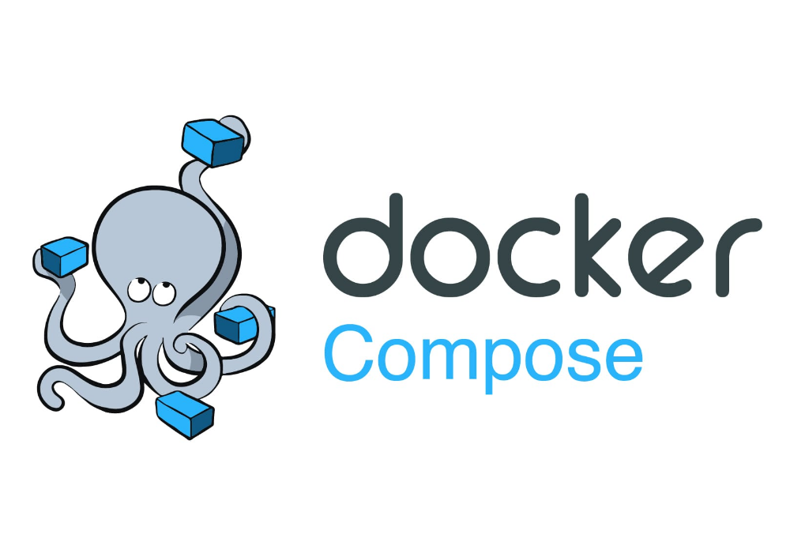

**In the last few days, I have been working on guidance on piping EventStoreDB logs into Elasticsearch.** ELK stack (so Elasticsearch, Logstash and Kibana) is one of the most popular tools for ingesting and analyzing logs and statistics. There are plenty of ways to configure it, but I wanted to do it idiomatically as I was doing the initial guide. 

I wanted to provide and test a few scenarios with the following tools:
- [EventStoreDB](https://developers.eventstore.com/) - source for logs
- [Elasticsearch](https://www.elastic.co/guide/en/elasticsearch/reference/8.2/index.html) to store logs. It's a document database built on top of the [Lucene](https://lucene.apache.org/) full-text search engine.
- [Kibana](https://www.elastic.co/guide/en/kibana/8.2/index.html) -  UI for browsing logs with dashboards and visualizations.
- [Logstash](https://www.elastic.co/guide/en/logstash/current/getting-started-with-logstash.html) - tool for gathering and/or transforming log files to Elasticsearch
- [Filebeat](https://www.elastic.co/guide/en/beats/filebeat/8.2/index.html): the latest tool that offloaded Logstash from tailing files efficiently. 

**I knew that I'll have to test those tools in multiple environments, as EventStoreDB can be run both on Windows and Linux.** Also, as I wasn't the ELK stack expert, I expected to require a few iterations before making it right. I didn't want to end up reinstalling my dev machine. Although it's not recommended to set up EventStoreDB or ELK stack on top of the Docker engine, I decided to use this approach as:
- this would allow me to quickly ephemeral environments,
- I didn't need to provide the entire production setup but rather show how configuration files with the EventStoreDB specifics should look. I could reference the detailed installation instructions to EventStoreDB and ELK stack documentation. Especially, adding too many non-related details would blur the guidance.
- I wanted to have a repeatable configuration that someone could just take and play with it without going through all the installation steps.
- I had previous experience with various Docker setups.

**Of course, it didn't go as smoothly as I had imagined.** Windows 11 and Linux definitely have distinct sets of quirks to align. For instance, even though containers should behave the same way between operating systems, it's not always like that, especially if that involves sharing files, network config etc., with the host operating system.

**Let's start with file sharing between containers.** I had to shovel the EventStoreDB log file with Filebeat. I could also provide my Dockerfile using the EventStoreDB image as the base one and install Filebeat in it. It would be closer to the production usage, but this would force me to maintain my Dockerfile. It is far from ideal, making different testing combinations of releases harder. Yet, the purpose of my samples was to show how to configure Filebeats to grab EventStoreDB log files. For that, it's enough to have access to files. I decided to use separate, unchanged Docker images maintained by EventStoreDB and Elastic and map the same files source.

Docker has the concept of [volumes](https://docs.docker.com/storage/volumes/). It enables storing the container data. You can restart the container, and the data will remains. It also allows to mount/bind the host operating system files to the container. It can go both ways, you can send files to the container, but you can also see generated files from the container in the host storage. Of course, if you do it right... 

There are plenty of ways how to configure volumes. Let's focus on the most straightforward one that I used. Docker-compose in the latest versions allows defining templates that can be shared between docker image configurations. We could use it to describe the volume that we'll share between EventStoreDB and Filebeat containers. What's more, we'll also get those files in our host system to browse the logs easily and debug/diagnose potential issues. It can look as follows:

```yml
# map logs to disk location and share between containers
x-eventstore-volume-logs:
  &eventstore-volume-logs
  type: bind
  source: ./logs
  target: /var/log/eventstore

version: "3.8"
services:
    #######################################################
    #  EventStoreDB
    #######################################################
    eventstoredb:
        image: eventstore/eventstore:21.10.2-buster-slim
        container_name: eventstoredb
        volumes:
            # external volume to be able to share EventStoreDB logs
            # with Filebeat image
            - <<: *eventstore-volume-logs

    #######################################################
    #  Filebeat to harvest logs from event store logs
    #######################################################
    filebeat:
        # required to have a proper access to config file on Windows
        entrypoint: "filebeat -e -strict.perms=false"
        image: docker.elastic.co/beats/filebeat:8.2.0
        volumes:
            # add Filebeat config file
            - "./filebeat.yml:/usr/share/filebeat/filebeat.yml:ro"
            # get access to EventStoreDB logs through shared external volume
            - <<: *eventstore-volume-logs
        depends_on:
            - eventstoredb
```

First, we're defining the template, telling that we'd like to bind host storage _./logs_ folder (relative to the _docker-compose.yml_ file location) to the _/var/log/eventstore_ directory inside the container. That's the default log location in the EventStoreDB docker image. We're using this template both in the EventStoreDB and Filebeat image.

Thanks to that, the EventStoreDB container will generate the logs and bind them to the host storage, which will also be mapped into the Filebeat container (as both containers share the exact file location). 

**There's one more quirk into that. Docker won't always create _./logs_ folder automatically.** It may not have needed permissions. If we want to have it ready without running on elevated permissions, we need to set it up. How to do that without additional shell scripts or manual steps? Especially keeping in mind that in Git we cannot create empty folders? We can set up a _logs_ folder with an empty _.gitignore_ file. Thanks to that, if we clone the fresh Git repository, the folder will be already created. 

We need to tell Filebeat where it should search for log files. It can be done using _filebeat.yml_. We'll bind it from the host file system. So we can easily modify it in our IDE. We have to also set up proper permissions inside the container. We could do it by adding _:ro_ suffix in the volume definition. We don't need to use template here, as it's a regular volume.

The file can look as follows.

```yml
#######################################################
#  EventStoreDB logs file input
#######################################################
filebeat.inputs:
  - type: log
    paths:
      - /var/log/eventstore/*/log*.json
    json.keys_under_root: true
    json.add_error_key: true

#######################################################
#  Logstash output to transform and prepare logs
#######################################################
output.logstash:
  hosts: ["logstash:5044"]
```

In the _filebeat.inputs_ we're telling where EventStoreDB logs are stored, so in the location defined in our template _/var/log/eventstore/_. As an output, we're using a Logstash image. Even though Filebeat can pipe logs directly to Elasticsearch and do a basic Kibana setup, you'd like to have more control and expand the processing pipeline. That's why for production, it's recommended to use both. Multiple Filebeat instances (e.g. from different EventStoreDB clusters) can collect logs and pipe them to Logstash, which will play an aggregator role. Filebeat can output logs to Logstash, and Logstash can receive and process these logs with the Beats input. Logstash can transform and route logs to Elasticsearch instance(s). 

**Even from this description, it's visible that there are dependencies between containers. How to solve the race conditions in a startup?** By convention, internally, Docker images [should define healtcheck](https://docs.docker.com/engine/reference/builder/#healthcheck). By having that, the Docker runtime will know if the container is running. We can also define our checks in docker-compose. We can also set a startup order using [depends_on](https://docs.docker.com/compose/startup-order/). Still, Compose will only know if the container is running, which is not precisely the same as it's ready. We will, of course, use it, but only for the basic setup. For instance:

```yml
#######################################################
#  Kibana to browse logs
#######################################################
kibana:
    container_name: kibana
    image: docker.elastic.co/kibana/kibana:8.2.0
    environment:
        - ELASTICSEARCH_HOSTS=http://elasticsearch:9200
    restart: unless-stopped
    ports:
        - "5601:5601"
    networks:
        - es_network
    depends_on:
        - elasticsearch
    healthcheck:
        test:
            [
            "CMD-SHELL",
            "curl --fail http://localhost:5601 || exit 1",
            ]
        interval: 10s
        timeout: 10s
        retries: 120
```

It will depend on the Elasticsearch image, and it'll also have a custom health check to verify if Kibana is not only running but also ready. It will also always restart unless stopped manually by us.

**The rest we'll need to do orchestration manually.** For instance, we'd like to automatically create a Kibana data view. As Kibana exposes an HTTP API, we'll use the [curl](https://curl.se/) image for that.

```yml
#######################################################
#  Call curl once Kibana was started 
#  to create Kibana Data Views for EventStoreDB logs
#######################################################
initializer:
    image: curlimages/curl
    restart: on-failure
    depends_on:
        - kibana
    networks:
        - es_network
    command: ["sh","-c","sleep 1 && curl  --fail -X POST 'kibana:5601/api/index_patterns/index_pattern' -H 'kbn-xsrf: true' -H 'Content-Type: application/json' -d'{ \"index_pattern\": { \"title\": \"eventstoredb-stats\" } }' && curl  --fail -X POST 'kibana:5601/api/index_patterns/index_pattern' -H 'kbn-xsrf: true' -H 'Content-Type: application/json' -d'{ \"index_pattern\": { \"title\": \"eventstoredb-logs\" } }' || exit 1"]
```

This image will depend on Kibana, and once it's started, it will try to make the HTTP requests to set up two data views (index patterns), one for logs and the other for stats. Thanks to that, we won't need to do it manually through UI. If any of the HTTP requests fail, it'll restart the container. Then wait one second and try again. Once Kibana is ready and requests succeeded, it will finish with status code _1_. It'll tell Docker that the run succeeded and won't restart the container again. So no more requests will be made.

The full docker-compose configuration will look as follows:

```yml
###########################################################################
#  Storing EventStoreDB logs into ElasticSearch with Filebeat and Logstash
###########################################################################
#  DISCLAIMER: This configuration is presented as docker-compose
#  to simplify the developer environment setup. 
#  It aims to give the quick option to play with Elastic setup.
#  It's NOT recommended to run setup through docker-compose on production.
###########################################################################

# map logs to disk location and share between containers
x-eventstore-volume-logs:
  &eventstore-volume-logs
  type: bind
  source: ./logs
  target: /var/log/eventstore

version: "3.8"
services:
    #######################################################
    #  EventStoreDB
    #######################################################
    eventstoredb:
        image: eventstore/eventstore:21.10.2-buster-slim
        container_name: eventstoredb
        # use this image if you're running ARM-based proc like Apple M1
        # image: ghcr.io/eventstore/eventstore:21.10.0-alpha-arm64v8
        environment:
            - EVENTSTORE_CLUSTER_SIZE=1
            - EVENTSTORE_RUN_PROJECTIONS=All
            - EVENTSTORE_START_STANDARD_PROJECTIONS=true
            - EVENTSTORE_EXT_TCP_PORT=1113
            - EVENTSTORE_HTTP_PORT=2113
            - EVENTSTORE_INSECURE=true
            - EVENTSTORE_ENABLE_EXTERNAL_TCP=true
            - EVENTSTORE_ENABLE_ATOM_PUB_OVER_HTTP=true
        ports:
            - '1113:1113'
            - '2113:2113'
        restart: unless-stopped
        volumes:
            -   type: volume
                source: eventstore-volume-data
                target: /var/lib/eventstore
            # external volume to be able to share EventStoreDB logs
            # with Filebeat image
            - <<: *eventstore-volume-logs
        networks:
            - esdb_network

    #######################################################
    #  Filebeat to harvest logs from event store logs
    #######################################################
    filebeat:
        # required to have a proper access to config file on Windows
        entrypoint: "filebeat -e -strict.perms=false"
        container_name: file_beat
        image: docker.elastic.co/beats/filebeat:8.2.0
        networks:
            - es_network
        # make sure that Filebeat is restarted
        # in case ElasticSearch or EventStoreDB
        # were not available yet
        restart: unless-stopped
        volumes:
            # add Filebeat config file
            - "./filebeat.yml:/usr/share/filebeat/filebeat.yml:ro"
            # get access to EventStoreDB logs through shared external volume
            - <<: *eventstore-volume-logs
        depends_on:
            - eventstoredb
            - logstash


    #######################################################
    #  Logstash for more advanced log pipelines
    #  e.g. filtering, transformations, etc.
    #  this will split stats and regular logs
    #######################################################
    logstash:
        # required to have a proper access to config file on windows
        container_name: logstash
        image: docker.elastic.co/logstash/logstash:8.2.0
        networks:
            - es_network
        restart: unless-stopped
        volumes:
            # add Logstash config file
            - "./logstash.conf:/usr/share/logstash/pipeline/logstash.conf:ro"
        # make sure that LogStash is restarted
        # in case ElasticSearch was not available yet
        depends_on:
            - elasticsearch


    #######################################################
    #  Elastic Search to store logs
    #######################################################
    elasticsearch:
        container_name: elasticsearch
        image: docker.elastic.co/elasticsearch/elasticsearch:8.2.0
        environment:
            - discovery.type=single-node
            - xpack.security.enabled=false
            - bootstrap.memory_lock=true
            - "ES_JAVA_OPTS=-Xms512m -Xmx512m"
        ulimits:
            memlock:
                soft: -1
                hard: -1
        volumes:
            - elastic-data:/usr/share/elasticsearch/data
        restart: unless-stopped
        ports:
            - "9200:9200"
            - "9300:9300"
        networks:
            - es_network
        healthcheck:
            test:
                [
                "CMD-SHELL",
                "curl --fail http://localhost:9200 || exit 1",
                ]
            interval: 10s
            timeout: 10s
            retries: 120

    #######################################################
    #  Kibana to browse logs
    #######################################################
    kibana:
        container_name: kibana
        image: docker.elastic.co/kibana/kibana:8.2.0
        environment:
            - ELASTICSEARCH_HOSTS=http://elasticsearch:9200
        restart: unless-stopped
        ports:
            - "5601:5601"
        networks:
            - es_network
        depends_on:
            - elasticsearch
        healthcheck:
            test:
                [
                "CMD-SHELL",
                "curl --fail http://localhost:5601 || exit 1",
                ]
            interval: 10s
            timeout: 10s
            retries: 120

    #######################################################
    #  Call curl once Kibana was started 
    #  to create Kibana Data Views for ESDB logs
    #######################################################
    initializer:
        image: curlimages/curl
        restart: on-failure
        depends_on:
            - kibana
        networks:
            - es_network
        command: ["sh","-c","sleep 1 && curl  --fail -X POST 'kibana:5601/api/index_patterns/index_pattern' -H 'kbn-xsrf: true' -H 'Content-Type: application/json' -d'{ \"index_pattern\": { \"title\": \"eventstoredb-stats\" } }' && curl  --fail -X POST 'kibana:5601/api/index_patterns/index_pattern' -H 'kbn-xsrf: true' -H 'Content-Type: application/json' -d'{ \"index_pattern\": { \"title\": \"eventstoredb-logs\" } }' || exit 1"]

networks:
    es_network:
        driver: bridge
    esdb_network:
        driver: bridge

volumes:
    eventstore-volume-data:
    elastic-data:
```

Logstash config file that grabs logs from Filebeat and splits logs and stats into different Elasticsearch indexes looks like:

```ruby
#######################################################
#  Filebeat input 
#######################################################
input {
  beats {
    port => 5044
  }
}

#######################################################
#  Filter out stats from regular logs
#  add respecting field with log type
#######################################################
filter {
  # check if log path includes "log-stats"
  # so pattern for stats
  if [log][file][path] =~ "log-stats" {
    mutate {
      add_field => {
        "log_type" => "stats"
      }
    }
  }
  else {
    mutate {
      add_field => {
        "log_type" => "logs"
      }
    }
  }
}

#######################################################
#  Send logs to Elastic
#  Create separate indexes for stats and regular logs
#  using field defined in the filter transformation
#######################################################
output {
  elasticsearch {
    hosts => [ "elasticsearch:9200" ]
    index => 'eventstoredb-%{[log_type]}'
  }
}
```

See the complete changes in the pull requests to:
- [EventStoreDB docs](https://github.com/EventStore/EventStore/pull/3488),
- [EventStoreDB samples](https://github.com/EventStore/samples/pull/17)

I hope that this article will give you enough background for playing with the complex developer environment's Docker configuration. Docker-compose is a decent tool for setting up temporary environments. They're great for testing and playing with the ideas and various configurations. 

Cheers!

Oskar

p.s. If you liked this article this article, you may also find interesting:
- [How to build an optimal Docker image for your application?](/pl/how_to_buid_an_optimal_docker_image_for_your_application/)
- [How to build and push Docker image with GitHub actions?](/pl/how_to_buid_and_push_docker_image_with_github_actions/)

p.s.2. **Ukraine is still under brutal Russian invasion. A lot of Ukrainian people are hurt, without shelter and need help.** You can help in various ways, for instance, directly helping refugees, spreading awareness, putting pressure on your local government or companies. You can also support Ukraine by donating e.g. to [Red Cross](https://www.icrc.org/en/donate/ukraine), [Ukraine humanitarian organisation](https://savelife.in.ua/en/donate/). You may also consider joining [Tech for Ukraine](https://techtotherescue.org/tech/tech-for-ukraine) initiative.
