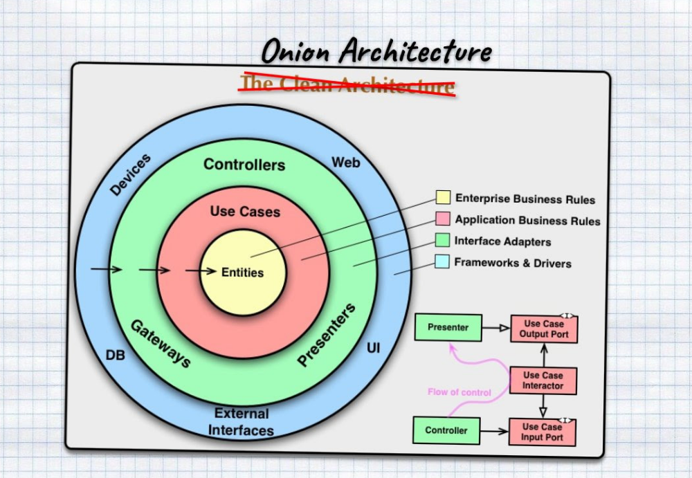

I quite often make fun of Clean Code and Clean Architecture. I'm calling it an Onion Architecture. Not least because it has layers but also because it's smelly. I have already told about it several times in the blog and talks, but it is never enough to emphasize it!

Even looking at the picture above, it is difficult for me to understand what the author meant and what the flow should look like. If the idea behind "Clean Code" is to create something maintainable and precise, it goes against what you see in the picture.

The general problem is that this tiered breakdown forces you to focus on the technical split rather than the business functionality. Instead of reproducing the business flow, we cut it into separate, distinct pieces. It often becomes challenging to keep track of what is going on from end to end. Even for a simple business operation. API, Services, Repositories, Ports, Adapters, Interfaces, ORMs, etc.

In one of my past projects, I counted in the application layers. The result was seven layers to perform a simple CRUD operation. The cognitive load needed to understand such flow and the inertia is so big that it demotivates to make changes. Development costs are rising, and understanding within the team is low.

Another important aspect is that this leads to a high risk of change. A change in one layer can potentially affect most functionalities as all mechanisms are shared horizontally. It leads to procrastination, meetings _"Can I do it?"_, _"Are you sure?"_, _" or maybe do it otherwise?"_. It often results in the neglect of necessary changes due to the high risk involved.

Code becomes problematic to maintain and understand. So (in my experience), it always ends opposite the initial _clean code_ premise. Coupling is okay if you couple the things that change together, e.g. end-to-end business flow.

Therefore, the more layers, the worse the smell. Onion, you remember, right? For me, the definition of _clean code_ is that when I look at it, I think, _"wow, that's so simple. Why I didn't make it up myself?"_. The simple code makes it easy to maintain as it is easy to understand.

I am also the one to blame because I made such multi-layered applications. My personal record is a class with 14 generic parameters (_sic!_). Currently, I prefer to focus on the composition of smaller pieces and cut the application into vertical slices according to the CQRS rules. The simpler and more self-documenting, the better.

Of course, writing simple code is not that easy. It takes time, patience and iteration. But it's worth the effort!

Do you want to know more? Read my articles:
- [Generic does not mean Simple](/pl/generic_does_not_mean_simple/),
- [CQRS facts and myths explained](/pl/cqrs_facts_and_myths_explained/),
- [How to slice the codebase effectively?](/pl/how_to_slice_the_codebase_effectively/).

For example, Dan North created a CUPID policy: https://dotnetrocks.com/?show=1745.

I am also not a fan of Robert C. Martin, in general. But that is a topic for a different article.

Do you want more? Watch:

`youtube: https://www.youtube.com/watch?v=eOPlg-eB4As`

Cheers!

Oskar

p.s.2. **Ukraine is still under brutal Russian invasion. A lot of Ukrainian people are hurt, without shelter and need help.** You can help in various ways, for instance, directly helping refugees, spreading awareness, putting pressure on your local government or companies. You can also support Ukraine by donating e.g. to [Red Cross](https://www.icrc.org/en/donate/ukraine), [Ukraine humanitarian organisation](https://savelife.in.ua/en/donate/). You may also consider joining [Tech for Ukraine](https://techtotherescue.org/tech/tech-for-ukraine) initiative.
