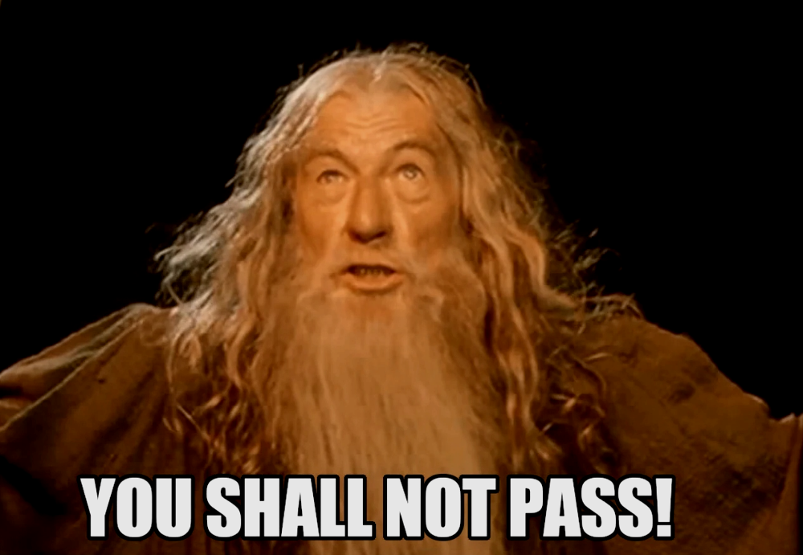

**Event Sourcing is not a difficult pattern to understand.** Event stores are not conceptually complicated databases (although implementation may be quite complex). We have two data structures in them:
- **event**, a fact that has occurred in our system. For instance: the order has been started, the shopping cart has been confirmed, a cinema seat has been reserved,
- **events stream**, an ordered sequence of events. The stream conceptually corresponds to the record/entity/aggregate in the classical approach. Typically, one record (e.g., one reservation, one order) is represented by one stream. In other words, these are all facts recorded for a given object.

Additionally, we have two types of operations:
- append an event to the end of the selected stream,
- read all events for the stream.

That's all, and that's enough to implement the simplest event store. It is no wonder that I will try to [build an event store in an hour at the next NDC Oslo](https://ndcoslo.com/agenda/lets-build-event-store-in-one-hour-0mrk/0cavgqf0evd) (Yeah, as you noticed, I am very excited about that). 

**In Event Sourcing, each business operation ends with the registration of its results, i.e. a new event.** To execute business logic, we need to know its current state. **In Event Sourcing, the state is events.** We don't have to make a revolution, and we can still use entities and a "flattened" current entity state. We need to turn the sequence of events into an object to get it. How to do it? I wrote in detail in [How to get the current entity state from events?](/en/how_to_get_the_current_entity_state_in_event_sourcing/). A short TLDR:
- we read all events from the stream in the order of occurrence,
- create a default entity object (e.g. using the default constructor),
- for each event, we apply it to the entity state to get the current one.

This can be done, for example, by adding the _Apply_ methods for each type of event. For example, a method that applies an event to remove a product from the cart could look like this:

```csharp
public void Apply(ProductRemoved @event)
{
    var productItemToBeRemoved = @event.ProductItem;

    var existingProductItem = FindProductItemMatchingWith(@event.ProductItem);

    if (existingProductItem == null)
        return;

    if (existingProductItem.HasTheSameQuantity(productItemToBeRemoved))
    {
        ProductItems.Remove(existingProductItem);
        return;
    }

    ProductItems.Replace(
        existingProductItem,
        existingProductItem.Subtract(productItemToBeRemoved)
    );
}
```

In short, when we _zero_ the number of products in the shopping cart, we remove the whole product item. If we are removing only a part, we reduce the number. **What if the product, for some reason, does not exist in the cart?** I wanted to talk about that case today.

Take a look at the snippet that just ignores this scenario.

```csharp
if (existingProductItem == null)
        return;
```

Wouldn't you be tempted to throw an exception here? Yes, I would also be tempted. So why didn't I do it?

Let us recall once again. Events are facts. They happened. What has been seen will not be displayed. **The events were stored in our database because our business logic stated that rules are fulfilled, and we can perform the operation and record the event as a result.** If we trust our business logic (read: we have it tested), we should also trust the recorded event. Yes, I know control is the basis of trust, plus I don't trust myself either.

**So what if we forgot some IF in our logic, or we misspelt the event?** What if our logic in the past allowed us to remove more products than existed in the shopping cart? Sounds absurd? Perhaps, but I would like to remind you that most bank accounts have an overdraft facility, the amount of which can be changed. Moreover, there may be a legal rule prohibiting banks from using overdrafts. If we change our application method, forgetting that it was possible in the past, we will cause errors in the system's operation.

**So am I suggesting that we ignore data errors?** God forbid! Mistakes need to be fixed (not only those in the code). I wrote about it in [What texting your Ex has to do with Event-Driven Design?](/en/what_texting_ex_has_to_do_with_event_driven_design/). The best way to correct a mistake is to regret your sins and promise correction. Well, the best thing is actually improving. In Event-Driven Architecture, this is best done by adding another event. Thanks to that, we can be sure that even in a distributed system, information about the compensation will be propagated between independent services. 

**What could be a compensating event?** If, for instance, the cashier in a department store charged us with the same product twice, the money will be refunded, and a new receipt will be generated. Do you think that's a hack? Let me dispel this way of thinking. This is not a hack; this is how business works, especially where paper is involved. You do not scribble on the contract; you print a new one and then sign it. It is also worth thinking about compensating actions before the end of development. [The more we give the user the chance to fix errors on their own, the better](/en/no_it_can_never_happen/). We can even consider introducing _administrative_ events so that we can correct our mistakes without redeploying the application.

When we publish a compensating event, it will be appended like any other: to the current end of the stream. **So, if we throw an exception on an event that had a bug, we won't give ourselves a chance to fix the state.** We won't reach the compensating event because each time we try to apply the "wrong event" on the state, we will throw an exception.

On the other hand, even if we did not have compensating events, should the actual recovery be verifying the business rules? Business logic should be checking them. If our state is wrong, it should pick up the inconsistency. Therefore, you can simply check whether the state is consistent and meets the business rules after restoring the state from events and then run the appropriate business logic. Of course, we will not capture everything this way because the state may meet the business rules and not be correct (e.g. with double charges made by the cashier), but that's another story.

**So, do I suggest that you always ignore mistakes?** It depends. In my opinion, throwing exceptions may make sense in the initial development of functionality when the functionality is _stabilizing_. At such a stage, we may want to know as soon as possible that something went wrong. We can also assume that only when there is the first need to introduce a compensating operation then, we remove code that throws exceptions to unblock it. However, we must remember one thing. If we decide to do so, the error will be corrected only after deployment. Which can mean in the extreme situation of a wake-up call in the middle of the night if you are the unfortunate one on the shift.

**One IF, and so much fun, isn't it?**

Cheers!

Oskar

p.s. **Ukraine is still under brutal Russian invasion. A lot of Ukrainian people are hurt, without shelter and need help.** You can help in various ways, for instance, directly helping refugees, spreading awareness, putting pressure on your local government or companies. You can also support Ukraine by donating e.g. to [Red Cross](https://www.icrc.org/en/donate/ukraine), [Ukraine humanitarian organisation](https://savelife.in.ua/en/donate/) or [donate Ambulances for Ukraine](https://www.gofundme.com/f/help-to-save-the-lives-of-civilians-in-a-war-zone).
