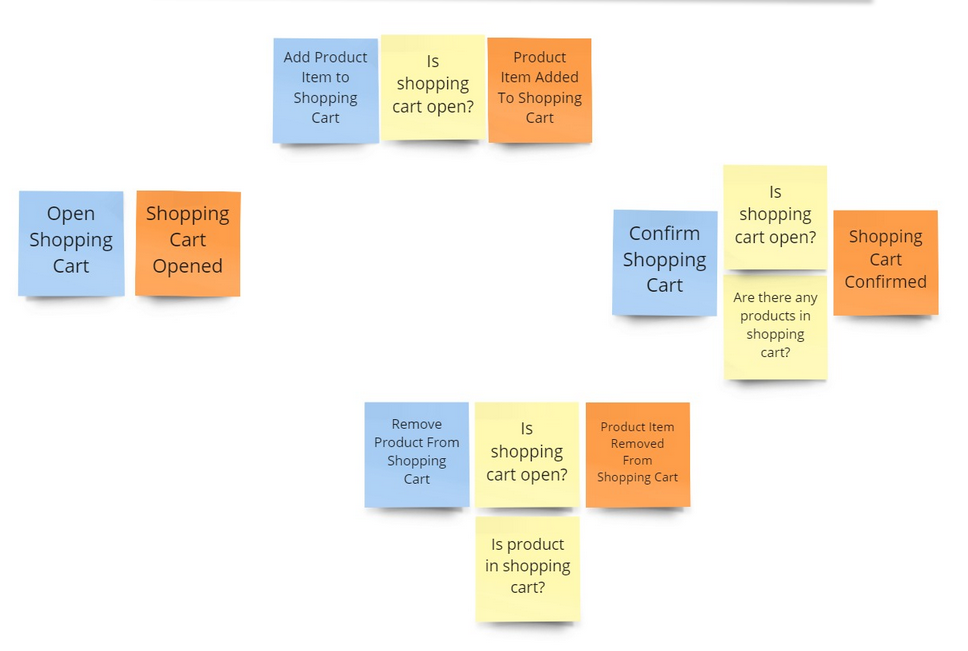

Let's say that we'd like to implement Shopping Cart. We have the following requirements:

1. The customer may only add a product to the shopping cart after opening it.
2. When selecting and adding a product to the basket customer needs to provide the quantity chosen. The system calculates the product price based on the current price list.
3. The customer may remove a product with a given price from the cart.
4. The customer can confirm the shopping cart and start the order fulfilment process.
5. The customer may cancel the shopping cart and reject all selected products.
6. After shopping cart confirmation or cancellation, the product can no longer be added or removed from the cart.

A single good picture tells more than a thousand words, right? There you have it.



We may already notice that our shopping cart is a simple state machine. It's either pending, and we can add products to it, or closed (confirmed or cancelled). If we were object-oriented Java developers, we could model our shopping cart as:

```java
public class ShoppingCart {
    private UUID clientId;
    private ShoppingCartStatus status;
    private List<PricedProductItem> productItems;
    private OffsetDateTime confirmedAt;
    private OffsetDateTime canceledAt;

    // (...) horde of the public getters and setters
}
```

This could be good enough for many scenarios, yet **it doesn't tell us much about the expected behaviour**. We won't know if and when confirmation and cancellation dates are set. Our object structure will allow us to change anytime we want. Even set null. Of course, we could add more validation logic in the constructor, etc. Yet it would make our code only more blurry. Wouldn't it be nice if the compiler helped us to catch our mistakes? It'd be great if we could express the state machine with code and model the state transitions explicitly, right?

Luckily, Java from version 17 can help us. How? Let's start with [records](https://openjdk.org/jeps/395). They are shortened syntax for classes simplifying their definition and making their instances immutable. Immutability is a topic for its own article. For now, let's focus on what we want to get from them. We'd like to make our code predictable by knowing precisely when we're doing state transition. By that, we can restrict unexpected modifications. We know that from the place we build our state, we may trust it and don't need to validate it each time we use it. That reduces the number of IFs and required unit tests.

For example, we could define [ETag]() value object to restrict the proper format:

```java
public record ETag(String value) {
  private static final Pattern ETagPattern = Pattern.compile("\"([^\"]*)\"");

  @JsonCreator
  public ETag {
    if (value != null) {
      var regexMatcher = ETagPattern.matcher(value);

      if (!regexMatcher.find())
        throw new IllegalArgumentException("Not an ETag header");
    }
  }

  public static ETag weak(Object value) {
    return new ETag("W/\"%s\"".formatted(value.toString()));
  }

  public boolean isEmpty() {
    return value == null;
  }

  public long toLong() {
    if (value == null) {
      throw new IllegalStateException("Header is empty");
    }

    var regexMatcher = ETagPattern.matcher(value);
    regexMatcher.find();

    return Long.parseLong(regexMatcher.group(1));
  }
}
```

Coming back to our shopping cart, we could also make our entity a record. Yet, that wouldn't be enough fun and help for us. Predictability is excellent, but we'd like to model our state machine explicitly. **We can use another new concept, so [sealed interface](https://openjdk.org/jeps/409).** They allow restricting the set of implementations for our interfaces. Check what we can do with them:

```java
sealed public interface ShoppingCart {
  record EmptyShoppingCart() implements ShoppingCart {
  }

  record PendingShoppingCart(
    UUID id,
    UUID clientId,
    ProductItems productItems
  ) implements ShoppingCart {
  }

  record ConfirmedShoppingCart(
    UUID id,
    UUID clientId,
    ProductItems productItems,
    OffsetDateTime confirmedAt
  ) implements ShoppingCart {
  }

  record CanceledShoppingCart(
    UUID id,
    UUID clientId,
    ProductItems productItems,
    OffsetDateTime canceledAt
  ) implements ShoppingCart {
  }
}
```

At first glance, the syntax may look weird, but you can get used to it. When we do, then by looking at the code, we'll know that an instance of a **shopping cart will be either empty (not initialised), pending, confirmed or cancelled.** This is powerful, as it's expressive, plus sealed interface won't allow anyone to do cowboy implementation of our interface. Plus, it works great with new [Java pattern matching capabilities](https://openjdk.org/jeps/406). We'll get to that later. 

Sealed interfaces are the same concept as [traits in Scala](https://docs.scala-lang.org/tour/traits.html) or similar to [sealed classes in Kotlin](https://kotlinlang.org/docs/sealed-classes.html) and [Union Types in TypeScript](https://www.typescriptlang.org/docs/handbook/2/everyday-types.html#union-types). If you're searching for a rabbit hole, check [algebraic types](https://en.wikipedia.org/wiki/Algebraic_data_type), it might appear that your favourite language also supports them.

Using sealed interfaces, we could also define a set of commands to know precisely what could happen with our shopping cart.

```java
public sealed interface ShoppingCartCommand {
  record OpenShoppingCart(
    UUID shoppingCartId,
    UUID clientId
  ) implements ShoppingCartCommand {
  }

  record AddProductItemToShoppingCart(
    UUID shoppingCartId,
    ProductItem productItem
  ) implements ShoppingCartCommand {
  }

  record RemoveProductItemFromShoppingCart(
    UUID shoppingCartId,
    PricedProductItem productItem
  ) implements ShoppingCartCommand {
  }

  record ConfirmShoppingCart(
    UUID shoppingCartId
  ) implements ShoppingCartCommand {
  }

  record CancelShoppingCart(
    UUID shoppingCartId
  ) implements ShoppingCartCommand {
  }
}
```

Now we have the code telling us precisely what business state we may expect and all the operations we can do on the shopping cart. Now, what we have left is to define command handling.

```java
public final class ShoppingCartService {
  public static ProductItemAddedToShoppingCart addProductItem(
    ProductPriceCalculator productPriceCalculator,
    AddProductItemToShoppingCart command,
    ShoppingCart shoppingCart
  ) {
    if (!(shoppingCart instanceof ShoppingCart.PendingShoppingCart pendingShoppingCart))
      throw new IllegalStateException("Removing product item for cart in '%s' status is not allowed.".formatted(shoppingCart.getClass().getName()));

    var pricedProductItem = productPriceCalculator.calculate(command.productItem());

    pendingShoppingCart.productItems().add(pricedProductItem);

    return new ProductItemAddedToShoppingCart(
      command.shoppingCartId(),
      pricedProductItem
    );
  }

  public static ProductItemRemovedFromShoppingCart removeProductItem(
    RemoveProductItemFromShoppingCart command,
    ShoppingCart shoppingCart
  ) {
    if (!(shoppingCart instanceof ShoppingCart.PendingShoppingCart pendingShoppingCart))
      throw new IllegalStateException("Removing product item for cart in '%s' status is not allowed.".formatted(shoppingCart.getClass().getName()));

    pendingShoppingCart.productItems().hasEnough(command.productItem());

    return new ProductItemRemovedFromShoppingCart(
      command.shoppingCartId(),
      command.productItem()
    );
  }

  public static ShoppingCartConfirmed confirm(ConfirmShoppingCart command, ShoppingCart shoppingCart) {
    if (!(shoppingCart instanceof ShoppingCart.PendingShoppingCart pendingShoppingCart))
      throw new IllegalStateException("Removing product item for cart in '%s' status is not allowed.".formatted(shoppingCart.getClass().getName()));

    return new ShoppingCartConfirmed(
      pendingShoppingCart.id(),
      OffsetDateTime.now()
    );
  }

  public static ShoppingCartCanceled cancel(CancelShoppingCart command, ShoppingCart shoppingCart) {
    if (!(shoppingCart instanceof ShoppingCart.PendingShoppingCart pendingShoppingCart))
      throw new IllegalStateException("Removing product item for cart in '%s' status is not allowed.".formatted(shoppingCart.getClass().getName()));

    return new ShoppingCartCanceled(
      pendingShoppingCart.id(),
      OffsetDateTime.now()
    );
  }
}
```

As you can see, there's nothing spectacular happening here. We have a set of functions: taking command and current state, processing the business logic and returning the event as a result. **Oh wait, did someone mention _event_?** I wouldn't be myself if I didn't add a sprinkle of Event Sourcing in my samples. It matches well with the approach we took. We're focusing on modelling business logic and exposing it directly through the code. Event Sourcing can help in knowing the intent and registering the results of our business logic. Events here are facts and the checkpoints for our business workflow. Of course, we could return the next state instead, but hey, we're on the blog registered under the _event-driven.io_ domain!

**Let's define events that can be registered for the shopping cart:**

```java
public sealed interface ShoppingCartEvent {

  record ShoppingCartOpened(
    UUID shoppingCartId,
    UUID clientId
  ) implements ShoppingCartEvent {
  }

  record ProductItemAddedToShoppingCart(
    UUID shoppingCartId,
    PricedProductItem productItem
  ) implements ShoppingCartEvent {
  }

  record ProductItemRemovedFromShoppingCart(
    UUID shoppingCartId,
    PricedProductItem productItem
  ) implements ShoppingCartEvent {
  }

  record ShoppingCartConfirmed(
    UUID shoppingCartId,
    OffsetDateTime confirmedAt
  ) implements ShoppingCartEvent {
  }

  record ShoppingCartCanceled(
    UUID shoppingCartId,
    OffsetDateTime canceledAt
  ) implements ShoppingCartEvent {
  }
}
```

In Event Sourcing, the application state is stored in events. Classical entities are represented as series of events called _streams_. To get the current state, we need to:
Get all events for a given stream. We choose them based on the stream identifier (derived from the business object/record id). An event store retains the events for a given stream in the order they were appended; retrieval should preserve the order.
Create a default, empty entity.
Apply each event sequentially to the entity.
We're taking the current state and evolving it into the new one for each event. Method transforming the state based on the event is usually called _when_, _apply_ or _evolve_. Read more in [How to get the current entity state from events?](/pl/how_to_get_the_current_entity_state_in_event_sourcing/). 

Let's define it for our case:

```java
sealed public interface ShoppingCart {
  // (...)

  static ShoppingCart evolve(
    ShoppingCart state,
    ShoppingCartEvent event
  ) {
    return switch (event) {
      case ShoppingCartEvent.ShoppingCartOpened shoppingCartOpened: {
        if (!(state instanceof EmptyShoppingCart))
          yield state;

        yield new PendingShoppingCart(
          shoppingCartOpened.shoppingCartId(),
          shoppingCartOpened.clientId(),
          ProductItems.empty()
        );
      }
      case ShoppingCartEvent.ProductItemAddedToShoppingCart productItemAddedToShoppingCart: {
        if(!(state instanceof PendingShoppingCart pendingShoppingCart))
          yield state;

        yield new ShoppingCart.PendingShoppingCart(
          pendingShoppingCart.id(),
          pendingShoppingCart.clientId(),
          pendingShoppingCart.productItems().add(productItemAddedToShoppingCart.productItem())
        );
      }
      case ShoppingCartEvent.ProductItemRemovedFromShoppingCart productItemRemovedFromShoppingCart: {
        if (!(state instanceof PendingShoppingCart pendingShoppingCart))
          yield state;

        yield new ShoppingCart.PendingShoppingCart(
          pendingShoppingCart.id(),
          pendingShoppingCart.clientId(),
          pendingShoppingCart.productItems().remove(productItemRemovedFromShoppingCart.productItem())
        );
      }
      case ShoppingCartEvent.ShoppingCartConfirmed shoppingCartConfirmed: {
        if (!(state instanceof PendingShoppingCart pendingShoppingCart))
          yield state;

        yield new ShoppingCart.ConfirmedShoppingCart(
          pendingShoppingCart.id(),
          pendingShoppingCart.clientId(),
          pendingShoppingCart.productItems(),
          shoppingCartConfirmed.confirmedAt()
        );
      }
      case ShoppingCartEvent.ShoppingCartCanceled shoppingCartCanceled:{
        if (!(state instanceof PendingShoppingCart pendingShoppingCart))
          yield state;

        yield new ShoppingCart.ConfirmedShoppingCart(
          pendingShoppingCart.id(),
          pendingShoppingCart.clientId(),
          pendingShoppingCart.productItems(),
          shoppingCartCanceled.canceledAt()
        );
      }
    };
  }
}
```

Yup, it can also be a part of our Shopping Cart definition. Thanks to that, we can see in one place all the possible states and how to get to them from the sequence of events. This is also a fantastic example of self-documenting code being the source of truth both for the business process and implementation. We're also using here [mentioned new pattern matching](https://openjdk.org/jeps/406). They're super cool, as the compiler will guard us and fail if we forget to handle the newly added event in a dedicated switch branch.

The essential thing to note is that we can use _instanceof_ to ensure that our current state is as expected. We should not throw exceptions here, as our business logic should check all invariants. If we threw an exception, then we wouldn't give ourselves a chance to correct bugs in our stream. Read more in [Should you throw an exception when rebuilding the state from events?](/pl/should_you_throw_exception_when_rebuilding_state_from_events/).

**Now, let's wrap it up and go to Grand Finale!**

We could group our command handling into the method called _decide_:

```java
public final class ShoppingCartService {
  public static ShoppingCartEvent[] decide(
    Supplier<ProductPriceCalculator> getProductPriceCalculator,
    ShoppingCartCommand command,
    ShoppingCart state
  ) {
    return new ShoppingCartEvent[]{
      switch (command) {
        case OpenShoppingCart openCommand -> open(openCommand);
        case AddProductItemToShoppingCart addCommand ->
          addProductItem(getProductPriceCalculator.get(), addCommand, state);
        case RemoveProductItemFromShoppingCart removeProductCommand ->
          removeProductItem(removeProductCommand, state);
        case ConfirmShoppingCart confirmCommand ->
          confirm(confirmCommand, state);
        case CancelShoppingCart cancelCommand -> cancel(cancelCommand, state);
      }
    };
  }
```

This method takes the command and current state and runs the business logic. **It's a decent example of how using just [pure functions](https://en.wikipedia.org/wiki/Pure_function) enables composability.** We have better encapsulation, a single entry point for our business logic. We can model union types, pass a specific parameter thanks to the sealed interfaces, and then have strong typing and trust in our objects. Plus, we're getting a self-documenting code, easy to test. Immutability only strengthens that.

We could generalise all of that and define the following type:

```java
public record Decider<State, Command, Event>(
  BiFunction<Command, State, Event[]> decide,
  BiFunction<State, Event, State> evolve,
  Supplier<State> getInitialState
) {
}
```

It groups business logic (_decide_ function), state evolution and rebuild (_evolve_) together with the initial state. It's similar to the [Aggregate pattern](https://www.dddcommunity.org/wp-content/uploads/files/pdf_articles/Vernon_2011_1.pdf) in a way as it represents a particular decision process, ensuring that all the business invariants are checked, and guards consistency. It's based on the functional composition, which speaks to me, as it helps me to focus on the specific business process instead of how to glue the staff together.

For our shopping cart this would look as follows:

```java
public final class ShoppingCartService {
  public static Decider<ShoppingCart, ShoppingCartCommand, ShoppingCartEvent> shoppingCartDecider(
    Supplier<ProductPriceCalculator> getProductPriceCalculator
  ) {
    return new Decider<>(
      (command, state) -> ShoppingCartService.decide(getProductPriceCalculator, command, state),
      ShoppingCart::evolve,
      EmptyShoppingCart::new
    );
  }
}
```

We can define the general Command Handler as:

```java
public class CommandHandler<State, Command, Event> {
  private final EventStore eventStore;
  private final Decider<State, Command, Event> decider;

  CommandHandler(
    EventStore eventStore,
    Decider<State, Command, Event> decider
  ) {

    this.eventStore = eventStore;
    this.decider = decider;
  }

  public AppendResult handle(
    String streamId,
    Command command,
    ETag eTag
  ) {
    var events = eventStore.<Event>read(streamId);

    var state = events.stream()
      .collect(foldLeft(decider.getInitialState(), decider.evolve()));

    var newEvents = decider.decide().apply(command, state);

    return eventStore.append(
      streamId,
      eTag,
      Arrays.stream(newEvents).iterator()
    );
  }
}
```

Such handler can be used in the regular API controller as:

```java
@RestController
@RequestMapping("api/shopping-carts")
class ShoppingCartsController {
  private final CommandHandler<ShoppingCart, ShoppingCartCommand, ShoppingCartEvent> commandHandler;

  ShoppingCartsController(
    CommandHandler<ShoppingCart, ShoppingCartCommand, ShoppingCartEvent> commandHandler
  ) {
    this.commandHandler = commandHandler;
  }

  @PostMapping("{id}/products")
  ResponseEntity<Void> addProduct(
    @PathVariable UUID id,
    @RequestBody ShoppingCartsRequests.AddProduct request,
    @RequestHeader(name = HttpHeaders.IF_MATCH) @Parameter(in = ParameterIn.HEADER, required = true, schema = @Schema(type = "string")) @NotNull ETag ifMatch
  ) {
    if (request.productItem() == null)
      throw new IllegalArgumentException("Product Item has to be defined");

    var result = commandHandler.handle(
      "shopping_cart-%s".formatted(id),
      new AddProductItemToShoppingCart(
        id,
        new ProductItem(
          request.productItem().productId(),
          request.productItem().quantity()
        )
      ),
      ifMatch
    );

    if(!(result instanceof Success success))
      return ResponseEntity.status(HttpStatus.PRECONDITION_FAILED).build();

    return ResponseEntity
      .ok()
      .eTag(success.nextExpectedRevision().value())
      .build();
  }

  // (...)
}
```

The rest of handlers will use exactly the same pattern.

Check the full sample in my repo: https://github.com/oskardudycz/EventSourcing.JVM/pull/34.

And now, here's the deal. I left that as the last point. Last but not least: **All KUDOS go to [Jérémie Chassaing](https://twitter.com/thinkb4coding).** He coined Decider pattern and described it in detail. I encourage you to check his:
- [article](https://thinkbeforecoding.com/post/2021/12/17/functional-event-sourcing-decider),
- [talk](https://www.youtube.com/watch?v=whFfzQfdJZg),
- [detailed example with a walkthrough in F#](https://gist.github.com/thinkbeforecoding/026a1d90ea2f3ea86d151b1229cad932).

That should give you an even better understanding of this pattern than my humble article. I touched on one possible implementation path, but there's more. You can use it not only for Event Sourcing but also for regular business logic processing.

Thanks also goes to [Ruben Bartelink](https://twitter.com/rbartelink) for the numerous discussions and patiently explaining me details of those concepts.

Cheers!

Oskar

p.s. If you want to see C# version check [Union types in C#](/pl/union_types_in_csharp) or the more succing [TypeScript](/pl/type_script_node_Js_event_sourcing).

p.s.2. **Ukraine is still under brutal Russian invasion. A lot of Ukrainian people are hurt, without shelter and need help.** You can help in various ways, for instance, directly helping refugees, spreading awareness, putting pressure on your local government or companies. You can also support Ukraine by donating e.g. to [Red Cross](https://www.icrc.org/en/donate/ukraine), [Ukraine humanitarian organisation](https://savelife.in.ua/en/donate/) or [donate Ambulances for Ukraine](https://www.gofundme.com/f/help-to-save-the-lives-of-civilians-in-a-war-zone).
