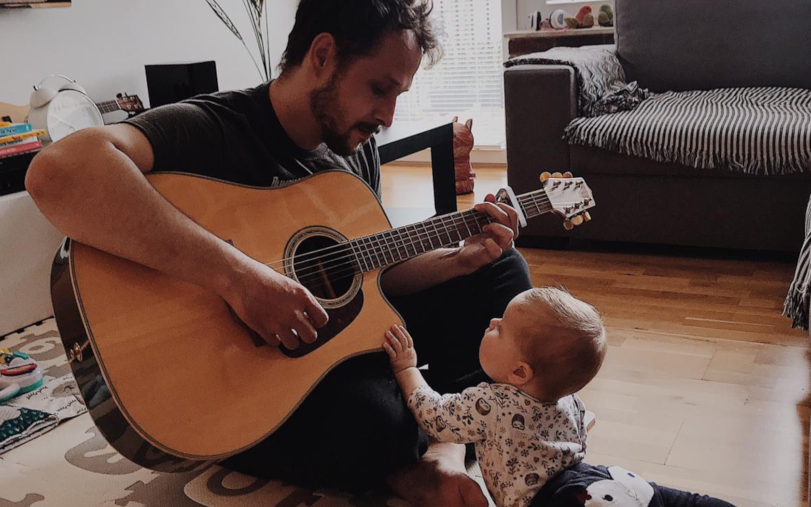

**The first time I did not become a musician was when my grandma tried to sign me to music school.** During rehearsal, I stubbornly said I would not sing or repeat things played on the piano.

**The first time I didn't become a programmer was when I found a floppy disk with the Basic label.** I found it in my new Amiga 500. Technically, it was not new; it was secondhand, so the previous owner left the disk. Dad said it was for programming. I threw it in the box and turned on the Lotus III.

**The second time I did not become a musician was one I signed to the local music library.** I hoped to learn more about music. Interjection, dear children, in the pre-Spotify era, the music library was a place where you could listen to, or even borrow, CDs and attention - cassettes. Like Spotify, but physical and free, you need to return the music you borrowed. I've noted the band name to start my journey, but it appeared that I made it wrong. I got a CD with the terrible music of the band with a similar name.

**The fact that I did not become a programmer for the second time is related to cassettes that sounded like a Skrillex when played on a tape recorder.** Unusual recorder; the one from the Commodore 64. We used it to play in the North& South. On this hardware, I almost became a programmer. One could become one by reading a book and then rewriting it. The book had a yellow cover, A4 format, and by typing it for 2 hours, you could play MMORPG for a few minutes. I remember deciding whether to run away from the wolf or not. Robert (the C64 owner) and I decided we would run away from it and this programming thing.

**I was quite close to becoming a musician when we were forced in primary school to learn to play the flute.** You had to buy plastic, foldable ones, and be careful during the lesson. We weren't going to do that with my friend Gabriel. Instead of playing, we were chatting. Worse, we were supposed to have a flute play exam at the end of the school season. Fortunately, the teacher changed her mind. Both today and then, I can only play one number - Sirene. You know it: eeyo-eeyo!

**In 1991, I almost looked like a musician.** I cut my jeans on my knees. To this day, I do not know how my father let a 6-year-old walk around in such pants. At the time, I didn't understand why I was doing it. Today I know - I wanted to be like Kurt Cobain. I returned to this idea in high school when I was qualified for the grungers group with flannel shirts and jeans. A proud team of acid drinkers.

**Nor did I become a programmer when in the 7th grade, I decided to go to high school with Mathematics and Computer Science specialisation.** I didn't go on the humanistic path even though I loved reading. I didn't like cramming. Math came to me loosely, so the choice was simple. In the 2nd year of high school, my friend gave me CD with Visual Studio and .NET 1.0. I didn't know the reason even to open it. I prefer to play FIFA and Baldur's Gate.

Just as printing the first Christmas tree written in Turbo Pascal during the Computer Science lesson did not make me a programmer, the acoustic guitar I got as my 18th birthday gift did not make me a guitarist.

**On the other hand, Flash animations made me a programmer.** The Cancion del Mariachi learned by heart, without rhythm and technique, made me a guitarist. At least in the eyes of my high school friends and family. Have I already been them? Definitely not. It's hard to be a programmer and guitarist while still being a shaky kid with inconsistency, but with a whole set of straw eagerness.

**I also didn't become a musician when I bought a harmonica in Lidl and started playing a lesson called a train.** It was too much for my girlfriend. Nor did I become one when she bought me guitar lessons. The classes were fun, and the teacher was cool, but I wasn't cool. I over-motivated. I wanted to make up for years of putting the guitar in the corner, months of coming back and weeks of self-learning at one time. I had to let go and cool down. Think about the topic and approach it more calmly.

**I then realised that learning to play the guitar is very similar to learning programming.** I believe that you can use the same tactics in mastering both. How come?

1. **It's hard to become a self-taught musician.** It is harder to find specific directions and choose techniques to learn. Even more difficult is to impose a routine on yourself. Routine and consistency are the most important here. Playing only on weekends or holidays won't make you a guitarist. In the same way, you also cannot learn programming once a month by sitting down and saying hello to the world. How do you get to Carnegie Hall? Practice, practice, practice. Finding someone to inspire, still being careful, and questioning authorities is also worth finding someone to inspire. By looking at what those people are interested in and following their steps, you can cut the time spent on finding the things to learn. Assaf Levavy and his licknriff.com is a model example for guitar. Programming varies depending on the technology, but I think that no one failed to recommend Martin Fowler's work.

2. **Did I mention the consequence?** You won't achieve anything without consistency, tedious training of licks, chord progressions, UI forms, entities design, reading, searching and trying. After a break without playing, the fingers do not move as fast as before. In the same way, after the break in programming, the brain does not cycle as quickly as before. Without regular typing and coding, you might even get scared to set up the new empty project.

3. **Keep your head open and try various approaches.** I was never interested in practising chords. I wanted to smash solos like John Petrucci right away. No campfire songs. Later it turned out that, when I learned chords, it became easier to move through the fretboard. Likewise, warming your fingers up in solos stretches them and makes it easier to catch grips. The same goes for programming - even if you hate JavaScript and think SPA applications are Satan's invention, give it a try. If you think functional programming is a dumb idea, give it a try and evaluate. It is worth observing and testing different programming concepts and various platforms. Even if you don't do any commercial stuff in them and return to your beloved technology, I assure you that you will look at it a little wider.

4. **Understanding theory helps.** I know, I know. The theory may sound boring, but you won't get far without it. Just as you can make the UI form without knowing how computers handle memory, you can learn a song by heart on the guitar. Yet, understanding the theory can help you to do it better. You might get the a-ha moment when you hear the click, and things are suddenly slowing down for you. For example, when you understand that instead of flying like stupid through the fretboard, it might be better just to arrange them in a chord. You will play with less effort and thus make it sound better. In the same way, understanding the memory pressure can make your UI forms faster and less buggy.

5. **Find the balance.** After playing the guitar for too long, your collarbone and wrist will start to hurt. You can outstretch your neck muscles and cannot play for weeks (checked!). The same is with programming. Your head, eyes and wrist can get sick too. Worse than physical pain is burnout, the desire to quit everything, and mental fatigue. Better to take a break. Don't over-motivate yourself. Some things take time. After sleeping or just leaving the desk, you devise a solution to a problem you have been struggling with for several hours. Likewise, when you play the guitar after a day of break, it often turns out that the part of a song that you couldn't get overcomes itself as if you were Van Halen.

6. **Having a manual hobby helps to decrease the stress level.** I'm sure your brain spins around much longer after a busy day of coding. In theory, you finished, but you're still working in your head. Doing stuff that requires manual exercise and focus helps to stop thinking. In guitar, you must focus on the rhythm and licks to do it right. You stop thinking about other stuff by focusing on moving fingers on the fretboard. It helps to cool down. Even short exercise can do miracles. Don't like playing on guitar? Try something else, woodwork, bakery, whatever you prefer. Just find something that will require your body to switch and focus on other stuff than coding.

7. **Hobby is a great tool to detect our workaholism signs.** Do you know that coal miners used to carry canaries? Canaries are tender birds, much more delicate than we humans. If the level of dangerous gases (such as CO) in the mine tunnels increased, the gases would kill the canary before killing the miners. Seeing that, miners could run away and save their lives. Yeah, humanity works only for humans. Still, if our hobby dies and we don't have enough time for it, that's a clear sign that we're on the slippery slope to burnout. That's the right moment to stop and find it and revise our work style.

**I am still not becoming a programmer, e.g. when I buy a book on Amazon and don't read it.** Likewise, I don't become a musician when I find a tutorial for a Full House theme and stop learning it. However, I am a programmer when I manage to deliver a project or deliver a new OSS feature. I also happen to be a guitarist when I catch the rhythm and feel my fingers moving seamlessly or when someone tells me, "oh, I can see that you have practised".

Cheers!

Oskar

p.s. **Ukraine is still under brutal Russian invasion. A lot of Ukrainian people are hurt, without shelter and need help.** You can help in various ways, for instance, directly helping refugees, spreading awareness, putting pressure on your local government or companies. You can also support Ukraine by donating e.g. to [Red Cross](https://www.icrc.org/en/donate/ukraine), [Ukraine humanitarian organisation](https://savelife.in.ua/en/donate/) or [donate Ambulances for Ukraine](https://www.gofundme.com/f/help-to-save-the-lives-of-civilians-in-a-war-zone).
