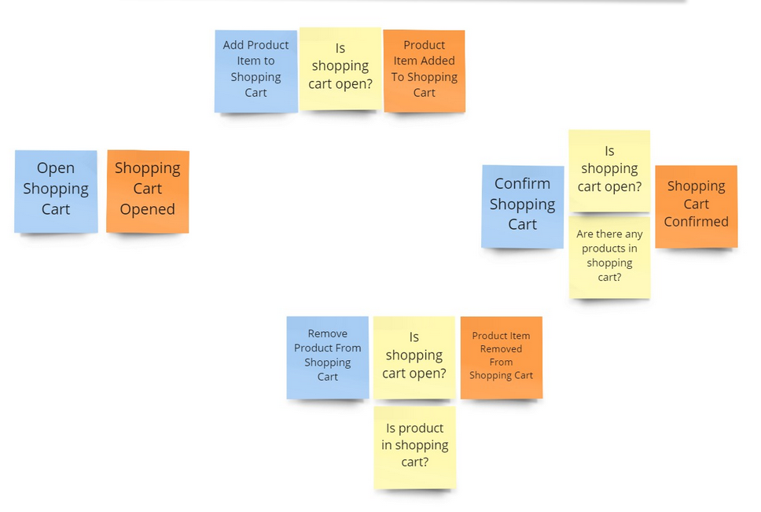

In the traditional approach, what we get is what we store. Our write model is too often used directly as our read model, because the typical set of functionality in a system has a details view that exposes it all. Based on that, the user makes decisions and indicates the desired updates. Depending on how CRUDish is our preference, we either have a single update or a set of business operations.

Let's say that we're modelling the shopping cart aggregate known from [the previous post](/en/how_to_effectively_compose_your_business_logic/). We have the following requirements:

1. The customer may only add a product to the shopping cart after opening it.
2. When selecting and adding a product to the basket customer needs to provide the quantity chosen. The system calculates the product price based on the current price list.
3. The customer may remove a product with a given price from the cart.
4. The customer can confirm the shopping cart and start the order fulfilment process.
5. The customer may cancel the shopping cart and reject all selected products.
6. After shopping cart confirmation or cancellation, the product can no longer be added or removed from the cart.

A single good picture tells more than a thousand words, right? There you have it.



Our aggregate could look like that:

```csharp
public class ShoppingCart: Aggregate
{
    public Guid ClientId { get; private set; }

    public ShoppingCartStatus Status { get; private set; }

    public IList<ProductItem> ProductItems { get; private set; } = default!;

    public static ShoppingCart Open(
        Guid cartId,
        Guid clientId
    )
    {
        return new ShoppingCart(cartId, clientId);
    }

    private ShoppingCart() { }

    private ShoppingCart(
        Guid id,
        Guid clientId)
    {
        var @event = new ShoppingCartOpened(
            id,
            clientId
        );

        Enqueue(@event);
        Apply(@event);
    }

    public void Apply(ShoppingCartOpened @event)
    {
        Id = @event.CartId;
        ClientId = @event.ClientId;
        ProductItems = new List<ProductItem>();
        Status = ShoppingCartStatus.Pending;
    }

    public void AddProduct(ProductItem productItem)
    {
        if (Status != ShoppingCartStatus.Pending)
            throw new InvalidOperationException($"Adding product for the cart in '{Status}' status is not allowed.");

        var @event = new ProductItemAdded(Id, productItem);

        Enqueue(@event);
        Apply(@event);
    }

    public void Apply(ProductItemAdded @event)
    {
        var newProductItem = @event.ProductItem;

        var existingProductItem = ProductItems
            .SingleOrDefault(pi => pi.ProductId == newProductItem.ProductId);

        if (existingProductItem is null)
        {
            ProductItems.Add(newProductItem);
            return;
        }

        ProductItems[ProductItems.IndexOf(existingProductItem)] =
            existingProductItem with { Quantity = existingProductItem.Quantity + newProductItem.Quantity };
    }

    public void RemoveProduct(ProductItem productItemToBeRemoved)
    {
        if (Status != ShoppingCartStatus.Pending)
            throw new InvalidOperationException($"Removing product from the cart in '{Status}' status is not allowed.");

        var existingProductItem = ProductItems
            .SingleOrDefault(pi => pi.ProductId == productItemToBeRemoved.ProductId);

        if (existingProductItem is null)
            throw new InvalidOperationException(
                $"Product with id `{productItemToBeRemoved.ProductId}` and price was not found in cart.");

        if (existingProductItem.Quantity < productItemToBeRemoved.Quantity)
            throw new InvalidOperationException(
                $"Cannot remove {productItemToBeRemoved.Quantity} items of Product with id `{productItemToBeRemoved.ProductId}` as there are only ${existingProductItem.Quantity} items in card");

        var @event = new ProductItemRemoved(Id, productItemToBeRemoved);

        Enqueue(@event);
        Apply(@event);
    }

    public void Apply(ProductItemRemoved @event)
    {
        var productItemToBeRemoved = @event.ProductItem;

        var existingProductItem = ProductItems
            .SingleOrDefault(pi => pi.ProductId == productItemToBeRemoved.ProductId);

        if (existingProductItem == null)
            return;

        if (existingProductItem == productItemToBeRemoved)
        {
            ProductItems.Remove(existingProductItem);
            return;
        }

        ProductItems[ProductItems.IndexOf(existingProductItem)] =
            existingProductItem with { Quantity = existingProductItem.Quantity - productItemToBeRemoved.Quantity };
    }

    public void Confirm()
    {
        if (Status != ShoppingCartStatus.Pending)
            throw new InvalidOperationException($"Confirming cart in '{Status}' status is not allowed.");

        var @event = new ShoppingCartConfirmed(Id, DateTime.UtcNow);

        Enqueue(@event);
        Apply(@event);
    }

    public void Apply(ShoppingCartConfirmed @event)
    {
        Status = ShoppingCartStatus.Confirmed;
    }

    public void Cancel()
    {
        if (Status != ShoppingCartStatus.Pending)
            throw new InvalidOperationException($"Canceling cart in '{Status}' status is not allowed.");

        var @event = new ShoppingCartCanceled(Id, DateTime.UtcNow);

        Enqueue(@event);
        Apply(@event);
    }

    public void Apply(ShoppingCartCanceled @event)
    {
        Status = ShoppingCartStatus.Canceled;
    }
}


public enum ShoppingCartStatus
{
    Pending = 1,
    Confirmed = 2,
    Canceled = 4
}

public record ProductItem(
    Guid ProductId,
    int Quantity
);
```

Plus the base class for completeness:

```csharp
public abstract class Aggregate
{
    public Guid Id { get; protected set; }

    public int Version { get; protected set; }

    [NonSerialized] private readonly Queue<object> uncommittedEvents = new();

    public object[] DequeueUncommittedEvents()
    {
        var dequeuedEvents = uncommittedEvents.ToArray();

        uncommittedEvents.Clear();

        return dequeuedEvents;
    }

    protected void Enqueue(object @event) =>
        uncommittedEvents.Enqueue(@event);
}
```

Nothing spectacular is happening here. If you have already tried DDD or Event Sourcing, then, for sure, you already saw such code.

**In case that's the first time you see it. In Event Sourcing, each business operation should result in one or more new business events.** Events represent the facts and give us a tracing of the business process. Events are appended to the event stream. Each entity (aggregate) has its dedicated stream. That's why we keep the cache of uncommitted events. We're using them store all at once after finishing business logic.

**To retrieve the current state, we need to load all the events and apply them one by one on the default object.** That's why we need to have _Apply_ methods for each of them. Read more in [How to get the current entity state from events?](/en/how_to_get_the_current_entity_state_in_event_sourcing/).

**This already looks like a lot of code for a simple feature, but that's not all.** In Event Sourcing, we're building read models based on events. This logic is called projection. We'd need to duplicate (more or less) the same logic for the details view. 

At least, that's what we see if we're coming from the state-oriented approach. In the long term, those views will differ; we may also build the fine-tuned smaller read models, but let's take it out of the discussion for now. That's a decent topic for another article.

**If we conclude that we need to always start new features with doubled code in Event Sourcing, then that may look like complicated bikeshedding.** That'd be the correct conclusion if it wasn't entirely true.

As I mentioned, we're building our write model in-memory in Event Sourcing. Each time we want to run our business logic, we're _rehydrating_ our write model state from events. Our read models are placed in another storage (another table like Marten or another database like EventStoreDB). So we don't need to tie them together. What's more, we can also benefit from that split to simplify our write model.

**The first step is to check all IFs in our business logic.** If we do that, then we could see that:
- we don't need all the status information. We just need information if the shopping cart is opened or not.
- there's no need to keep the entire product item information and merge it to form an elegant single line for product items. That's nice for the read model. To write model logic, we need to know if we have enough quantity before removing the product item. To do that, we just need to sum up the total amounts.
- we don't have any logic around client id.

By observing that, we could simplify our class into:

```csharp
public class ShoppingCart: Aggregate
{
    public bool IsOpened { get; private set; }

    public Dictionary<Guid, int> ProductItems { get; private set; } = default!;

    public static ShoppingCart Open(
        Guid cartId,
        Guid clientId
    )
    {
        return new ShoppingCart(cartId, clientId);
    }

    private ShoppingCart() { }

    private ShoppingCart(
        Guid id,
        Guid clientId)
    {
        var @event = new ShoppingCartOpened(
            id,
            clientId
        );

        Enqueue(@event);
        Apply(@event);
    }

    public void Apply(ShoppingCartOpened @event)
    {
        Id = @event.CartId;
        ProductItems = new Dictionary<Guid, int>();
        IsOpened = true;
    }

    public void AddProduct(ProductItem productItem)
    {
        if (!IsOpened)
            throw new InvalidOperationException("Adding product to the closed cart is not allowed.");

        var @event = new ProductItemAdded(Id, productItem);

        Enqueue(@event);
        Apply(@event);
    }

    public void Apply(ProductItemAdded @event)
    {
        var newProductItem = @event.ProductItem;

        ProductItems[newProductItem.ProductId] =
            ProductItems.GetValueOrDefault(newProductItem.ProductId, 0) + newProductItem.Quantity;
    }

    public void RemoveProduct(ProductItem productItemToBeRemoved)
    {
        if (!IsOpened)
            throw new InvalidOperationException("Removing product to the closed cart is not allowed.");

        if (!ProductItems.TryGetValue(productItemToBeRemoved.ProductId, out var currentQuantity))
            throw new InvalidOperationException(
                $"Product with id `{productItemToBeRemoved.ProductId}` and price was not found in cart.");

        if (currentQuantity < productItemToBeRemoved.Quantity)
            throw new InvalidOperationException(
                $"Cannot remove {productItemToBeRemoved.Quantity} items of Product with id `{productItemToBeRemoved.ProductId}` as there are only ${currentQuantity} items in card");

        var @event = new ProductItemRemoved(Id, productItemToBeRemoved);

        Enqueue(@event);
        Apply(@event);
    }

    public void Apply(ProductItemRemoved @event)
    {
        var productItemToBeRemoved = @event.ProductItem;

        if (!ProductItems.TryGetValue(productItemToBeRemoved.ProductId, out var currentQuantity) ||
            currentQuantity < productItemToBeRemoved.Quantity)
            return;

        ProductItems[productItemToBeRemoved.ProductId] =
            currentQuantity - productItemToBeRemoved.Quantity;
    }

    public void Confirm()
    {
        if (!IsOpened)
            throw new InvalidOperationException("Confirming closed cart is not allowed.");

        var @event = new ShoppingCartConfirmed(Id, DateTime.UtcNow);

        Enqueue(@event);
        Apply(@event);
    }

    public void Apply(ShoppingCartConfirmed @event) =>
        IsOpened = false;

    public void Cancel()
    {
        if (!IsOpened)
            throw new InvalidOperationException("Canceling closed cart is not allowed.");

        var @event = new ShoppingCartCanceled(Id, DateTime.UtcNow);

        Enqueue(@event);
        Apply(@event);
    }

    public void Apply(ShoppingCartCanceled @event) =>
        IsOpened = false;
}
```

**As we store information in events, we can safely remove redundant code from our shopping cart aggregate.** As long as we keep all information in events, we can add them back once we have a new requirement that makes them needed for business logic. That's the power of in-memory rebuild!

That's already smaller and cleaner. Yet, we can do better than that! 

**Let's get rid of the base class!**. How to do it? By returning events from the method handling business logic. Then we won't need to cache event(s) in the base class. Of course, some may say that _"but then my aggregate will show that's event-sourced!". Ok, so what is the issue? If we want to invest in Event Sourcing or Event-Driven Design, then let's not add artificial limitations and overhead just for the sake that _"some day it may not be event-sourced anymore"_. What will it look like afterwards?

```csharp
public class ShoppingCart
{
    public Guid Id { get; private set; }
    public bool IsOpened { get; private set; }

    public Dictionary<Guid, int> ProductItems { get; private set; } = default!;

    private ShoppingCart() { }

    public static (ShoppingCart, ShoppingCartOpened) Open(
        Guid id,
        Guid clientId
    )
    {
        var @event = new ShoppingCartOpened(
            id,
            clientId
        );

        var shoppingCart = new ShoppingCart();
        shoppingCart.Apply(@event);

        return (shoppingCart, @event);
    }

    public void Apply(ShoppingCartOpened @event)
    {
        Id = @event.CartId;
        ProductItems = new Dictionary<Guid, int>();
        IsOpened = true;
    }

    public ProductItemAdded AddProduct(ProductItem productItem)
    {
        if (!IsOpened)
            throw new InvalidOperationException("Adding product to the closed cart is not allowed.");

        var @event = new ProductItemAdded(Id, productItem);

        Apply(@event);

        return @event;
    }

    public void Apply(ProductItemAdded @event)
    {
        var newProductItem = @event.ProductItem;

        ProductItems[newProductItem.ProductId] =
            ProductItems.GetValueOrDefault(newProductItem.ProductId, 0) + newProductItem.Quantity;
    }

    public ProductItemRemoved RemoveProduct(ProductItem productItemToBeRemoved)
    {
        if (!IsOpened)
            throw new InvalidOperationException("Removing product to the closed cart is not allowed.");

        if (!ProductItems.TryGetValue(productItemToBeRemoved.ProductId, out var currentQuantity))
            throw new InvalidOperationException(
                $"Product with id `{productItemToBeRemoved.ProductId}` and price was not found in cart.");

        if (currentQuantity < productItemToBeRemoved.Quantity)
            throw new InvalidOperationException(
                $"Cannot remove {productItemToBeRemoved.Quantity} items of Product with id `{productItemToBeRemoved.ProductId}` as there are only ${currentQuantity} items in card");

        var @event = new ProductItemRemoved(Id, productItemToBeRemoved);

        Apply(@event);

        return @event;
    }

    public void Apply(ProductItemRemoved @event)
    {
        var productItemToBeRemoved = @event.ProductItem;

        if (!ProductItems.TryGetValue(productItemToBeRemoved.ProductId, out var currentQuantity) ||
            currentQuantity < productItemToBeRemoved.Quantity)
            return;

        ProductItems[productItemToBeRemoved.ProductId] =
            currentQuantity - productItemToBeRemoved.Quantity;
    }

    public ShoppingCartConfirmed Confirm()
    {
        if (!IsOpened)
            throw new InvalidOperationException("Confirming closed cart is not allowed.");

        var @event = new ShoppingCartConfirmed(Id, DateTime.UtcNow);

        Apply(@event);

        return @event;
    }

    public void Apply(ShoppingCartConfirmed @event) =>
        IsOpened = false;

    public ShoppingCartCanceled Cancel()
    {
        if (!IsOpened)
            throw new InvalidOperationException("Canceling closed cart is not allowed.");

        var @event = new ShoppingCartCanceled(Id, DateTime.UtcNow);

        Apply(@event);

        return @event;
    }

    public void Apply(ShoppingCartCanceled @event) =>
        IsOpened = false;
}
```

**It didn't slim the codebase enormously, but it already made it more explicit.** It's clearly visible that each method takes params and returns event(s). That makes code also easier to test and understand. Can we do something more? Yes, we can!

**If we're always calling only a single method from our aggregate during the request/command handling, we may conclude that we need to update the state.** We're not storing our updated write model anywhere. It only lives per business logic handling scope (e.g. command handler). The only reason why we would keep it is to be able to run more than one method changing state in the same scope. Which is not the best practice, aye?

**Let's remove explicit _Apply_ method calls from the business logic code!**

```csharp
public class ShoppingCart
{
    public Guid Id { get; private set; }
    public bool IsOpened { get; private set; }

    public Dictionary<Guid, int> ProductItems { get; private set; } = default!;

    private ShoppingCart() { }

    public static ShoppingCartOpened Open(
        Guid id,
        Guid clientId
    )
    {
        return  new ShoppingCartOpened(
            id,
            clientId
        );
    }

    public void Apply(ShoppingCartOpened @event)
    {
        Id = @event.CartId;
        ProductItems = new Dictionary<Guid, int>();
        IsOpened = true;
    }

    public ProductItemAdded AddProduct(ProductItem productItem)
    {
        if (!IsOpened)
            throw new InvalidOperationException("Adding product to the closed cart is not allowed.");

        return new ProductItemAdded(Id, productItem);
    }

    public void Apply(ProductItemAdded @event)
    {
        var newProductItem = @event.ProductItem;

        ProductItems[newProductItem.ProductId] =
            ProductItems.GetValueOrDefault(newProductItem.ProductId, 0) + newProductItem.Quantity;
    }

    public ProductItemRemoved RemoveProduct(ProductItem productItemToBeRemoved)
    {
        if (!IsOpened)
            throw new InvalidOperationException("Removing product to the closed cart is not allowed.");

        if (!ProductItems.TryGetValue(productItemToBeRemoved.ProductId, out var currentQuantity))
            throw new InvalidOperationException(
                $"Product with id `{productItemToBeRemoved.ProductId}` and price was not found in cart.");

        if (currentQuantity < productItemToBeRemoved.Quantity)
            throw new InvalidOperationException(
                $"Cannot remove {productItemToBeRemoved.Quantity} items of Product with id `{productItemToBeRemoved.ProductId}` as there are only ${currentQuantity} items in card");

        return new ProductItemRemoved(Id, productItemToBeRemoved);
    }

    public void Apply(ProductItemRemoved @event)
    {
        var productItemToBeRemoved = @event.ProductItem;

        if (!ProductItems.TryGetValue(productItemToBeRemoved.ProductId, out var currentQuantity) ||
            currentQuantity < productItemToBeRemoved.Quantity)
            return;

        ProductItems[productItemToBeRemoved.ProductId] =
            currentQuantity - productItemToBeRemoved.Quantity;
    }

    public ShoppingCartConfirmed Confirm()
    {
        if (!IsOpened)
            throw new InvalidOperationException("Confirming closed cart is not allowed.");

        return new ShoppingCartConfirmed(Id, DateTime.UtcNow);
    }

    public void Apply(ShoppingCartConfirmed @event) =>
        IsOpened = false;

    public ShoppingCartCanceled Cancel()
    {
        if (!IsOpened)
            throw new InvalidOperationException("Canceling closed cart is not allowed.");

        return new ShoppingCartCanceled(Id, DateTime.UtcNow);
    }

    public void Apply(ShoppingCartCanceled @event) =>
        IsOpened = false;
}
```

We still need to keep _Apply_ methods definition to be able to rebuild the state from events. Still, we made the next step by cutting the boilerplate and making the class definition shorter and thus more straightforward and self-explanatory. We could, in theory, finish at that stage, but oh well, we need to go deeper!

**If we look closer, we may notice that our methods are pure functions right now. That means they're not causing side effects (like modifying the shopping cart state). **That makes them predictable.** This is a huge benefit, as such methods are much easier to test. Noticing that, we may realise that we could even make those methods static. 

We may also realise that as we're not changing the aggregate state and not doing other logic, we're not getting a tremendous value from keeping the state and behaviour in the same class. Of course, encapsulation can help if we're afraid that our colleague will accidentally modify the code. But if that's the case in our project, don't we have more substantial issues to fix?

**Let's see how the code will look after the split.**

Our aggregate will become the entity:

```csharp
public class ShoppingCart
{
    public Guid Id { get; private set; }
    public bool IsOpened { get; private set; }

    public Dictionary<Guid, int> ProductItems { get; private set; } = default!;

    private ShoppingCart() { }

    public void Apply(ShoppingCartOpened @event)
    {
        Id = @event.CartId;
        ProductItems = new Dictionary<Guid, int>();
        IsOpened = true;
    }

    public void Apply(ProductItemAdded @event)
    {
        var newProductItem = @event.ProductItem;

        ProductItems[newProductItem.ProductId] =
            ProductItems.GetValueOrDefault(newProductItem.ProductId, 0) + newProductItem.Quantity;
    }

    public void Apply(ProductItemRemoved @event)
    {
        var productItemToBeRemoved = @event.ProductItem;

        if (!ProductItems.TryGetValue(productItemToBeRemoved.ProductId, out var currentQuantity) ||
            currentQuantity < productItemToBeRemoved.Quantity)
            return;

        ProductItems[productItemToBeRemoved.ProductId] =
            currentQuantity - productItemToBeRemoved.Quantity;
    }

    public void Apply(ShoppingCartConfirmed @event) =>
        IsOpened = false;

    public void Apply(ShoppingCartCanceled @event) =>
        IsOpened = false;
}
```

Business logic placed in the service:

```csharp

public static class ShoppingCartService
{
    public static ShoppingCartOpened Open(
        Guid id,
        Guid clientId
    ) =>
        new ShoppingCartOpened(
            id,
            clientId
        );

    public static ProductItemAdded AddProduct(ShoppingCart shoppingCart, ProductItem productItem)
    {
        if (!shoppingCart.IsOpened)
            throw new InvalidOperationException("Adding product to the closed cart is not allowed.");

        return new ProductItemAdded(shoppingCart.Id, productItem);
    }

    public static ProductItemRemoved RemoveProduct(ShoppingCart shoppingCart, ProductItem productItemToBeRemoved)
    {
        if (!shoppingCart.IsOpened)
            throw new InvalidOperationException("Removing product to the closed cart is not allowed.");

        if (!shoppingCart.ProductItems.TryGetValue(productItemToBeRemoved.ProductId, out var currentQuantity))
            throw new InvalidOperationException(
                $"Product with id `{productItemToBeRemoved.ProductId}` and price was not found in cart.");

        if (currentQuantity < productItemToBeRemoved.Quantity)
            throw new InvalidOperationException(
                $"Cannot remove {productItemToBeRemoved.Quantity} items of Product with id `{productItemToBeRemoved.ProductId}` as there are only ${currentQuantity} items in card");

        return new ProductItemRemoved(shoppingCart.Id, productItemToBeRemoved);
    }

    public static ShoppingCartConfirmed Confirm(ShoppingCart shoppingCart)
    {
        if (!shoppingCart.IsOpened)
            throw new InvalidOperationException("Confirming closed cart is not allowed.");

        return new ShoppingCartConfirmed(shoppingCart.Id, DateTime.UtcNow);
    }

    public static ShoppingCartCanceled Cancel(ShoppingCart shoppingCart)
    {
        if (!shoppingCart.IsOpened)
            throw new InvalidOperationException("Canceling closed cart is not allowed.");

        return new ShoppingCartCanceled(shoppingCart.Id, DateTime.UtcNow);
    }
}
```

This is just one step from the Decider pattern described in [How to effectively compose your business logic](/en/how_to_effectively_compose_your_business_logic/).

We could go even further to close the deal. As we don't intend to modify our shopping cart beside the current state rehydration code, we could model it as a [record](/en/notes_about_csharp_records_and_nullable_reference_types/). It will add a bit more allocations, so if you're cautious about that, you don't have to.

```csharp
public record ShoppingCart(
    Guid Id,
    bool IsOpened,
    Dictionary<Guid, int> ProductItems
)
{
    public static ShoppingCart Create(ShoppingCartOpened @event) =>
        new ShoppingCart(
            @event.CartId,
            true,
            new Dictionary<Guid, int>()
        );

    public ShoppingCart Apply(ProductItemAdded @event) =>
        this with
        {
            ProductItems = ProductItems
                .Select(p =>
                    p.Key != @event.ProductItem.ProductId
                        ? p
                        : new KeyValuePair<Guid, int>(
                            @event.ProductItem.ProductId,
                            p.Value + @event.ProductItem.Quantity
                        )
                )
                .ToDictionary(ks => ks.Key, vs => vs.Value)
        };

    public ShoppingCart Apply(ProductItemRemoved @event) =>
        this with
        {
            ProductItems = ProductItems
                .Select(p =>
                    p.Key != @event.ProductItem.ProductId
                        ? p
                        : new KeyValuePair<Guid, int>(
                            @event.ProductItem.ProductId,
                            p.Value - @event.ProductItem.Quantity
                        )
                )
                .ToDictionary(ks => ks.Key, vs => vs.Value)
        };

    public ShoppingCart Apply(ShoppingCartConfirmed @event) =>
        this with { IsOpened = false };

    public ShoppingCart Apply(ShoppingCartCanceled @event) =>
        this with { IsOpened = false };
}

public static class ShoppingCartService
{
    public static ShoppingCartOpened Open(
        Guid id,
        Guid clientId
    ) =>
        new ShoppingCartOpened(
            id,
            clientId
        );

    public static ProductItemAdded AddProduct(ShoppingCart shoppingCart, ProductItem productItem)
    {
        if (!shoppingCart.IsOpened)
            throw new InvalidOperationException("Adding product to the closed cart is not allowed.");

        return new ProductItemAdded(shoppingCart.Id, productItem);
    }

    public static ProductItemRemoved RemoveProduct(ShoppingCart shoppingCart, ProductItem productItemToBeRemoved)
    {
        if (!shoppingCart.IsOpened)
            throw new InvalidOperationException("Removing product to the closed cart is not allowed.");

        if (!shoppingCart.ProductItems.TryGetValue(productItemToBeRemoved.ProductId, out var currentQuantity))
            throw new InvalidOperationException(
                $"Product with id `{productItemToBeRemoved.ProductId}` and price was not found in cart.");

        if (currentQuantity < productItemToBeRemoved.Quantity)
            throw new InvalidOperationException(
                $"Cannot remove {productItemToBeRemoved.Quantity} items of Product with id `{productItemToBeRemoved.ProductId}` as there are only ${currentQuantity} items in card");

        return new ProductItemRemoved(shoppingCart.Id, productItemToBeRemoved);
    }

    public static ShoppingCartConfirmed Confirm(ShoppingCart shoppingCart)
    {
        if (!shoppingCart.IsOpened)
            throw new InvalidOperationException("Confirming closed cart is not allowed.");

        return new ShoppingCartConfirmed(shoppingCart.Id, DateTime.UtcNow);
    }

    public static ShoppingCartCanceled Cancel(ShoppingCart shoppingCart)
    {
        if (!shoppingCart.IsOpened)
            throw new InvalidOperationException("Canceling closed cart is not allowed.");

        return new ShoppingCartCanceled(shoppingCart.Id, DateTime.UtcNow);
    }
}
```

**I typically keep entities together with events, making it an excellent documentation form.** We could compare it with our Event Storming/Modeling results. See:

```csharp
public record ShoppingCartOpened(
    Guid CartId,
    Guid ClientId
);

public record ProductItemAdded(
    Guid CartId,
    ProductItem ProductItem
);

public record ProductItemRemoved(
    Guid CartId,
    ProductItem ProductItem
);

public record ShoppingCartConfirmed(
    Guid CartId,
    DateTimeOffset ConfirmedAt
);

public record ShoppingCartCanceled(
    Guid CartId,
    DateTimeOffset CanceledAt
);

public record ShoppingCart(
    Guid Id,
    bool IsOpened,
    Dictionary<Guid, int> ProductItems
)
{
    public static ShoppingCart Create(ShoppingCartOpened @event) =>
        new ShoppingCart(
            @event.CartId,
            true,
            new Dictionary<Guid, int>()
        );


    public ShoppingCart Apply(ProductItemAdded @event) =>
        this with
        {
            ProductItems = ProductItems
                .Select(p =>
                    p.Key != @event.ProductItem.ProductId
                        ? p
                        : new KeyValuePair<Guid, int>(
                            @event.ProductItem.ProductId,
                            p.Value + @event.ProductItem.Quantity
                        )
                )
                .ToDictionary(ks => ks.Key, vs => vs.Value)
        };

    public ShoppingCart Apply(ProductItemRemoved @event) =>
        this with
        {
            ProductItems = ProductItems
                .Select(p =>
                    p.Key != @event.ProductItem.ProductId
                        ? p
                        : new KeyValuePair<Guid, int>(
                            @event.ProductItem.ProductId,
                            p.Value - @event.ProductItem.Quantity
                        )
                )
                .ToDictionary(ks => ks.Key, vs => vs.Value)
        };

    public ShoppingCart Apply(ShoppingCartConfirmed @event) =>
        this with { IsOpened = false };

    public ShoppingCart Apply(ShoppingCartCanceled @event) =>
        this with { IsOpened = false };
}
```

Ok, but how to store such code? With Marten is extremely simple. We could define following method:

```csharp
public static class DocumentSessionExtensions
{
    public static Task Add<T>(
        this IDocumentSession documentSession,
        Guid id,
        object @event,
        CancellationToken ct
    ) where T : class
    {
        documentSession.Events.StartStream<T>(id, @event);
        return documentSession.SaveChangesAsync(token: ct);
    }

    public static Task GetAndUpdate<T>(
        this IDocumentSession documentSession,
        Guid id,
        int version,
        Func<T, object> handle,
       CancellationToken ct
    ) where T : class =>
        documentSession.Events.WriteToAggregate<T>(id, version, stream =>
            stream.AppendOne(handle(stream.Aggregate)), ct);
}
```

They're simple extension methods that make our intention explicit. The biggest power is in [WriteToAggregate]() method that:
- loads all the events from the stream,
- aggregate them by calling _Apply_ methods by conventions,
- allow storing one or more events.

I added the option to run the specific handler to run the business logic. The example usage could look like that (using Minimal Apis):

```csharp
using static ShoppingCartService;

// (...)

app.MapPost("api/clients/{clientId:guid}/shopping-carts/",
    async (
        IDocumentSession documentSession,
        Guid clientId
        CancellationToken ct) =>
    {
        var shoppingCartId = CombGuidIdGeneration.NewGuid();

        await documentSession.Add<ShoppingCart>(shoppingCartId,
            Open(shoppingCartId, clientId)), ct);

        return Created($"/api/shopping-carts/{shoppingCartId}", shoppingCartId);
    }
);

app.MapPost("api/shopping-carts/{agentId:guid}/products/{productId}",
    (
        IDocumentSession documentSession,
        Guid shoppingCartId,
        Guid productId,
        [FromBody] int quantity,
        [FromHeader(Name = "If-Match")] string eTag,
        CancellationToken ct
    ) =>
        documentSession.GetAndUpdate<ShoppingCart>(shoppingCartId, ToExpectedVersion(eTag),
            current => AddProduct(current, new ProductItem(productId, int quantity))), ct)
);
```

It may be harder to slimmer it more!

**To sum up. Thanks to its nature, Event Sourcing aggregates can be made slimmer.** You don't need to put all the data there, as you may not need it for business logic. Check your IFs to see what you actually need to check your invariants. Then, depending on your preferences around:
- control,
- encapsulation,
- simplicity,
you may decide to use it one way or another. This approach can be also helpful to classical state-based approach. Read more in [How events can help in making the state-based approach efficient](/en/ow_events_can_help_on_making_state_based_approach_efficient).

I encourage you to try those different styles and play with them. An excellent way for that is the [Event Sourcing self-paced kit](/en/introduction_to_event_sourcing/) that I prepared for you.

For me, the simpler, the better. You can reduce the cognitive load and spend less time understanding your business logic.

Which style do you choose?

Cheers!

Oskar

p.s. **Ukraine is still under brutal Russian invasion. A lot of Ukrainian people are hurt, without shelter and need help.** You can help in various ways, for instance, directly helping refugees, spreading awareness, putting pressure on your local government or companies. You can also support Ukraine by donating e.g. to [Red Cross](https://www.icrc.org/en/donate/ukraine), [Ukraine humanitarian organisation](https://savelife.in.ua/en/donate/) or [donate Ambulances for Ukraine](https://www.gofundme.com/f/help-to-save-the-lives-of-civilians-in-a-war-zone).
