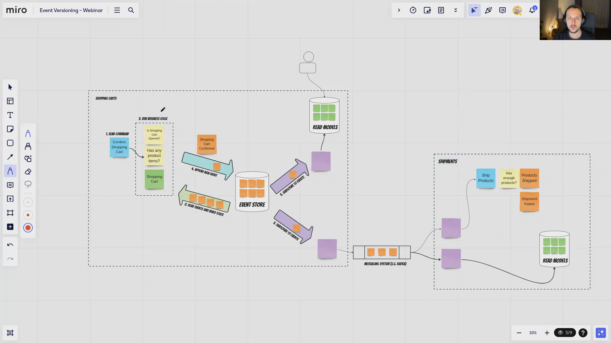

War never changes; migrations are always complex. It's always a mind gymnastics and searching [for risks](/en/the_risk_of_ignoring_risks) and what may go wrong. Sometimes we try to cheat, ignore the consequences, and take the fastest. That usually ends up with breaking things. Breaking our data is one of the worst consequences of our YOLO attitude. We all have scary tales about our mishaps, yet we still believe that "just doing a simple SQL" is manageable. We can split people into two groups: those that are doing backups and those that will do them.

In Event Sourcing, we have a log of business events registered in our system. This log and events are immutable. What has been seen cannot be unseen. Of course, if you read 1984 or watched "Back to the Future", you know that the past can be changed. Yet, it doesn't mean that it should. I wrote about that in the past, explaining that:
- [The best rule is not to break changes, as it increases predictability](/en/lets_take_care_of_ourselves_thoughts_about_comptibility/).
- [the only sure way to correct the past is to compensate our operations](/en/what_texting_ex_has_to_do_with_event_driven_design/), for instance, by appending correcting events. We live in a distributed world; running SQL migration in a single module won't propagate those changes to other modules.
- [we should try to avoid migrations and support multiple events versions by working on our streams design](/en/how_to_do_event_versioning/),

Yet, sometimes we must act pragmatically and apply the above rules to support multiple event schemas. I described some of them in [Simple patterns for events schema versioning](/en/how_to_do_event_versioning/). Recently, I added Upcasting strategy in Marten (versions [5.9.0](https://github.com/JasperFx/marten/releases/tag/5.9.0) and [5.10.0](https://github.com/JasperFx/marten/releases/tag/5.10.0). 

Upcasting is a process of transforming the old JSON schema into the new one. It's performed on the fly each time the event is read. You can think of it as a pluggable middleware between the deserialisation and application logic. Having that, we can either grab raw JSON or a deserialised object of the old CLR type and transform them into the new schema. Thanks to that, we can keep only the last version of the event schema in our stream aggregation or projection handling. Check the [documentation](https://martendb.io/events/versioning.html#upcasting-advanced-payload-transformationsl), as I tried to make it a comprehensive source, not only the API description. 

In this post, I'll focus on explaining how to support multiple schema versions.

Let's say that we started with the following event representing information that the client added the product to the shopping cart:

```csharp
public record ProductItemAddedToShoppingCart(
    Guid ShoppingCartId,
    Guid ProductId,
    int Quantity
);
```

It has information on which product we added (_ProductId_) and how many items we selected (_Quantity_). It worked well for some time, but we realised that product prices are changing. Surprise! We would not want our clients to pay more but _freeze_ the price when they decide to add a product. To do that we decided to also store information about the price. By having that, even if the price changes, we'll know precisely what the price client has selected. Ah, and we'd like to also rename _ShoppingCartId_ to _CartId_ as we think the prefix is redundant. The updated event will look like this:

```csharp
public record ProductItemAddedToShoppingCart(
    Guid CartId,
    Guid ProductId,
    int Quantity,
    decimal? Price = null
);
```

You may notice that we're making the price nullable. If we could guess the price, then we could make it not null and provide some default value, e.g. _666_. Yet that's not always possible. In this case, also. To be accurate, even in the traditional approach, if we weren't versioning our prices per time, then SQL migration wouldn't help. The issue with that is that this code will allow creating the invalid event from the code. If we'd like to have the compiler checking that, we could do something like that:

```csharp
public class ProductItemAddedToShoppingCart
{
    public Guid ShoppingCartId { get; }
    public Guid ProductId { get; }
    public int Quantity { get; }
    public decimal? Price  { get; }

    private ProductItemAddedToShoppingCart(
        Guid shoppingCartId,
        Guid productId,
        int quantity,
        decimal? price = null
    )
    {
        ShoppingCartId = shoppingCartId;
        ProductId = productId,
        Quantity = quantity,
        Price = price;
    }

    public static ProductItemAddedToShoppingCart For(
        Guid shoppingCartId,
        Guid productId,
        int quantity,
        decimal price
    ) =>
        new (shoppingCartId, productId, quantity, price)
}
```

We're making our constructor private, it'll be only used during deserialisation, and our code will use the static factory method. By that, we won't allow creating new events without price. Yet, we still need to support the old one.

Let's also say that we're pedantic and like Object Oriented Programming. We realised that it excessively hurts our eyes to see the flattened structure. We'd like to group product-related items into a nested object. After that, our third schema version will look like this:

```csharp
public record PricedProductItem(
    Guid ProductId,
    int Quantity,
    decimal? Price = null
);

public record ProductItemAddedToShoppingCart(
    Guid ShoppingCartId,
    ProductItem ProductItem
);
```


Now, for obvious reasons, the serialiser (for apparent reasons) won't automatically know how to map it to the new schemas. 

Before we show how to solve that, let's stop and discuss the **naming of the events representing different schemas**. We can use:
- the same name,
- different namespace,
- different name with a version number, e.g. _ProductItemAddedToShoppingCartV1_, _ProductItemAddedToShoppingCartV2_, _ProductItemAddedToShoppingCartV3_,
- different name with meaningful suffix, e.g _ProductItemAddedWithPriceToShoppingCart_ or _ProductItemAddedToShoppingCartWithGroupedInformations_.

I usually lean toward explicit naming, as it's more precise and shows us that those events are different. Because they're different. We, humans, can correlate things by abstract thinking. Computers can't, serialisers can't. Yet, even if we see the same name, or just the _V27_ suffix may get lost. The choice is yours. Marten supports all of the options.

There are two main ways of upcasting the old schema into the new one:
- **CLR types transformation** - if we're okay with keeping the old CLR class in the codebase, we could define a function that takes the instance of the old type and returns the new one. Internally it will use default deserialisation and event type mapping for the old CLR type and calls the upcasting function.
- **Raw JSON transformation** - if we don't want to keep the old CLR class or want to get the best performance by reducing the number of allocations, we can do raw JSON transformations. Most of the serialisers have classes enabling that. [Newtonsoft Json.NET has  JObject](https://www.newtonsoft.com/json/help/html/queryinglinqtojson.htm) and [System.Text.Json has JsonDocument](https://docs.microsoft.com/en-us/dotnet/standard/serialization/system-text-json-use-dom-utf8jsonreader-utf8jsonwriter#use-jsondocument). This gives the best flexibility, but logic may be more cryptic and _stringly-typed_.

Moreover, Marten allows registering those transformations using raw functions and dedicated classes.

I'll use those ways interchangeably, as you can also do that, to show how to version events with different naming strategies. 

## Different namespace and the same event name with version suffix

I'll use CLR types transformations and simple functions registration. The Marten registration will look like this:

```csharp
var options = new StoreOptions();

options.Events
    // event type name: "product_item_added_to_shopping_cart"
    .Upcast((V1.ProductItemAddedToShoppingCart @event) =>
        new V3.ProductItemAddedToShoppingCart(
            @event.ShoppingCartId,
            new V3.ProductItem(@event.ProductId, @event.Quantity)
        )
    )
    // event type name: "product_item_added_to_shopping_cart_v2"
    .Upcast(2, (V2.ProductItemAddedToShoppingCart @event) =>
        new V3.ProductItemAddedToShoppingCart(
            @event.ShoppingCartId,
            new V3.ProductItem(@event.ProductId, @event.Quantity, @event.Price)
        )
    )
    // event type name: "product_item_added_to_shopping_cart_v3"
    .MapEventTypeWithSchemaVersion<V3.ProductItemAddedToShoppingCart>(3);

var documentStore = new DocumentStore(options);
```

As we're using the CLR transformation and keeping old event types, we need to use different namespaces for our events. The following definition assumes that the first version wasn't appended with a suffix (e.g. we forgot to add it at the beginning), and then events with version two are appended with the _v2_ suffix. We'd like the third version to be added with _v3_ suffix. By that, we know what to expect and can define a specific mapping for each schema version. As you noticed, Marten allows you to pass specific version numbers explicitly and does internal mapping for you. FYI: Marten, by default, maps the CamelCase CLR class name into the lowered snake_case. For instance, the mapped event type name for the _ProductItemAddedToShoppingCart_ will be "product_item_added_to_shopping_cart".

## The same event name with version suffix

As mentioned above, if we'd like to eliminate the old event types or we hate adding redundant allocations, we could use raw JSON transformations. I'll use System.Text.Json as an example, but you can achieve the same with Newtonsoft Json.NET.

Let's now take transformations to the dedicated class. They're just pure functions taking the raw _JsonDocument_ and returning the mapped event. This will make it easier to do unit tests.

```csharp
public static class ProductItemAddedToShoppingCartUpcasters
{
    public static V3.ProductItemAddedToShoppingCart V1(JsonDocument oldEventJson)
    {
        var oldEvent = oldEventJson.RootElement;

        return new V3.ProductItemAddedToShoppingCart(
            oldEvent.GetProperty("ShoppingCartId").GetGuid(),
            new ProductItem(
                oldEvent.GetProperty("ProductId").GetGuid(),
                oldEvent.GetProperty("Quantity").GetInt32()
            )
        );
    };

    
    public static V3.ProductItemAddedToShoppingCart V2(JsonDocument oldEventJson)
    {
        var oldEvent = oldEventJson.RootElement;

        return new V3.ProductItemAddedToShoppingCart(
            oldEvent.GetProperty("ShoppingCartId").GetGuid(),
            new ProductItem(
                oldEvent.GetProperty("ProductId").GetGuid(),
                oldEvent.GetProperty("Quantity").GetInt32(),
                oldEvent.GetProperty("Price").GetDecimal()
            )
        );
    };
}
```

The registration will look like this:

```csharp
using static Marten.Services.Json.Transformations.SystemTextJson.JsonTransformations;
using static ProductItemAddedToShoppingCartUpcasters;

var options = new StoreOptions();
options.UseDefaultSerialization(serializerType:SerializerType.SystemTextJson);

options.Events
    // event type name: "product_item_added_to_shopping_cart"
    .Upcast<V3.ProductItemAddedToShoppingCart>(Upcast(V1))
    // event type name: "product_item_added_to_shopping_cart_v2"
    .Upcast<V3.ProductItemAddedToShoppingCart>(2, Upcast(V2))
    // event type name: "product_item_added_to_shopping_cart_v3"
    .MapEventTypeWithSchemaVersion<V3.ProductItemAddedToShoppingCart>(3);

var documentStore = new DocumentStore(options);
```

You could also put the upcasting options configuration into the _ProductItemAddedToShoppingCartUpcasters_ class to encapsulate all upcasting definitions:

```csharp
public static class ProductItemAddedToShoppingCartUpcasters
{
    // (...) Upcasting methods

    public static StoreOptions UpcastProductItemAddedToShoppingCartUpcasters(this StoreOptions options)
    {
        options.Events
            // event type name: "product_item_added_to_shopping_cart"
            .Upcast<V3.ProductItemAddedToShoppingCart>(Upcast(V1))
            // event type name: "product_item_added_to_shopping_cart_v2"
            .Upcast<V3.ProductItemAddedToShoppingCart>(2, Upcast(V2))
            // event type name: "product_item_added_to_shopping_cart_v3"
            .MapEventTypeWithSchemaVersion<V3.ProductItemAddedToShoppingCart>(3);

        return options;
    }
}
```

Then registration will look as:

```csharp
using static ProductItemAddedToShoppingCartUpcasters;

var options = new StoreOptions();
options.UseDefaultSerialization(serializerType:SerializerType.SystemTextJson);

options.UpcastProductItemAddedToShoppingCartUpcasters();

var documentStore = new DocumentStore(options);
```

### Different event names with the explicit suffix

If you're a classy person, then you could also define upcasters like that:

```csharp
public class ProductItemAddedToShoppingCartV1toV3Upcaster:
    EventUpcaster<ProductItemAddedToShoppingCart,
        ProductItemAddedToShoppingCartWithPriceAndGroupedProduct>
{
    protected override ProductItemAddedToShoppingCartWithPriceAndGroupedProduct Upcast(
        ProductItemAddedToShoppingCart @event
    ) =>
        new ProductItemAddedToShoppingCartWithPriceAndGroupedProduct(
            @event.ShoppingCartId,
            new PricedProductItem(@event.ProductId, @event.Quantity)
        );
}

public class ProductItemAddedToShoppingCartV2toV3Upcaster:
    EventUpcaster<ProductItemAddedToShoppingCartWithPrice,
        ProductItemAddedToShoppingCartWithPriceAndGroupedProduct>
{
    protected override ProductItemAddedToShoppingCartWithPriceAndGroupedProduct Upcast(
        ProductItemAddedToShoppingCartWithPrice @event
    ) =>
        new ProductItemAddedToShoppingCartWithPriceAndGroupedProduct(
            @event.ShoppingCartId,
            new PricedProductItem(@event.ProductId, @event.Quantity, @event.Price)
        );
}

public static class ProductItemAddedToShoppingCartUpcasters
{
    public static StoreOptions UpcastProductItemAddedToShoppingCartUpcasters(this StoreOptions options)
    {
        options.Events
            .Upcast<ProductItemAddedToShoppingCartV1toV3Upcaster>()
            .Upcast<ProductItemAddedToShoppingCartV2toV3Upcaster>()
            .MapEventTypeWithSchemaVersion<ProductItemAddedToShoppingCartWithPriceAndGroupedProduct>();

        return options;
    }
}
```

For such registration, you can don't need to specify event type, as Marten will automatically use the old CLR event type name and perform mapping by convention:
- _ProductItemAddedToShoppingCart_ => "product_item_added_to_shopping_cart",
- _ProductItemAddedToShoppingCartWithPrice_ => "product_item_added_to_shopping_cart_with_price",
- _ProductItemAddedToShoppingCartWithPriceAndGroupedProduct_ => "product_item_added_to_shopping_cart_with_price_and_grouped_product".

Of course, you can override the event type name, e.g.

```csharp
using static Marten.Events.EventMappingExtensions;

public class ProductItemAddedToShoppingCartV2toV3Upcaster:
    EventUpcaster<ProductItemAddedToShoppingCartWithPrice,
        ProductItemAddedToShoppingCartWithPriceAndGroupedProduct>
{
    
    public override string EventTypeName =>
        GetEventTypeNameWithSchemaVersion<V1.ShoppingCartOpened>(2);

    protected override ProductItemAddedToShoppingCartWithPriceAndGroupedProduct Upcast(
        ProductItemAddedToShoppingCartWithPrice @event
    ) =>
        new ProductItemAddedToShoppingCartWithPriceAndGroupedProduct(
            @event.ShoppingCartId,
            new PricedProductItem(@event.ProductId, @event.Quantity, @event.Price)
        );
}
```

Marten provides a set of helper methods for a convention-based approach, but you can also explicitly define the event type name.

## Grand finalle

You may keep your stream aggregation and projection logic clean thanks to the upcasting. You may just use the last schema version, for instance:

```csharp
namespace WithTheSameName
{
    public record ShoppingCart(
        Guid Id,
        Guid ClientId,
        Dictionary<Guid, int> ProductItems,
        ShoppingCartStatus Status = ShoppingCartStatus.Opened,
        DateTime? OpenedAt = null
    )
    {
        public static ShoppingCart Create(ShoppingCartOpened @event) =>
            new ShoppingCart(
                @event.CartId,
                @event.Client.Id,
                new Dictionary<Guid, int>(),
                @event.Status,
                @event.OpenedAt
            );

        public ShoppingCart Apply(V3.ProductItemAddedToShoppingCart @event) =>
            this with
            {
                ProductItems = ProductItems.Select(x => new { ProductId = x.Key, Quantity = x.Value })
                    .Union(new[] { new { @event.ProductItem.ProductId, @event.ProductItem.Quantity } })
                    .GroupBy(x => x.ProductId)
                    .ToDictionary(x => x.Key, x => x.Sum(k => k.Quantity))
            };
    }
}
```

When we need to introduce the new schema, we can do it with backward compatibility and support both old and new schema during the next deployment. Based on our business process lifetime, we can define the graceful period. For instance, helpdesk tickets live typically for 1-3 days. We can assume that active tickets will be using only the new event schema after two weeks from deployment. Of course, we should verify that, and events with the old schema will still be in the database. Yet, we can archive the inactive tickets, as they won't be needed for operational purposes (they will be either warm or cold data). By doing that, we can make the old event schema obsolete and don't need to maintain it.

Is Upcasting a killer feature? Probably not. When used wisely, it can be a decent, pragmatic choice helping us in the migration strategies and being our safety belt, allowing us to evolve our model. It should be used with care; thus, this article.

**Watch also more in the webinar:**



**And read in the versioning series:**
- [Simple patterns for events schema versioning](/en/simple_events_versioning_patterns/)
- [How to (not) do the events versioning?](/en/how_to_do_event_versioning/)
- [Fun with serial JSON](/en/fun_with_json_serialisation/)
- [Mapping event type by convention](/en/how_to_map_event_type_by_convention/)
- [Let's take care of ourselves! Thoughts on compatibility](/en/lets_take_care_of_ourselves_thoughts_about_comptibility/)
- [Internal and external events, or how to design event-driven API](/en/internal_external_events/)

Cheers!

Oskar

p.s. **Ukraine is still under brutal Russian invasion. A lot of Ukrainian people are hurt, without shelter and need help.** You can help in various ways, for instance, directly helping refugees, spreading awareness, putting pressure on your local government or companies. You can also support Ukraine by donating e.g. to [Red Cross](https://www.icrc.org/en/donate/ukraine), [Ukraine humanitarian organisation](https://savelife.in.ua/en/donate/) or [donate Ambulances for Ukraine](https://www.gofundme.com/f/help-to-save-the-lives-of-civilians-in-a-war-zone).
