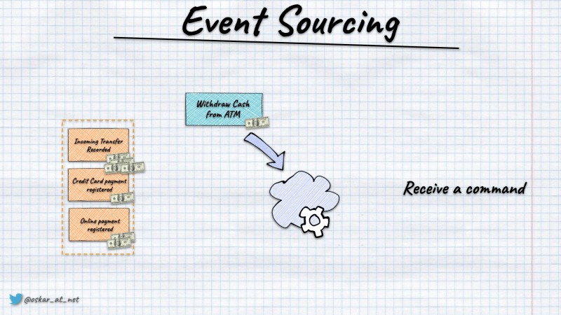
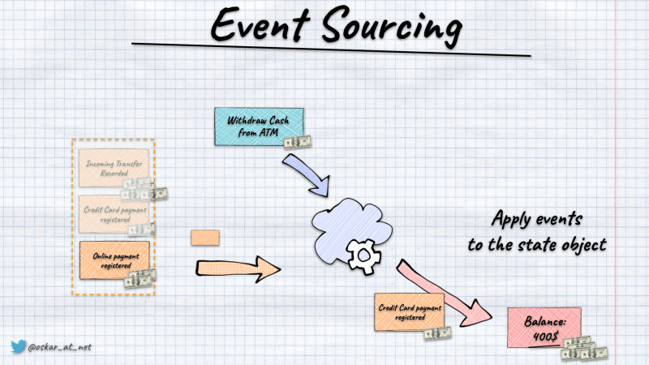
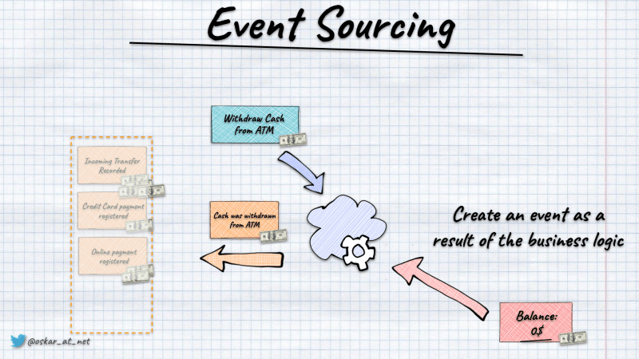

**I've heard a few times that Event Sourcing is hard to test. I'm not sure where this myth comes from;** maybe from mixing it with [event streaming](/en/event_streaming_is_not_event_sourcing/). Event Sourcing logic is pretty straightforward. We're getting the list of events recorded for a specific entity (e.g. bank account), building the current state from them and running business logic based on it. As a result, we're getting either a new event or a list of events.

Let's take a bank account as an example. We could define it as:

```csharp
public record BankAccount(
    Guid Id,
    BankAccountStatus Status,
    decimal Balance
)
{
    public static BankAccount Evolve(
        BankAccount bankAccount,
        object @event
    ) =>
        @event switch
        {
            BankAccountOpened bankAccountCreated =>
                Create(bankAccountCreated),
            DepositRecorded depositRecorded =>
                bankAccount.Apply(depositRecorded),
            CashWithdrawnFromATM cashWithdrawnFromATM =>
                bankAccount.Apply(cashWithdrawnFromATM),
            BankAccountClosed bankAccountClosed =>
                bankAccount.Apply(bankAccountClosed),
            _ => bankAccount
        };
    
    private static BankAccount Create(BankAccountOpened @event) =>
        new BankAccount(@event.BankAccountId, BankAccountStatus.Opened, @event.Version);

    private BankAccount Apply(DepositRecorded @event) =>
        this with { Balance = Balance + @event.Amount };

    private BankAccount Apply(CashWithdrawnFromATM @event) =>
        this with { Balance = Balance - @event.Amount };

    private BankAccount Apply(BankAccountClosed @event) =>
        this with { Status = BankAccountStatus.Closed };
}
```

It contains the state definition (_Id_, _Status_, and _Balance_) plus _Evolve_ function that takes the current state, applies the event, and gets the new state. Read more in [How to get the current entity state from events](/en/how_to_get_the_current_entity_state_in_event_sourcing/).

The simplest example of how to run business logic might look like this (using C#):

```csharp
static class BankAccountService
{
    public static CashWithdrawnFromATM Handle(
        WithdrawnCashFromATM command,
        BankAccount account
    )
    {
        if (account.Status == BankAccountStatus.Closed)
            throw new InvalidOperationException("Account is closed!");

        if (account.Balance < command.Amount)
            throw new InvalidOperationException("Not enough money!");

        return new CashWithdrawnFromATM(account.Id, command.Amount, command.AtmId);
    }
}
```

As you see, it's a pure function that takes the  _CashWithdrawnFromATM_ command (representing user intention), the current bank account state and returns a new fact: an event that the cash was withdrawn. It's a pure function that's not causing any side effects. Thus, straightforward code to test. 

```csharp
[Fact]
public void GivenOpenBankAccountWithEnoughMoney_WhenCashWithdrawnFromATM_ThenSucceeds()
{
    // Given
    // Existing events
    var bankAccountId = Guid.NewGuid();
    var accountNumber = Guid.NewGuid().ToString();
    var clientId = Guid.NewGuid();
    var currencyISOCode = "USD";
    var accountOpened = 
        new BankAccountOpened(
            bankAccountId,
            accountNumber,
            clientId,
            currencyISOCode
        );

    var cashierId = Guid.NewGuid();
    var initialAmount = (decimal)random.NextDouble()* 100 + 10;
    var depositRecorded = new DepositRecorded(bankAccountId, amount, cashierId);

    // and currentstate build from them
    var currentState = GetCurrentState(
        accountOpened,
        depositRecorded
    );

    // When
    var withdrawalAmount = initialAmount - 1;
    var atmId = Guid.NewGuid();

    // Command is handled
    var newEvent = BankAccountService.Handle(
        new WithdrawCashFromATM(bankAccountId, withdrawalAmount, atmId),
        currentState
    );

    // Then
    Assert.Equal(
        new CashWithdrawnFromATM(bankAccountId, withdrawalAmount, atmId),
        newEvent
    );
}

public BankAccount GetCurrentState(params object[] events)
{
    var currentState = new BankAccount();

    foreach(var @event in events)
    {
        currentState = BankAccount.Evolve(currentState, @event);
    }

    return currentState
}
```

We assert that the specific event is returned after running the command handler logic for the current state.

**The tests are written in the following pattern:**

**Given** the sequence of past events.



**When** the business logic is run for the command and the current state built from events.



**Then** the following set of events is returned (when succeeded), or an exception is thrown (when failed).



The test is written in the [Behaviour Driven-Development](https://en.wikipedia.org/wiki/Behavior-driven_development) style.

The pattern is repeatable, and we could use it for all possible event-sourcing business logic.

**Wouldn't it be great to be able to generalise business logic tests as below?**

```csharp
public class BankAccountTests
{
    private readonly Random random = new();

    private readonly DeciderSpecification<object, object, BankAccount> Spec = Specification.For<BankAccount>(
        BankAccountDecider.Handle,
        BankAccount.Evolve
    );

    [Fact]
    public void GivenNonExistingBankAccount_WhenOpenWithValidParams_ThenSucceeds()
    {
        var bankAccountId = Guid.NewGuid();
        var accountNumber = Guid.NewGuid().ToString();
        var clientId = Guid.NewGuid();
        var currencyISOCode = "USD";

        Spec.Given()
            .When(new OpenBankAccount(bankAccountId, accountNumber, clientId, currencyISOCode))
            .Then(new BankAccountOpened(bankAccountId, accountNumber, clientId, currencyISOCode));
    }

    [Fact]
    public void GivenOpenBankAccount_WhenRecordDepositWithValidParams_ThenSucceeds()
    {
        var bankAccountId = Guid.NewGuid();

        var amount = (decimal)random.NextDouble();
        var cashierId = Guid.NewGuid();

        Spec.Given(BankAccountOpened(bankAccountId))
            .When(new RecordDeposit(amount, cashierId))
            .Then(new DepositRecorded(bankAccountId, amount, cashierId));
    }

    [Fact]
    public void GivenClosedBankAccount_WhenRecordDepositWithValidParams_ThenFailsWithInvalidOperationException()
    {
        var bankAccountId = Guid.NewGuid();

        var amount = (decimal)random.NextDouble();
        var cashierId = Guid.NewGuid();

        Spec.Given(
                BankAccountOpened(bankAccountId),
                BankAccountClosed(bankAccountId)
            )
            .When(new RecordDeposit(amount, cashierId))
            .ThenThrows<InvalidOperationException>(exception => exception.Message.Should().Be("Account is closed!"));
    }

    [Fact]
    public void GivenOpenBankAccountWithEnoughMoney_WhenCashWithdrawnFromATM_ThenSucceeds()
    {
        var bankAccountId = Guid.NewGuid();
        var initialAmount = (decimal)random.NextDouble()* 100 + 10;
        
        var withdrawalAmount = initialAmount - 1;
        var atmId = Guid.NewGuid();
        
        Spec.Given(
                BankAccountOpened(bankAccountId)
                DepositRecorded(bankAccountId, initialAmount)
            )
            .When(new WithdrawCashFromATM(bankAccountId, withdrawalAmount, atmId))
            .Then(new CashWithdrawnFromATM(bankAccountId, amount, cashierId));
    }

    public static BankAccountOpened BankAccountOpened(Guid bankAccountId)
    {
        var accountNumber = Guid.NewGuid().ToString();
        var clientId = Guid.NewGuid();
        var currencyISOCode = "USD";

        return new BankAccountOpened(bankAccountId, accountNumber, clientId, currencyISOCode);
    }

    public static BankAccountOpened DepositRecorded(Guid bankAccountId, decimal amount)
    {
        var cashierId = Guid.NewGuid();
        return new DepositRecorded(bankAccountId, amount, cashierId);
    }

    public static BankAccountClosed BankAccountClosed(Guid bankAccountId)
    {
        var reason = Guid.NewGuid().ToString();

        return new BankAccountClosed(bankAccountId, reason);
    }
}
```

Ok, but how to get to that?

**No worries, I got you covered!**

Some time ago [I created Ogooreck, a sneaky testing library in BDD style](/en/ogooreck_sneaky_bdd_testing_framework/). 

**Now I extended it also for the business logic tests**. It's testing framework agnostic so that you can use it both for XUnit, NUnit and others! Just [add the NuGet](https://www.nuget.org/packages/Ogooreck), and you'll be able to test your business logic as described in this article. All of that (and more) is already available. See more in the [Ogooreck repository](https://github.com/oskardudycz/Ogooreck#business-logic-testing).

Are you not coding in .NET? Don't you want to use my library? That's also fine. Let me try to explain how to build it on your own.

## Decider tests specification

**There are multiple ways how to run business logic.** I showed them in [Slim your aggregates with Event Sourcing!](/en/slim_your_entities_with_event_sourcing/). **Let's start today with the pattern called _Decider_.** It's a [pattern defined by Jérémie Chassaing](https://thinkbeforecoding.com/post/2021/12/17/functional-event-sourcing-decider), I explained it in detail in [How to effectively compose your business logic](/en/how_to_effectively_compose_your_business_logic/). Decider pattern clarifies how to run the business logic. It's composed of the following three methods:
- **decide** - a method that's running the business logic as in the example shown above in the incident categorisation example,
- **evolve** - a method that takes the current state, an event and returns the new state updated by event data,
- **get initial state** - a method that returns the default state object, this methods is used as a base for [getting the current state from events](/en/how_to_get_the_current_entity_state_in_event_sourcing/).
- there's also the terminal function, but let's skip it for now. If you're interested, read more in [Jérémie's article](https://thinkbeforecoding.com/post/2021/12/17/functional-event-sourcing-decider)

We could describe the decider in C# code as:

```csharp
public record Decider<TCommand, TEvent, TState>(
    Func<TCommand, TState, TEvent[]> Decide,
    Func<TState, TEvent, TState> Evolve,
    Func<TState> GetInitialState
);
```

I like it, as it's a concise and complete way of explaining the event-driven business logic. It helps in composability.

The handling could be described as follows:

```csharp
private (TEvent[], TState) Handle<TEvent, TState>(
    TEvent[] events,
    Command command
)
{
    var currentState = decider.GetInitialState();

    var newEvents = decider.Decide(command, currentState);
    var newState = newEvents.Aggregate(currentState, decider.Evolve);

    return (newEvents, newState);
}
```

For defined above _BankAccount_ entity the _Decide_ method could look like this:

```csharp
public static class BankAccountDecider
{
    public static object Handle(
        object command,
        BankAccount bankAccount
    ) =>
        command switch
        {
            OpenBankAccount openBankAccount =>
                Handle(openBankAccount),
            RecordDeposit recordDeposit =>
                Handle(recordDeposit, bankAccount),
            WithdrawnCashFromATM withdrawnCash =>
                Handle(withdrawnCash, bankAccount),
            CloseBankAccount closeBankAccount =>
                Handle(closeBankAccount, bankAccount),
            _ =>
                throw new InvalidOperationException($"{command.GetType().Name} cannot be handled for Bank Account")
        };

    private static BankAccountOpened Handle(
        OpenBankAccount command
    ) =>
        new BankAccountOpened(
            command.BankAccountId,
            command.AccountNumber,
            command.ClientId,
            command.CurrencyISOCode
        );

    private static DepositRecorded Handle(
        RecordDeposit command,
        BankAccount account
    )
    {
        if (account.Status == BankAccountStatus.Closed)
            throw new InvalidOperationException("Account is closed!");

        return new DepositRecorded(account.Id, command.Amount, command.CashierId);
    }

    private static CashWithdrawnFromATM Handle(
        WithdrawnCashFromATM command,
        BankAccount account
    )
    {
        if (account.Status == BankAccountStatus.Closed)
            throw new InvalidOperationException("Account is closed!");

        if (account.Balance < command.Amount)
            throw new InvalidOperationException("Not enough money!");

        return new CashWithdrawnFromATM(account.Id, command.Amount, command.AtmId);
    }

    private static  BankAccountClosed Handle(
        CloseBankAccount command,
        BankAccount account
    )
    {
        if (account.Status == BankAccountStatus.Closed)
            throw new InvalidOperationException("Account is already closed!");

        return new BankAccountClosed(account.Id, command.Reason);
    }
}
```

To define the following test, we'll need to mix a bit of [Specification](https://en.wikipedia.org/wiki/Specification_pattern) and [Builder](https://en.wikipedia.org/wiki/Builder_pattern) patterns.

Let's start with the general specification description:

```csharp
public class DeciderSpecification<TCommand, TEvent, TState>
{
    private readonly Decider<TCommand, TEvent, TState> decider;

    public DeciderSpecification(Decider<TCommand, TEvent, TState> decider) =>
        this.decider = decider;

    public WhenDeciderSpecificationBuilder<TCommand, TEvent, TState> Given(params TEvent[] events) =>
        Given(() =>
        {
            var currentState = decider.GetInitialState();

            return events.Aggregate(currentState, decider.Evolve);
        });

    public WhenDeciderSpecificationBuilder<TCommand, TEvent, TState> Given(TState currentState) =>
        Given(() => currentState);

    public WhenDeciderSpecificationBuilder<TCommand, TEvent, TState> Given() =>
        new(decider);

    public WhenDeciderSpecificationBuilder<TCommand, TEvent, TState> Given(Func<TState> getCurrentState) =>
        new(decider, getCurrentState);
}
```

**It's a simple wrapper that takes the _Decider_ instance and generates a method to get the current state. This method will either take an entity instance or build it from the provided events sequence.**

We could also add helper methods to facilitate Specification setup:

```csharp
public static DeciderSpecification<TCommand, TEvent, TState> For<TCommand, TEvent, TState>(
        Decider<TCommand, TEvent, TState> decider
    ) =>
        new(decider);

    public static DeciderSpecification<TCommand, TEvent, TState> For<TCommand, TEvent, TState>(
        Func<TCommand, TState, TEvent[]> decide,
        Func<TState, TEvent, TState> evolve,
        Func<TState>? getInitialState = null
    ) where TState : notnull =>
        For(
            new Decider(
                decide,
                evolve,
                getInitialState ?? ObjectFactory<TState>.GetDefaultOrUninitialized
            )
        );

    public static DeciderSpecification<TCommand, TEvent, TState> For<TCommand, TEvent, TState>(
        Func<TCommand, TState, TEvent> decide,
        Func<TState, TEvent, TState> evolve,
        Func<TState>? getInitialState = null
    ) =>
        For<TCommand, TEvent, TState>(
            (command, state) => new TEvent[] { decide(command, state) },
            evolve,
            getInitialState
        );
}
```

Nothing spectacular here besides the _ObjectFactory<TState>.GetDefaultOrUninitialized_ method. It's a simple wrapper that tries to create an instance with a default constructor or creates an uninitialised object.

```csharp
public static class ObjectFactory<T>
{
    public static T GetUnitialized() =>
        (T)RuntimeHelpers.GetUninitializedObject(typeof(T));

    public static T? GetDefault()
    {
        try
        {
            return (T?)Activator.CreateInstance(typeof(T), true);
        }
        catch (MissingMethodException? e)
        {
            Console.WriteLine(e);
            return default;
        }
    }

    public static T GetDefaultOrUninitialized()
        => GetDefault() ?? GetUnitialized();
}
```

We now have the basic test input setup; we should define the test run. We'll do that via _WhenDeciderSpecificationBuilder_.

```csharp
public class WhenDeciderSpecificationBuilder<TCommand, TEvent, TState>
{
    private readonly Decider<TCommand, TEvent, TState> decider;
    private readonly Func<TState>? getCurrentState;

    public WhenDeciderSpecificationBuilder(
        Decider<TCommand, TEvent, TState> decider,
        Func<TState>? getCurrentState = null
    )
    {
        this.decider = decider;
        this.getCurrentState = getCurrentState;
    }

    public ThenDeciderSpecificationBuilder<TEvent, TState> When(params TCommand[] commands) =>
        new(RunTest(commands));

    private Lazy<TestResult<TState, TEvent>> RunTest(TCommand[] commands) =>
        new(() =>
        {
            var currentState = (getCurrentState ?? decider.GetInitialState)();
            var resultEvents = new List<TEvent>();

            foreach (var command in commands)
            {
                var newEvents = decider.Decide(command, currentState);
                resultEvents.AddRange(newEvents);

                currentState = newEvents.Aggregate(currentState, decider.Evolve);
            }

            return new TestResult<TState, TEvent>(currentState, resultEvents.ToArray());
        });
}

public record TestResult<TState, TEvent>(
    TState CurrentState,
    TEvent[] NewEvents
);
```

**We're taking the decider instance and generating the lazily evaluated test run.** It's the same as the business handling defined above, with the distinction that we're allowing to provide and run multiple commands. Typically, it's best to add multiple tests instead of running multiple commands, yet sometimes you'd like to do some integration test or test command orchestration, which can be helpful.

**The final thing that we need to provide is test verification.** We'll do that through _ThenDeciderSpecificationBuilder_. 

```csharp
public class ThenDeciderSpecificationBuilder<TEvent, TState>
{
    private readonly Lazy<TestResult<TState, TEvent>> getResult;

    public ThenDeciderSpecificationBuilder(Lazy<TestResult<TState, TEvent>> getResult) =>
        this.getResult = getResult;

    public ThenDeciderSpecificationBuilder<TEvent, TState> Then(params TEvent[] expectedEvents)
    {
        var result = getResult.Value;
        result.NewEvents.Should().BeEquivalentTo(expectedEvents);
        return this;
    }

    public ThenDeciderSpecificationBuilder<TEvent, TState> Then(TState expectedState)
    {
        var result = getResult.Value;
        result.CurrentState.Should().BeEquivalentTo(expectedState);
        return this;
    }

    public ThenDeciderSpecificationBuilder<TEvent, TState> Then(params Action<TEvent[]>[] eventsAssertions)
    {
        var result = getResult.Value;

        foreach (var then in eventsAssertions)
        {
            then(result.NewEvents);
        }

        return this;
    }

    public ThenDeciderSpecificationBuilder<TEvent, TState> Then(params Action<TState>[] stateAssertions)
    {
        var result = getResult.Value;

        foreach (var then in stateAssertions)
        {
            then(result.CurrentState);
        }

        return this;
    }

    public ThenDeciderSpecificationBuilder<TEvent, TState> Then(params Action<TState, TEvent[]>[] assertions)
    {
        var result = getResult.Value;

        foreach (var then in assertions)
        {
            then(result.CurrentState, result.NewEvents);
        }

        return this;
    }

    public ThenDeciderSpecificationBuilder<TEvent, TState> ThenThrows<TException>(Action<TException>? assert = null)
        where TException : Exception
    {
        try
        {
            var _ = getResult.Value;
        }
        catch (TException e)
        {
            assert?.Invoke(e);
        }

        return this;
    }
}
```

Class wraps the lazily evaluated test run (to ensure that it's run only once) and allows multiple assertions using fluent syntax. The test will be run on the first _Then_ method call.

## Event-driven aggregate tests

**Testing Decider is cool, but what if we're not so fancy and using good, old aggregates?**

Let's say that we have the classical _Aggregate_ base class:

```csharp
public abstract class Aggregate: Aggregate<Guid>
{
}

public abstract class Aggregate<T> where T : notnull
{
    public T Id { get; protected set; } = default!;

    public int Version { get; protected set; }

    [NonSerialized] private readonly Queue<object> uncommittedEvents = new();

    public virtual void When(object @event) { }

    public object[] DequeueUncommittedEvents()
    {
        var dequeuedEvents = uncommittedEvents.ToArray();

        uncommittedEvents.Clear();

        return dequeuedEvents;
    }

    protected void Enqueue(object @event)
    {
        uncommittedEvents.Enqueue(@event);
    }
}
```

And Shopping Cart aggregate defined with it:

```csharp
public class ShoppingCart: Aggregate
{
    public Guid ClientId { get; private set; }

    public ShoppingCartStatus Status { get; private set; }

    public IList<PricedProductItem> ProductItems { get; private set; } = default!;

    public decimal TotalPrice => ProductItems.Sum(pi => pi.TotalPrice);

    public static ShoppingCart Open(
        Guid cartId,
        Guid clientId)
    {
        return new ShoppingCart(cartId, clientId);
    }

    public static ShoppingCart Evolve(ShoppingCart cart, object @event)
    {
        switch (@event)
        {
            case ShoppingCartOpened opened:
                cart.Apply(opened);
                break;
            case ProductAdded productAdded:
                cart.Apply(productAdded);
                break;
            case ProductRemoved productRemoved:
                cart.Apply(productRemoved);
                break;
            case ShoppingCartConfirmed confirmed:
                cart.Apply(confirmed);
                break;
            case ShoppingCartCanceled canceled:
                cart.Apply(canceled);
                break;
        }

        return cart;
    }

    private ShoppingCart(){}

    private ShoppingCart(
        Guid id,
        Guid clientId)
    {
        var @event = ShoppingCartOpened.Create(
            id,
            clientId
        );

        Enqueue(@event);
        Apply(@event);
    }

    public void Apply(ShoppingCartOpened @event)
    {
        Id = @event.CartId;
        ClientId = @event.ClientId;
        ProductItems = new List<PricedProductItem>();
        Status = ShoppingCartStatus.Pending;
    }

    public void AddProduct(
        IProductPriceCalculator productPriceCalculator,
        ProductItem productItem)
    {
        if(Status != ShoppingCartStatus.Pending)
            throw new InvalidOperationException($"Adding product for the cart in '{Status}' status is not allowed.");

        var pricedProductItem = productPriceCalculator.Calculate(productItem).Single();

        var @event = ProductAdded.Create(Id, pricedProductItem);

        Enqueue(@event);
        Apply(@event);
    }

    public void Apply(ProductAdded @event)
    {
        var newProductItem = @event.ProductItem;

        var existingProductItem = FindProductItemMatchingWith(newProductItem);

        if (existingProductItem is null)
        {
            ProductItems.Add(newProductItem);
            return;
        }

        ProductItems.Replace(
            existingProductItem,
            existingProductItem.MergeWith(newProductItem)
        );
    }

    public void RemoveProduct(
        PricedProductItem productItemToBeRemoved)
    {
        if(Status != ShoppingCartStatus.Pending)
            throw new InvalidOperationException($"Removing product from the cart in '{Status}' status is not allowed.");

        var existingProductItem = FindProductItemMatchingWith(productItemToBeRemoved);

        if (existingProductItem is null)
            throw new InvalidOperationException($"Product with id `{productItemToBeRemoved.ProductId}` and price '{productItemToBeRemoved.UnitPrice}' was not found in cart.");

        if(!existingProductItem.HasEnough(productItemToBeRemoved.Quantity))
            throw new InvalidOperationException($"Cannot remove {productItemToBeRemoved.Quantity} items of Product with id `{productItemToBeRemoved.ProductId}` as there are only ${existingProductItem.Quantity} items in card");

        var @event = ProductRemoved.Create(Id, productItemToBeRemoved);

        Enqueue(@event);
        Apply(@event);
    }

    public void Apply(ProductRemoved @event)
    {
        var productItemToBeRemoved = @event.ProductItem;

        var existingProductItem = FindProductItemMatchingWith(@event.ProductItem);

        if (existingProductItem == null)
            return;

        if (existingProductItem.HasTheSameQuantity(productItemToBeRemoved))
        {
            ProductItems.Remove(existingProductItem);
            return;
        }

        ProductItems.Replace(
            existingProductItem,
            existingProductItem.Subtract(productItemToBeRemoved)
        );
    }

    public void Confirm()
    {
        if(Status != ShoppingCartStatus.Pending)
            throw new InvalidOperationException($"Confirming cart in '{Status}' status is not allowed.");

        var @event = ShoppingCartConfirmed.Create(Id, DateTime.UtcNow);

        Enqueue(@event);
        Apply(@event);
    }

    public void Apply(ShoppingCartConfirmed @event)
    {
        Status = ShoppingCartStatus.Confirmed;
    }

    public void Cancel()
    {
        if(Status != ShoppingCartStatus.Pending)
            throw new InvalidOperationException($"Canceling cart in '{Status}' status is not allowed.");

        var @event = ShoppingCartCanceled.Create(Id, DateTime.UtcNow);

        Enqueue(@event);
        Apply(@event);
    }

    public void Apply(ShoppingCartCanceled @event)
    {
        Status = ShoppingCartStatus.Canceled;
    }

    private PricedProductItem? FindProductItemMatchingWith(PricedProductItem productItem)
    {
        return ProductItems
            .SingleOrDefault(pi => pi.MatchesProductAndPrice(productItem));
    }
}
```

Aggregate methods are not returning anything. They also do not have a command instance as a parameter, just standard method params. This is fine, as it's not recommended to pass commands through aggregate methods, as by that, we're tying the application layer with domain definition.

**Can we test it with the test specifications defined above?** Almost! We need to add a bit more code.

In general, command handling doesn't mean that we should use a command object. We can treat command handling as processing input parameters on the aggregate/entity object. We may also want to test the returned event and the updated aggregate state to ensure we didn't forget to apply the newly created event to the state.

To do that, let's modify the Decider definition to allow returning both events collection and new state.

```csharp
public record Decider<TCommand, TEvent, TState>(
    Func<TCommand, TState, DecideResult<TEvent, TState>> Decide,
    Func<TState, TEvent, TState> Evolve,
    Func<TState> GetInitialState
);

public record DecideResult<TEvent, TState>(
    TEvent[] NewEvents,
    TState? NewState = default
);

public static class DecideResult
{
    public static DecideResult<TEvent, TState> For<TEvent, TState>(params TEvent[] newEvents) => new(newEvents);

    public static DecideResult<TEvent, TState> For<TEvent, TState>(TState newState, params TEvent[] newEvents) =>
        new(newEvents, newState);
}
```

Unfortunately, [C# doesn't have algebraic types](/en/union_types_in_csharp/), so we need to work around it by adding the _DecideResult_ that can take either just new events (for the decider scenario) or new events and new state.

**Having that, let's define the business logic handler template:**

```csharp
public delegate DecideResult<TEvent, TState> Handler<TEvent, TState>(TState state);
```

It's a simple function template definition that will do some logic on the state and return the result. 

**And now, focus, as we'll do a bit of magic now!**

```csharp
public class HandlerSpecification<TEvent, TState>
    : DeciderSpecification<Handler<TEvent, TState>, TEvent, TState>
{
    public HandlerSpecification(Decider<Handler<TEvent, TState>, TEvent, TState> decider):
        base(decider)
    {
    }
}
```

We also need to define the specification definition methods:

```csharp
public static HandlerSpecification<TEvent, TState> For<TEvent, TState>(
        Func<Handler<TEvent, TState>, TState, DecideResult<TEvent, TState>> decide,
        Func<TState, TEvent, TState> evolve,
        Func<TState>? getInitialState = null
    ) =>
        new(
            Decider.For(
                decide,
                evolve,
                getInitialState
            )
        );

    public static HandlerSpecification<TEvent, TState> For<TEvent, TState>(
        Func<TState, TEvent, TState>? evolve = null,
        Func<TState>? getInitialState = null
    ) =>
        new(
            Decider.For<Handler<TEvent, TState>, TEvent, TState>(
                decide: (handler, currentState) => handler(currentState),
                evolve,
                getInitialState
            )
        );
```

We defined the new test specification derived from the well-known _DeciderSpecification_. As the command parameter, we're not providing the specific command class but a handler. As explained above, the handler will be a function that will take the current state and run defined logic on it.

**What will the test look like?**

```csharp
using static AggregateTestExtensions<ShoppingCart>;

public class ShoppingCartTests
{
    private readonly Random random = new();
    
    private readonly HandlerSpecification<object, ShoppingCart> Spec = 
        Specification.For<object, ShoppingCart>(Handle, ShoppingCart.Evolve);

    private class DummyProductPriceCalculator: IProductPriceCalculator
    {
        private readonly decimal price;

        public DummyProductPriceCalculator(decimal price) => this.price = price;

        public IReadOnlyList<PricedProductItem> Calculate(params ProductItem[] productItems) =>
            productItems.Select(pi => PricedProductItem.For(pi, price)).ToList();
    }

    [Fact]
    public void GivenNonExistingShoppingCart_WhenOpenWithValidParams_ThenSucceeds()
    {
        var shoppingCartId = Guid.NewGuid();
        var clientId = Guid.NewGuid();

        Spec.Given()
            .When(() => ShoppingCart.Open(shoppingCartId, clientId))
            .Then(new ShoppingCartOpened(shoppingCartId, clientId));
    }

    [Fact]
    public void GivenOpenShoppingCart_WhenAddProductWithValidParams_ThenSucceeds()
    {
        var shoppingCartId = Guid.NewGuid();

        var productItem = ValidProductItem();
        var price = random.Next(1, 1000);
        var priceCalculator = new DummyProductPriceCalculator(price);

        Spec.Given(ShoppingCartOpened(shoppingCartId))
            .When(cart => cart.AddProduct(priceCalculator, productItem))
            .Then(new ProductAdded(shoppingCartId, PricedProductItem.For(productItem, price)));
    }

    public static ShoppingCartOpened ShoppingCartOpened(Guid shoppingCartId)
    {
        var clientId = Guid.NewGuid();

        return new ShoppingCartOpened(shoppingCartId, clientId);
    }

    public static ProductItem ValidProductItem() =>
        ProductItem.From(Guid.NewGuid(), Random.Next(1, 100));
}

public static class AggregateTestExtensions<TAggregate> where TAggregate : Aggregate
{
    public static DecideResult<object, TAggregate> Handle(Handler<object, TAggregate> handle, TAggregate aggregate)
    {
        var result = handle(aggregate);
        var updatedAggregate = result.NewState ?? aggregate;
        return DecideResult.For(updatedAggregate, updatedAggregate.DequeueUncommittedEvents());
    }
}
```

**As you see, we're not passing in tests, the command instance, but running the aggregate methods with input parameters.** As our aggregate publish events through the internal pending events queue, we're still checking events in.

To be able to get events from the pending collection, we had to inject the _decide_ method. We defined that _AggregateTestExtensions_ and passed in spec definition. It's again a bit of magic, but it's straightforward if we look closely. 

We expect that as the first parameter, we'll get a handler provided in the _When_ method. As the second, we'll get aggregate. We need to run the provided handler on aggregate to get the new aggregate state. Once we have it, we can dequeue events and return both.

We must define a few extensions to _WhenDeciderSpecificationBuilder_ to be able to pass the regular functions.

```csharp
public static class HandlerSpecificationExtensions
{
    public static ThenDeciderSpecificationBuilder<TEvent, TState>
        When<TEvent, TState>(
            this WhenDeciderSpecificationBuilder<Handler<TEvent, TState>, TEvent, TState> when,
            params Func<TState>[] whens
        ) =>
        when.When(whens.Select(WhenMapping<TEvent, TState>.ToHandler).ToArray());

    public static ThenDeciderSpecificationBuilder<TEvent, TState>
        When<TEvent, TState>(
            this WhenDeciderSpecificationBuilder<Handler<TEvent, TState>, TEvent, TState> when,
            params Action<TState>[] whens
        ) =>
        when.When(whens.Select(WhenMapping<TEvent, TState>.ToHandler).ToArray());
}

public static class WhenMapping<TEvent, TState>
{
    public static Handler<TEvent, TState> ToHandler(Func<TState> when) =>
        _ => DecideResult.For<TEvent, TState>(when());

public static Handler<TEvent, TState> ToHandler(Action<TState> when) =>
        state =>
        {
            when(state);
            return DecideResult.For<TEvent, TState>(state);
        };

}
```

This code snippet may look cryptic, but it just defines the permutation of handlers you can pass to the test method:
- returning state from the handler (for the newly created instance) 
- running the handler on the current state and not returning anything.

**Bang! We have also aggregates covered!**

## State-based Aggregates tests

Event-driven is great, but what if we'd like just to test aggregates that are not producing any events? Sure we can!

Let's say that we have the following version of the shopping cart:

```csharp
public class ShoppingCart
{
    public Guid Id { get; private set; }
    
    public Guid ClientId { get; private set; }

    public ShoppingCartStatus Status { get; private set; }

    public IList<PricedProductItem> ProductItems { get; private set; } = default!;

    public decimal TotalPrice => ProductItems.Sum(pi => pi.TotalPrice);

    public static ShoppingCart Open(
        Guid cartId,
        Guid clientId)
    {
        return new ShoppingCart(cartId, clientId);
    }

    private ShoppingCart(){}

    private ShoppingCart(
        Guid id,
        Guid clientId)
    {

        Id = id;
        ClientId = clientId;
        ProductItems = new List<PricedProductItem>();
        Status = ShoppingCartStatus.Pending;
    }

    public void AddProduct(
        IProductPriceCalculator productPriceCalculator,
        ProductItem productItem)
    {
        if(Status != ShoppingCartStatus.Pending)
            throw new InvalidOperationException($"Adding product for the cart in '{Status}' status is not allowed.");

        var newProductItem = productPriceCalculator.Calculate(productItem).Single();

        var existingProductItem = FindProductItemMatchingWith(newProductItem);

        if (existingProductItem is null)
        {
            ProductItems.Add(newProductItem);
            return;
        }

        ProductItems.Replace(
            existingProductItem,
            existingProductItem.MergeWith(newProductItem)
        );
    }

    public void RemoveProduct(
        PricedProductItem productItemToBeRemoved)
    {
        if(Status != ShoppingCartStatus.Pending)
            throw new InvalidOperationException($"Removing product from the cart in '{Status}' status is not allowed.");

        var existingProductItem = FindProductItemMatchingWith(productItemToBeRemoved);

        if (existingProductItem is null)
            throw new InvalidOperationException($"Product with id `{productItemToBeRemoved.ProductId}` and price '{productItemToBeRemoved.UnitPrice}' was not found in cart.");

        if(!existingProductItem.HasEnough(productItemToBeRemoved.Quantity))
            throw new InvalidOperationException($"Cannot remove {productItemToBeRemoved.Quantity} items of Product with id `{productItemToBeRemoved.ProductId}` as there are only ${existingProductItem.Quantity} items in card");

        if (existingProductItem.HasTheSameQuantity(productItemToBeRemoved))
        {
            ProductItems.Remove(existingProductItem);
            return;
        }

        ProductItems.Replace(
            existingProductItem,
            existingProductItem.Subtract(productItemToBeRemoved)
        );
    }

    public void Confirm()
    {
        if(Status != ShoppingCartStatus.Pending)
            throw new InvalidOperationException($"Confirming cart in '{Status}' status is not allowed.");

        Status = ShoppingCartStatus.Confirmed;
    }

    public void Cancel()
    {
        if(Status != ShoppingCartStatus.Pending)
            throw new InvalidOperationException($"Canceling cart in '{Status}' status is not allowed.");

        Status = ShoppingCartStatus.Canceled;
    }

    private PricedProductItem? FindProductItemMatchingWith(PricedProductItem productItem)
    {
        return ProductItems
            .SingleOrDefault(pi => pi.MatchesProductAndPrice(productItem));
    }
}
```

No events here! What would the test look like?

```csharp
public class ShoppingCartTests
{
    private readonly Random random = new();

    private readonly HandlerSpecification<object, ShoppingCart> Spec = Specification.For<object, ShoppingCart>();

    private class DummyProductPriceCalculator: IProductPriceCalculator
    {
        private readonly decimal price;

        public DummyProductPriceCalculator(decimal price) => this.price = price;

        public IReadOnlyList<PricedProductItem> Calculate(params ProductItem[] productItems) =>
            productItems.Select(pi => PricedProductItem.For(pi, price)).ToList();
    }

    [Fact]
    public void GivenNonExistingShoppingCart_WhenOpenWithValidParams_ThenSucceeds()
    {
        var shoppingCartId = Guid.NewGuid();
        var clientId = Guid.NewGuid();

        Spec.Given()
            .When(() => ShoppingCart.Open(shoppingCartId, clientId))
            .Then((state, _) =>
            {
                state.Id.Should().Be(shoppingCartId);
                state.ClientId.Should().Be(clientId);
                state.ProductItems.Should().BeEmpty();
                state.Status.Should().Be(ShoppingCartStatus.Pending);
                state.TotalPrice.Should().Be(0);
            });
    }

    [Fact]
    public void GivenOpenShoppingCart_WhenAddProductWithValidParams_ThenSucceeds()
    {
        var shoppingCartId = Guid.NewGuid();

        var productItem = ValidProductItem();
        var price = random.Next(1, 1000);
        var priceCalculator = new DummyProductPriceCalculator(price);

        Spec.Given(OpenedShoppingCart(shoppingCartId))
            .When(cart => cart.AddProduct(priceCalculator, productItem))
            .Then((state, _) =>
            {
                state.ProductItems.Should().NotBeEmpty();
                state.ProductItems.Single().Should().Be(PricedProductItem.For(productItem, price));
            });
    }

    public static ShoppingCart OpenedShoppingCart(Guid shoppingCartId)
    {
        var clientId = Guid.NewGuid();

        return ShoppingCart.Open(shoppingCartId, clientId);
    }

    public static ProductItem ValidProductItem() =>
        ProductItem.From(Guid.NewGuid(), Random.Next(1, 100));
}
```

Looks neat, but what changes do we need to add?

Let's start with updating the test run method in _WhenDeciderSpecificationBuilder_ also to return state and assume that the events collection may be empty:

```csharp
Lazy<TestResult<TState, TEvent>> RunTest(TCommand[] commands) =>
    new(() =>
    {
        var currentState = (getCurrentState ?? decider.GetInitialState)();
        var resultEvents = new List<TEvent>();

        foreach (var command in commands)
        {
            var (newEvents, state) = decider.Decide(command, currentState);
            resultEvents.AddRange(newEvents);

            currentState = state ?? newEvents.Aggregate(currentState, decider.Evolve);
        }

        return new TestResult<TState, TEvent>(currentState, resultEvents.ToArray());
    });
```
That allows us to take the state based on the _evolve_ method and directly from _decide_ function result.

## Summary

**As you can see, we started with the _Decider_ pattern and tried to use it in our event-sourced tests.** Yet it appeared that the concept is flexible enough and strong that on top of it, we were able to test aggregates (event-driven and state-based).

The code samples show the C# implementation, but using the following patterns can also be applied to any other programming language.

Still, you don't need to do it on your own, if you're in .NET space, just [add the NuGet](https://www.nuget.org/packages/Ogooreck), and you'll be able to test your business logic as described in this article.

I hope that you like it!

Cheers!

Oskar

p.s. **Ukraine is still under brutal Russian invasion. A lot of Ukrainian people are hurt, without shelter and need help.** You can help in various ways, for instance, directly helping refugees, spreading awareness, putting pressure on your local government or companies. You can also support Ukraine by donating e.g. to [Red Cross](https://www.icrc.org/en/donate/ukraine), [Ukraine humanitarian organisation](https://savelife.in.ua/en/donate/) or [donate Ambulances for Ukraine](https://www.gofundme.com/f/help-to-save-the-lives-of-civilians-in-a-war-zone).
