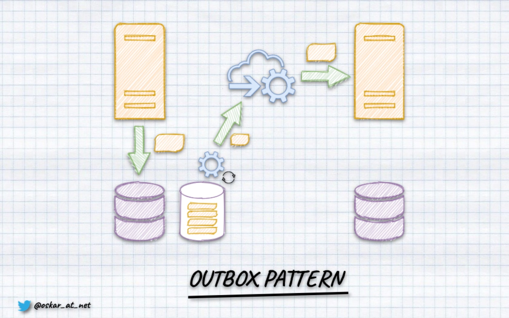

**There are only a few patterns that I'm comfortable saying: _"You should use it always if you want to build mature system"_. One of them is the Outbox Pattern.** Why? Because it guarantees that your business workflows and communication will not be stuck in the middle.

As I explained in [Outbox, Inbox patterns and delivery guarantees explained](/pl/outbox_inbox_patterns_and_delivery_guarantees_explained/):

_**Outbox Pattern ensures that a message was sent (e.g. to a queue) successfully at least once.** With this pattern, instead of directly publishing a message to the queue, we store it in temporary storage (e.g. database table). We're wrapping the entity save and message storing with the Unit of Work (transaction). By that, we're ensuring that the message won't be lost if the application data is stored. It will be published later through a background process. This process will check if there are any unsent messages in the table. When the worker finds any, it tries to send them. After it gets confirmation of publishing (e.g. ACK from the queue), it marks the event as sent._



Why does it provide at-least-once and not exactly-once? Writing to the database may fail (e.g. it will not respond). When that happens, the process handling outbox pattern will try to resend the event after some time and try to do it until the message is correctly marked as sent in the database._

We can use Outbox Pattern to publish any type of message. Typically we're sending commands or publishing events (see more in [What's the difference between a command and an event?](/pl/whats_the_difference_between_event_and_command/) to know why semantics matters).

If you're using a relational database, you typically need to create the table for the messages.

The example structure could look as follows:

```sql
CREATE TABLE publications(
   -- the autoincremented position of the message to respect the order
   position        BIGSERIAL                 PRIMARY KEY,
   -- this may allow you to partition publications, e.g. per tenant
   publication_id  VARCHAR(250)              NOT NULL,
   -- unique message id, which can be used for deduplication or idempotency
   message_id       VARCHAR(250)             NOT NULL,
   -- the message type, e.g. `TransactionRecorded`
   message_type     VARCHAR(250)             NOT NULL,
   -- serialised message data, e.g. to JSON
   data             JSONB                    NOT NULL,
   -- diagnostic information of when the message was scheduled
   scheduled       TIMESTAMP WITH TIME ZONE  NOT NULL    default (now()),
);
```

If we'd like to have the option to have more than one subscriber and parallelise the publishing, then we should also define the table with information about the publishing process.

```sql
CREATE TABLE subscribers
(
   -- subscription name
   subscription_id          VARCHAR(250) PRIMARY KEY,
   -- information about the position of the last processed message
   last_processed_position  INTEGER      NULL,
   -- inform which publication we're subscribing to
   publication_id           VARCHAR(250) NOT NULL,
);
```

We can subscribe to the specific message sequence (called _publication_) with such a table structure. Once we handle the particular message, using its position, we update the subscription's last processed position. Thanks to that, we can retry it from the previously known position even if the process breaks in the middle.

**Typically, this processing happens by polling.** With a defined interval, we're querying the messages table to get the new to publish. For instance:

```sql
SELECT 
   p.position, p.publication_id, p.message_id, p.message_type, p.data, p.scheduled
FROM publication p
WHERE
   p.publication_id = subscription_publication_id
   p.last_processed_position  > subscription_last_processed_position 
LIMIT 100 
```

This is fine for many cases, but:
- it's not easy to find the right interval. [Marten Async Daemon](https://martendb.io/events/projections/async-daemon.html#async-projections-daemon) does fancy stuff to tune it depending on how fast new messages are appended. But still, it's an approximation.
- polling may require more resources and have more extensive memory pressure.
- it's not as easy as it seems to scale it in a reliable and resilient way (e.g. have multiple nodes, [leaders election](https://jeremydmiller.com/2020/05/05/using-postgresql-advisory-locks-for-leader-election/) etc.),
- may be harder to implement than it seems, check more in [How Postgres sequences issues can impact your messaging guarantees](/en/ordering_in_postgres_outbox/).

It would be great if we could be notified by the database when new messages arrive, right?

If you're using Postgres, then you may be the lucky person then!

## Postgres Logical Replication

**I'm not sure if you know, but [Relational databases work like event stores](/pl/relational_databases_are_event_stores/). They have a concept called _"Write-Ahead Log"_ (WAL).** It is an append-only structure that records all the operations during transaction processing (Inserts, Updates, Deletes). When we commit a transaction, the data is firstly appended to the Write-Ahead Log. Then all operations are applied to tables, indexes, etc. Hence the name "Write-Ahead": from this writing data to the log in advance of other changes. So from that perspective, tables and indexes are just read models for Write-Ahead Log.

Postgres is a rock-solid database with many superb features. One of them is JSON support we're using in [Marten](https://martendb.io), and the other is logical replication that we'll look closer at now. 

**Logical replication takes the traditional approach to the next level. Instead of sending the raw binary stream of backed-up database files, we're sending a stream of changes that were recorded in the Write-Ahead Log.** It's named logical, as it understands the operations' semantics, plus the information about the tables it's replicating. It's highly flexible; it can be defined for one or multiple tables, filter records and copy a subset of data. It can inform you about changes to specific records. Thus it requires the replicated table to have primary keys.

The first step is to enable logical replication in Postgres config (_postgresql.conf_):

```toml
wal_level = logical
```

If Docker compose, you can configure it as:

```yml
version: "3"
services:
  postgres:
    image: postgres:14.5-alpine
    ports:
      - "5432:5432"
    environment:
      - POSTGRES_DB=postgres
      - POSTGRES_PASSWORD=postgres
    command:
      - "postgres"
      - "-c"
      - "wal_level=logical"
```

Similarly to the Outbox tables described above, it has publish-subscribe semantics.

**To define publication, we need to call the following SQL statement:**

```sql
CREATE PUBLICATION outbox_pub FOR TABLE outbox;
```

**We also need to tell Postgres that it should retain Write-Ahead Log entries required to perform logical replications, even if replicas/subscribers are disconnected from the database. We do that by defining logical replication slot:**

```sql
SELECT * FROM pg_create_logical_replication_slot('outbox_slot', 'pgoutput');
```

The first parameter is just a freehand name. The other is the name of the logical decoding plugin we'd like to use. Logical replication is still performed with binary data of the defined format. It's not super-readable for humans or even for other systems. To be able to translate the replication format, we can use logical decoding plugins. They're plenty of them, from the most known; let me mention:
- [test-decoding](https://www.postgresql.org/docs/current/test-decoding.html) - allows to read replication data in the SQL format. A built-in one; as the name suggests, is made for quick tests.
- [wal2json](https://github.com/eulerto/wal2json) - translates WAL changeset into JSON format.
- [pg_output](https://www.postgresql.org/docs/15/logical-replication-architecture.html) - standard decoding plugin.

_pg\_output_ is probably the most popular. It's used in the most known and mature tool [Debezium](https://debezium.io/documentation/reference/stable/postgres-plugins.html). It's also used in [Npgsql](https://www.npgsql.org/doc/replication.html), .NET Postgres data provider. We'll use it to show logical replication in practice.

## .NET logical replication example

Let's say we're using a simplified version of the Publication table presented above:

```sql
CREATE TABLE outbox (
   position    BIGSERIAL     PRIMARY KEY,
   event_type  VARCHAR(250)  NOT NULL,
   data        JSONB         NOT NULL
);
```

**Let's start to shape the general API. Our subscription could look like this:**

```csharp
public interface IEventsSubscription
{
    IAsyncEnumerable<object> Subscribe(EventsSubscriptionOptions options, CancellationToken ct);
}

public record EventsSubscriptionOptions(
    string ConnectionString,
    string SlotName,
    string PublicationName
);
```

We just have a single method that takes the subscription options and _CancellationToken_ to be able to stop the subscription. Subscription returns _IAsyncEnumerable_, which is a .NET interface for getting the asynchronous stream of notifications. It suits well, the publish-subscribe semantics. We'll get a stream of messages, as they may have various CLR types, and then we need to use the lowest common denominator: base _object_ class. Subscriptions options are used to pass the connection string to the Postgres database plus slot and publication name to know what we're subscribing.

Let's now discuss the details of implementing our _Subscribe_ method. The first thing is to open the connection and get the replication slot. We do that by:

``` csharp
var (connectionString, slotName, publicationName) = options;

await using var conn = new LogicalReplicationConnection(connectionString);
await conn.Open(ct);

var slot = new PgOutputReplicationSlot(slotName);
```

**Having that, we can start a subscription:**

```csharp
await foreach (var message in conn.StartReplication(slot, new PgOutputReplicationOptions(publicationName, 1), ct))
{
    // TODO: PLACE PROCESSING LOGIC HERE
    
    // Always call SetReplicationStatus() or assign LastAppliedLsn and LastFlushedLsn individually
    // so that Npgsql can inform the server which WAL files can be removed/recycled.
    conn.SetReplicationStatus(message.WalEnd);
    // send the ACK to Postgres that we processed message
    await conn.SendStatusUpdate(ct);
}
```

We can use an asynchronous _foreach_ loop. It will run infinitely until the connection with Postgres is down, or we cancel the subscription through _CancellationToken_. It will run for each replication message notification we get from Postgres. _pg\_output_ produces [multiple type of messages](https://github.com/npgsql/npgsql/tree/main/src/Npgsql/Replication/PgOutput/Messages). As our outbox table is append-only, let's focus only on the insert part. Our full class implementation will look as follows:

```csharp
public class EventsSubscription: IEventsSubscription
{
    public async IAsyncEnumerable<object> Subscribe(EventsSubscriptionOptions options, [EnumeratorCancellation] CancellationToken ct)
    {
        var (connectionString, slotName, publicationName) = options;
        await using var conn = new LogicalReplicationConnection(connectionString);
        await conn.Open(ct);

        var slot = new PgOutputReplicationSlot(slotName);

        await foreach (var message in conn.StartReplication(slot, new PgOutputReplicationOptions(publicationName, 1), ct))
        {
            if (message is InsertMessage insertMessage)
            {
                yield return await InsertMessageHandler.Handle(insertMessage, ct);
            }

            conn.SetReplicationStatus(message.WalEnd);
            await conn.SendStatusUpdate(ct);
        }
    }
}
```

We'll cede the message handling to the dedicated _InsertMessageHandler_. 

```csharp
public static class InsertMessageHandler
{
    public static async Task<object> Handle(InsertMessage message, CancellationToken ct)
    {
        var columnNumber = 0;
        var eventTypeName = string.Empty;

        await foreach (var value in message.NewRow)
        {
            switch (columnNumber)
            {
                case 1:
                    eventTypeName = await value.GetTextReader().ReadToEndAsync();
                    break;
                case 2 when value.GetDataTypeName().ToLower() == "jsonb":
                {
                    var eventType = Type.GetType(eventTypeName);
                    if (eventType is null)
                        throw new ArgumentOutOfRangeException(nameof(eventType));

                    var @event = await JsonSerialization.FromJsonAsync(eventType, value.GetStream(), ct);

                    return @event!;
                }
            }

            columnNumber++;
        }

        throw new InvalidOperationException("You should not get here");
    }
}
```
We'll need to iterate through all the columns in the insert message. We assume that our subscription will get messages from our standardised outbox table. We need to get the message type from the second column and use it to deserialise the method. We assume that we'll have the assembly-qualified name of the CLR type (Is it the best technique? In the long term, you may need to think about [messages versioning](/pl/simple_events_versioning_patterns/), but that's a different story). Having deserialised the message, we can return it and propagate it to the subscriber.

```csharp
var subscriptionOptions = new EventsSubscriptionOptions(ConnectrionString, "outbox_slot", "outbox_pub");
var subscription = new EventsSubscription();

await foreach (var readEvent in subscription.Subscribe(subscriptionOptions, ct))
{
    // Handle upcoming event here, e.g.
    // eventBus.Publish(readEvent);
}
```

What to do with the event? You can [pipe it to in-memory handler](/pl/how_to_build_simple_event_pipeline/), [forward it to message bus](/pl/integrating_Marten/), in general, do what your imagination and sanity allows you.

## Summary

**Postgres invests a lot in each release to make logical replication the most robust.** See what they did in [just released 15 version](https://www.postgresql.fastware.com/blog/how-postgresql-15-improved-communication-in-logical-replication). Did I use it on production? Not yet. But I'm planning to. 

Some time ago, I did a [proof of concept using Debezium to forward events from Marten to Kafka](https://github.com/oskardudycz/kafka-connect). Now I'd like to step forward.

I started to play with logical replication, and this article summarises my current findings. You can find more in my [GitHub repository](https://github.com/oskardudycz/PostgresOutboxPatternWithCDC.NET). I'd like to provide a simple, focused on, append-only outbox solution for .NET. Then do extensive tests to see if I could make it production-ready. Maybe incorporate that in Marten or generalise it into some tool if that works out.

What are the next steps? I need to check:
- various scenarios like adding replication to the existing table,
- subscriptions and replies,
- scenarios around backups and, in general, fault tolerance.

That sounds like a decent pet project, so stay tuned; more to come in the future!

Cheers!

Oskar

p.s. **Ukraine is still under brutal Russian invasion. A lot of Ukrainian people are hurt, without shelter and need help.** You can help in various ways, for instance, directly helping refugees, spreading awareness, putting pressure on your local government or companies. You can also support Ukraine by donating e.g. to [Red Cross](https://www.icrc.org/en/donate/ukraine), [Ukraine humanitarian organisation](https://savelife.in.ua/en/donate/). You may also consider joining [Tech for Ukraine](https://techtotherescue.org/tech/tech-for-ukraine) initiative.
