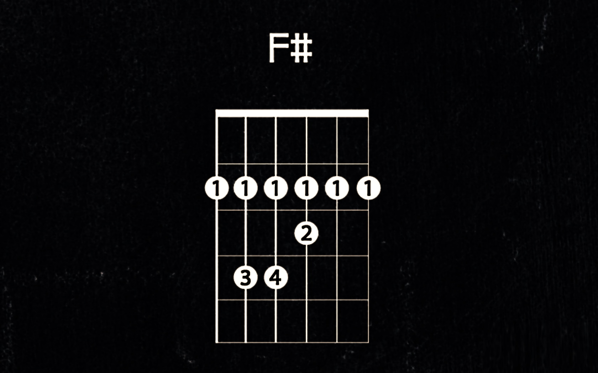

**My road to functional programming was pretty long.** I started with structural programming in C++ and then rebranded into an Object-Oriented approach with Java and C#. At some point, I began to feel that [the ceremony I had been doing was slowing me down](/en/onion_clean_code/). I started to code in JavaScript more. First, I was afraid; I was petrified. Like most of the backend devs, I was a JS hater. Then, I understood that it's just looking similar to OOP languages, and it's much more efficient if it's done without the layered ceremonies, using just functions and objects. To this day, I think that adding classes in Ecma Script 6 was a mistake. Yet, I haven't ever written any production code with pure functional language. The closer to that was in [TypeScript, which can be used in this way](/en/type_script_node_Js_event_sourcing/).

**As most of my career is related to coding in .NET, I have always wanted to try F#.** I like its concise syntax and precision in defining the type-driven approach. Especially reading ["Domain Modeling Made Functional" by Scott Wlaschin](https://pragprog.com/titles/swdddf/domain-modeling-made-functional/) made me firm about the benefits of using it for business logic. Even if you don't want to code in F#, I highly recommend this book, it was eyes opening experience for me, and it's one of the best programming books I've read in the last few years. Also, numerous discussions with my friend [Ruben Bartelink](https://twitter.com/rbartelink) and [influence by Decider pattern by Jérémie Chassaing](https://thinkbeforecoding.com/post/2021/12/17/functional-event-sourcing-decider) increased my will to try the language. Still, I didn't have enough time to pass the ramp-up phase.

**Two weeks ago, I wrote about [testing business logic in Event Sourcing](/en/testing_event_sourcing/) and how my [testing library called Ogooreck](https://github.com/oskardudycz/Ogooreck) can help you in that.** I wrote it with a functional approach in mind, as [C# allows you to put a bit of that flavour, but not fully](/en/union_types_in_csharp/). I thought that this could be a decent chance to try F#. I decided to port my samples and see how Ogooreck's API goes with it. Let's see what I came up with!

**Let's start with the entity definition. Even though I claimed that [Bank Account is not the best example for explaining Event Sourcing](/en/bank_account_event_sourcing/), I used it, as for baby steps, it is actually okay.**

```fsharp
type BankAccount =
    | Initial
    | Open of
        {| Id: AccountId
           Balance: decimal
           Version: int64 |}
    | Closed of {| Id: AccountId; Version: int64 |}
```

This states that Bank Account can either have an initial/empty state or open or closed. F# supports union types and allows different definitions for different entity states. Think of it as a state machine; we're transitioning from one distinct state to another.

Now, let's define events:

```fsharp
type BankAccountOpened =
    { BankAccountId: AccountId
      AccountNumber: AccountNumber
      ClientId: ClientId
      CurrencyIsoCode: CurrencyIsoCode
      CreatedAt: DateTimeOffset
      Version: int64 }

type DepositRecorded =
    { BankAccountId: AccountId
      Amount: decimal
      CashierId: CashierId
      RecordedAt: DateTimeOffset
      Version: int64 }

type CashWithdrawnFromATM =
    { BankAccountId: AccountId
      Amount: decimal
      AtmId: AtmId
      RecordedAt: DateTimeOffset
      Version: int64 }

type BankAccountClosed =
    { BankAccountId: AccountId
      Reason: string
      ClosedAt: DateTimeOffset
      Version: int64 }

type Event =
    | BankAccountOpened of BankAccountOpened
    | DepositRecorded of DepositRecorded
    | CashWithdrawnFromAtm of CashWithdrawnFromATM
    | BankAccountClosed of BankAccountClosed
```

Those are all facts that can be registered during the Bank Account lifetime (I told you already that's oversimplified, right?). I also grouped all the events into _Event_ union type. Why? Have a look at this method:

```fsharp
let evolve bankAccount bankAccountEvent : BankAccount =
    match bankAccount, bankAccountEvent with
    | Initial _, BankAccountOpened event ->
        Open
            {| Id = event.BankAccountId
               Balance = 0M
               Version = 1L |}
    | Open state, DepositRecorded event ->
        Open
            {| state with
                Balance = state.Balance + event.Amount
                Version = event.Version |}
    | Open state, CashWithdrawnFromAtm event ->
        Open
            {| state with
                Balance = state.Balance - event.Amount
                Version = event.Version |}
    | Open state, BankAccountClosed bankAccountClosed ->
        Closed
            {| Id = state.Id
               Version = bankAccountClosed.Version |}
    | _ -> bankAccount
```

**The method defines the state transition based on the facts observed during the bank account lifetime.** In Event Sourcing, to [build the current state](/en/how_to_get_the_current_entity_state_in_event_sourcing/), we're getting all the events registered for the specific entity, and one by one applying it on the state. We do that by calling such a function as the one shown above.

The syntax, at first glance, may look a bit cryptic. But if we look closer, then it's actually straightforward. We're doing pattern matching based on the current bank account state and the event. 

As we expect, certain operations happen in particular states, for instance:
- opening should be only available if no such account exists,
- recording transactions and closure should be done on an open account,
- we should not be opening or closing the bank accounts twice,
then we're reflecting each of those cases in code. That's also the power of F#; it allows us to make explicit what should be made explicit. If we encounter an unexpected state, it either is incorrect or was correct in the past, and our code doesn't reflect reality. As I wrote in [the other article, we should not throw exceptions here](/en/should_you_throw_exception_when_rebuilding_state_from_events/). Our business logic should guard us later on.

## Business Logic

**Speaking about business logic, let's define it.** Our bank account can handle the following user intentions:

```fsharp
type OpenBankAccount =
    { BankAccountId: AccountId
      AccountNumber: AccountNumber
      ClientId: ClientId
      CurrencyIsoCode: CurrencyIsoCode
      Now: DateTimeOffset }

type RecordDeposit = { Amount: decimal; CashierId: CashierId; Now: DateTimeOffset }
type WithdrawCashFromAtm = { Amount: decimal; AtmId: AtmId; Now: DateTimeOffset }
type CloseBankAccount = { Reason: string; Now: DateTimeOffset }

type Command =
    | OpenBankAccount of OpenBankAccount
    | RecordDeposit of RecordDeposit
    | WithdrawCashFromAtm of WithdrawCashFromAtm
    | CloseBankAccount of CloseBankAccount
```

We could group the command handling, again using pattern matching:

```fsharp
let decide command bankAccount =
    match command with
    | OpenBankAccount c -> openBankAccount c bankAccount
    | RecordDeposit c -> recordDeposit c bankAccount
    | WithdrawCashFromAtm c -> withdrawCashFromAtm c bankAccount
    | CloseBankAccount c -> closeBankAccount c bankAccount
```

**Each method is just a pure function that takes command, current state and returns event(s).** See more:

```fsharp
let openBankAccount (command: OpenBankAccount) bankAccount : Event =
    match bankAccount with
    | Open _ -> invalidOp "Account is already opened!"
    | Closed _ -> invalidOp "Account is already closed!"
    | Initial _ ->
        BankAccountOpened
            { BankAccountId = command.BankAccountId
              AccountNumber = command.AccountNumber
              ClientId = command.ClientId
              CurrencyIsoCode = command.CurrencyIsoCode
              CreatedAt = command.Now
              Version = 1 }

let recordDeposit (command: RecordDeposit) bankAccount : Event =
    match bankAccount with
    | Initial _ -> invalidOp "Account is not opened!"
    | Closed _ -> invalidOp "Account is closed!"
    | Open state ->
        DepositRecorded
            { BankAccountId = state.Id
              Amount = command.Amount
              CashierId = command.CashierId
              RecordedAt = command.Now
              Version = state.Version + 1L }

let withdrawCashFromAtm (command: WithdrawCashFromAtm) bankAccount : Event =
    match bankAccount with
    | Initial _ -> invalidOp "Account is not opened!"
    | Closed _ -> invalidOp "Account is closed!"
    | Open state ->
        if (state.Balance < command.Amount) then
            invalidOp "Not enough money!"

        CashWithdrawnFromAtm
            { BankAccountId = state.Id
              Amount = command.Amount
              AtmId = command.AtmId
              RecordedAt = command.Now
              Version = state.Version + 1L }

let closeBankAccount (command: CloseBankAccount) bankAccount : Event =
    match bankAccount with
    | Initial _ -> invalidOp "Account is not opened!"
    | Closed _ -> invalidOp "Account is already closed!"
    | Open state ->
        BankAccountClosed
            { BankAccountId = state.Id
              Reason = command.Reason
              ClosedAt = command.Now
              Version = state.Version + 1
```

Here we also see why having union types is helpful. We can explicitly restrict the handling based on the current bank account state. "Can" is, in fact, wrong. We "have to". F# compiler will ask us to handle each possible state, helping us not to forget about anything. We also don't need to check conditions based on fields (e.g. status, etc.) as our state will only contain available data.

## Testing 

**Still, I promised you the testing example with [Ogooreck](https://github.com/oskardudycz/Ogooreck).** It's a testing library that allows you to cut the boilerplate of the setup and verification and brings you the Behaviour-Driven Development (BDD) structure. Don't worry; it's not doing any custom [Domain-specific language (DSL)](https://en.wikipedia.org/wiki/Domain-specific_language). I like BDD because of its focus on behaviour. Still, I haven't seen DSL workin well anywhere for a long time. The intention is to cut the boilerplate instead of adding it.

For Event Sourcing, the pattern looks like this:
- **GIVEN** set of events recorded for the entity,
- **WHEN** we run the command on the state built from events,
- **THEN** we're getting new event(s) as a result of business logic.

The tests can look as follows:

```fsharp
open Ogooreck.BusinessLogic
open FsCheck.Xunit

let random = Random()

let spec =
    Specification.For(decide, evolve, Initial)

let BankAccountOpenedWith bankAccountId now version =
    let accountNumber =
        AccountNumber.parse (Guid.NewGuid().ToString())

    let clientId = ClientId.newId()

    let currencyISOCode =
        CurrencyIsoCode.parse "USD"

    BankAccountOpened
        { BankAccountId = bankAccountId
          AccountNumber = accountNumber
          ClientId = clientId
          CurrencyIsoCode = currencyISOCode
          CreatedAt = now
          Version = version }

let BankAccountClosedWith bankAccountId now version =
    BankAccountClosed
        { BankAccountId = bankAccountId
          Reason = Guid.NewGuid().ToString()
          ClosedAt = now
          Version = version }

[<Property>]
let ``GIVEN non existing bank account WHEN open with valid params THEN bank account is opened``
    bankAccountId
    accountNumber
    clientId
    currencyISOCode
    now
    =
    let notExistingAccount = Array.empty

    spec
        .Given(notExistingAccount)
        .When(
            OpenBankAccount
                { BankAccountId = bankAccountId
                  AccountNumber = accountNumber
                  ClientId = clientId
                  CurrencyIsoCode = currencyISOCode
                  Now = now }
        )
        .Then(
            BankAccountOpened
                { BankAccountId = bankAccountId
                  AccountNumber = accountNumber
                  ClientId = clientId
                  CurrencyIsoCode = currencyISOCode
                  CreatedAt = now
                  Version = 1 }
        )
    |> ignore

[<Property>]
let ``GIVEN open bank account WHEN record deposit with valid params THEN deposit is recorded``
    bankAccountId
    amount
    cashierId
    now
    =
    spec
        .Given(BankAccountOpenedWith bankAccountId now 1)
        .When(
            RecordDeposit
                { Amount = amount
                  CashierId = cashierId
                  Now = now }
        )
        .Then(
            DepositRecorded
                { BankAccountId = bankAccountId
                  Amount = amount
                  CashierId = cashierId
                  RecordedAt = now
                  Version = 2 }
        )
    |> ignore

[<Property>]
let ``GIVEN closed bank account WHEN record deposit with valid params THEN fails with invalid operation exception``
    bankAccountId
    amount
    cashierId
    now
    =
    spec
        .Given(
            BankAccountOpenedWith bankAccountId now 1,
            BankAccountClosedWith bankAccountId now 2
        )
        .When(
            RecordDeposit
                { Amount = amount
                CashierId = cashierId
                Now = now }
        )
        .ThenThrows<InvalidOperationException>
    |> ignore
```

As you noticed, we're setting up test specifications for the methods defined earlier.

```fsharp
let spec =
    Specification.For(decide, evolve, Initial)
```

Then, we can just focus on defining the test scenario. Ogooreck will run internally the _evolve_ function on provided events building the current state, then run business logic from the _decide_ function for a specific command. It'll also check the correctness of the result.

**I think this gives structure to our tests and makes them read as documentation.**

## Summary

So far, I like the F# experience. If we keep the functional shortening on the leash and focus on composition, we get concise, self-explanatory code. It's also secure; if we do proper type definitions, we can reduce the chance of wrong cases and even testing scenarios.

I'm still early in the journey, but [thanks to superb input from the community in my PR](https://github.com/oskardudycz/Ogooreck/pull/13) learned a lot. I love the vibe in the F# community and the willingness to help such noobs like me.

Some stuff in F# was confusing for me, like:
- the multiple ways of defining types, where to use when,
- different styles of function definitions (where to use parens and where not),
- the fact that formatting matters and the compiler is not extremely helpful if you don't put the correct number of tabs.

But, oh well, that's a learning curve and minor things that can be found in each new learning.

I liked the F# ecosystem so far, how the pieces match together and how much it already has baked in. I also like the tooling, e.g.:
- [FsCheck](https://fscheck.github.io/FsCheck/): super simple test data seeding and [Property Testing](https://en.wikipedia.org/wiki/Property_testing).
- [FSharp.UMX](https://github.com/fsprojects/FSharp.UMX): units of measure for primitive non-numeric types, like strongly-typed ids.
- [Fantomas](https://fsprojects.github.io/fantomas/) for elegant code autoformatting.

The next step for me is to ensure that the F# experience is decent in [Marten](https://martendb.io/). But that's for another story!

Cheers!

Oskar

p.s. **Ukraine is still under brutal Russian invasion. A lot of Ukrainian people are hurt, without shelter and need help.** You can help in various ways, for instance, directly helping refugees, spreading awareness, putting pressure on your local government or companies. You can also support Ukraine by donating e.g. to [Red Cross](https://www.icrc.org/en/donate/ukraine), [Ukraine humanitarian organisation](https://savelife.in.ua/en/donate/). You may also consider joining [Tech for Ukraine](https://techtotherescue.org/tech/tech-for-ukraine) initiative.
