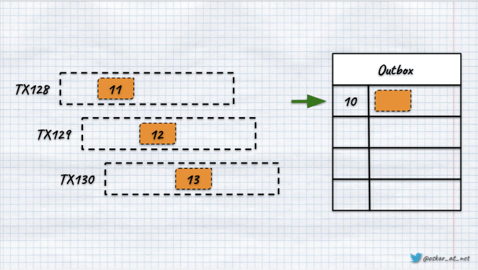
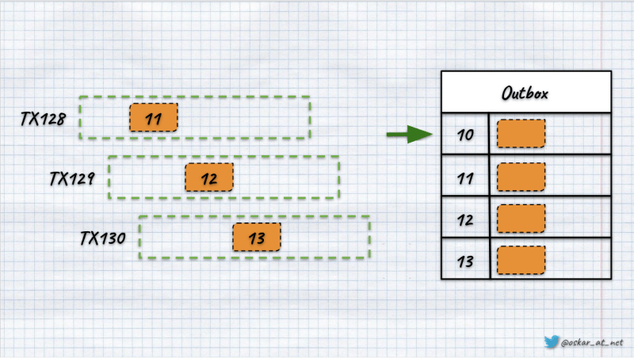
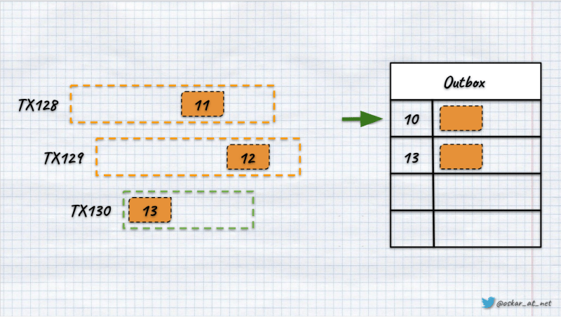
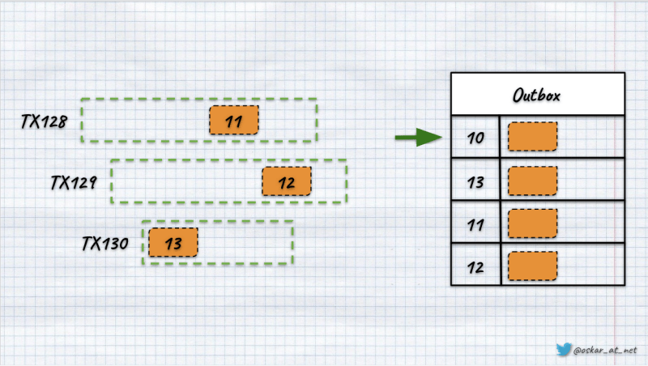
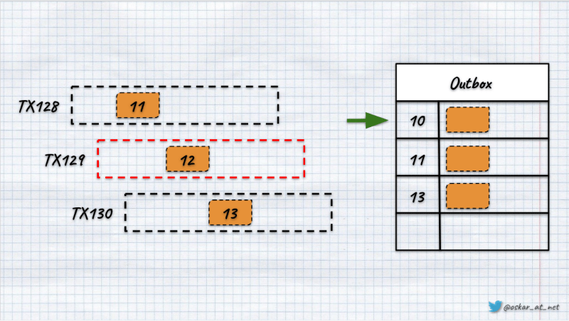
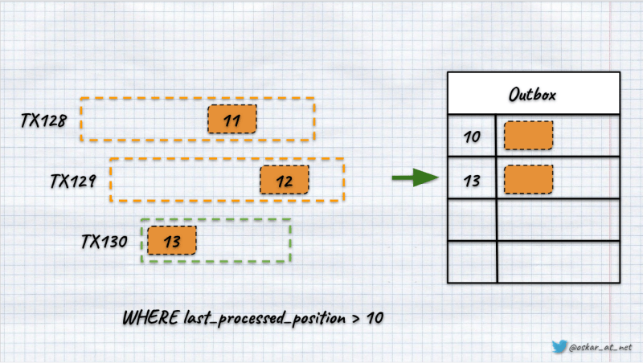
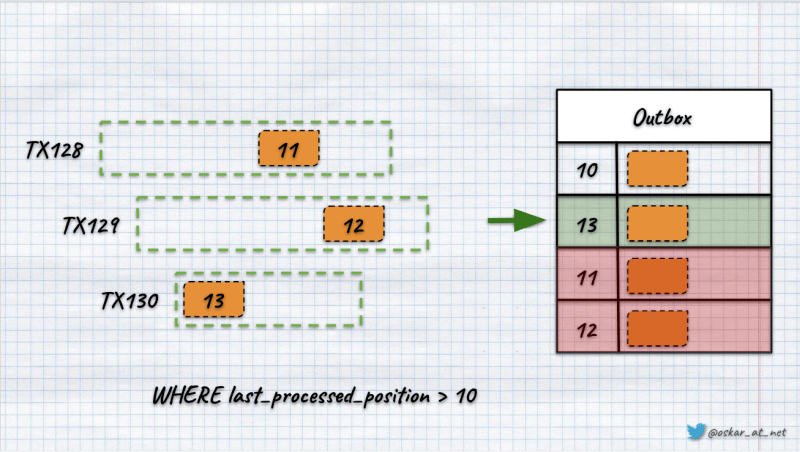
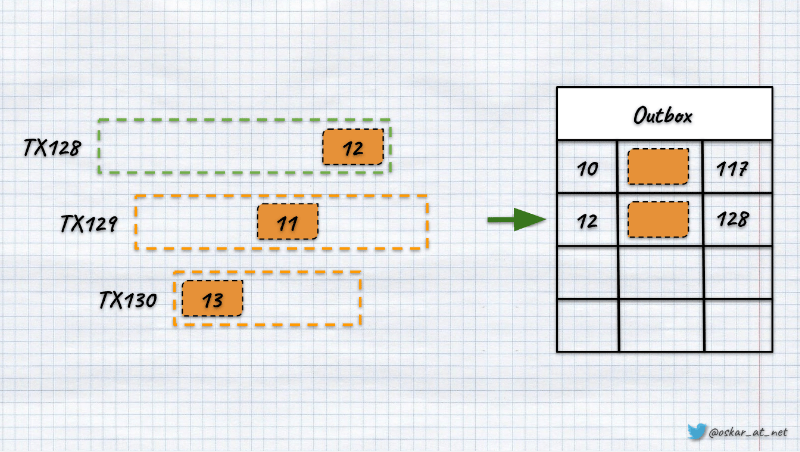
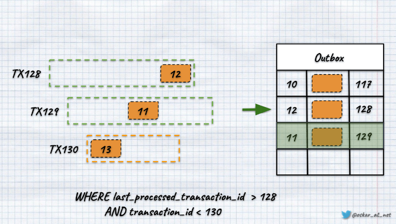

**Big picture descriptions and overall explanations are great. They help us to understand the foundations of new ideas and then find the place we need to evaluate more.** Still, we're starting to face reality when we try to go deeper. This may be harsh. It may be a good bullshit filter when we realise the idea is not as simple as pictured. We may just throw, "this can't be done!" or try to find our way through the problems.

Let's take an example of the Outbox pattern I described in my two articles:
- [Outbox, Inbox patterns and delivery guarantees explained](/en/outbox_inbox_patterns_and_delivery_guarantees_explained/),
- [Push-based Outbox Pattern with Postgres Logical Replication](/en/push_based_outbox_pattern_with_postgres_logical_replication/).

Two articles should be enough to exhaust the topic, aye? Let's go deeper and discuss the potential poll-based implementation on top of Postgres. As it's the most flexible relational database nowadays, it cannot be that hard.

**Let's say that we'll use the table structure from [the previous article](/en/push_based_outbox_pattern_with_postgres_logical_replication/):**

```sql
CREATE TABLE outbox(
   -- the autoincremented position of the message to respect the order
   position        BIGSERIAL                 PRIMARY KEY,
   -- this may allow you to partition publications, e.g. per tenant
   publication_id  VARCHAR(250)              NOT NULL,
   -- unique message id, which can be used for deduplication or idempotency
   message_id       VARCHAR(250)             NOT NULL,
   -- the message type, e.g. `TransactionRecorded`
   message_type     VARCHAR(250)             NOT NULL,
   -- serialised message data, e.g. to JSON
   data             JSONB                    NOT NULL,
   -- diagnostic information of when the message was scheduled
   scheduled       TIMESTAMP WITH TIME ZONE  NOT NULL    default (now()),
);
```

We'll be storing messages to publish there and then continuously polling those messages in the background process using the following query:

```sql
SELECT 
     position, message_id, message_type, data
FROM
     outbox
WHERE
     position > last_processed_position
ORDER BY
    position ASC
LIMIT 100;
```

The last processed position will be taken from the subscriptions table:

```sql
CREATE TABLE subscribers
(
   -- subscription name
   subscription_id          VARCHAR(250) PRIMARY KEY,
   -- information about the position of the last processed message
   last_processed_position  INTEGER      NULL,
   -- inform which publication we're subscribing to
   publication_id           VARCHAR(250) NOT NULL,
);
```

After we process all the messages from the read batch, we update the last processed position for the particular subscriber. So far, so good, easy peasy.

We're using the _BIGSERIAL_ type to generate a monotonic, autoincremented position. The happy path for the three parallel transactions will look as follows:



Once transactions are committed, the results should look like this:



**Yet, since I'm writing this article, you can guess that something may be odd here.** What if the last transaction was the fastest and committed as the first one.



**If the rest followed the order, we'd see that the order in which records were appended to the table may differ from the order of positions.**



**This is possible because of how [Postgres sequences](https://www.postgresql.org/docs/current/sql-createsequence.html) work. They're evaluated before the transaction commit.** _"But we're using BIGSERIAL here!". It doesn't matter. BIGSERIAL is just a syntactic sugar for the autogenerated Postgres sequence. It's just using it behind the scenes.

The other important thing is that number of sequences is not reused. This is a valid approach to avoid having an accidental clash of numbers between transactions. The number is lost if the transaction fails and is rolled back. **In our case, this may result in gaps in position numbering.**



**So right now, we have two issues:**
- we may have messages out of order,
- we may have gaps in ordering.

I already wrote that positions [are pretty important for Event Stores](https://event-driven.io/en/lets_talk_about_positions_in_event_stores/). Yet, even using an outbox to broadcast messages may have severe consequences.

Let's get back to the race condition example.



If the 3rd transaction was the fastest, we try to query by the last processed position before the 1st and 2nd were committed, then we won't know if the gap was caused by some transaction rollbacks or race condition. **If we optimistically assume that the gaps were caused by rollbacks, we may lose messages.**



We'll update the position with the newly read maximum one (13), and then the following query will use it, skipping records added after that (11 and 12).

**We could workaround the ordering issues, but losing messages is a no-go for most systems.**

What could we do?

A first thing is a nuke option. It's nicely presented by [Laurenz Albe in his article](https://www.cybertec-postgresql.com/en/gaps-in-sequences-postgresql/). **We could manually generate gapless numbers in the "singleton table".** W could do it like that:

```sql
CREATE TABLE seq (id bigint NOT NULL);
 
INSERT INTO seq (id) VALUES (0);
 
CREATE FUNCTION next_val() RETURNS bigint
   LANGUAGE sql AS
'UPDATE seq SET id = id + 1 RETURNING id';
```

It would update the number in the table only if the transaction succeeded. Why is it a nuke option? Because it's locking the whole _seq_ table making all the processing that's calling this function sequential. This could be fine for low throughput but high importance numbers, but not for the mechanism like outbox that'll be the backbone of the communication. Trust me, I tried that, and the performance hit was the backbone of the communication was too big to accept.

**The next option is to do gap detection like Marten is doing.** If we delay the message publishing by waiting a bit, we could try to assume that the gaps have come from rolled-back transactions. If we found such, we could append _"tombstone event",_ marking the gap as checked and locked. Once we fill all the holes with such events, we can continue processing. In Marten, it's called _High Water Mark_. It's the furthest known event sequence that the daemon "knows" that all events with that sequence or lower can be safely processed in order by projections. The high watermark will frequently be a little behind the highest known event sequence number if outstanding gaps in the event sequence are detected. 

Yet, writing such a gap detection mechanism is non-trivial. [Jeremy explained some of the challenges in his talk at Event Sourcing Live](https://www.youtube.com/watch?v=rm2lFlI3Ubk).

**What if we could just live with those gaps?** I said we should not, so am I doing some Jedi mind tricks? And that's how we come up with the last idea. There's _a trick..._

Postgres has a mechanism of returning us information about current active transactions. We can get such information by calling _pg_current_snapshot_ function. Once we have it, we can call on the result of another function, _pg_snapshot_xmin_, which selects the minimum transaction id. 

**So if call _pg_snapshot_xmin(pg_current_snapshot())_, we'll effectively get the minimum active transaction id.** In Postgres, transactions are monotonic, gapless numbers that are unique throughout the cluster lifetime. We could use that for our needs. We could add a transaction id column to our outbox table and fill it with the transaction id to which we're appending the message.

```sql
ALTER  TABLE outbox
ADD COLUMN   transaction_id    xid8 NOT NULL;
```

We're using _xid8_ type, a 64bit, sequential number type used to represent transaction ids. Having that, we could change our query to use it:

```sql
SELECT 
     position, message_id, message_type, data
FROM
     outbox
WHERE
     position > last_processed_position
     AND transaction_id < pg_snapshot_xmin(pg_current_snapshot())
ORDER BY
    position ASC
LIMIT 100;
```

Thanks to that, we won't get the "Usain Bolts", so the messages from the transactions were faster than transactions that started earlier.


If we have a scenario like in the image above, as we have transaction 129 ongoing, then through our query, we'll get record 11, as it was added in transaction no 128. We won't get the record with position 13, as it was added by the transaction that started later than the ongoing one.

It looks good enough, but let's discuss one more scenario. Let's say that we have the same set of transactions again. Yet, this time 128, so the earliest one finished first. Still, it got the global position later than the still active 129.



If we query now using the sequence number to filter out already processed records, we'll lose the message from transaction 129. It has a smaller number (11) than the one processed in transaction 128 (12).


To solve that, the only option we have is to filter by the transaction id instead of the global position. We're benefiting from the fact that a transaction id is a monotonic number. 



This filter will give us a guarantee of not losing any messages. It is a much better option than the previous nuke option, as we don't have a performance hit while adding new messages (besides using more data). Our queries may be a bit delayed if our transactions last long, so we should ensure they're processed quickly. Worth noting is that our ordering guarantee respects when the transaction was started, not when the message was appended. That should be fine for most cases, but in some edge cases, it may create problems if forgotten.

The last thing to mention is that one transaction can append more than one message. In that case, we would only like to be polling the same message once (e.g. in case of retry). The final SQL query to respect this would be:

```sql
SELECT 
     position, message_id, message_type, data
FROM
     outbox
WHERE
     (
          (transaction_id = last_processed_transaction_id
               AND position > last_processed_position)
          OR
          (transaction_id > last_processed_transaction_id)
     )
     AND transaction_id < pg_snapshot_xmin(pg_current_snapshot())
ORDER BY
    transaction_id ASC,
    position ASC
LIMIT 100;
```

To sum up, as always, the devil lies in details. Good and useful patterns are not always easy to implement. We should always ensure that we defined our expected guarantees upfront and that they're matched. But hey, isn't that what we're getting paid for?

Cheers!

Oskar

p.s. Big thanks to  [Tomek Masternak](https://twitter.com/Masternak) for reviewing the article and pointing out the last use case I didn't initially predict.

p.s.2. **Ukraine is still under brutal Russian invasion. A lot of Ukrainian people are hurt, without shelter and need help.** You can help in various ways, for instance, directly helping refugees, spreading awareness, putting pressure on your local government or companies. You can also support Ukraine by donating e.g. to [Red Cross](https://www.icrc.org/en/donate/ukraine), [Ukraine humanitarian organisation](https://savelife.in.ua/en/donate/) or [donate Ambulances for Ukraine](https://www.gofundme.com/f/help-to-save-the-lives-of-civilians-in-a-war-zone).
