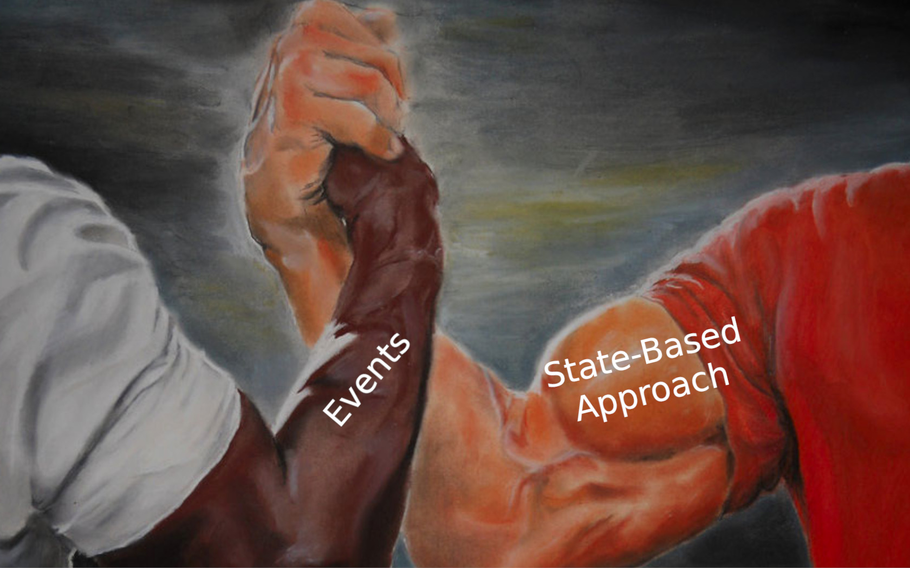

In my last few articles, I showed the power of [functional composition](/en/writing_and_testing_business_logic_in_fsharp/). That's a foundation for [effective modelling of your business logic](/en/type_script_node_Js_event_sourcing/). It allows for having more straightforward and explicit code. We discussed starting from the classical Domain Driven Design and [sliming all the abstractions we could](/en/slim_your_entities_with_event_sourcing/). I sprinkled that with a bit of Event Sourcing because I like and believe in the usefulness of this pattern. Yet, the same approach can also be applied to the classical state-based approach. Let's say that we have the following code representing the business logic of adding a product item to the shopping cart:

```typescript
export class AddProductItemToShoppingCartHandler
{
  constructor(
    private repository: MongoDbRepository<ShoppingCartModel>,
    private mapper: ShoppingCartMapper,
    private eventBus: EventBus
  ) {}

  async handle(command: AddProductItemToShoppingCart): Promise<void> {
    const model = await this.repository.find(command.shoppingCartId);

    if (model === null) {
      throw Error(`Shopping cart with id ${command.shoppingCartId} not found!`);
    }

    const aggregate = this.mapper.toAggregate(model);
    aggregate.addProductItem(command.productItem);

    await this.repository.add(this.mapper.toModel(aggregate));

    for (const event of aggregate.dequeueUncomittedEvents()) {
      await this.eventBus.publish(event);
    }
  }
}
```

It's a classical way of handling code in the Object-Oriented, Domain-Driven Design style. We have a storage model that's mapped to aggregate. We run some logic on the aggregate that changes the state and produces the event. We can use this event to notify subscribers about the action they need to take (e.g. update inventory state, publish notification, update read model etc.).

The mapper can look as follows:

```typescript
export class ShoppingCartMapper
{
  toModel(aggregate: ShoppingCart): ShoppingCartModel {
    return new ShoppingCartModel(
      new ObjectId(aggregate.id),
      aggregate.customerId,
      aggregate.status,
      aggregate.productItems,
      aggregate.openedAt,
      aggregate.confirmedAt
    );
  }
  toAggregate(model: ShoppingCartModel): ShoppingCart {
    return new ShoppingCart(
      model._id.toHexString(),
      model.customerId,
      model.status,
      model.productItems,
      model.openedAt,
      model.confirmedAt
    );
  }
}
```

If we'd like to store it in MongoDB, then our repository class could look like that:

```typescript
class MongoDbRepository<T extends Document & { _id: ObjectId }>
{
  protected collection: Collection<T>;

  constructor(
    mongo: MongoClient,
    collectionName: string,
    databaseName?: string | undefined
  ) {
    this.collection = getCollection<T>(mongo, collectionName, databaseName);
  }

  async add(entity: T): Promise<void> {
    await this.collection.updateOne(
      { _id: entity._id } as Filter<T>,
      { $set: entity },
      { upsert: true }
    );
  }

  async update(entity: T): Promise<void> {
    await this.collection.updateOne(
      { _id: entity._id } as Filter<T>,
      { $set: entity },
      { upsert: false }
    );
  }

  async upsert(entity: T): Promise<void> {
    await this.collection.updateOne(
      { _id: entity._id } as Filter<T>,
      { $set: entity },
      { upsert: true }
    );
  }

  async find(id: string): Promise<T | null> {
    const result = await this.collection.findOne({
      _id: new ObjectId(id),
    } as Filter<T>);

    if (result === null) return null;

    return result as T;
  }
}
```

Some may say that's too many abstractions, and I could _yessir_ to that. Still, the worst part is that **we're doing the lowest common denominator by not benefiting from the storage capabilities**. 

MongoDB has a sweet set of atomic operations you can apply to the document. You can update a subset of properties, increment values, and nested arrays. **You can do upserts and modify the whole document.** This is not so common for [key-value databases](/en/key-value-stores/). It's fine to keep documents a bit bigger, denormalised and use the same document for writing and read models by just querying for a subset of information. We're not getting a big penalty hit if we're doing atomic operations. Having that, loading and updating the whole document each time is overkill.

Let's say that we [applied transformations explained in the aforementioned article](/en/slim_your_entities_with_event_sourcing/) and ended up with a similar model to the one presented in [Straightforward Event Sourcing with TypeScript and NodeJS](/en/type_script_node_Js_event_sourcing/).

```typescript
type ShoppingCart = {
  id: string;
  status: string;
  productItems: Map<string, number>;
};

const ShoppingCartStatus = {
  Opened: 'Opened',
  Confirmed: 'Confirmed',
};

type ProductItem = {
  productId: string;
  quantity: number;
};

export type ShoppingCartOpened = Readonly<{
  type: 'shopping-cart-opened';
  data: {
    shoppingCartId: string;
    customerId: string;
    openedAt: Date;
  };
}>;

export type ProductItemAddedToShoppingCart = Readonly<{
  type: 'product-item-added-to-shopping-cart';
  data: {
    shoppingCartId: string;
    productItem: ProductItem;
    addedAt: Date;
  };
}>;

export type ProductItemRemovedFromShoppingCart = Readonly<{
  type: 'product-item-removed-from-shopping-cart';
  data: {
    shoppingCartId: string;
    productItem: ProductItem;
    removedAt: Date;
  };
}>;

export type ShoppingCartConfirmed = Readonly<{
  type: 'shopping-cart-confirmed';
  data: {
    shoppingCartId: string;
    confirmedAt: Date;
  };
}>;

export type ShoppingCartEvent =
  | ShoppingCartOpened
  | ProductItemAddedToShoppingCart
  | ProductItemRemovedFromShoppingCart
  | ShoppingCartConfirmed;
```
And the logic:

```typescript
const openShoppingCart = (
  command: OpenShoppingCart
): ShoppingCartOpened => {
  return {
    type: 'shopping-cart-opened',
    data: {
      shoppingCartId: command.data.shoppingCartId,
      customerId: command.data.customerId,
      openedAt: new Date(),
    },
  };
};


const addProductItemToShoppingCart = (
  command: AddProductItemToShoppingCart,
  cart: ShoppingCart
): ProductItemAddedToShoppingCart => {
  if (cart.status !== ShoppingCartStatus.Opened) {
    throw Error('Cannot add product to not opened shopping cart');
  }

  return {
    type: 'product-item-added-to-shopping-cart',
    data: {
      shoppingCartId: cart.id,
      productItem: command.data.productItem,
      addedAt: new Date(),
    },
  };
};

export const removeProductItemFromShoppingCart = (
  command: RemoveProductItemFromShoppingCart,
  cart: ShoppingCart
): ProductItemRemovedFromShoppingCart => {
  if (cart.status !== ShoppingCartStatus.Opened) {
    throw Error('Cannot remove product from not opened shopping cart');
  }

  const productItemToRemove = command.data.productItem;

  const { productId, quantity } = productItemToRemove;

  const currentQuantity = cart.productItems.get(productId);

  const newQuantity = (currentQuantity ?? 0) - quantity;

  if (newQuantity < 0) throw new Error('Product Item not found');

  return {
    type: 'product-item-removed-from-shopping-cart',
    data: {
      shoppingCartId: cart.id,
      productItem: productItemToRemove,
      removedAt: new Date(),
    },
  };
};

const confirmShoppingCart = (
  _command: ConfirmShoppingCart,
  cart: ShoppingCart
): ShoppingCartConfirmed => {
  if (cart.status !== ShoppingCartStatus.Opened) {
    throw Error('Cannot confirm to not opened shopping cart');
  }
  return {
    type: 'shopping-cart-confirmed',
    data: {
      shoppingCartId: cart.id,
      confirmedAt: new Date(),
    },
  };
}
```

**The pattern is simple, handlers take command, current state. They run business logic and either return an event as a result or throw an error.** That's straightforward and extremely easy to test way. Still, it looks unusual, especially if we don't intend to do Event Sourcing but use a state-based approach with MongoDB. Yet!

Events are facts representing the result of our business logic. They gather all the information about what has changed. [They should be as granular as possible](/en/events_should_be_as_small_as_possible/) and have all the information about the change inside. We could also benefit from that in our state-based approach!

**What if we used events as the input of the update state method?** How come? Let's say that we have a following data model:

```typescript
export type ShoppingCartModel = {
  _id: ObjectId;
  customerId: string;
  status: string;
  productItems: ProductItem[];
  openedAt: Date;
  confirmedAt: Date | undefined;
};
```

**To update it based on the results of our business logic (so events) we could write a following method:**

```typescript
const store = async (
  carts: Collection<ShoppingCartModel>,
  event: ShoppingCartEvent
): Promise<void> => {
  switch (event.type) {
    case 'shopping-cart-opened': {
      await carts.updateOne(
        { _id: new ObjectId(event.data.shoppingCartId) },
        {
          $set: {
            customerId: event.data.customerId,
            status: ShoppingCartStatus.Opened,
            productItems: [],
            openedAt: event.data.openedAt,
            confirmedAt: undefined,
          },
        },
        { upsert: true }
      );
      return;
    }
    case 'product-item-added-to-shopping-cart': {
      await carts.updateOne(
        {
          _id: new ObjectId(event.data.shoppingCartId),
          'productItems.productId': { $ne: event.data.productItem.productId },
        },
        {
          $addToSet: {
            productItems: {
              productId: event.data.productItem.productId,
              quantity: 0,
            },
          },
        }
      );

      await carts.updateOne(
        {
          _id: new ObjectId(event.data.shoppingCartId),
        },
        {
          $inc: {
            'productItems.$[orderItem].quantity':
              event.data.productItem.quantity,
          },
        },
        {
          arrayFilters: [
            {
              'orderItem.productId': event.data.productItem.productId,
            },
          ],
          upsert: true,
        }
      );
      return;
    }
    case 'product-item-removed-from-shopping-cart': {
      await carts.updateOne(
        {
          _id: new ObjectId(event.data.shoppingCartId),
          'productItems.productId': event.data.productItem.productId,
        },
        {
          $inc: {
            'productItems.$.quantity': -event.data.productItem.quantity,
          },
        },
        { upsert: false }
      );
      return;
    }
    case 'shopping-cart-confirmed': {
      await carts.updateOne(
        { _id: new ObjectId(event.data.shoppingCartId) },
        {
          $set: {
            status: ShoppingCartStatus.Confirmed,
            confirmedAt: event.data.confirmedAt,
          },
        },
        { upsert: false }
      );
      return;
    }
  }
};
```

It's a simple method that takes MongoDB documents collection and the event. As I mentioned, we assume that we have all information we need for the event. If we miss something, we should consider updating the event payload. As our events represent the specific business operation, they do not just have the latest state; we can precisely modify the document. We're doing pattern matching based on the event type to make a particular change. 

For instance, the removal of the product item from the shopping cart:

```typescript
case 'product-item-removed-from-shopping-cart': {
  await carts.updateOne(
  {
    _id: new ObjectId(event.data.shoppingCartId),
    'productItems.productId': event.data.productItem.productId,
  },
  {
    $inc: {
      'productItems.$.quantity': -event.data.productItem.quantity,
    },
  },
  { upsert: false }
  );
  
  return;
}
```

We're saying that for the shopping cart of a particular id, we're removing the product item with the specific id. MongoDB, we'll be smart enough to give us the exact product item, so we can specify how to decrement the quantity.

We can then use this method in the handler in the following way:

```typescript
export const removeProductItemFromShoppingCartRoute = (
  carts: Collection<ShoppingCartModel>,
  eventBus: EventBus,
  router: Router
) =>
  router.delete(
    '/customers/:customerId/shopping-carts/:shoppingCartId/product-items',
    async (
      request: RemoveProductItemFromShoppingCartRequest,
      response: Response,
      next: NextFunction
    ) => {
      try {
        const command = from(request);
        const cart = await getShoppingCart(carts, command.data.shoppingCartId);

        const event = removeProductItemFromShoppingCart(command, cart);

        await store(carts, event);
        await eventBus.publish(event);

        response.sendStatus(200);
      } catch (error) {
        console.error(error);
        next(error);
      }
    }
  );
```

If we didn't have precise information from events, then to have efficient updates, we either had to:
- couple the storage with business logic, 
- do sophisticated diff mechanisms between the old and new states,
- stay with non-performant upserts.

**As you see, events are helpful not only for event-sourced storage.** They can also hugely simplify regular storage and make it even more efficient. That's the benefit of having precise business information instead of _one change to rule them all_. By thinking upfront and working on our model, we can improve not only the business logic but also the technical implementation. All in all, it's about the pragmatism of focusing on what we want to achieve. Using events can create a good synergy between the domain and technical concepts.

Cheers!

Oskar

p.s. **Ukraine is still under brutal Russian invasion. A lot of Ukrainian people are hurt, without shelter and need help.** You can help in various ways, for instance, directly helping refugees, spreading awareness, putting pressure on your local government or companies. You can also support Ukraine by donating e.g. to [Red Cross](https://www.icrc.org/en/donate/ukraine), [Ukraine humanitarian organisation](https://savelife.in.ua/en/donate/). You may also consider joining [Tech for Ukraine](https://techtotherescue.org/tech/tech-for-ukraine) initiative.
