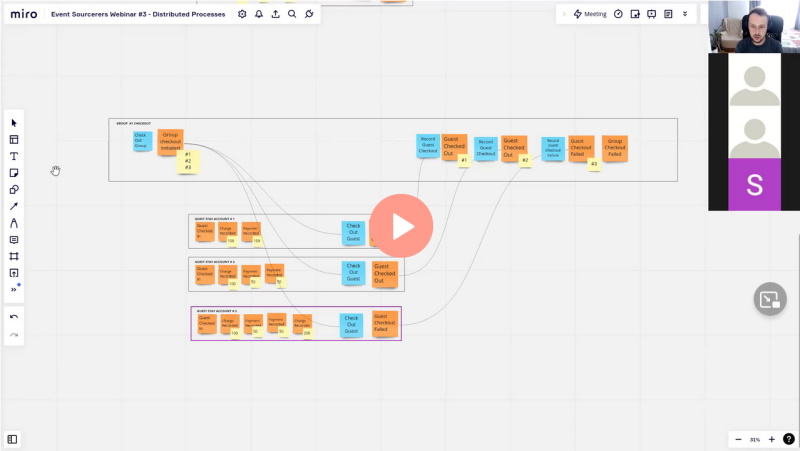

**Let's say that you have an event-driven application. It has an event bus that listens for events from asynchronous processes (e.g. Kafka consumer or [outbox pattern](/en/outbox_inbox_patterns_and_delivery_guarantees_explained/)).** Once it gets them, it calls all event handlers registered for the particular event. It can be defined with the following interface:

```csharp
public interface IEventBus
{
    Task Publish(object @event, CancellationToken ct);
}
```

Typically, you should aim to have your business logic tested with the unit or integration tests, but it's also worth writing end-to-end or [syntetic tests](/en/i_tested_on_production/) for the most critical features. 

**Let's say we'd like to check the result of the specific event handler (e.g. updated read model).** As it's asynchronous, we won't know precisely when it happened. We could be [polling continuously with retries](/en/dealing_with_eventual_consistency_and_idempotency_in_mongodb_projections/) for changes to our read model. Yet, that won't be efficient and will make our tests less predictable and running longer. How to improve that?

**We could benefit from [Channels](https://learn.microsoft.com/en-us/dotnet/core/extensions/channels).** They're a way of safely handling multi-threaded concurrency in a reliable and performant manner. They're using producer/consumer and can be used in publish/subscribe manner.

Let's define the _EventListener_ class to record all the events _EventBus_ got.

```csharp
public class EventListener
{
    private readonly Channel<object> events = Channel.CreateUnbounded<object>();

    public ChannelReader<object> Reader => events.Reader;
    public ChannelWriter<object> Writer => events.Writer;

    public async Task Handle(object @event, CancellationToken ct)
    {
        await events.Writer.WriteAsync(@event, ct).ConfigureAwait(false);
    }

    public async Task WaitForProcessing(object @event, CancellationToken ct)
    {
        await foreach (var item in events.Reader.ReadAllAsync(ct).ConfigureAwait(false))
        {
            if (item.Equals(@event))
                return;
        }

        throw new Exception("No events were found");
    }
}
```

We're setting up the unbounded channel. It means that we're not putting any restrictions on it. It may have multiple writers and readers; there're no limitations on the number of produced messages in the channel. 

**Channels are highly configurable and extendible, but in our case, we just need to be able to write to it and wait until the message is processed.** We can do it using _ReadAllAsync_ method that returns _IAsyncEnumerable_. Once the event is published and written to the channel, the next iteration of async foreach will be triggered for the reader automatically. If it matches the expected event, then we're just finishing waiting. 

Now, we can write a decorator for our event bus that we'll be catching all handled events and forward them to _EventListener_:

```csharp
public class EventCatcher: IEventBus
{
    private readonly EventListener listener;
    private readonly IEventBus eventBus;

    public EventCatcher(EventListener listener, IEventBus eventBus)
    {
        this.listener = listener;
        this.eventBus = eventBus;
    }

    public async Task Publish(object @event, CancellationToken ct)
    {
        await eventBus.Publish(@event, ct).ConfigureAwait(false);

        await listener.Handle(@event, ct).ConfigureAwait(false);
    }
}
```

**It's a simple wrapper that takes the original event bus and pushes the event to the listener after events are handled.** If the event bus is synchronous and in-memory, then we're sure all the event handlers were called.

We can override the original setup following way in our end-to-end code:

```csharp
var eventListener = new EventListener();

services
    .AddScoped<IEventBus>(sp =>
        new EventCatcher(
            eventListener,
            sp.GetRequiredService<EventBus>()
        )
    )
```

Thanks to that, we can write the following test:

```csharp
[Fact]
public async Task AddUser_ShouldEventuallyUpdateUserDetailsReadModel()
{
    // Given
    var userId = Guid.NewGuid();
    var userName = "Oscar the Grouch";
    var command = new AddUser(userId, userName);
    var userAdded = new UserAdded(userId, userName);

    // When
    await commandHandler.Handle(command, ct);

    // Then
    await eventListener.WaitForProcessing(userAdded , ct);

    var userDetails = awai GetUserDetails(userId, ct);
    userDetails.Should().NotBeNull();
    userDetails.Id.Should().Be(userId);
    userDetails.Name.Should().Be(userName);
}
```

Thanks to that, we don't need to try continuous polling but finish our test at the right time.

**If you're curious when that could be useful, check the ["Implementing Distributed Processes"](https://www.architecture-weekly.com/p/webinar-3-implementing-distributed) webinar:**

[](https://www.architecture-weekly.com/p/webinar-3-implementing-distributed)

Or check:
- [Code Samples](https://github.com/oskardudycz/EventSourcing.NetCore/tree/main/Sample/HotelManagement),
- [Outbox, Inbox patterns and delivery guarantees explained](/en/outbox_inbox_patterns_and_delivery_guarantees_explained/),
- [Saga and Process Manager - distributed processes in practice](/en/saga_process_manager_distributed_transactions/),
- [Event-driven distributed processes by example](/en/event_driven_distributed_processes_by_example/)

Cheers!

Oskar

p.s. **Ukraine is still under brutal Russian invasion. A lot of Ukrainian people are hurt, without shelter and need help.** You can help in various ways, for instance, directly helping refugees, spreading awareness, putting pressure on your local government or companies. You can also support Ukraine by donating e.g. to [Red Cross](https://www.icrc.org/en/donate/ukraine), [Ukraine humanitarian organisation](https://savelife.in.ua/en/donate/). You may also consider joining [Tech for Ukraine](https://techtotherescue.org/tech/tech-for-ukraine) initiative.
