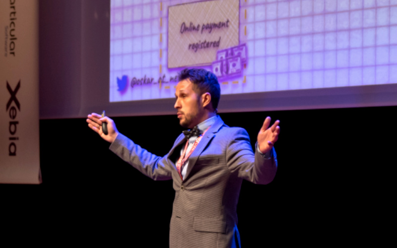

**Event Sourcing is a concept that helps to build the bridge between business and technical implementation.** It's a storage pattern that takes the business facts and uses them to model and handle business workflow. [InfoQ, in its Software Architecture and Design InfoQ Trends Report](https://www.infoq.com/articles/architecture-trends-2022) puts it into the late majority, which means that it's already widely adopted. I think that we're not there yet, but it's undeniable that Event Sourcing is one of the fastest-emerging concepts. 

That's also why I'm passionate about sharing what I learned wherever I can, e.g. on this blog, [workshops](/pl/training/), and [talks](https://www.youtube.com/watch?v=Lu-skMQ-vAw&list=PLw-VZz_H4iiqUeEBDfGNendS0B3qIk-ps&index=7). 

**I'm happy to announce that this year, together with the DDDEU team, I'll be responsible for curating next year's Event Sourcing Live Conference lineup.** I'm thrilled to be part of such an initiative, the only conference focused on Event Sourcing.

**We want to prove that Event Sourcing is a highly practical pattern and show its real-world usage during the Event Sourcing Live Conference.** We want to learn about both big successes adopting it and horror stories. Your stories.

If you're an Open Source maintainer of the Event Sourcing related tooling, that's the right place to share your story. We want to connect event-sourced community and consider giving space for builders to show and tell their tooling. We're still determining the specifics, but [contact me](mailto:oskar@event-driven.io), and we'll try to find a way to show your work.

If you're a practitioner with an intriguing use case but unsure about your speaking skills. Contact our team, especially [Oskar Dudycz](mailto:oskar@event-driven.io), that'll be curating this year's edition. We're open to do mentoring for the selected people.

**We're looking for talks made by practitioners sharing their experiences with the community and their case studies.** It's a chance for you to go down the rabbit hole with the audience and share more advanced scenarios. We encourage you to bring more technical details to show your use case. Still, the focus should be on the architecture and pattern implementation rather than tech specifics. Talks can also bring other aspects that are useful for the Event Sourcing applications, so CQRS, Event-Driven Architecture, Messaging etc.

**As always, we're looking for diversity in the content and representation.** We want to show the whole variety of people using it and all the related practices. Like:
- Real-world case studies, experience reports
- Best and worst practices applied
- Specifics of event-driven modelling,
- Tooling and practices: CQRS, event stores, messaging, etc.
- Distilling the essence of Event Sourcing (similarities and differences with other techniques)
- Integrations with different patterns
- DevOps practices (e.g. running event stores,  blue-green projections rebuilds, etc.)
- Handling Event Sourcing at scale

We're also interested in adjacent topics:
- Microservices
- Distributed systems
- Event-Driven Architecture.

**Don't be shy to [send your proposal](https://2023.dddeurope.com/cfp/) and [contact me](mailto:oskar@event-driven.io) if you have any doubts. I'm here to help.**

We'll be running a set of speaker meetings to help you deliver the best proposal:
- [Learn about the DDD Europe 2023 CFP - December 6, 16:30-17:30 CET](https://ti.to/dddbv/dddeu23-speaker-sessions)
- [How to do a Livecoding session - December 13, 16:30-17:30 CET](https://ti.to/dddbv/dddeu23-speaker-sessions)
- [Learn about the EventSourcing Live CFP - December 21, 10:00-11:00 CET](https://ti.to/dddbv/dddeu23-speaker-sessions)

If you're looking for inspiration, check my talk from the last edition and see [other talks](https://www.youtube.com/@EventSourcingLive/videos).

`youtube: https://www.youtube.com/watch?v=Lu-skMQ-vAw&list=PL8psFT6p7A7om8WldfcawbymGA6z8q6Dk&index=7`

**I'm not sure about you, but I'm thrilled!** Waiting for your proposal or joining the conference as an attendee. In both ways, we'll have a good time learning and sharing our Event Sourcing journey!

Cheers!

Oskar

p.s. **Ukraine is still under brutal Russian invasion. A lot of Ukrainian people are hurt, without shelter and need help.** You can help in various ways, for instance, directly helping refugees, spreading awareness, putting pressure on your local government or companies. You can also support Ukraine by donating e.g. to [Red Cross](https://www.icrc.org/en/donate/ukraine), [Ukraine humanitarian organisation](https://savelife.in.ua/en/donate/) or [donate Ambulances for Ukraine](https://www.gofundme.com/f/help-to-save-the-lives-of-civilians-in-a-war-zone).
