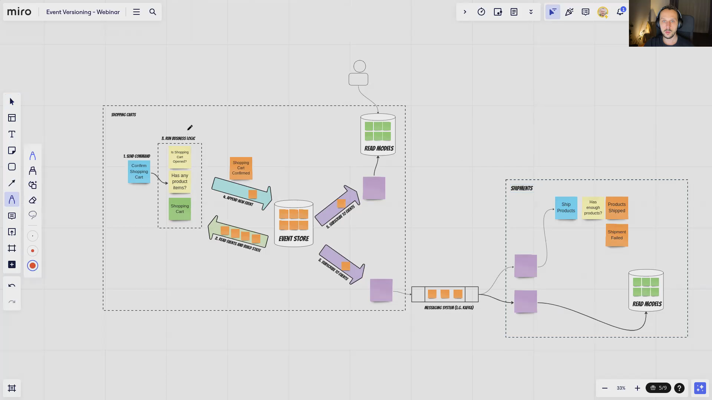

**Events serialisation is an intriguing topic.** On the one hand, it's part of the campfire spooky tales, so (in)famous events versioning. On the other, we're just taking event type name and event data and serialising it back and forth to string or binary data. That cannot be that hard, aye?

**The truth (as always) lies somewhere in the middle.** Indeed, it's not as hard as envisioned, but there's also a reason I am writing a 5th blog article about that, right? 

I wrote already about [simple patterns for events schema versioning](/pl/simple_events_versioning_patterns/). I explained [why the best way of doing event versioning is not having the need for that](/pl/how_to_do_event_versioning/). I also presented [how to do versioning in Marten](/pl/event_versioning_with_marten/). In the last article, I showed [mapping event type by convention](/pl/how_to_map_event_type_by_convention/). I'll show you how and when it may be worth serialising explicit events this time.

**Conventional mapping can take you far if you have a set of basic conventions and serialiser that can do a lot.** In many languages, like C# or Java, serialisers can go pretty wild and do advanced mappings. That's quite powerful as long as you obey the rules. Creator rules. That's fine until you'll try to do something a bit unusual. 

**What can unusual mean in this context?** For instance: building a complex type system instead of just using primitives. Or: connecting evolved type structure to the old event payload.

**Let's discuss that in the specific scenario.** I showed you already that [strongly-typed ids might play poorly with a lot of tooling](/pl/using_strongly_typed_ids_with_marten/). Still, if you put enough effort or use the proper patterns, they're the simplest example of [value objects](/pl/immutable_value_objects/) and can make your life easier. Once you build your type system, you get predictability as the compiler will know better, fewer unit tests and a much more expressive and explicit codebase. All of that makes your code much closer to the business language, a [base for shared understanding](/pl/bring_me_problems_not_solutions/) and better matching the expected results.

Let's have a look at our events definition. They're facts that can be observed during the Shopping Cart lifetime:

```csharp
public abstract record ShoppingCartEvent
{
    public record ShoppingCartOpened(
        ShoppingCartId ShoppingCartId,
        ClientId ClientId
    ): ShoppingCartEvent;

    public record ProductItemAddedToShoppingCart(
        ShoppingCartId ShoppingCartId,
        PricedProductItem ProductItem
    ): ShoppingCartEvent;

    public record ProductItemRemovedFromShoppingCart(
        ShoppingCartId ShoppingCartId,
        PricedProductItem ProductItem
    ): ShoppingCartEvent;

    public record ShoppingCartConfirmed(
        ShoppingCartId ShoppingCartId,
        LocalDateTime ConfirmedAt
    ): ShoppingCartEvent;

    public record ShoppingCartCanceled(
        ShoppingCartId ShoppingCartId,
        LocalDateTime CanceledAt
    ): ShoppingCartEvent;
}
```

As you noticed, I'm using strongly typed ids (_ShoppingCartId_ and _ClientId_), custom types like _LocalDateTime_ and value objects for priced product items.

They can be defined, for instance, as:

```csharp
public class ClientId: StronglyTypedValue<Guid>
{
    private ClientId(Guid value): base(value) { }

    public static readonly ClientId Unknown = new(Guid.Empty);

    public static ClientId New() => new(Guid.NewGuid());

    public static ClientId Parse(string? value)
    {
        if (!Guid.TryParse(value, out var guidValue) || guidValue == Guid.Empty)
            throw new ArgumentOutOfRangeException(nameof(value));

        return new ClientId(guidValue);
    }
}

public class Amount: StronglyTypedValue<int>, IComparable<Amount>
{
    private Amount(int value): base(value) { }
    public bool IsPositive => Value > 0;

    public int CompareTo(Amount? other) => Value.CompareTo(other?.Value);

    public static Amount Parse(int value) => new(value);
}

public enum Currency
{
    USD,
    EUR,
    PLN
}

public record Money(
    Amount Amount,
    Currency Currency
);
```

The others are defined accordingly, creating a primary type with validations and not allowing incorrect values. _StronglyTypedValue_ is the class known from the [previous article](/pl/using_strongly_typed_ids_with_marten/) responsible for implementing the equality boilerplate etc. So as you see, nothing spectacular. In C#, some boilerplate is needed; in many languages ([e.g. F#](/pl/writing_and_testing_business_logic_in_fsharp/)), this could look even simpler.

**This approach is flexible, as we can model our types case by case following the business specification. Yet, that's also the weakness if we'd like to use the convention. Customisation and flexibility by convention don't follow conventions.**

The solution for that is explicit serialisation. We won't be trying to fight the tooling but telling it explicitly how to do the work.

## How to handle serialisation like that?

Let's define the Serde (serialisation/deserialisation) class that will handle JSON serialisation using System.Text.Json serialiser. The serialisation method could look like this:

```csharp
public class ShoppingCartEventsSerde
{
    public (string EventType, JsonObject Data) Serialize(ShoppingCartEvent @event)
    {
        return @event switch
        {
            ShoppingCartOpened e =>
                ("shopping_cart_opened",
                    Json.Object(
                        Json.Node("shoppingCartId", e.ShoppingCartId.ToJson()),
                        Json.Node("clientId", e.ClientId.ToJson()
                        )
                    )
                ),
            ProductItemAddedToShoppingCart e =>
                ("product_item_added_to_shopping_cart",
                    Json.Object(
                        Json.Node("shoppingCartId", e.ShoppingCartId.ToJson()),
                        Json.Node("productItem", e.ProductItem.ToJson())
                    )
                ),
            ProductItemRemovedFromShoppingCart e =>
                ("product_item_removed_from_shopping_cart",
                    Json.Object(
                        Json.Node("shoppingCartId", e.ShoppingCartId.ToJson()),
                        Json.Node("productItem", e.ProductItem.ToJson())
                    )
                ),
            ShoppingCartConfirmed e =>
                ("shopping_cart_confirmed",
                    Json.Object(
                        Json.Node("shoppingCartId", e.ShoppingCartId.ToJson()),
                        Json.Node("confirmedAt", e.ConfirmedAt.ToJson())
                    )
                ),
            ShoppingCartCanceled e =>
                ("shopping_cart_canceled",
                    Json.Object(
                        Json.Node("shoppingCartId", e.ShoppingCartId.ToJson()),
                        Json.Node("canceledAt", e.CanceledAt.ToJson())
                    )
                ),
            _ => throw new InvalidOperationException()
        };
    }
}
```

**We're taking the _ShoppingCartEvent_ and doing a switch based on the exact event type. Knowing this, we can do a specific serialisation of the event data.** We have full flexibility in defining the event structure. We can flatten the structure next to it and set custom property names. This freedom is especially valuable for handling [event schema evolution](/pl/simple_events_versioning_patterns/). Thanks to that, we can handle compatibility issues explicitly. As a serialisation result, we're returning both serialised data and a mapped event type name. That's needed to deserialise it, as we'll see later.

**The code also doesn't look that scary besides the _stringly-typed_ property names.** It is dangerous, as we can make a copy-paste mistake. As always, with great power comes great responsibility. Of course, we could make those strings const values or map them from the type names, but that's also not ideal. 

Let's say we made a constant value with the shopping cart id property name. 

```csharp
const shoppingCartIdPropertyName = "shoppingCartId";
```

Now we're reusing it in the multiple serialisation scenarios. If we decided to rename the value of the property for one scenario, e.g. to:

```csharp
const shoppingCartIdPropertyName = "cartId";
```

Then we could forget that it's also used in other places, making a ripple effect of breaking changes. 

So as always, pick your poison. There are no best solutions, just better or worse in a specific context.

## Let's see how deserialisation will look like 

We can write the code accordingly to the serialisation, but this time the other way round. We need a method that takes the event type name and serialised event data. As a result, we'll return the typed deserialised event.

```csharp
public class ShoppingCartEventsSerde
{
    public ShoppingCartEvent Deserialize(string eventType, JsonDocument document)
    {
        var data = document.RootElement;

        return eventType switch
        {
            "shopping_cart_opened" =>
                new ShoppingCartOpened(
                    data.GetProperty("shoppingCartId").ToShoppingCartId(),
                    data.GetProperty("clientId").ToClientId()
                ),
            "product_item_added_to_shopping_cart" =>
                new ProductItemAddedToShoppingCart(
                    data.GetProperty("shoppingCartId").ToShoppingCartId(),
                    data.GetProperty("productItem").ToPricedProductItem()
                ),
            "product_item_removed_from_shopping_cart" =>
                new ProductItemRemovedFromShoppingCart(
                    data.GetProperty("shoppingCartId").ToShoppingCartId(),
                    data.GetProperty("productItem").ToPricedProductItem()
                ),
            "shopping_cart_confirmed" =>
                new ShoppingCartConfirmed(
                    data.GetProperty("shoppingCartId").ToShoppingCartId(),
                    data.GetProperty("confirmedAt").ToLocalDateTime()
                ),
            "shopping_cart_canceled" =>
                new ShoppingCartCanceled(
                    data.GetProperty("shoppingCartId").ToShoppingCartId(),
                    data.GetProperty("canceledAt").ToLocalDateTime()
                ),
            _ => throw new InvalidOperationException()
        };
    }
}
```

Again, we're making the pattern matching on the event type name. By that, we know precisely what event structure to expect and the type to deserialise.

**Mapping complex types can be tedious, but we can compose it from tiny helpers that can make that process easier.**

```csharp
public static class Json
{
    public static JsonObject Object(params KeyValuePair<string, JsonNode?>[] nodes) => new(nodes);
    public static KeyValuePair<string, JsonNode?> Node(string key, JsonNode? node) => new(key, node);

    public static JsonNode ToJson(this ShoppingCartId value) => value.Value;
    public static JsonNode ToJson(this ProductId value) => value.Value;
    public static JsonNode ToJson(this ClientId value) => value.Value;
    public static JsonNode ToJson(this Amount value) => value.Value;
    public static JsonNode ToJson(this Quantity value) => value.Value;
    public static JsonNode ToJson(this LocalDateTime value) => value.Value;

    public static JsonObject ToJson(this Money value) =>
        Object(
            Node("amount", value.Amount.ToJson()),
            Node("currency", value.Currency.ToString())
        );

    public static JsonObject ToJson(this Price value) => value.Value.ToJson();

    public static JsonObject ToJson(this PricedProductItem value) =>
        Object(
            Node("productId", value.ProductId.ToJson()),
            Node("quantity", value.Quantity.ToJson()),
            Node("unitPrice", value.UnitPrice.ToJson())
        );

    public static ShoppingCartId ToShoppingCartId(this JsonElement value) =>
        ShoppingCartId.Parse(value.GetString());

    public static ProductId ToProductId(this JsonElement value) =>
        ProductId.Parse(value.GetString());

    public static ClientId ToClientId(this JsonElement value) =>
        ClientId.Parse(value.GetString());

    public static Currency ToCurrency(this JsonElement value) =>
        Enum.Parse<Currency>(value.GetString() ?? throw new ArgumentOutOfRangeException());

    public static Amount ToAmount(this JsonElement value) =>
        Amount.Parse(value.GetInt32());

    public static Quantity ToQuantity(this JsonElement value) =>
        Quantity.Parse(value.GetUInt32());

    public static Money ToMoney(this JsonElement value) =>
        new(
            value.GetProperty("amount").ToAmount(),
            value.GetProperty("currency").ToCurrency()
        );

    public static LocalDateTime ToLocalDateTime(this JsonElement value) =>
        LocalDateTime.Parse(DateTimeOffset.Parse(value.GetString() ?? throw new ArgumentOutOfRangeException()));

    public static Price ToPrice(this JsonElement value) => new(value.ToMoney());

    public static PricedProductItem ToPricedProductItem(this JsonElement value) =>
        new(
            value.GetProperty("productId").ToProductId(),
            value.GetProperty("quantity").ToQuantity(),
            value.GetProperty("unitPrice").ToPrice()
        );
}
```

We can make this process pretty straightforward if we're consistent and do not take lazy shortcuts.

## Which event type mapping is better?

**There's no easy answer to that. It's highly dependent on the development process, team constellation and tools you use.** In C# and Java, serialisers like Json.NET, System.Text.Json or Jackson can take you pretty far. They contain not only the serialiser part but also enhanced mapping capabilities. Still, in environments like Node.JS, where serialisers are pretty dumb explicit approach may be rewarding.

Going explicit may be tedious and more error-prone for dumb copy-paste mistakes. Conventional-based makes debugging serialisation issues much harder, as it's tricky to find the source of the issue in the magical behind-the-scenes mappings.

**An explicit approach, if made consistently, will make your type design easier.** You won't need to make rotten compromises like using just primitives in your domain logic or doing some additional mapping between a domain event and the wired technical ones.

The choice is yours; I encourage you to try both ways, get familiar with it and feel the weak and strong points of those two approaches. Then you can find what works best for you and your project.

See the full code for this article in: https://github.com/oskardudycz/EventSourcing.NetCore/pull/190.

**Watch also more in the webinar:**



**And read in the versioning series:**
- [Simple patterns for events schema versioning](/pl/simple_events_versioning_patterns/)
- [How to (not) do the events versioning?](/pl/how_to_do_event_versioning/)
- [Fun with serial JSON](/pl/fun_with_json_serialisation/)
- [Mapping event type by convention](/pl/how_to_map_event_type_by_convention/)
- [Event Versioning with Marten](/pl/event_versioning_with_marten/)
- [Let's take care of ourselves! Thoughts on compatibility](/pl/lets_take_care_of_ourselves_thoughts_about_comptibility/)
- [Internal and external events, or how to design event-driven API](/pl/internal_external_events/)

Cheers!

Oskar

p.s. **Ukraine is still under brutal Russian invasion. A lot of Ukrainian people are hurt, without shelter and need help.** You can help in various ways, for instance, directly helping refugees, spreading awareness, putting pressure on your local government or companies. You can also support Ukraine by donating e.g. to [Red Cross](https://www.icrc.org/pl/donate/ukraine), [Ukraine humanitarian organisation](https://savelife.in.ua/pl/donate/) or [donate Ambulances for Ukraine](https://www.gofundme.com/f/help-to-save-the-lives-of-civilians-in-a-war-zone).
