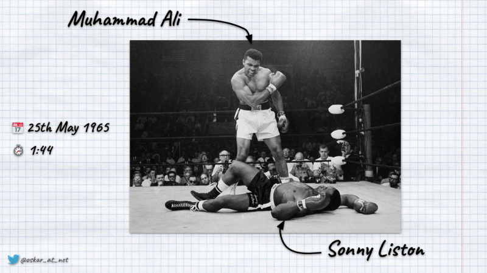
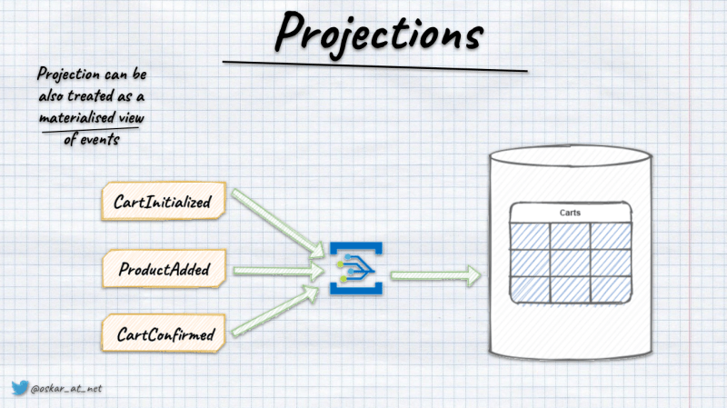
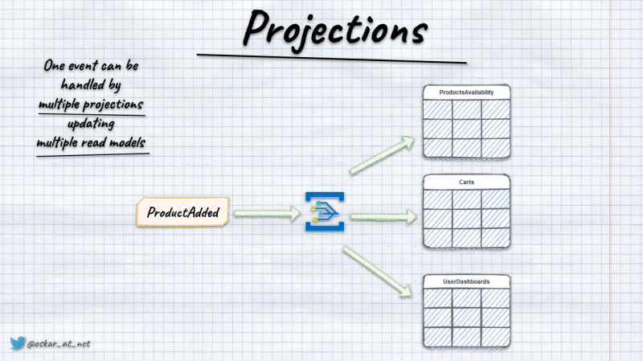
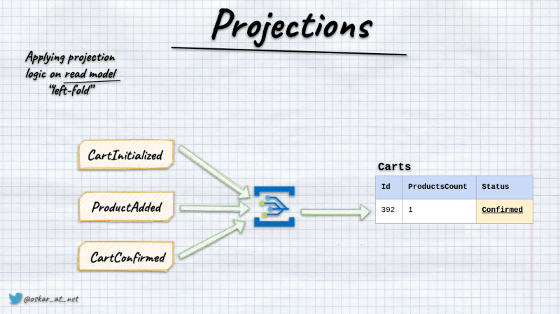
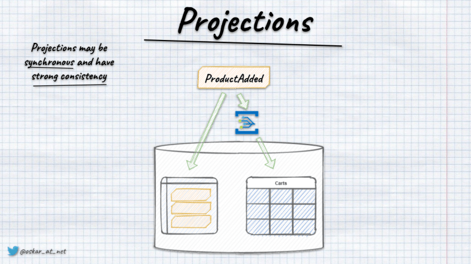
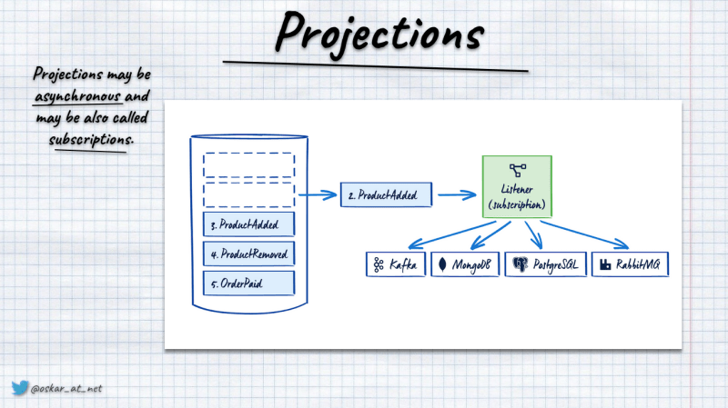
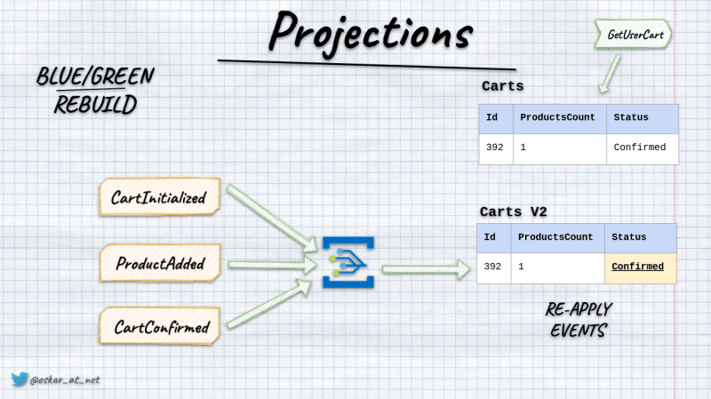

**If I had to choose the killer feature of Event Sourcing, I'd select projections.** Why? I'll explain that in detail in this article.

Events are facts; they represent something that has happened in the past. Projections are a different interpretation of the set of facts. Sounds enigmatic? Let's have a look at this picture.



It shows the result of a boxing fight. Even if you're not a boxing fan, you can see that the triumphing guy is Muhammad Ali. Below him lies Sonny Liston. 

Why am I telling you about it? 

**Because it shows pretty well what's an event.** The fight result is a fact. It cannot be retracted. It happened on 25th May 1965, so at a certain point in time. It has specific information about what has happened, like information of:
- who fought, 
- that it only lasted 1 minute 44 seconds, 
- the venue was Central Maine Youth Center in Lewiston, Maine,
- etc.

**It also shows well what's projection.** The same result of the fight may be interpreted differently: Muhammad is triumphing, Sonny not so much. What's more, to this day, boxing fans are arguing if this was a real fight or a rigged one. The punch knocked down Sonny Liston is known as [phantom punch](https://en.wikipedia.org/wiki/Muhammad_Ali_vs._Sonny_Liston#The_phantom/anchor_punch) as no one saw it reaching Sonny Liston's face.

**In projections, we're taking a set of events representing various facts (about the same object, multiple), correlating them and building interpretation.** Most of the time, we store the result as a materialised read model. Yet, the projection result can be anything: email, PDF, etc.



Projections can be built on existing facts. Thus together with data analytics, drilling and handling insights, we got from them. Events are an excellent source for data exploration. For instance, by checking products bought in the e-commerce system, we can find the gaps like abandoned carts, build a recommendation engine, etc. Read more in [Never Lose Data Again - Event Sourcing to the Rescue!](/en/never_lose_data_with_event_sourcing/).

As mentioned, a single fact can have multiple interpretations; events can be a source of numerous projections. For instance, information about the product added to the shopping cart should update the shopping cart view, product availability, etc.



**The most popular approach to handling them is to perform the so-called _left-fold_ approach.** We're taking the current state of the read model, applying the upcoming event and getting the new state as a result.



**Of course, nothing stops you from batch processing by taking all the events, merging them and storing the result.** For instance, if you're doing set-based aggregations like the total of sold products, money accrual, and average grades in school, it could be more efficient if done _en masse_.

## Projections can be synchronous and asynchronous

Although most tooling shows that they need eventual consistency, that's incorrect. Their state doesn't have to be updated with a delay. It's a technical _"detail"_ of the exact implementation. If you're storing events and read models in the same relational database (like, e.g. [Marten]() in Postgres), then you can wrap all in a transaction. Then either events are appended and projections updated, or no change is made.



**Of course, we should not be afraid of eventual consistency.** How soon is now? There's no now! Everything in the real world happens with some delay. Also, if we want to make a reliable and fault-tolerant processing pipeline doing stuff as a background process may be a go-to way. Read more in [Outbox, Inbox patterns and delivery guarantees explained](/en/outbox_inbox_patterns_and_delivery_guarantees_explained/).

**Projections are a concept that's part of Event-Driven Architecture and essential building block of [CQRS](/en/cqrs_facts_and_myths_explained/). They're not tight to Event Sourcing.** Yet, event stores can help you in making them efficient. Most of the time, they allow you to subscribe to the appended events notifications, for instance, [Marten's Async Daemon](/en/integrating_Marten/) or [EventStoreDB subscriptions](/en/persistent_vs_catch_up_eventstoredb_subscriptions_in_action/). They are an [outbox pattern](/en/push_based_outbox_pattern_with_postgres_logical_replication/) provided as a commodity by the database. That gives both durabilities for the events and strong guarantees around processing them.



## Projections rebuild

**The significant benefit of the projections is that they're predictable.**  That means that the same logic will generate the same result for the same events.

**As events are our source of truth, then we can think of read models as secondary data.** If we treat events as the source of truth and base projection processing only on data we get from them, we can also rebuild our read models. 

We could break it into two phases:
- **catching up**, where we're far from the current state. 
- **live**, where we're processing new, upcoming events.

**How to decide if the gap is _"far enough"_?** We might never be fully caught up if events are appended continuously. Because of that, we need to define some threshold, e.g. in our context, live means that we have a maximum of ten events to process from the latest registered event. Of course, this can be done case by case and differ for various projections. Read also more in [Let's talk about positions in event stores](/en/lets_talk_about_positions_in_event_stores/).

We can use different projection handling techniques depending on the phase we're in, e.g., batch processing when we're catching up and left-fold when we're live. 

Projections are usually made asynchronously, while the left-fold approach can work well in sync and async ways.

**The simplest rebuild we can do is truncate the current state of the read model and then reapply all events through projection logic.** We can do that if we can afford the downtime. There will be a time when there's no data, or we're far from being up to date. 

**If we cannot afford downtime, we can do a _blue-green_ rebuild.** In that, we're setting up a read model in the other storage (e.g. different database, schema, table, etc.). Then we're reapplying events to this secondary read model. Once we're caught up, we can switch queries to target the new read model and archive the old one.



## Idempotency

Some event-driven tooling promises to bring you the Holy Grail: exactly-once delivery. I explained in detail in [another article](/en/outbox_inbox_patterns_and_delivery_guarantees_explained/) that this is impossible. 

**The safe assumption is that we might get the same event more than once and run projection logic multiple times for the same event.** Because of that, our projection handling needs to be idempotent. It's a fancy word to say that no matter how many times we apply the same event, we'll get the same result as we'd applied it only once.

How to handle idempotency correctly?

**The simplest case is [Event-Carried State Transfer](https://martinfowler.com/articles/201701-event-driven.html).** It's a fancy term for just pushing the latest state through events. Generally, it's not the best practice, as it creates a coupling between event producer and consumer. Also, if we just send the state, we're losing the context of the operation that caused the state change. However, it can be more than enough for cases like read model updates. Especially if our read model is just another representation of write model data.

**Yet, it's better to avoid having [state obsession](/en/state-obsession/) and work on the event model design.** For instance, if we have read model with the bank account balance _Payment Registered_ event. If we put the transaction amount to the event payload, applying it more than once will result in the wrong balance calculation. If we additionally include the account balance after payment was registered, then updating the balance would become upsert, idempotent by default.

**Of course, it's a tradeoff, as we should keep events granular. [They should be as small as possible, but not smaller](/en/events_should_be_as_small_as_possible/).** We should treat events as API. We should apply the same design practices as the others, so think if it should be API first or more tuned to consumer needs.

If you're still unsure of my reasoning, let's look at that from a different angle. Which component should be responsible for doing balance calculation? In reality, it's much more complex than just incrementing the value. We need to account for taxes, policies, previous balance etc. Do you really want to repeat this logic in read models or all the other consumers? The business logic should rather do such a calculation and propagate it further to subscribers. As always, pick your poison.

**The next option is a more generic solution based on the event's position in the log.** We could pass the entity version in event metadata and store it in the read model during the update. If we assume that we're getting events in the proper order, then we could compare the value during the update and ignore the change if it's smaller than the value in the read model. I wrote about it longer in:
- [Dealing with Eventual Consistency and Idempotency in MongoDB projections](/en/simple_trick_for_idempotency_handling_in_elastic_search_readm_model/)
- [A simple trick for idempotency handling in the Elastic Search read model](/en/dealing_with_eventual_consistency_and_idempotency_in_mongodb_projections/)

**You could also store events' ids and ensure their uniqueness.** This could be done as part of middleware around your event handler that tries to store the event id and stops processing if it was already handled. It may be part of your [inbox pattern deduplication](/en/outbox_inbox_patterns_and_delivery_guarantees_explained/) or stored in a dedicated table together with business results wrapped in the database transaction. 

If we decide to do that, we should consider keeping the handled events' ids information for each projection. Why? To enable projection rebuilds and add new projections based on existing events.

**My general recommendation is to work on the design and use the last handled position (checkpoints) to verify if the event was already handled.** Other mechanisms may appear to be more sophisticated but also more fragile.

## Eventual Consistency

**I often hear the phrase: _"business won't let me to have stale data"_.** That's not surprising, as [we're not great at speaking with each other](/en/bring_me_problems_not_solutions/). 

The first step to solving that is not to use technical jargon while talking with a business. We're scaring them by using it and not helping to understand what we're trying to say. Cross out eventual consistency from your dictionary before speaking with business. Ask them questions like:
- _"What worse can happen if user won't see this information immediately?"_ or
- _"Can we solve it differently, so we don't need to show it at once?"

**Show them the money and tell them how much development time and money it will cost for each solution.** Don't go too far into the implementation details. Try to build professional relationships in which we trust each other. So business knows about business, and we know the technical aspects.

**Start also talking more with UX designers.** Simple usability tricks may cut a lot of complexity from you. For instance, when adding a new product to the shopping cart, you might not redirect it to the shopping cart view. You may keep the user on the product page. It reduces the chance of not seeing the product in the shopping cart details and makes the user experience smoother. Typically users want to continue shopping and go to selected product details when they want to confirm and proceed to payment. Between those actions, our read model should become consistent.

You can also use different techniques like push notifications from the server or simulate the synchronous flows in the asynchronous world by using long-polling. Read more in [Long-polling, how to make our async API synchronous](/en/long_polling_and_eventual_consistency/).

**Still, the best advice is to work closely with the business and designers; this will save you a lot of accidental complexity.** The real world has delays, and we should embrace that also in our technical design.

## Scaling and data isolation

_**Will it scale? How to scale?**_ Those are mantras we tell in all cases. Most of the time, we don't know what we need and don't know the exact metrics, but we're already trying to solve imaginary scenarios. Don't get me wrong; it's essential to consider this before going to production. Yet, those considerations before knowing where we need to go are just pointless. 

Performance optimisation should be made based on the precise requirements and verified with the benchmarks. Before trying to parallelise processing, we should ascertain if we need to optimise and if our current solution needs to scale more.

I wrote about those considerations in [How to scale projections in the event-driven systems?](/en/how_to_scale_projections_in_the_event_driven_systems/). 

**In short, the foundational aspect of scaling projections is not the tech stack we use but the data partitioning we apply.** To be able to parallelise, we need to isolate data. We could do it per module, customer, and region, but we can also go deeper. We can have a processor for each projection type (e.g. different for the user dashboard and shopping cart view). We can also go extreme and distribute the load on the row level. We should be good if projections are not competing for resources. 

**That also means we should not have multiple projections updating the same data.** If we're using a normalised relational database for our read models and have a shopping cart with product items as separate tables, then we should still have a single projection updating them. They're conceptually grouped together, as you won't have product items without a shopping cart, so keep a single writer updating it as a whole.

Speaking about nested data. Check also [How to create projections of events for nested object structures?](/en/how_to_create_projections_of_events_for_nested_object_structures/)

## Talk is cheap; show me the code!

Let's say that we have to implement the following projections:

1. Detailed view of the shopping cart with:
- the total amount of products in the basket,
- total number of products
- list of products (e.g. if someone added the same product twice, then we should have one element with the sum).
2. View with short information about pending shopping carts. It's intended to be used as a list view for administration:
- the total amount of products in the basket,
- total number of products
- confirmed and cancelled shopping carts should be hidden.

Let's say we're using some database that can store/upsert and delete the entities with provided id.

We could add to it a helper that'd get the current state and store the updated result using C#:

```csharp
public static class DatabaseExtensions
{
    public static void GetAndStore<T>(this Database database, Guid id, Func<T, T> update) where T : class, new ()
    {
        var item = database.Get<T>(id) ?? new T();

        database.Store(id, update(item));
    }
}
```

Having that, we could implement the first projection as:

```csharp
public class ShoppingCartDetails
{
    public Guid Id { get; set; }
    public Guid ClientId { get; set; }
    public ShoppingCartStatus Status { get; set; }
    public IList<PricedProductItem> ProductItems { get; set; } = new List<PricedProductItem>();
    public DateTime? ConfirmedAt { get; set; }
    public DateTime? CanceledAt { get; set; }
    public decimal TotalPrice { get; set; }
    public decimal TotalItemsCount { get; set; }
}

public class ShoppingCartDetailsProjection
{
    private readonly Database database;
    public ShoppingCartDetailsProjection(Database database) => this.database = database;

    public void Handle(EventEnvelope<ShoppingCartOpened> @event) =>
        database.Store(@event.Data.ShoppingCartId,
            new ShoppingCartDetails
            {
                Id = @event.Data.ShoppingCartId,
                Status = ShoppingCartStatus.Pending,
                ClientId = @event.Data.ClientId,
                ProductItems = new List<PricedProductItem>(),
                TotalPrice = 0,
                TotalItemsCount = 0
            });

    public void Handle(EventEnvelope<ProductItemAddedToShoppingCart> @event) =>
        database.GetAndStore<ShoppingCartDetails>(@event.Data.ShoppingCartId, item =>
        {
            var productItem = @event.Data.ProductItem;
            var existingProductItem = item.ProductItems.SingleOrDefault(p => p.ProductId == productItem.ProductId);

            if (existingProductItem == null)
            {
                item.ProductItems.Add(productItem);
            }
            else
            {
                item.ProductItems.Remove(existingProductItem);
                item.ProductItems.Add(
                    new PricedProductItem(
                        existingProductItem.ProductId,
                        existingProductItem.Quantity + productItem.Quantity,
                        existingProductItem.UnitPrice
                    )
                );
            }

            item.TotalPrice += productItem.TotalAmount;
            item.TotalItemsCount += productItem.Quantity;

            return item;
        });

    public void Handle(EventEnvelope<ProductItemRemovedFromShoppingCart> @event) =>
        database.GetAndStore<ShoppingCartDetails>(@event.Data.ShoppingCartId, item =>
        {
            var productItem = @event.Data.ProductItem;
            var existingProductItem = item.ProductItems.SingleOrDefault(p => p.ProductId == productItem.ProductId);

            if (existingProductItem == null || existingProductItem.Quantity - productItem.Quantity < 0)
                // You may consider throwing exception here, depending on your strategy
                return item;

            if (existingProductItem.Quantity - productItem.Quantity == 0)
            {
                item.ProductItems.Remove(productItem);
            }
            else
            {
                item.ProductItems.Remove(existingProductItem);
                item.ProductItems.Add(
                    new PricedProductItem(
                        existingProductItem.ProductId,
                        existingProductItem.Quantity - productItem.Quantity,
                        existingProductItem.UnitPrice
                    )
                );
            }

            item.TotalPrice -= productItem.TotalAmount;
            item.TotalItemsCount -= productItem.Quantity;

            return item;
        });

    public void Handle(EventEnvelope<ShoppingCartConfirmed> @event) =>
        database.GetAndStore<ShoppingCartDetails>(@event.Data.ShoppingCartId, item =>
        {
            item.Status = ShoppingCartStatus.Confirmed;
            item.ConfirmedAt = DateTime.UtcNow;

            return item;
        });


    public void Handle(EventEnvelope<ShoppingCartCanceled> @event) =>
        database.GetAndStore<ShoppingCartDetails>(@event.Data.ShoppingCartId, item =>
        {
            item.Status = ShoppingCartStatus.Canceled;
            item.CanceledAt = DateTime.UtcNow;

            return item;
        });
}
```

And the second projection as:

```csharp
public class ShoppingCartShortInfo
{
    public Guid Id { get; set; }
    public Guid ClientId { get; set; }
    public decimal TotalPrice { get; set; }
    public decimal TotalItemsCount { get; set; }
}

public class ShoppingCartShortInfoProjection
{
    private readonly Database database;

    public ShoppingCartShortInfoProjection(Database database) => this.database = database;

    public void Handle(EventEnvelope<ShoppingCartOpened> @event) =>
        database.Store(@event.Data.ShoppingCartId,
            new ShoppingCartShortInfo
            {
                Id = @event.Data.ShoppingCartId,
                ClientId = @event.Data.ClientId,
                TotalPrice = 0,
                TotalItemsCount = 0
            });

    public void Handle(EventEnvelope<ProductItemAddedToShoppingCart> @event) =>
        database.GetAndStore<ShoppingCartShortInfo>(@event.Data.ShoppingCartId, item =>
        {
            var productItem = @event.Data.ProductItem;

            item.TotalPrice += productItem.TotalAmount;
            item.TotalItemsCount += productItem.Quantity;

            return item;
        });

    public void Handle(EventEnvelope<ProductItemRemovedFromShoppingCart> @event) =>
        database.GetAndStore<ShoppingCartShortInfo>(@event.Data.ShoppingCartId, item =>
        {
            var productItem = @event.Data.ProductItem;

            item.TotalPrice -= productItem.TotalAmount;
            item.TotalItemsCount -= productItem.Quantity;

            return item;
        });

    public void Handle(EventEnvelope<ShoppingCartConfirmed> @event) =>
        database.Delete<ShoppingCartShortInfo>(@event.Data.ShoppingCartId);


    public void Handle(EventEnvelope<ShoppingCartCanceled> @event) =>
        database.Delete<ShoppingCartShortInfo>(@event.Data.ShoppingCartId);
}
```

**As you see, projections use using simple handler that takes the upcoming events, loads the current state, runs the projection logic and stores the result.** So, doing left-fold. 

That's also how [Marten projections](https://martendb.io/events/projections/) are working. Yet, they're doing much more internally. So batching, parallelising etc. 

Of course, as explained earlier, you don't need to do left fold; you could even just run an SQL statement, e.g.:

```csharp
public class UserDashboardProjection : Projection
{
    private readonly NpgsqlConnection databaseConnection;

    public UserDashboardProjection(NpgsqlConnection databaseConnection)
    {
        this.databaseConnection = databaseConnection;

        Projects<UserCreated>(Apply);
        Projects<UserNameUpdated>(Apply);
        Projects<OrderCreated>(Apply);
    }

    void Apply(UserCreated @event)
    {
        databaseConnection.Execute(
            @"INSERT INTO UserDashboards (Id, UserName, OrdersCount, TotalAmount)
                VALUES (@UserId, @UserName, 0, 0)",
            @event
        );
    }

    void Apply(UserNameUpdated @event)
    {
        databaseConnection.Execute(
            @"UPDATE UserDashboards
                SET UserName = @UserName
                WHERE Id = @UserId",
            @event
        );
    }

    void Apply(OrderCreated @event)
    {
        databaseConnection.Execute(
            @"UPDATE UserDashboards
                SET OrdersCount = OrdersCount + 1,
                    TotalAmount = TotalAmount + @Amount
                WHERE Id = @UserId",
            @event
        );
    }
}
```

Or do batch processing. 

Projections should be as close as possible to end storage to be efficient. Create abstractions when needed, but beware to avoid ending up with the lowest common denominator.

## Summing up

**Projections are powerful mechanism.** In a nutshell, they're _just_ transformations of information we got from events into other data. We can look at the past and analyse the data, finding even new business models. Thanks to that, we can get business insights and view data from different perspectives.

To implement projections efficiently and benefit fully from their superpowers, we need to take a lot into consideration. I hope this post is a decent starting point for you to know how to deal with them and what to watch for. 

I showed a foundational building block from a big-picture view. Even though it ended up as a lengthy article, there are still things to expand. Feel free to post such in the comments!

If you also want to learn more, consider [doing training with me](/en/training/). A real workshop is the best way to learn, discuss and get hands-on experience.

Cheers!

Oskar

p.s. **Ukraine is still under brutal Russian invasion. A lot of Ukrainian people are hurt, without shelter and need help.** You can help in various ways, for instance, directly helping refugees, spreading awareness, putting pressure on your local government or companies. You can also support Ukraine by donating e.g. to [Red Cross](https://www.icrc.org/en/donate/ukraine), [Ukraine humanitarian organisation](https://savelife.in.ua/en/donate/) or [donate Ambulances for Ukraine](https://www.gofundme.com/f/help-to-save-the-lives-of-civilians-in-a-war-zone).
