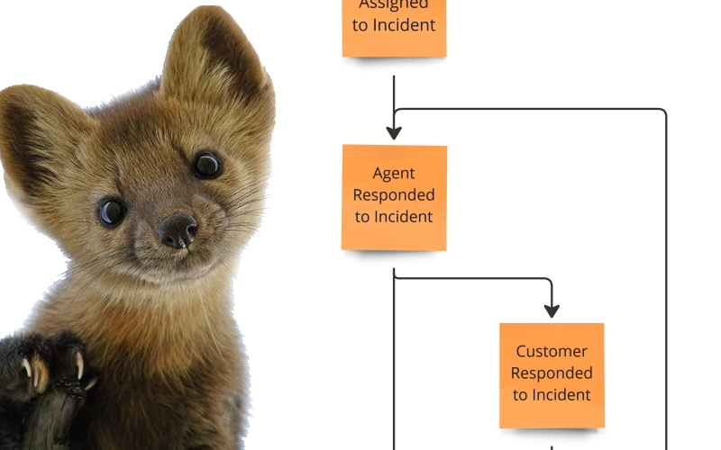
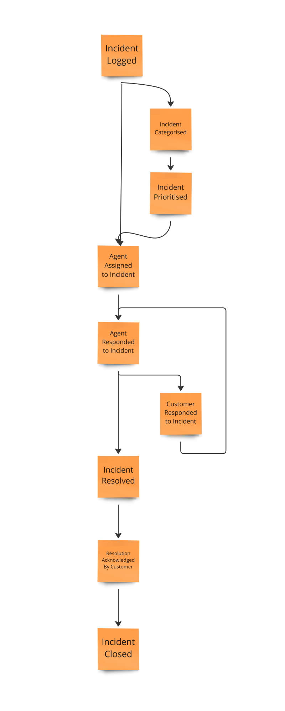

Projections are a neverending story. One does not simply write [a single guide](). One needs to write more examples of more advanced cases. That's precisely what one here intends to do!

Let's say that we're working on the helpdesk system. We're gathering information about incidents provided by the customer. 

The flow is probably well-known to you, but let's summarise it:
- Incident is logged. It can be received via various channels (application, email, phone, etc.).
- After that, it should be categorised and prioritised by the support agent.
- The discussion between the agent and customer is happening. 
- The agent has to answer all customer questions before resolving the incident.
- Resolution needs to be acknowledged by the customer.
- After customer acknowledgement incident can be closed.



In code, our events could look like this:

```csharp
public record IncidentLogged(
    Guid IncidentId,
    Guid CustomerId,
    Contact Contact,
    string Description,
    Guid LoggedBy,
    DateTimeOffset LoggedAt
);

public record IncidentCategorised(
    Guid IncidentId,
    IncidentCategory Category,
    Guid CategorisedBy,
    DateTimeOffset CategorisedAt
);

public record IncidentPrioritised(
    Guid IncidentId,
    IncidentPriority Priority,
    Guid PrioritisedBy,
    DateTimeOffset PrioritisedAt
);

public record AgentAssignedToIncident(
    Guid IncidentId,
    Guid AgentId,
    DateTimeOffset AssignedAt
);

public record AgentRespondedToIncident(
    Guid IncidentId,
    IncidentResponse.FromAgent Response,
    DateTimeOffset RespondedAt
);

public record CustomerRespondedToIncident(
    Guid IncidentId,
    IncidentResponse.FromCustomer Response,
    DateTimeOffset RespondedAt
);

public record IncidentResolved(
    Guid IncidentId,
    ResolutionType Resolution,
    Guid ResolvedBy,
    DateTimeOffset ResolvedAt
);

public record ResolutionAcknowledgedByCustomer(
    Guid IncidentId,
    Guid AcknowledgedBy,
    DateTimeOffset AcknowledgedAt
);

public record IncidentClosed(
    Guid IncidentId,
    Guid ClosedBy,
    DateTimeOffset ClosedAt
);
```

**Having them, we can build various projections. The most obvious are incident details and short info.** 

The first one will show all the information about the details and is used during the resolution process. The second shows basic information for a list view.

**They are built from the same set of events from incident streams.** A single stream will end up as the single record in the read model. 

**How to model them in [Marten](https://martendb.io/)?** We've got you covered! For that, use [Single Stream aggregations](https://martendb.io/events/projections/aggregate-projections.html#aggregate-by-stream). They're dedicated to such 1:1 handling.

Marten will take the stream id, try to match it with the read model id and perform an upsert. You just need to provide the logic for applying the event on the read model item.

Short info projection can look like that _(Note: read-only syntax is not required, you can also use regular mutations_).

```csharp
public record IncidentShortInfo(
    Guid Id,
    Guid CustomerId,
    IncidentStatus Status,
    int NotesCount,
    IncidentCategory? Category = null,
    IncidentPriority? Priority = null
);

public class IncidentShortInfoProjection: SingleStreamAggregation<IncidentShortInfo>
{
    public static IncidentShortInfo Create(IncidentLogged logged) =>
        new(logged.IncidentId, logged.CustomerId, IncidentStatus.Pending, 0);

    public IncidentShortInfo Apply(IncidentCategorised categorised, IncidentShortInfo current) =>
        current with { Category = categorised.Category };

    public IncidentShortInfo Apply(IncidentPrioritised prioritised, IncidentShortInfo current) =>
        current with { Priority = prioritised.Priority };

    public IncidentShortInfo Apply(AgentRespondedToIncident agentResponded, IncidentShortInfo current) =>
        current with { NotesCount = current.NotesCount + 1 };

    public IncidentShortInfo Apply(CustomerRespondedToIncident customerResponded, IncidentShortInfo current) =>
        current with { NotesCount = current.NotesCount + 1 };

    public IncidentShortInfo Apply(IncidentResolved resolved, IncidentShortInfo current) =>
        current with { Status = IncidentStatus.Resolved };

    public IncidentShortInfo Apply(ResolutionAcknowledgedByCustomer acknowledged, IncidentShortInfo current) =>
        current with { Status = IncidentStatus.ResolutionAcknowledgedByCustomer };

    public IncidentShortInfo Apply(IncidentClosed closed, IncidentShortInfo current) =>
        current with { Status = IncidentStatus.Closed };
}
```

Details projection can look as follows:

```csharp
public record IncidentDetails(
    Guid Id,
    Guid CustomerId,
    IncidentStatus Status,
    IncidentNote[] Notes,
    IncidentCategory? Category = null,
    IncidentPriority? Priority = null,
    Guid? AgentId = null,
    int Version = 1
);

public record IncidentNote(
    IncidentNoteType Type,
    Guid From,
    string Content,
    bool VisibleToCustomer
);

public enum IncidentNoteType
{
    FromAgent,
    FromCustomer
}

public class IncidentDetailsProjection: SingleStreamAggregation<IncidentDetails>
{
    public static IncidentDetails Create(IncidentLogged logged) =>
        new(logged.IncidentId, logged.CustomerId, IncidentStatus.Pending, Array.Empty<IncidentNote>());

    public IncidentDetails Apply(IncidentCategorised categorised, IncidentDetails current) =>
        current with { Category = categorised.Category };

    public IncidentDetails Apply(IncidentPrioritised prioritised, IncidentDetails current) =>
        current with { Priority = prioritised.Priority };

    public IncidentDetails Apply(AgentAssignedToIncident prioritised, IncidentDetails current) =>
        current with { AgentId = prioritised.AgentId };

    public IncidentDetails Apply(AgentRespondedToIncident agentResponded, IncidentDetails current) =>
        current with
        {
            Notes = current.Notes.Union(
                new[]
                {
                    new IncidentNote(
                        IncidentNoteType.FromAgent,
                        agentResponded.Response.AgentId,
                        agentResponded.Response.Content,
                        agentResponded.Response.VisibleToCustomer
                    )
                }).ToArray()
        };

    public IncidentDetails Apply(CustomerRespondedToIncident customerResponded, IncidentDetails current) =>
        current with
        {
            Notes = current.Notes.Union(
                new[]
                {
                    new IncidentNote(
                        IncidentNoteType.FromCustomer,
                        customerResponded.Response.CustomerId,
                        customerResponded.Response.Content,
                        true
                    )
                }).ToArray()
        };

    public IncidentDetails Apply(IncidentResolved resolved, IncidentDetails current) =>
        current with { Status = IncidentStatus.Resolved };

    public IncidentDetails Apply(ResolutionAcknowledgedByCustomer acknowledged, IncidentDetails current) =>
        current with { Status = IncidentStatus.ResolutionAcknowledgedByCustomer };

    public IncidentDetails Apply(IncidentClosed closed, IncidentDetails current) =>
        current with { Status = IncidentStatus.Closed };
}
```

**What if you'd like to show the human-readable audit log containing the history of the incident?** Not a problem! You can also reuse the events you have and just interpret them differently. For instance like that:

```csharp
public record IncidentHistory(
    Guid Id,
    Guid IncidentId,
    string Description
);

public class IncidentHistoryTransformation: EventProjection
{
    public IncidentHistory Transform(IEvent<IncidentLogged> input)
    {
        var (incidentId, customerId, contact, description, loggedBy, loggedAt) = input.Data;

        return new IncidentHistory(
            CombGuidIdGeneration.NewGuid(),
            incidentId,
            $"['{loggedAt}'] Logged Incident with id: '{incidentId}' for customer '{customerId}' and description `{description}' through {contact} by '{loggedBy}'"
        );
    }

    public IncidentHistory Transform(IEvent<IncidentCategorised> input)
    {
        var (incidentId, category, categorisedBy, categorisedAt) = input.Data;

        return new IncidentHistory(
            CombGuidIdGeneration.NewGuid(),
            incidentId,
            $"[{categorisedAt}] Categorised Incident with id: '{incidentId}' as {category} by {categorisedBy}"
        );
    }

    public IncidentHistory Transform(IEvent<IncidentPrioritised> input)
    {
        var (incidentId, priority, prioritisedBy, prioritisedAt) = input.Data;

        return new IncidentHistory(
            CombGuidIdGeneration.NewGuid(),
            incidentId,
            $"[{prioritisedAt}] Prioritised Incident with id: '{incidentId}' as '{priority}' by {prioritisedBy}"
        );
    }

    public IncidentHistory Transform(IEvent<AgentAssignedToIncident> input)
    {
        var (incidentId, agentId, assignedAt) = input.Data;

        return new IncidentHistory(
            CombGuidIdGeneration.NewGuid(),
            incidentId,
            $"[{assignedAt}] Assigned agent `{agentId} to incident with id: '{incidentId}'"
        );
    }

    public IncidentHistory Transform(IEvent<CustomerRespondedToIncident> input)
    {
        var (incidentId, response, respondedAt) = input.Data;

        return new IncidentHistory(
            CombGuidIdGeneration.NewGuid(),
            incidentId,
            $"[{respondedAt}] Agent '{response.CustomerId}' responded with response '{response.Content}' to Incident with id: '{incidentId}'"
        );
    }

    public IncidentHistory Transform(IEvent<AgentRespondedToIncident> input)
    {
        var (incidentId, response, respondedAt) = input.Data;

        var responseVisibility = response.VisibleToCustomer ? "public" : "private";

        return new IncidentHistory(
            CombGuidIdGeneration.NewGuid(),
            incidentId,
            $"[{respondedAt}] Agent '{response.AgentId}' responded with {responseVisibility} response '{response.Content}' to Incident with id: '{incidentId}'"
        );
    }

    public record IncidentResolved(
        Guid IncidentId,
        ResolutionType Resolution,
        Guid ResolvedBy,
        DateTimeOffset ResolvedAt
    );

    public IncidentHistory Transform(IEvent<IncidentResolved> input)
    {
        var (incidentId, resolution, resolvedBy, resolvedAt) = input.Data;

        return new IncidentHistory(
            CombGuidIdGeneration.NewGuid(),
            incidentId,
            $"[{resolvedAt}] Resolved Incident with id: '{incidentId}' with resolution `{resolution} by '{resolvedBy}'"
        );
    }

    public IncidentHistory Transform(IEvent<ResolutionAcknowledgedByCustomer> input)
    {
        var (incidentId, acknowledgedBy, acknowledgedAt) = input.Data;

        return new IncidentHistory(
            CombGuidIdGeneration.NewGuid(),
            incidentId,
            $"[{acknowledgedAt}] Customer '{acknowledgedBy}' acknowledged resolution of Incident with id: '{incidentId}'"
        );
    }

    public IncidentHistory Transform(IEvent<IncidentClosed> input)
    {
        var (incidentId, closedBy, closedAt) = input.Data;

        return new IncidentHistory(
            CombGuidIdGeneration.NewGuid(),
            incidentId,
            $"[{closedAt}] Agent '{closedBy}' closed Incident with id: '{incidentId}'"
        );
    }
}
```

This time, I'm using a different projection base class: [Event Projection](https://martendb.io/events/projections/event-projections.html). It gives you even higher flexibility. 

By generating a new id for each Incident History entry, I end up with a new record in the read model for each registered incident event. I'm also placing the incident id to be able to filter it later by that.

Cool? Let's go deeper, then!

**What if we'd like to build a dashboard for a user containing its name, email and summaries of the incidents in a certain status?** Then we'd need to combine information from two types of streams:
- customer information,
- incident data.

For that, we need to correlate the incident and customer information. The simplest way is to define the customer dashboard id as equal to the customer id. That's optimal because we don't want multiple instances of this report for the same customer.

If we had a customer id in each incident event, we could use it to find the information in each model. 

Marten also provides a base class for handling multiple streams (of the same or different type): [Multi Stream Aggregation](https://martendb.io/events/projections/view-projections.html).

```csharp
public record CustomerCreated(
    Guid CustomerId,
    string Name,
    string Email
);

public class CustomerIncidentsSummary
{
    public Guid Id { get; set; }
    public required string Name{ get; set; }
    public required string Email{ get; set; }
    public int Pending { get; set; }
    public int Resolved { get; set; }
    public int Acknowledged { get; set; }
    public int Closed { get; set; }
}

public class CustomerIncidentsSummaryProjection: MultiStreamAggregation<CustomerIncidentsSummary, Guid>
{
    public CustomerIncidentsSummaryProjection()
    {
        Identity<CustomerCreated>(e => e.CustomerId);
        Identity<IncidentLogged>(e => e.CustomerId);
        Identity<IncidentResolved>(e => e.CustomerId);
        Identity<ResolutionAcknowledgedByCustomer>(e => e.CustomerId);
        Identity<IncidentClosed>(e => e.CustomerId);
    }

    public void Apply(CustomerCreated customerCreated, CustomerIncidentsSummary current)
    {
        var (_, name, email) = customerCreated;

        current.Name = name;
        current.Email = email;
    }

    public void Apply(IncidentLogged logged, CustomerIncidentsSummary current)
    {
        current.Pending++;
    }

    public void Apply(IncidentResolved resolved, CustomerIncidentsSummary current)
    {
        current.Pending--;
        current.Resolved++;
    }

    public void Apply(ResolutionAcknowledgedByCustomer acknowledged, CustomerIncidentsSummary current)
    {
        current.Resolved--;
        current.Acknowledged++;
    }

    public void Apply(IncidentClosed closed, CustomerIncidentsSummary current)
    {
        current.Acknowledged--;
        current.Closed++;
    }
}
```

As events may come from streams of different types, Marten won't be able to use stream id by convention. We need to help Marten tell which field from the event will be used to find the read model record. That's why we select identity in the projection constructor:

```csharp
public CustomerIncidentsSummaryProjection()
{
    Identity<CustomerCreated>(e => e.CustomerId);
    Identity<IncidentLogged>(e => e.CustomerId);
    Identity<IncidentResolved>(e => e.CustomerId);
    Identity<ResolutionAcknowledgedByCustomer>(e => e.CustomerId);
    Identity<IncidentClosed>(e => e.CustomerId);
}
```

However, if you're a careful reader (which I'm sure you are!), you noticed that we have customer id only in _CustomerCreated_ and _IncidentLogged_ events.

**Best practice is to avoid repeating the same information in events if it's not directly related to the operation.** We might not want to repeat customer id in incident events, as it can only be assigned when the incident is logged; then, there's no option to change it.

Of course, a bit of redundancy may not do significant harm, as [events should be as small as possible, but not smaller](/en/events_should_be_as_small_as_possible/). Still, it's a tradeoff that we should carefully choose to do or not.

**What if we'd like not to repeat this data but load it when applying projection?** Can Marten help with that? Of course! We can do additional preprocessing of events using the [custom event grouper](https://martendb.io/events/projections/view-projections.html#view-projection-with-custom-grouper) feature.

Let's see the full implementation, then explain it step by step.

```csharp
public class CustomerIncidentsSummaryGrouper: IAggregateGrouper<Guid>
{
    private readonly Type[] eventTypes =
    {
        typeof(IncidentResolved), typeof(ResolutionAcknowledgedByCustomer),
        typeof(IncidentClosed)
    };

    public async Task Group(IQuerySession session, IEnumerable<IEvent> events, ITenantSliceGroup<Guid> grouping)
    {
        var filteredEvents = events
            .Where(ev => eventTypes.Contains(ev.EventType))
            .ToList();

        if (!filteredEvents.Any())
            return;

        var incidentIds = filteredEvents.Select(e => e.StreamId).ToList();

        var result = await session.Events.QueryRawEventDataOnly<IncidentLogged>()
            .Where(e => incidentIds.Contains(e.IncidentId))
            .Select(x => new { x.IncidentId, x.CustomerId })
            .ToListAsync();

        foreach (var group in result.Select(g =>
                     new { g.CustomerId, Events = filteredEvents.Where(ev => ev.StreamId == g.IncidentId) }))
        {
            grouping.AddEvents(group.CustomerId, group.Events);
        }
    }
}
```

**We start by defining for each events we'll be running the custom transformations:**

```csharp
private readonly Type[] eventTypes =
{
    typeof(IncidentResolved), typeof(ResolutionAcknowledgedByCustomer),
    typeof(IncidentClosed)
};
```

For the rest, we'll go with regular logic.

Then we define Group method.

```csharp
public async Task Group(IQuerySession session, IEnumerable<IEvent> events, ITenantSliceGroup<Guid> grouping)
{
    // (...)
}
```

 It has:
- **query session** to enable additional loading of data when needed.
- **events**, all the events that are handled in this scope. For synchronous projection, it will contain all events appended before saving changes; for asynchronous, it will contain a batch of processing events. Marten does processing in batches to improve performance.
- **grouping** to add transformed events, grouping them by specified stream id.

**The next step is to filter only events that we want to transform:**

```csharp 
var filteredEvents = events
     .Where(ev => eventTypes.Contains(ev.EventType))
     .ToList();

 if (!filteredEvents.Any())
     return;
```

Having them, we need to find customer ids for each of those events:

```csharp
 var result = await session.Events.QueryRawEventDataOnly<IncidentLogged>()
     .Where(e => incidentIds.Contains(e.IncidentId))
     .Select(x => new { x.IncidentId, x.CustomerId })
     .ToListAsync();
```

We're trying to find the _IncidentLogged_ events that were registered for the specific incident. We assume it has to be available before resolving, acknowledging or closing the incident (as shown in the diagram above).

**Why are we querying events instead of, e.g. incident short info read models?** You don't want to couple the projections processing, that will impact [scaling](/en/how_to_scale_projections_in_the_event_driven_systems/) and create a _rebuild train_ if we're going to rebuild read models. We need to remember to process short incident info before we try to rebuild the customer summary. That's a no-go. Especially having that Marten, for asynchronous processing, parallelises processing of multiple projection types to boost performance.

**Now we can group events by the customer id:**

```csharp
foreach (var group in result.Select(g =>
              new { g.CustomerId, Events = filteredEvents.Where(ev => ev.StreamId == g.IncidentId) }))
 {
     grouping.AddEvents(group.CustomerId, group.Events);
 }
    }
```

After that, when we register grouper in our projection:

```csharp
public CustomerIncidentsSummaryProjection()
{
    Identity<CustomerCreated>(e => e.CustomerId);
    Identity<IncidentLogged>(e => e.CustomerId);
    CustomGrouping(new CustomerIncidentsSummaryGrouper());
}
```

Then Marten will run the transformation behind the scenes and call the proper apply method.

You can define even fancier transformations. Yet, with great power comes great responsibility. You need to be careful not to compromise performance after going wild. At least register such projection as asynchronous, e.g.:

```csharp
var builder = WebApplication.CreateBuilder(args);

builder.Services
    .AddMarten(options =>
    {
	// (...)
        options.Projections.Add<IncidentHistoryTransformation>();
        options.Projections.Add<IncidentDetailsProjection>();
        options.Projections.Add<IncidentShortInfoProjection>();
        options.Projections.Add<CustomerIncidentsSummaryProjection>(ProjectionLifecycle.Async);
    }).AddAsyncDaemon(DaemonMode.Solo);
```

Do you want more? Source codes are available [here in my repository](https://github.com/oskardudycz/EventSourcing.NetCore/tree/main/Sample/Helpdesk).

How to project events to other database than Postgres? I got you covered, read the [guide using Elasticsearch as an example](/pl/projecting_from_marten_to_elasticsearch).

Watch also the webinar:

`youtube: https://www.youtube.com/watch?v=Lc2zV8KA16A`

But most importantly, try it on your own, experiment and have fun!

Cheers!

Oskar

p.s. **Ukraine is still under brutal Russian invasion. A lot of Ukrainian people are hurt, without shelter and need help.** You can help in various ways, for instance, directly helping refugees, spreading awareness, putting pressure on your local government or companies. You can also support Ukraine by donating e.g. to [Red Cross](https://www.icrc.org/en/donate/ukraine), [Ukraine humanitarian organisation](https://savelife.in.ua/en/donate/) or [donate Ambulances for Ukraine](https://www.gofundme.com/f/help-to-save-the-lives-of-civilians-in-a-war-zone).