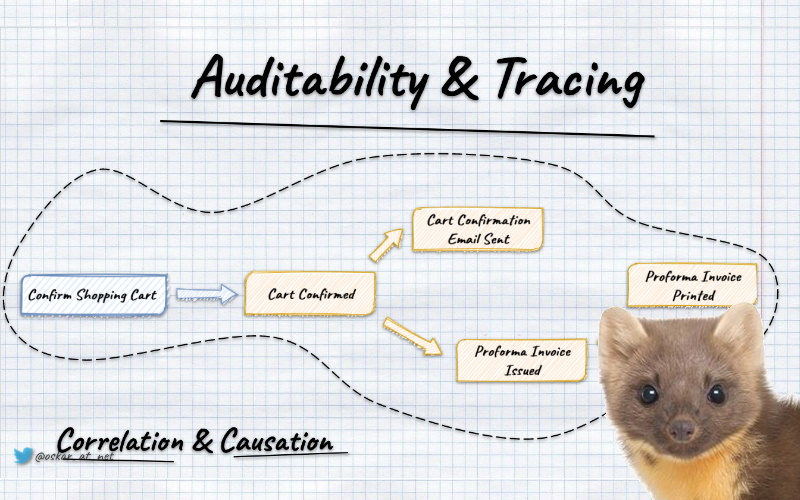
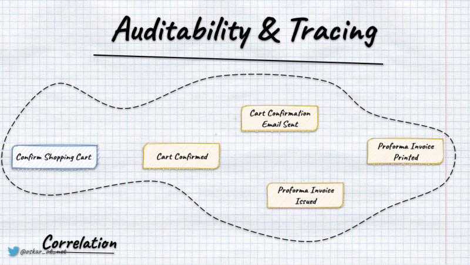
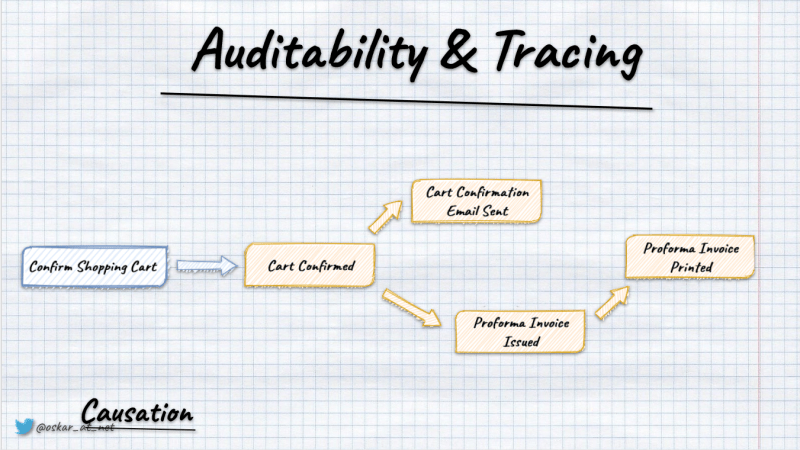
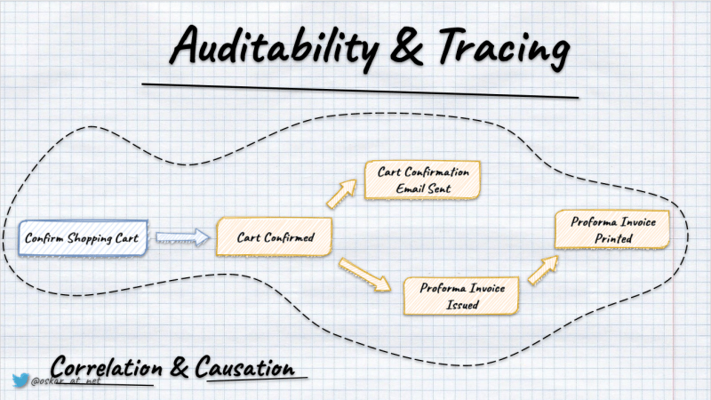
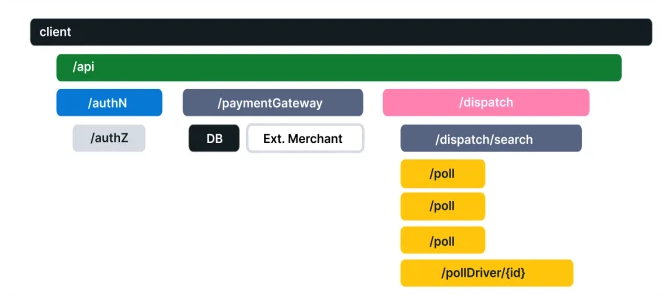

**If I had to select the Distributed Systems Song, I'd choose [Land of Confusion](https://www.youtube.com/watch?v=TlBIa8z_Mts).** This is the world we live in. And these are the hands we're given. Use them, and let's start trying. To make it a place worth living in. 

**Through the years, we didn't have a handful of options to make it a place worth living in.** Yet, recently, we got [Open Telemetry](https://opentelemetry.io/) which increases our likelihood to survive. 

## What's Open Telemetry?

Per its docs: 

_OpenTelemetry is a collection of tools, APIs, and SDKs. Use it to instrument, generate, collect, and export telemetry data (metrics, logs, and traces) to help you analyze your software's performance and behavior. OpenTelemetry is generally available across several languages and is suitable for use._

**In other words, it's standard with tooling to help us observe what's happening in our systems.**

If you want to learn more about its foundational concepts and how to apply them in .NET, Martin Thwaites' talk ["Distributed Tracing in .NET 6 using OpenTelemetry"](https://www.youtube.com/watch?v=3JnMfJM9K0c) is a decent place to start. You can also check the free [Observability Engineering](https://info.honeycomb.io/observability-engineering-oreilly-book-2022) book that should be an excellent way to understand why observability is essential nowadays.

**Let's say that you're building an E-Commerce flow and would like to understand both business and technical flow.** You have a shopping cart module responsible for selecting products. Once you confirm the shopping cart, the order process is started and handled by a separate module.

In distributed systems, many things can go wrong, e.g. failures in the business logic handling, services unavailability, [message delivery issues](/pl/outbox_inbox_patterns_and_delivery_guarantees_explained/), wrong idempotency handling, etc. It'd be great to be able to see what's going on.

**To understand that we need to understand two aspects correlation and causation.**



**Correlation gives us information about everything that happened during a single process/request.** The most straightforward way is to generate a unique index for a request/process. Having that, we can pass it through all the tooling we use and put it in logs, etc. 



**Causation gives us information about the previous step (parent) that triggered our activity.** For instance, we can see that loading and storing entities were initiated during command handling. 



**That's what Open Telemetry gives out of the box, standardising and handling it for us.** In .NET, it's even neater, as instrumentation is [built-in into the diagnostics mechanism](https://learn.microsoft.com/en-us/dotnet/core/diagnostics/distributed-tracing-instrumentation-walkthroughs).

In OpenTelemetry, we have traces representing the whole process and spans representing nested processing. Using them, we can get a tree representing the flow of our requests/processes.



**Event Sourcing gives us even more options; we can combine tracing with business facts we store.** Typically, we put them into event metadata. By that, we can see correlate technical traces with business information. That's super powerful if we try to diagnose what went wrong. Observe trends, etc.

## How to do it in practice?

**Let's say that we're using [Marten](https://martendb.io), and we have the following generic way of handling our commands:**

```csharp
public static class DocumentSessionExtensions
{
    public static Task Add<T>(
        this IDocumentSession documentSession,
        Guid id,
        object @event,
        CancellationToken ct
    ) where T : class
    {
        documentSession.Events.StartStream<T>(id, @event);
        return documentSession.SaveChangesAsync(token: ct);
    }

    public static Task GetAndUpdate<T>(
        this IDocumentSession documentSession,
        Guid id, int version,
        Func<T, object> handle,
        CancellationToken ct
    ) where T : class =>
        documentSession.Events.WriteToAggregate<T>(id, version, stream =>
            stream.AppendOne(handle(stream.Aggregate)), ct);
}
```

We either start the stream if we expect the event to be the first in the stream (e.g. when we're opening the shopping cart) or we're [getting the state from events](/pl/how_to_get_the_current_entity_state_in_event_sourcing/) and appending new fact as the result of the command handling logic ([WriteToAggregate](https://martendb.io/scenarios/command_handler_workflow.html#writetoaggregate) will do that for us). For examples of handling business logic, check [this article](/pl/slim_your_entities_with_event_sourcing/).

**Marten allows [defining metadata on the DocumentSession level](https://martendb.io/documents/metadata.html#correlation-id-causation-id-and-headers). We allow predefined fields like CorrelationId, CausationId, and custom ones.** Whatever we store in Marten in that session lifetime (so events, documents, projections, etc.) will get that metadata. We'll use that feature for OpenTelemetry integration.

To avoid mixing storage handling with telemetry processing to make that more understandable, let's add decorators for our methods that will fill the necessary telemetry data.

```csharp
public static class DocumentSessionExtensionsWithOpenTelemetry
{
    public static Task Add<T>(
        this IDocumentSession documentSession,
        Guid id,
        object @event,
        CancellationToken ct
    ) where T : class =>
        documentSession.WithTelemetry<T>(
            token => DocumentSessionExtensions.Add<T>(documentSession, id, @event, token),
            ct
        );

    public static Task GetAndUpdate<T>(
        this IDocumentSession documentSession,
        Guid id,
        int version,
        Func<T, object> handle,
        CancellationToken ct
    ) where T : class =>
        documentSession.WithTelemetry<T>(
            token => DocumentSessionExtensions.GetAndUpdate(documentSession, id, version, handle, token),
            ct
        );

    private static Task WithTelemetry<T>(
        this IDocumentSession documentSession,
        Func<CancellationToken, Task> run,
        CancellationToken ct,
        [CallerMemberName] string memberName = ""
    ) =>
        ActivityScope.Instance.Run($"{nameof(DocumentSessionExtensions)}/{memberName}",
            (activity, token) =>
            {
                documentSession.PropagateTelemetry(activity);

                return run(token);
            },
            new StartActivityOptions { Tags = { { TelemetryTags.Logic.Stream, typeof(T).Name } } },
            ct);
}
```

We're starting a new activity with a name equal to the method we're doing, so either _DocumentSessionExtensions/Add_ or _DocumentSessionExtensions/GetOrUpdate_. The activity, by default, will be created as the root one or nested if there's already a parent activity. We're also passing additional tags with information about our Stream/Entity type (you can add more depending on your needs).

Once the activity is started, we're propagating telemetry data to the document session and calling the decorated method.

**The propagation code looks as follows:**

```csharp
public static class OpenTelemetryExtensions
{
    public static void PropagateTelemetry(this IDocumentSession documentSession, Activity? activity, ILogger? logger = null)
    {
        var propagationContext = activity.Propagate(
            documentSession,
            ((session, key, value) => session.InjectTelemetryIntoDocumentSession(key, value, logger))
        );

        if (!propagationContext.HasValue) return;

        documentSession.CorrelationId = propagationContext.Value.ActivityContext.TraceId.ToHexString();
        documentSession.CausationId = propagationContext.Value.ActivityContext.SpanId.ToHexString();
    }

    private static void InjectTelemetryIntoDocumentSession(this IDocumentSession session, string key, string value, ILogger? logger = null)
    {
        try
        {
            session.SetHeader(key, value);
        }
        catch (Exception ex)
        {
            logger?.LogError(ex, "Failed to inject trace context");
        }
    }
}
```

We're using the built-in activity's _Propagate method that takes the specific object, and for each of the [telemetry headers](https://www.w3.org/TR/trace-context/#trace-context-http-headers-format) calls the provided method.

We're using Marten's _SetHeader_ that stores custom metadata.

Then finally, we're also storing trace and span information in _CorrelationId_ and _CausationId_.

Ah, and _ActivityScope.Instance.Run_ is also my custom wrapper. Here's the code for it:

```csharp

public class ActivityScope
{
    public static readonly ActivityScope Instance = new ActivityScope();

    private const string GeneralPrefix = "event_driven_io";

    public Activity? Start(string name, StartActivityOptions options) =>
        options.Parent.HasValue
            ? ActivitySourceProvider.Instance
                .CreateActivity(
                    $"{GeneralPrefix}.{name}",
                    options.Kind,
                    parentContext: options.Parent.Value,
                    idFormat: ActivityIdFormat.W3C,
                    tags: options.Tags
                )?.Start()
            : ActivitySourceProvider.Instance
                .CreateActivity(
                    $"{GeneralPrefix}.{name}",
                    options.Kind,
                    parentId: options.ParentId,
                    idFormat: ActivityIdFormat.W3C,
                    tags: options.Tags
                )?.Start();

    public async Task Run(
        string name,
        Func<Activity?, CancellationToken, Task> run,
        StartActivityOptions options,
        CancellationToken ct
    )
    {
        using var activity = Start(name, options) ?? Activity.Current;

        try
        {
            await run(activity, ct).ConfigureAwait(false);

            activity?.SetStatus(ActivityStatusCode.Ok);
        }
        catch
        {
            activity?.SetStatus(ActivityStatusCode.Error);
            throw;
        }
    }

    public async Task<TResult> Run<TResult>(
        string name,
        Func<Activity?, CancellationToken, Task<TResult>> run,
        StartActivityOptions options,
        CancellationToken ct
    )
    {
        using var activity = Start(name, options) ?? Activity.Current;

        try
        {
            var result = await run(activity, ct).ConfigureAwait(false);

            activity?.SetStatus(ActivityStatusCode.Ok);

            return result;
        }
        catch
        {
            activity?.SetStatus(ActivityStatusCode.Error);
            throw;
        }
    }
}

public record StartActivityOptions
{
    public Dictionary<string, object?> Tags { get; set; } = new();

    public string? ParentId { get; set; }

    public ActivityContext? Parent { get; set; }

    public ActivityKind Kind = ActivityKind.Internal;
}
```

Nothing spectacular is going on there. It's just setting up the activity, as described above, with specified options and marking its processing status. Eventually, you should enrich stored observability data. I'm showing here the bare minimum.

## How to propagate telemetry in Event-Driven processing?

We now know how to instrument our command handling with telemetry information, but that's only half the story.

For now, we have all we need to see how the shopping cart confirmation went, but we still don't know how to express that order initialisation was caused by it.

**To do that, we need to propagate context.** In another article, [I explained how to subscribe for notifications about new events](/pl/integrating_Marten/). We can use them to push events forward to the messaging system or call event handlers. 

To get a full telemetry setup, we need to assign the parent context from event metadata. Then we'll know that order initiation is part of the same process as shopping cart confirmation (as an event handler that initiated the order was triggered by the shopping cart confirmed event).

Let's see how our improved consumer with telemetry data could look like:

```csharp
public class MartenEventPublisher: IMartenEventsConsumer
{
    private readonly IServiceProvider serviceProvider;
    private readonly IActivityScope activityScope;
    private readonly ILogger<MartenEventPublisher> logger;

    public MartenEventPublisher(
        IServiceProvider serviceProvider,
        IActivityScope activityScope,
        ILogger<MartenEventPublisher> logger
    )
    {
        this.serviceProvider = serviceProvider;
        this.activityScope = activityScope;
        this.logger = logger;
    }

    public async Task ConsumeAsync(
        IDocumentOperations documentOperations,
        IReadOnlyList<StreamAction> streamActions,
        CancellationToken cancellationToken
    )
    {
        foreach (var @event in streamActions.SelectMany(streamAction => streamAction.Events))
        {
            var parentContext =
                TelemetryPropagator.Extract(@event.Headers, ExtractTraceContextFromEventMetadata);

            await activityScope.Run($"{nameof(MartenEventPublisher)}/{nameof(ConsumeAsync)}",
                async (_, ct) =>
                {
                    using var scope = serviceProvider.CreateScope();
                    var eventBus = scope.ServiceProvider.GetRequiredService<IEventBus>();

                    var eventMetadata = new EventMetadata(
                        @event.Id.ToString(),
                        (ulong)@event.Version,
                        (ulong)@event.Sequence,
                        parentContext
                    );

                    await eventBus.Publish(EventEnvelopeFactory.From(@event.Data, eventMetadata), ct)
                        .ConfigureAwait(false);
                },
                new StartActivityOptions
                {
                    Tags = { { TelemetryTags.EventHandling.Event, @event.Data.GetType() } },
                    Parent = parentContext.ActivityContext
                },
                cancellationToken
            ).ConfigureAwait(false);
        }
    }

    private IEnumerable<string> ExtractTraceContextFromEventMetadata(Dictionary<string, object>? headers, string key)
    {
        try
        {
            if (headers!.TryGetValue(key, out var value) != true)
                return Enumerable.Empty<string>();

            var stringValue = value.ToString();

            return stringValue != null
                ? new[] { stringValue }
                : Enumerable.Empty<string>();
        }
        catch (Exception ex)
        {
            logger.LogError("Failed to extract trace context: {ex}", ex);
            return Enumerable.Empty<string>();
        }
    }
}
```

We're using here the built-in OpenTelemetry propagator to extract the parent context and pass it to already known _ActivityScope.Run_ method. We're using a similar pattern, but this time doing the other way round: taking metadata from events and starting activity with them.

**We're also forwarding metadata into the event envelope and calling the in-memory event bus that will call registered event handlers.**

The event bus for each of the handlers will start a dedicated activity, similarly as we do for command handling:

```csharp
public class EventBus: IEventBus
{
    private readonly IServiceProvider serviceProvider;
    private readonly IActivityScope activityScope;

    public EventBus(
        IServiceProvider serviceProvider,
        IActivityScope activityScope,
        AsyncPolicy retryPolicy
    )
    {
        this.serviceProvider = serviceProvider;
        this.activityScope = activityScope;
        this.retryPolicy = retryPolicy;
    }

    private async Task Publish<TEvent>(EventEnvelope<TEvent> eventEnvelope, CancellationToken ct)
        where TEvent : notnull
    {
        using var scope = serviceProvider.CreateScope();

        var eventName = eventEnvelope.Data.GetType().Name;

        var activityOptions = new StartActivityOptions { Tags = { { TelemetryTags.EventHandling.Event, eventName } } };

        var eventHandlers =
            scope.ServiceProvider.GetServices<IEventHandler<TEvent>>();

        foreach (var eventHandler in eventHandlers)
        {
            var activityName = $"{eventHandler.GetType().Name}/{eventName}";

            await activityScope.Run(
                activityName,
                (_, token) => eventHandler.Handle(eventEnvelope.Data, token),
                activityOptions,
                ct
            ).ConfigureAwait(false);
        }
    }
}
```

**That gives us an entire flow and allows us to build pretty complex and observable workflows.**

## Further steps

OpenTelemetry is powerful, but it takes time to get familiar with it and understand the necessary steps. It's not complicated, but it has a lot of options and tools to plug together. I hope that this will give you enough to start your implementation.

We want to enrich Marten's support of OpenTelemetry, so less stuff is needed to orchestrate that. You can already use [Wolverine](https://jeremydmiller.com/2023/01/02/wolverine-delivers-the-instrumentation-you-want-and-need/) that solves instrumentation for you.

Understanding the technical aspect of observability is foundational. If you don't enable it, you won't have it. **Still, it's just a first step. You need to put observability as a core part of your design.** It needs to be thought, planned and included in your development process. Only that will give you a chance to not only set it up but get real observability.

For the whole setup, check my sample repository: [Event Sourcing in .NET](https://github.com/oskardudycz/EventSourcing.NetCore). It also has a similar setup made for EventStoreDB.


Cheers!

Oskar

p.s. **Ukraine is still under brutal Russian invasion. A lot of Ukrainian people are hurt, without shelter and need help.** You can help in various ways, for instance, directly helping refugees, spreading awareness, putting pressure on your local government or companies. You can also support Ukraine by donating e.g. to [Red Cross](https://www.icrc.org/en/donate/ukraine), [Ukraine humanitarian organisation](https://savelife.in.ua/en/donate/) or [donate Ambulances for Ukraine](https://www.gofundme.com/f/help-to-save-the-lives-of-civilians-in-a-war-zone).