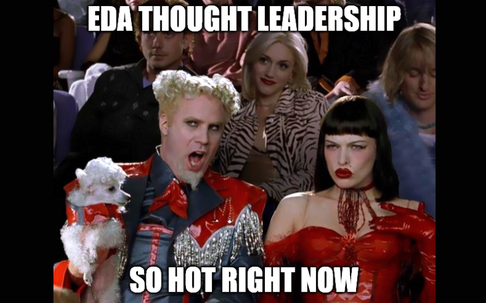

**I see a lot of new terms like [Command-Event](https://web.archive.org/web/20220816202019/https://developer.confluent.io/patterns/event/command-event/), [Event-Based Compute]( https://www.alexdebrie.com/posts/event-driven-vs-event-based/), etc., presented around Event-Driven Architecture. Let me clear that up because there are no such things.**

The real split is Event-Driven Architecture vs Messaging.

**Event-Driven Architecture (_EDA_) is about the logical composition of our workflow.** We're using events as the glue checkpoints of our workflow. 

Contrary to the traditional approach, we focus on verbs instead of nouns. So behaviours in our systems, interactions between them, reactions about new information and data in motion.

**Events are excellent workflow facilitators.** They represent facts on what has happened. We're inverting the classical flow; instead of requesting everything, we're notifying all interested parties. Then others can react and publish new information through events. [That helps to build decoupled and autonomous components](/en/how_events_can_help_on_making_state_based_approach_efficient/).

**Events are messages, but they're not the only message type. The second most important is _command_. They differ by intention.** I wrote about it longer in [What's the difference between a command and an event?](/en/whats_the_difference_between_event_and_command/). TLDR:

A command is an intent to do something. It's directed, and the handler may reject it.

Events are facts; they can (and should) have multiple receivers. Yet, the event producers shouldn't assume getting a response. 

**Understanding this split is essential for proper workflow composition.** As much as we'd like our flow to be fire and forget, sometimes we need to have an explicit request to do something. Suppose we model workflow so that we always expect a particular event back as a follow-up. Is our event really broadcasted information or just an implicit command?

**Events and commands do not differ by definition in terms of how they're delivered, whether synchronous or asynchronous.** The difference is in intention. The event doesn't have to be asynchronous or use tooling like Kafka, Rabbit, SQS, etc. It's about the composition of our flows, modelling conversation and structuring our architecture. It's close to the [original Alan Kay's definition of Object Oriented Programming](https://wiki.c2.com/?AlanKaysDefinitionOfObjectOriented).

**Now, here we got to Messaging.** It's a set of patterns like Outbox, Inbox, Competing Consumers etc., focused on integration between our boundaries (modules, services etc.). 

**EDA and Messaging are different design perspectives.** With EDA, you're shaping your application's conceptual/logical split, interactions, and how the flow looks. 

Knowing what we'd like to achieve, we can go one layer down and define how to do it. For instance, how to achieve guarantees like at-least-once delivery, strict ordering, and idempotent handlers. That's Messaging; it tells how to handle communication efficiently and is part of the solution space. Yet it's still agnostic to a specific technical solution. We should select the messaging tooling based on the design and whether it supports the Messaging patterns we have chosen to fulfil it.

**The design flow should look like this:**
1. **WHAT?** Describe the business workflow and model it using Event-Driven Architecture. That includes communication flow between components, boundaries, etc. Great tools for that are [EventStorming](https://www.eventstorming.com/) and [Event Modeling](https://eventmodeling.org).
2. **HOW?** Design how to get guarantees and define the expected technical flow using Messaging patterns. They're already established; no need to reinvent the wheel. Gregor Hohpe curated most of them in [Enterprise Integration Patterns: Designing, Building, and Deploying Messaging Solutions](https://www.goodreads.com/book/show/85012.Enterprise_Integration_Patterns) 20 years ago.
3. **WITH.** Select messaging toolings like RabbitMQ, Kafka, SQS or others that match your requirements. As you see, this is the last phase and outcome of the previous steps. 

**Please do not mix them, or you'll end up with a hangover!**

If we flatten all that into a single perspective, we won't be able to do a proper design. Without shaping the proper APIs based on intentions, we'll end up with synchronous, direct communication but made implicitly in an asynchronous way. It is a nightmare to run on production as it's hard to trace the processes and reason what and why went wrong. That usually ends up as distributed monolith. It's a dark place with all cons of monolith and microservices but no pros.

**Still not convinced? Let's get back to asynchronous commands, then.**

Some people claim that they're not commands then but events. In my world, how we send commands between modules is part of technical design, so choosing our messaging patterns, tech stack and protocols.

If we're okay with in-proc handling, we can just use in-memory processing and call it a day.

If we have a distributed system (e.g., service-oriented architecture, Kubernetes, multiple instances for scaling needs, etc.), we may need better delivery guarantees to ensure that our state is consistent. We may need [Outbox Pattern](/en/outbox_inbox_patterns_and_delivery_guarantees_explained/) or use a durable messaging queue. 

**Still, that choice doesn't change the message semantics; the intention remains the same.** We can use [Request/Reply pattern](https://www.enterpriseintegrationpatterns.com/patterns/messaging/RequestReply.html) to get the result of the processing. All of the mature messaging toolings like [Wolverine](https://wolverine.netlify.app/guide/messaging/message-bus.html#request-reply), [NATS JetStream](https://docs.nats.io/using-nats/developer/sending/request_reply) or [NServiceBus](https://docs.particular.net/nservicebus/messaging/reply-to-a-message) provide that out of the box.

**So why we're getting terms like Command-Event, and Event-Based Compute?** Because some companies were pushing the EDA buzzwords, Messaging didn't sound sexy enough.

They didn't embrace semantics or teach their users existing patterns because the tooling didn't support them out of the box. But that doesn't change the fact that, eventually, their users need to understand that to succeed. 

Yet, if companies pushed all marketing into event-based terms ignoring existing patterns, how to tell now that they were wrong?

**The easiest is to reinvent the wheel and introduce new gibberish terms.**

**Curtain.**

So, as architects, developers, we should remember to differentiate patterns from implementations. Be critical of what we read.

That's why I want to highlight how it's important to break our design into multiple layers:
- logical,
- technical,
- implementation.

That also plays well with tools like [EventStorming](https://www.eventstorming.com/), [Event Modeling](https://eventmodeling.org) and the [C4 Model](https://c4model.com/). All of them embrace that we have and should be able to zoom in and out.

I know that it sounds like 4D Chess, but that's our role. We need to train our abstract and critical thinking, as [the magic is that there's no magic](/en/the_magic_is_that_there_is_no_magic/).

**Don't let the buzzwords and marketing fool you. Think for yourself, and question authorities.**

Cheers!

Oskar

p.s. **Ukraine is still under brutal Russian invasion. A lot of Ukrainian people are hurt, without shelter and need help.** You can help in various ways, for instance, directly helping refugees, spreading awareness, putting pressure on your local government or companies. You can also support Ukraine by donating e.g. to [Red Cross](https://www.icrc.org/en/donate/ukraine), [Ukraine humanitarian organisation](https://savelife.in.ua/en/donate/) or [donate Ambulances for Ukraine](https://www.gofundme.com/f/help-to-save-the-lives-of-civilians-in-a-war-zone).