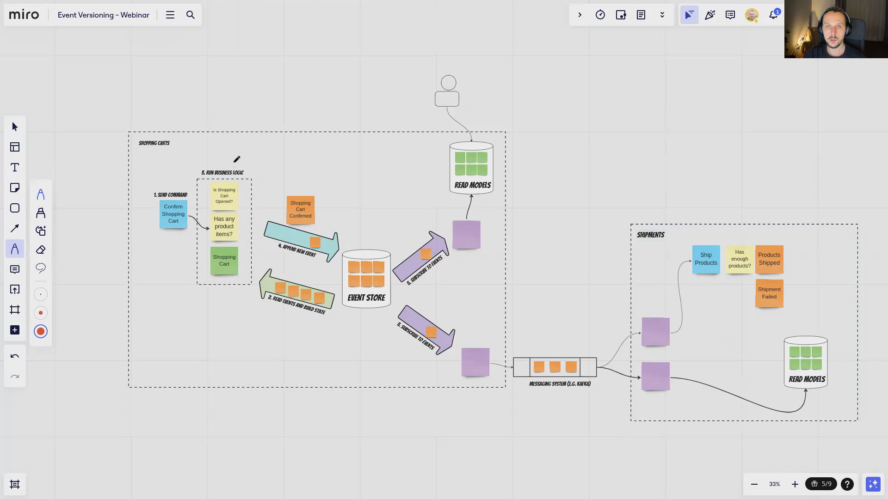

**JSON serialisation is so much fun. We can make jokes and curse, but we must live with it.** Surprisingly, that's not getting simpler if we use JavaScript or TypeScript. It may look simple as we have _JSON.parse_ and _JSON.stringify_ to make the mapping to text representation back and forth. That's correct until we use more advanced types.

**For JSON _Date_ and _BigInt_ are already too advanced.** Both are not defined in the [JSON standard](https://www.rfc-editor.org/rfc/rfc8259). Date will be serialised to string and BigInt? Will fail with error... What to do if we have such fields?

Let's say that we have the following type of definition [representing the Shopping Cart events](/pl/type_script_node_Js_event_sourcing/):

```typescript
type ShoppingCartEvent =
  | {
      type: 'ShoppingCartOpened';
      data: {
        shoppingCartId: string;
        clientId: string;
        openedAt: Date;
      };
    }
  | {
      type: 'ProductItemAddedToShoppingCart';
      data: {
        shoppingCartId: string;
        productItem: PricedProductItem;
      };
    }
  | {
      type: 'ProductItemRemovedFromShoppingCart';
      data: {
        shoppingCartId: string;
        productItem: PricedProductItem;
      };
    }
  | {
      type: 'ShoppingCartConfirmed';
      data: {
        shoppingCartId: string;
        confirmedAt: Date;
      };
    }
  | {
      type: 'ShoppingCartCanceled';
      data: {
        shoppingCartId: string;
        canceledAt: Date;
      };
    };
```

We'd like to have it typed and not need additional mapping in our business code. Still, based on what I wrote above, this will not (de)serialise correctly. What to do?

The first option is to define [explicit type representing serialised payload]().

```typescript
export type ShoppingCartEventPayload =
  | {
      type: 'ShoppingCartOpened';
      data: {
        shoppingCartId: string;
        clientId: string;
        openedAt: string;
      };
    }
  | {
      type: 'ProductItemAddedToShoppingCart';
      data: {
        shoppingCartId: string;
        productItem: PricedProductItem;
      };
    }
  | {
      type: 'ProductItemRemovedFromShoppingCart';
      data: {
        shoppingCartId: string;
        productItem: PricedProductItem;
      };
    }
  | {
      type: 'ShoppingCartConfirmed';
      data: {
        shoppingCartId: string;
        confirmedAt: string;
      };
    }
  | {
      type: 'ShoppingCartCanceled';
      data: {
        shoppingCartId: string;
        canceledAt: string;
      };
    };
```

Having it, we can define [explicit mapping](/pl/explicit_events_serialisation_in_event_sourcing/) like that:

```typescript
const ShoppingCartEventSerde = {
  serialize: ({ type, data }: ShoppingCartEvent): ShoppingCartEventPayload => {
    switch (type) {
      case 'ShoppingCartOpened': {
        return {
          type,
          data: { ...data, openedAt: data.openedAt.toISOString() },
        };
      }
      case 'ProductItemAddedToShoppingCart': {
        return { type, data };
      }
      case 'ProductItemRemovedFromShoppingCart': {
        return { type, data };
      }
      case 'ShoppingCartConfirmed': {
        return {
          type,
          data: { ...data, confirmedAt: data.confirmedAt.toISOString() },
        };
      }
      case 'ShoppingCartCanceled': {
        return {
          type,
          data: { ...data, canceledAt: data.canceledAt.toISOString() },
        };
      }
    }
  },
  deserialize: ({
    type,
    data,
  }: ShoppingCartEventPayload): ShoppingCartEvent => {
    switch (type) {
      case 'ShoppingCartOpened': {
        return {
          type,
          data: { ...data, openedAt: new Date(data.openedAt) },
        };
      }
      case 'ProductItemAddedToShoppingCart': {
        return { type, data };
      }
      case 'ProductItemRemovedFromShoppingCart': {
        return { type, data };
      }
      case 'ShoppingCartConfirmed': {
        return {
          type,
          data: { ...data, confirmedAt: new Date(data.confirmedAt) },
        };
      }
      case 'ShoppingCartCanceled': {
        return {
          type,
          data: { ...data, canceledAt: new Date(data.canceledAt) },
        };
      }
    }
  },
};
```

And use it as:

```typescript
const serialisedJSON = JSON.stringify(ShoppingCartEventSerde.serialize(event));

const deserialised = ShoppingCartEventSerde.deserialize(JSON.parse(serialisedJSON));
```

It may sound redundant, but we could also use it for more advanced mapping, e.g. to [version our events](/pl/simple_events_versioning_patterns/) to keep backward compatibility. 

**This pattern is also helpful in more generic scenarios, like handling Web API payload parsing.**

What if you don't want to define a specific class but have it more generic? Not an issue. You can use the following parser:

```typescript
export const JSONParser = {
  stringify: <From, To = From>(
    value: From,
    options?: StringifyOptions<From, To>
  ) => {
    return JSON.stringify(
      options?.map ? options.map(value as MapperArgs<From, To>) : value,
      options?.replacer
    );
  },
  parse: <From, To = From>(
    text: string,
    options?: ParseOptions<From, To>
  ): To | undefined => {
    const parsed: unknown = JSON.parse(text, options?.reviver);

    if (options?.typeCheck && !options?.typeCheck<To>(parsed))
      throw new ParseError(text);

    return options?.map
      ? options.map(parsed as MapperArgs<From, To>)
      : (parsed as To | undefined);
  },
};
```

Plus some typing to make TypeScript happy:

```typescript
export type ParseOptions<From, To = From> = {
  reviver?: (key: string, value: unknown) => unknown;
  map?: Mapper<From, To>;
  typeCheck?: <To>(value: unknown) => value is To;
};

export type StringifyOptions<From, To = From> = {
  map?: Mapper<From, To>;
  replacer?: (key: string, value: unknown) => unknown
};
export class ParseError extends Error {
  constructor(text: string) {
    super(`Cannot parse! ${text}`);
  }
}

export type Mapper<From, To = From> =
  | ((value: unknown) => To)
  | ((value: Partial<From>) => To)
  | ((value: From) => To)
  | ((value: Partial<To>) => To)
  | ((value: To) => To)
  | ((value: Partial<To | From>) => To)
  | ((value: To | From) => To);

export type MapperArgs<From, To = From> = Partial<From> &
  From &
  Partial<To> &
  To;
```

It allows specifying additional mappers to map JSON back and forth, plus also [reviver](https://developer.mozilla.org/en-US/docs/Web/JavaScript/Reference/Global_Objects/JSON/parse#the_reviver_parameter) and [replacer](https://developer.mozilla.org/en-US/docs/Web/JavaScript/Reference/Global_Objects/JSON/stringify#the_replacer_parameter) methods to convert types automatically [to Date](https://stackoverflow.com/a/14509447) and [to BigInt](https://stackoverflow.com/a/69573383). In our case, that'd not need an addtional serde type. We could also inline mappings to support payload versioning strategies.

**Watch also more in the webinar:**



**And read in the versioning series:**
- [Simple patterns for events schema versioning](/pl/simple_events_versioning_patterns/)
- [How to (not) do the events versioning?](/pl/how_to_do_event_versioning/)
- [Mapping event type by convention](/pl/how_to_map_event_type_by_convention/)
- [Event Versioning with Marten](/pl/event_versioning_with_marten/)
- [Let's take care of ourselves! Thoughts on compatibility](/pl/lets_take_care_of_ourselves_thoughts_about_comptibility/)
- [Internal and external events, or how to design event-driven API](/pl/internal_external_events/)

Cheers!

Oskar

p.s. **Ukraine is still under brutal Russian invasion. A lot of Ukrainian people are hurt, without shelter and need help.** You can help in various ways, for instance, directly helping refugees, spreading awareness, putting pressure on your local government or companies. You can also support Ukraine by donating e.g. to [Red Cross](https://www.icrc.org/pl/donate/ukraine), [Ukraine humanitarian organisation](https://savelife.in.ua/pl/donate/) or [donate Ambulances for Ukraine](https://www.gofundme.com/f/help-to-save-the-lives-of-civilians-in-a-war-zone).