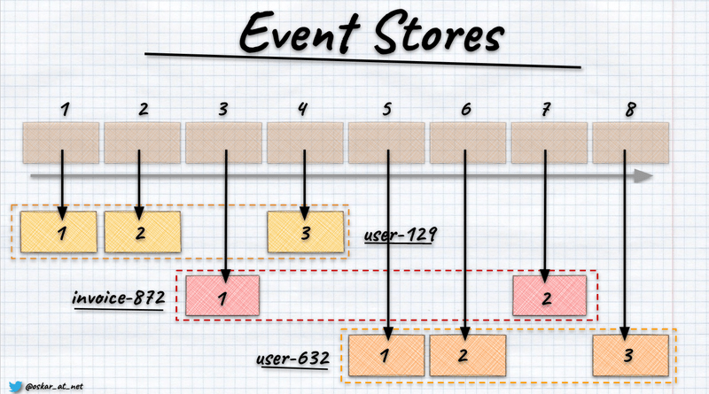
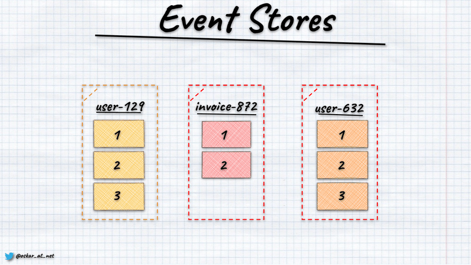

**Event stores are the foundational building block of Event Sourcing. They're also one of the biggest sources of confusion.** They are databases turned upside down, append-only logs. A new event always comes at the end of it.

**That's their power, but it also may be their weakness, especially in the eyes of the people at the first steps of their journey.** It's pretty easy to think that an append-only log is just a pipe; something comes in on one side and felling out eventually from the other. This sounds already awfully close to messaging, isn't it?

**Having immutable data can be beneficial for many use cases.** And here's the thing: correlation is not the same as causation. For messaging, immutability is a foundational aspect of guaranteeing that message won't be malformed in the transport; the less we do with it, the more performant solution we get. For the database, it means you won't have random updates, deadlocks and other stuff that are killing database performance.

**And I recently realised that even though event stores are implemented most of the time as global append-only logs technically, it's better to explain them as [key-value stores](/pl/key-value-stores/).** Why?

In event stores, the key is a record, and the value is an ordered list of events. In relational databases, records are called rows; in document databases: documents; in Event Sourcing, they're called streams.

If we realise that, then it's much more apparent!

## **Is event store a messaging tool?**

[Nope, it's a database, just like any other.](/pl/event_streaming_is_not_event_sourcing/) It has built-in notification capabilities about new events, but that's a perk, not the essence.

## **Is Event Sourcing performant as relational or document databases?**

They're in the same sense as denormalised documents with nested collections or as relational databases if you join data. If you consider the stream data as a list of events, they're as performant as the total size. Just like in the document databases, if you put too much in its data, then performance will degrade. Same if you eagerly load more data in relational databases.

## **What if streams get too long?**

If streams are the records, how many operations will you have, e.g. shopping cart? Of course, I'm not trying to downplay the issue. It exists. But it mostly comes from the fact that we don't apply the modelling techniques and don't include the lifetime aspect (e.g. accounting month instead of the whole account history or cashier shift instead of all transactions). Each databases types has its modelling techniques. We need to learn to use them effectively to optimise our usage. In Event Sourcing, [we should keep our streams short](https://www.youtube.com/watch?v=gG6DGmYKk4I).

## **Do we get strong guarantees?**

I mentioned to you that it's a key-value store, aye? So depending on the implementation, you should expect the same sort of guarantees as from the other databases: atomic writes, [optimistic concurrency](/pl/optimistic_concurrency_for_pessimistic_times/), reading your own writes, etc.

## **Should I share event store between microservices?**

Should you share a database between microservices?

## **Do I need to load all events, or can I use snapshots?**

If you're using MongoDB, are you loading the whole document before making your business decision or using a snapshot?

## **Is Event Sourcing a global architecture concept?**

Is document database a global architecture concept? Event Sourcing is focused on capturing business facts that happened in your system and using them to make new decisions and capture the new facts based on them. It's mostly focused on business logic and durability.

## **How do I publish events between microservices?**

We already agreed that it's not messaging tooling but a database. How do you publish events from a relational database? [Outbox](/pl/outbox_inbox_patterns_and_delivery_guarantees_explained/), CDC, etc. Event stores have built-in subscriptions, and you can use them to republish events forward, but logically it's no different from any other database type. Moreover, you should also [differentiate internal and external events](/pl/events_should_be_as_small_as_possible/) to avoid leaking abstractions. Sharing internal events with other services is just like sharing the database tables between them.

**You see where it's going. We can continue those discussions, but I hope you see that it's already liberating.** I think that assuming that, logically, event stores are a special type of key-value store makes reasoning much easier.  At least my tries to explain it like that in [my workshops](/pl/training/) seem to confirm my assumption.

What are your thoughts? Does such an explanation make it more accessible for you?

Cheers!

Oskar

p.s. Interested more on how event stores work internally? Read:
- [What if I told you that Relational Databases are in fact Event Stores?](/pl/relational_databases_are_event_stores/),
- [Let's build event store in one hour!](/pl/lets_build_event_store_in_one_hour/),
- [Unobvious things you need to know about key-value stores](/pl/key-value-stores/),
- [Let's talk about positions in event stores](/pl/lets_talk_about_positions_in_event_stores/).

p.s.2. **Ukraine is still under brutal Russian invasion. A lot of Ukrainian people are hurt, without shelter and need help.** You can help in various ways, for instance, directly helping refugees, spreading awareness, putting pressure on your local government or companies. You can also support Ukraine by donating e.g. to [Red Cross](https://www.icrc.org/en/donate/ukraine), [Ukraine humanitarian organisation](https://savelife.in.ua/en/donate/) or [donate Ambulances for Ukraine](https://www.gofundme.com/f/help-to-save-the-lives-of-civilians-in-a-war-zone).
