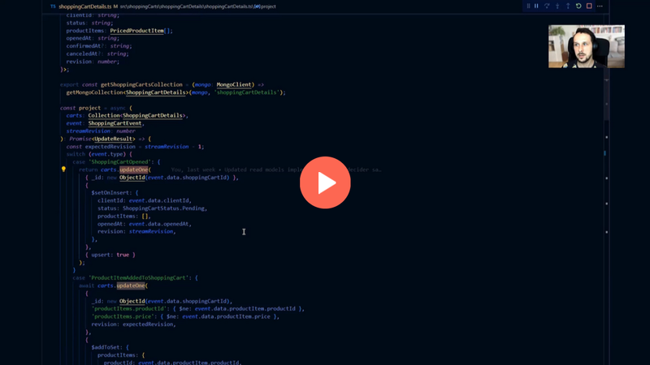

**[Projections in an event-driven world](/pl/projections_and_read_models_in_event_driven_architecture/) are a way to interpret registered events.** We can take a sequence of events and build from them read models in a predictable way. They're predictable so that they'll always generate the same result for the same logic and sequence of events. Still, it's never so easy regarding real usage and our colourful life. 

We could write projections so that they're always upserting the whole data. It could work in many cases, but if we want to make them performant and optimised, then we should benefit from the end storage capabilities. For instance, MongoDB provides a neat API for atomic partial updates. Why wouldn't we benefit from them? Yet, we also need to embrace that not all databases are giving us the guarantee that we'll immediately read our writes (e.g. MongoDB doesn't). Moreover, event-driven tools [give us at-least-once delivery guarantee](/pl/outbox_inbox_patterns_and_delivery_guarantees_explained/), meaning we might be processing events multiple times. 
I explained some challenges in [Dealing with Eventual Consistency and Idempotency in MongoDB projections](/pl/dealing_with_eventual_consistency_and_idempotency_in_mongodb_projections/).

So projection logic is predictable, but life, with its asynchronous nature, is difficult. We cannot blindly assume that our predictable logic will survive real-world chaos. We need to verify that.

**In software development, by verify, we usually mean testing, and that's what we will do today!** We'll use integration tests for that, as unit tests won't give us enough trust in the test results for the reasons I explained above.

**Let's say we're handling the simplified shopping cart scenario, known from my other articles.** We're registering facts about when it was opened, confirmed or cancelled and which products were added or removed from it. If we're handling it in Node.js, EventStoreDB and MongoDB, the projection code could look like that.

```typescript
export type ShoppingCartDetails = Readonly<{
  clientId: string;
  status: string;
  productItems: PricedProductItem[];
  openedAt: string;
  confirmedAt?: string;
  canceledAt?: string;
  revision: number;
}>;

export const ShoppingCartStatus = {
  Pending: 'Pending',
  Canceled: 'Canceled',
  Confirmed: 'Confirmed',
};

export const getShoppingCartsCollection = (mongo: MongoClient) =>
  getMongoCollection<ShoppingCartDetails>(mongo, 'shoppingCartDetails');

const project = async (
  carts: Collection<ShoppingCartDetails>,
  event: ShoppingCartEvent,
  streamRevision: number
): Promise<UpdateResult> => {
  const expectedRevision = streamRevision - 1;
  switch (event.type) {
    case 'ShoppingCartOpened': {
      return carts.updateOne(
        { _id: new ObjectId(event.data.shoppingCartId) },
        {
          $setOnInsert: {
            clientId: event.data.clientId,
            status: ShoppingCartStatus.Pending,
            productItems: [],
            openedAt: event.data.openedAt,
            revision: streamRevision,
          },
        },
        { upsert: true }
      );
    }
    case 'ProductItemAddedToShoppingCart': {
      await carts.updateOne(
        {
          _id: new ObjectId(event.data.shoppingCartId),
          'productItems.productId': { $ne: event.data.productItem.productId },
          'productItems.price': { $ne: event.data.productItem.price },
          revision: expectedRevision,
        },
        {
          $addToSet: {
            productItems: {
              productId: event.data.productItem.productId,
              quantity: 0,
              price: event.data.productItem.price,
            },
          },
        },
        {
          upsert: false,
        }
      );

      return carts.updateOne(
        {
          _id: new ObjectId(event.data.shoppingCartId),
          revision: expectedRevision,
        },
        {
          $inc: {
            'productItems.$[productItem].quantity':
              event.data.productItem.quantity,
            revision: 1,
          },
        },
        {
          arrayFilters: [
            {
              'productItem.productId': event.data.productItem.productId,
              'productItem.price': event.data.productItem.price,
            },
          ],
          upsert: false,
        }
      );
    }
    case 'ProductItemRemovedFromShoppingCart': {
      return carts.updateOne(
        {
          _id: new ObjectId(event.data.shoppingCartId),
          'productItems.productId': event.data.productItem.productId,
          revision: expectedRevision,
        },
        {
          $inc: {
            'productItems.$.quantity': -event.data.productItem.quantity,
            revision: 1,
          },
        },
        { upsert: false }
      );
    }
    case 'ShoppingCartConfirmed': {
      return carts.updateOne(
        {
          _id: new ObjectId(event.data.shoppingCartId),
          revision: expectedRevision,
        },
        {
          $set: {
            status: ShoppingCartStatus.Confirmed,
            confirmedAt: event.data.confirmedAt,
          },
          $inc: {
            revision: 1,
          },
        },
        { upsert: false }
      );
    }
    case 'ShoppingCartCanceled': {
      return carts.updateOne(
        {
          _id: new ObjectId(event.data.shoppingCartId),
          revision: expectedRevision,
        },
        {
          $set: {
            status: ShoppingCartStatus.Confirmed,
            canceledAt: event.data.canceledAt,
          },
          $inc: {
            revision: 1,
          },
        },
        { upsert: false }
      );
    }
    default: {
      const _: never = event;
      throw ShoppingCartErrors.UNKNOWN_EVENT_TYPE;
    }
  }
};

export const projectToShoppingCartDetails =
  (mongo: MongoClient) =>
  (resolvedEvent: SubscriptionResolvedEvent): Promise<UpdateResult> => {
    if (
      resolvedEvent.event === undefined ||
      !isCashierShoppingCartEvent(resolvedEvent.event)
    )
      return Promise.resolve(EmptyUpdateResult);

    const { event } = resolvedEvent;
    const streamRevision = Number(event.revision);
    const shoppingCarts = getShoppingCartsCollection(mongo);

    return project(shoppingCarts, event, streamRevision);
  };
```

We're explicitly applying the changes from events and building the shopping cart details read model using MongoDB API. We're also handling eventual consistency and idempotency as explained [in another article](/pl/dealing_with_eventual_consistency_and_idempotency_in_mongodb_projections/).

**I explained in [Testing business logic in Event Sourcing, and beyond!](/pl/testing_event_sourcing/) that the best way to test event-driven software is to assume that the source of truth comes from events. That means:**
1. **Given** a sequence of events.
2. **When** logic was run.
3. **Then** we got a new result or failure.

This pattern will also apply to our case, as read models are always built from events; we'll call the predictable projection logic and get the expected read model state as a result or no change if the event was already handled.

Our tests could look as follows:

```typescript
describe('Shopping Cart details', () => {
  let mongo: MongoClient;
  let given: Spec<ShoppingCartEvent, ShoppingCartDetails>;

  beforeAll(async () => {
    const mongoContainer = await new MongoDBContainer().start();
    console.log(mongoContainer.getConnectionString());
    mongo = mongoContainer.getClient();
    await mongo.connect();

    given = Spec.for(
      getShoppingCartsCollection(mongo),
      projectToShoppingCartDetails(mongo)
    );
  });

  afterAll(async () => {
    if (mongo) await mongo.close();
  });

  describe('On ShoppingCartOpened event', () => {
    it('should set up an empty shopping cart', async () => {
      const shoppingCartId: string = mongoObjectId();
      const clientId = mongoObjectId();
      const openedAt = new Date().toISOString();

      await given()
        .when({
          type: 'ShoppingCartOpened',
          data: {
            shoppingCartId,
            clientId,
            openedAt,
          },
        })
        .then(shoppingCartId, {
          clientId,
          revision: 0,
          openedAt,
          status: ShoppingCartStatus.Pending,
          productItems: [],
        });
    });

    it('should be idempotent if run twice', async () => {
      const shoppingCartId: string = mongoObjectId();
      const clientId = mongoObjectId();
      const openedAt = new Date().toISOString();

      const shoppingCartOpened: ShoppingCartEvent = {
        type: 'ShoppingCartOpened',
        data: {
          shoppingCartId,
          clientId,
          openedAt,
        },
      };

      await given(shoppingCartOpened)
        .when({ event: shoppingCartOpened, revision: 0n })
        .thenNotUpdated();
    });
  });

  describe('On ProductItemAddedToShoppingCart event', () => {
    it('should add product item to items list', async () => {
      const shoppingCartId: string = mongoObjectId();
      const clientId = mongoObjectId();
      const openedAt = new Date().toISOString();

      const productItem: PricedProductItem = {
        productId: mongoObjectId(),
        quantity: 2,
        price: 123,
      };

      await given(opened({ shoppingCartId, clientId, openedAt }))
        .when({
          type: 'ProductItemAddedToShoppingCart',
          data: {
            shoppingCartId,
            productItem,
          },
        })
        .then(shoppingCartId, {
          clientId,
          revision: 1,
          openedAt,
          status: ShoppingCartStatus.Pending,
          productItems: [productItem],
        });
    });

    it('should be idempotent if run twice', async () => {
      const shoppingCartId: string = mongoObjectId();

      const productItemAdded: ShoppingCartEvent = {
        type: 'ProductItemAddedToShoppingCart',
        data: {
          shoppingCartId,
          productItem: {
            productId: mongoObjectId(),
            quantity: 2,
            price: 123,
          },
        },
      };

      await given(opened({ shoppingCartId }), productItemAdded)
        .when({ event: productItemAdded, revision: 1n })
        .thenNotUpdated();
    });
  });

  describe('On ProductItemRemovedFromShoppingCart event', () => {
    it('should decrease existing product item quantity', async () => {
      const shoppingCartId: string = mongoObjectId();
      const clientId = mongoObjectId();
      const openedAt = new Date().toISOString();

      const productId = mongoObjectId();
      const price = 123;
      const initialQuantity = 20;
      const removedQuantity = 9;

      await given(
        opened({ shoppingCartId, clientId, openedAt }),
        productItemAdded(shoppingCartId, {
          productId,
          quantity: initialQuantity,
          price,
        })
      )
        .when({
          type: 'ProductItemRemovedFromShoppingCart',
          data: {
            shoppingCartId,
            productItem: {
              productId,
              quantity: removedQuantity,
              price,
            },
          },
        })
        .then(shoppingCartId, {
          clientId,
          revision: 2,
          openedAt,
          status: ShoppingCartStatus.Pending,
          productItems: [
            {
              productId,
              quantity: initialQuantity - removedQuantity,
              price,
            },
          ],
        });
    });

    it('should be idempotent if run twice', async () => {
      const shoppingCartId: string = mongoObjectId();

      const productId = mongoObjectId();
      const price = 123;
      const initialQuantity = 20;
      const removedQuantity = 9;

      const productItemRemoved: ShoppingCartEvent = {
        type: 'ProductItemRemovedFromShoppingCart',
        data: {
          shoppingCartId,
          productItem: {
            productId,
            quantity: removedQuantity,
            price,
          },
        },
      };

      await given(
        opened({ shoppingCartId }),
        productItemAdded(shoppingCartId, {
          productId,
          quantity: initialQuantity,
          price,
        }),
        productItemRemoved
      )
        .when({ event: productItemRemoved, revision: 2n })
        .thenNotUpdated();
    });
  });
});

const opened = ({
  shoppingCartId,
  clientId,
  openedAt,
}: {
  shoppingCartId?: string;
  clientId?: string;
  openedAt?: string;
}): ShoppingCartEvent => {
  return {
    type: 'ShoppingCartOpened',
    data: {
      shoppingCartId: shoppingCartId ?? mongoObjectId(),
      clientId: clientId ?? mongoObjectId(),
      openedAt: openedAt ?? new Date().toISOString(),
    },
  };
};

const productItemAdded = (
  shoppingCartId: string,
  productItem: PricedProductItem
): ShoppingCartEvent => {
  return {
    type: 'ProductItemAddedToShoppingCart',
    data: {
      shoppingCartId,
      productItem,
    },
  };
};
```

You for sure noticed the pattern:

```typescript
 
await given(
  opened({ shoppingCartId, clientId, openedAt }),
  productItemAdded(shoppingCartId, {
    productId,
    quantity: initialQuantity,
    price,
  })
)
  .when({
    type: 'ProductItemRemovedFromShoppingCart',
    data: {
      shoppingCartId,
      productItem: {
        productId,
        quantity: removedQuantity,
        price,
      },
    },
  })
  .then(shoppingCartId, {
    clientId,
    revision: 2,
    openedAt,
    status: ShoppingCartStatus.Pending,
    productItems: [
      {
        productId,
        quantity: initialQuantity - removedQuantity,
        price,
      },
    ],
  });
```

**And maybe thinking about what testing framework gives me such syntax. The answer is none; I just wrote it on my own. How?**

```typescript
type HasRevisionOrPosition = { revision: number } | { position: number | Long };
type DocumentWithRevisionOrPosition = Document & HasRevisionOrPosition;

type EventWithMetadata<E> = { event: E; revision?: bigint; position?: bigint };

export type Spec<
  E extends Event,
  Doc extends DocumentWithRevisionOrPosition = DocumentWithRevisionOrPosition
> = (...givenEvents: (E | EventWithMetadata<E>)[]) => {
  when: (...events: (E | EventWithMetadata<E>)[]) => {
    then: (id: string, expected: Doc) => Promise<void>;
    thenUpdated: (times: number) => Promise<void>;
    thenNotUpdated: () => Promise<void>;
  };
};

export const Spec = {
  for: <
    E extends Event,
    Doc extends DocumentWithRevisionOrPosition = DocumentWithRevisionOrPosition
  >(
    collection: Collection<Doc>,
    project: (event: SubscriptionResolvedEvent) => Promise<UpdateResult>
  ): Spec<E, Doc> => {
    {
      return (...givenEvents: (E | EventWithMetadata<E>)[]) => {
        return {
          when: (...events: (E | EventWithMetadata<E>)[]) => {
            const allEvents = [...givenEvents, ...events];

            const run = async () => {
              let position = 0n;
              let changesCount = 0;
              let acknowledgementCount = 0;

              for (const event of allEvents) {
                const options = {
                  position:
                    'position' in event && typeof event.position === 'bigint'
                      ? event.position
                      : position,
                  revision:
                    'revision' in event && typeof event.revision === 'bigint'
                      ? event.revision
                      : position,
                };

                const projectedEvent = toSubscriptionEvent(
                  'event' in event ? event.event : event,
                  options
                );

                const result = await project(projectedEvent);

                changesCount += result.upsertedCount + result.modifiedCount;
                acknowledgementCount += result.acknowledged ? 1 : 0;

                position++;
              }

              expect(acknowledgementCount).toBe(allEvents.length);

              return { changesCount };
            };

            const thenUpdated = async (times: number): Promise<void> => {
              const { changesCount } = await run();

              expect(changesCount - givenEvents.length).toBe(times);
            };

            return {
              thenUpdated,
              thenNotUpdated: () => {
                return thenUpdated(0);
              },
              then: async (id: string, expected: Doc) => {
                await thenUpdated(events.length);

                return assertUpdated(collection, id, expected);
              },
            };
          },
        };
      };
    }
  },
};

const assertUpdated = async <Doc extends DocumentWithRevisionOrPosition>(
  collection: Collection<Doc>,
  id: string,
  expected: Doc
) => {
  const objectId = new ObjectId(id);

  // Yes, MongoDB typings are far from perfect...
  const filter = {
    // filter by id
    _id: new ObjectId(objectId),
    // ensure that we got document at expected revision or position
    ...('revision' in expected
      ? { revision: expected.revision as number }
      : {}),
    ...('position' in expected
      ? { position: Long.fromBigInt(expected.position as bigint) }
      : {}),
  } as unknown as Filter<Doc>;

  const item = await retryIfNotFound(() => collection.findOne(filter));

  expect(item).toStrictEqual({ ...expected, _id: objectId });
};

const toSubscriptionEvent = <E extends Event>(
  event: E,
  options: { position: bigint; revision: bigint }
): SubscriptionResolvedEvent => {
  return {
    subscriptionId: mongoObjectId(),
    event: {
      ...event,
      revision: options.revision,
      position: { commit: options.position, prepare: options.position },
    } as unknown as AllStreamRecordedEvent,
  };
};
```

Only 130 lines, but a lot is happening. I'm building the test scenario using [Specification pattern](https://en.wikipedia.org/wiki/Specification_pattern).

When a method takes a sequence of events, as I expect to handle idempotency checks and verify updates based on the event position reflected in the read model data, I assume it is passed through event metadata. If my subscription is to a specific stream, then I'll use stream revision, and if I'm subscribing to all events, then I'll use global position (read more in [Let's talk about positions in event stores](/pl/lets_talk_about_positions_in_event_stores/).

The test specification is getting the projection logic, also called initially on the events we passed through the setup. Then for the event we want to verify. Of course, we could pass the specific read model state as test input. It would make setup a bit faster, but if we always use events, we'll always test real scenarios generated by projection. As always, pick your poison.

As MongoDB is eventually consistent, we might need to retry our reads multiple times until changes are applied; we're using the _retryIfNotFound_ for that.

As you see, there is not a lot of code and not much fancy stuff. As long as we know what may happen and what we need to verify, it's not a lot of work to ensure it. 

**If this description is not thorough enough, check the full webinar [Design and test Event-Driven projections and read models](https://www.architecture-weekly.com/p/webinar-7-design-and-test-event-driven) I made for Architecture Weekly subscribers.**

[](https://www.architecture-weekly.com/p/webinar-7-design-and-test-event-driven)

Check the complete code in [my sample repository](https://github.com/oskardudycz/EventSourcing.NodeJS/tree/main/samples/decider/src/shoppingCarts/shoppingCartDetails). 

Cheers! 

Oskar

p.s. **Ukraine is still under brutal Russian invasion. A lot of Ukrainian people are hurt, without shelter and need help.** You can help in various ways, for instance, directly helping refugees, spreading awareness, putting pressure on your local government or companies. You can also support Ukraine by donating e.g. to [Red Cross](https://www.icrc.org/en/donate/ukraine), [Ukraine humanitarian organisation](https://savelife.in.ua/en/donate/) or [donate Ambulances for Ukraine](https://www.gofundme.com/f/help-to-save-the-lives-of-civilians-in-a-war-zone).
