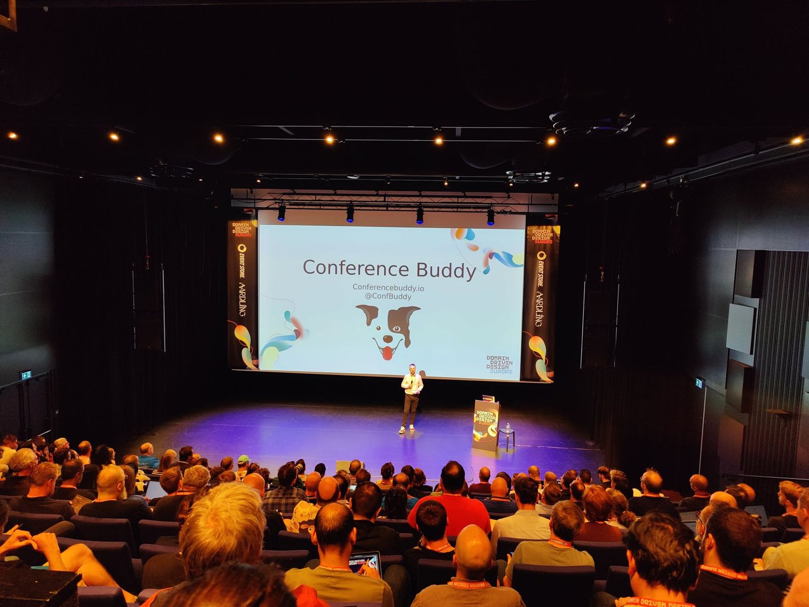
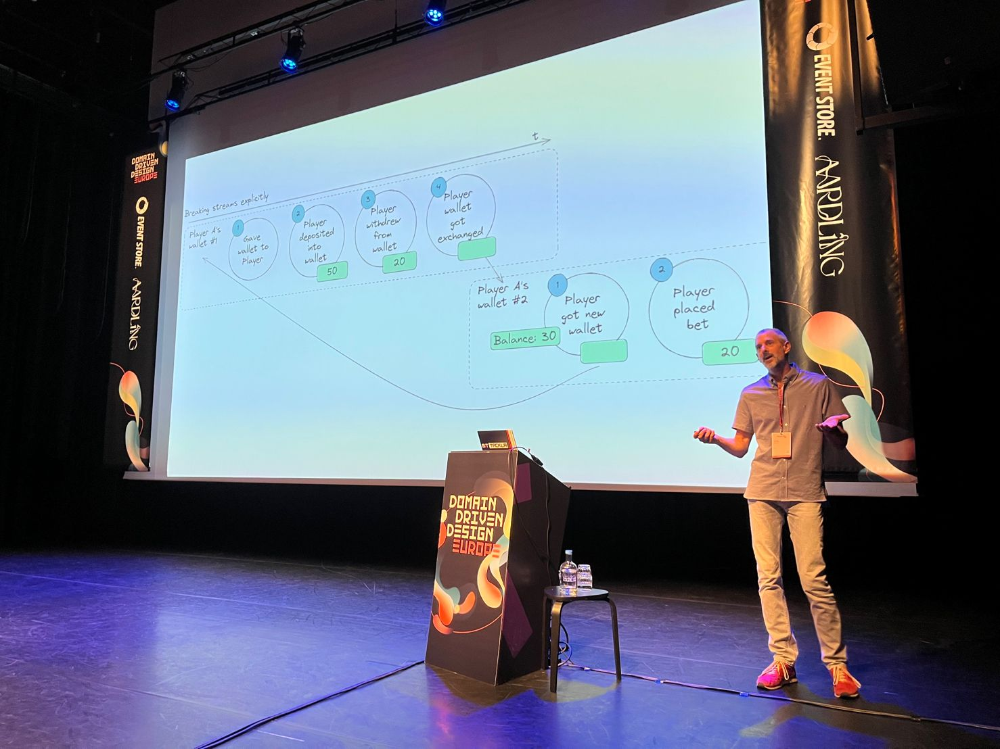
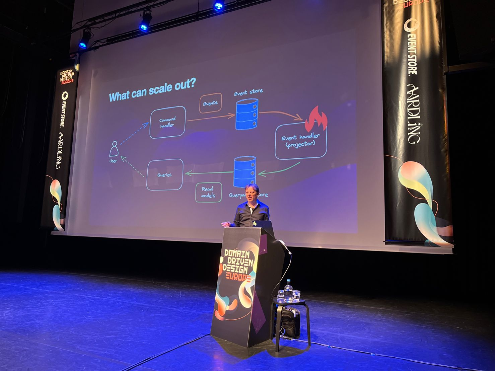
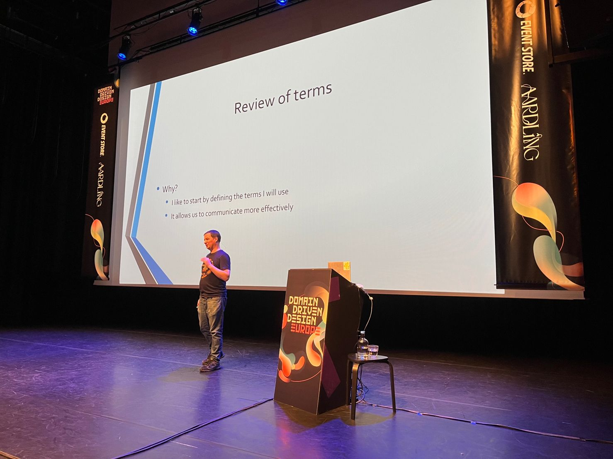
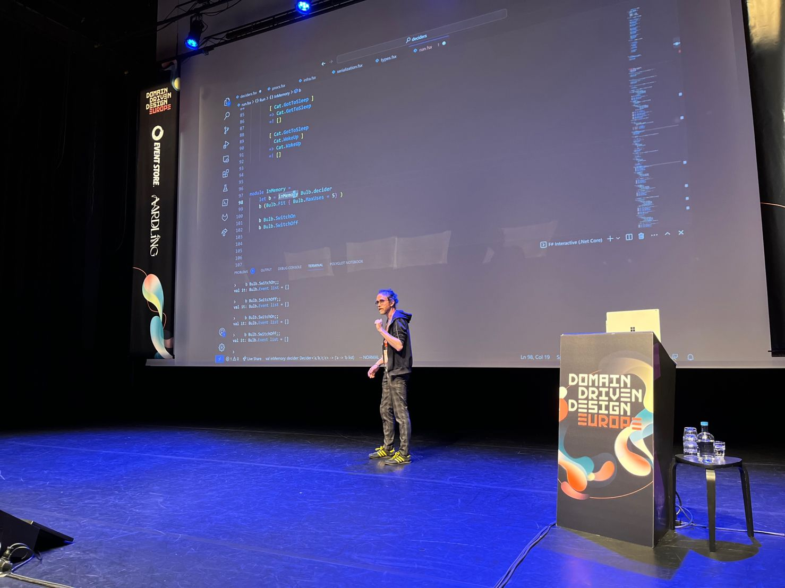
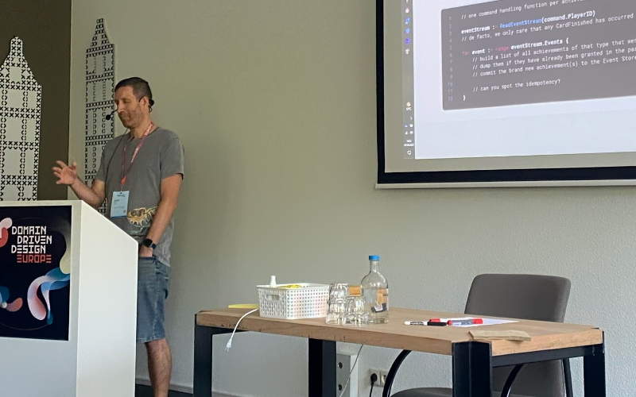
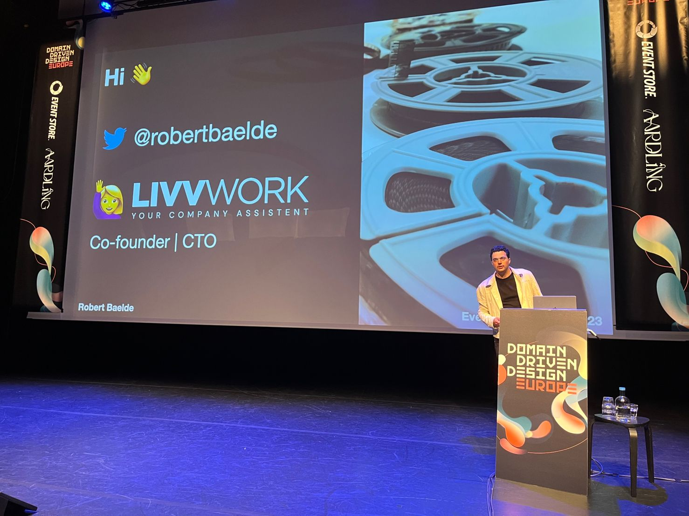
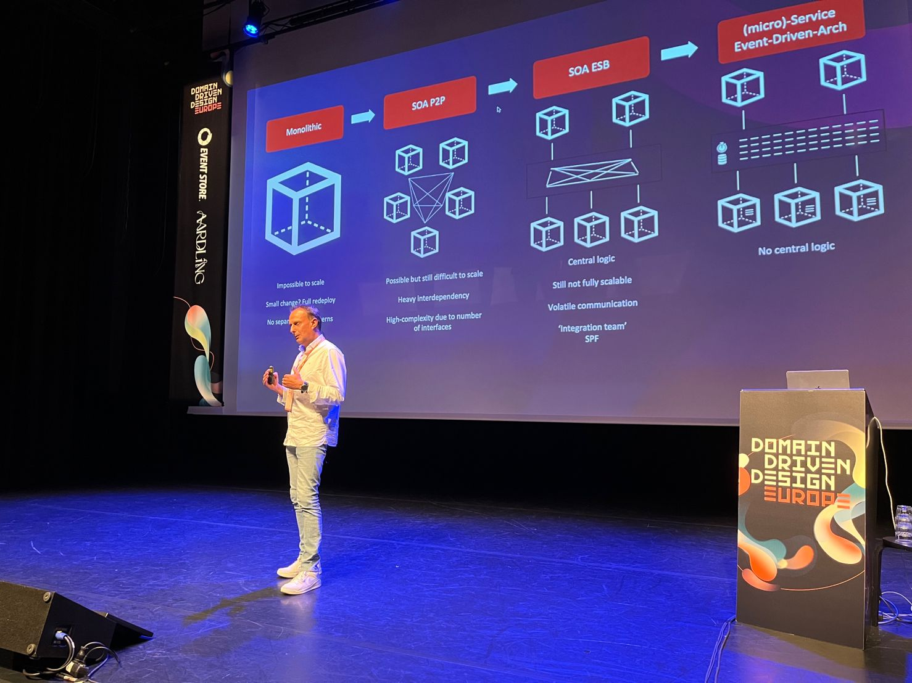
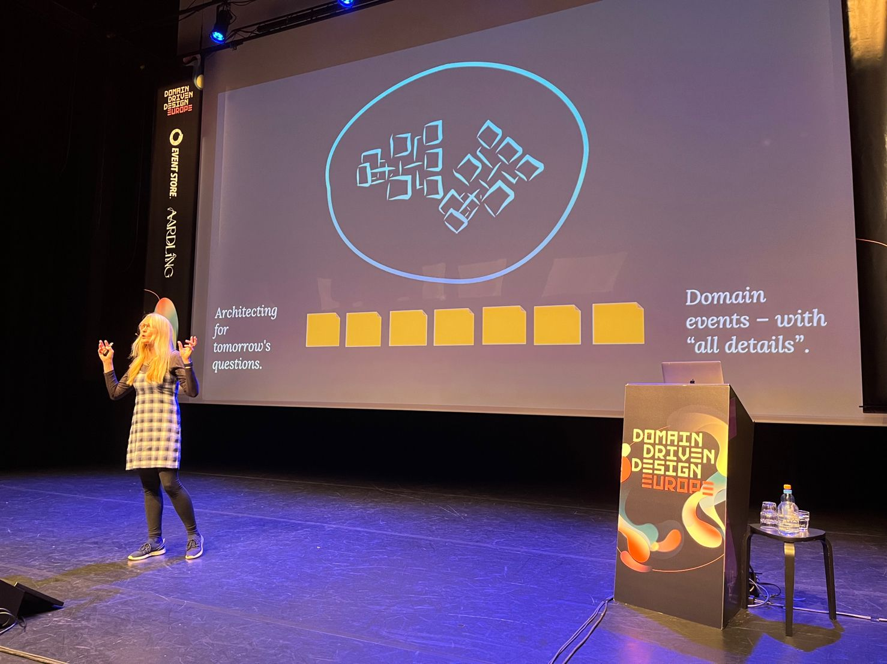

**[InfoQ claims](https://www.infoq.com/articles/architecture-trends-2023/) that Event Sourcing is in the _late majority_ adoption phase.** That means that if you haven't started to use it, you better start doing it, as you're not innovative and lagging behind. Is that true?

**I think that's too optimistic; we're not there yet.** Still, I believe that's one of the emerging concepts that can change how we build our software. From my observation, it's boiling under the surface. One of the reasons [why I decided to go solo](/en/leaving_event_store/) was that I got workshops and consulting requests, even though I didn't advertise them. Of course, I'm part of the bubble, but trying to look realistically at it.

**Event Sourcing passed the hype cycle.** [Some people failed to use it and were loud about it](/en/event_streaming_is_not_event_sourcing). Some were quieter about their failures because they learned from them and recovered. For many years, we had a shortage of practical resources about Event Sourcing; that's one of the reasons why I started to build my [samples](https://github.com/oskardudycz/) and [self-paced kits](/en/introduction_to_event_sourcing/) and write on [this blog](/en/category/#eventsourcing). Right now, tooling matured, and we have already established patterns. Wild-wild west times are over. In that regard, InfoQ is right.

**Half a year ago, [I invited](/en/share_your_story_on_event_sourcing_live/) the community to share their journey at the Event Sourcing Live conference.** I wrote:

> We want to prove that Event Sourcing is a highly practical pattern and show its real-world usage during the Event Sourcing Live Conference. We want to learn about both big successes adopting it and horror stories. Your stories.

And people accepted the challenge!

Event Sourcing Live is the only conference focused on the Event Sourcing pattern and a spin-off of [Domain Driven Design Europe](https://2023.dddeurope.com/). We had the third edition of it. It was an honour for me to be invited by [Mathias Verraes](https://verraes.net/) to be this year's line-up curator.

**The goal was to show that Event Sourcing is practical and pragmatic.** We wanted to make it more hands-on, giving the space to show the tech stack. We encouraged speakers that they could (and should!) go down the rabbit hole. We also assumed that the audience should be familiar with the basics, so speakers don't have to repeat the introduction stuff, like what's an event, what's projection and how to build a state from events. See:

`youtube: https://www.youtube.com/watch?v=vTTCQ3-ZK1c`

So if you were there and the introduction was missing, blame me, not the speakers.

**We started with a [talk by Yves Reynhout](https://2023.dddeurope.com/program/kiss/) showing that Event Sourcing can be simple if we keep it like that.** I'm happy that Yves came with this talk, and we intentionally put it as the first to make a clear stand. Event Sourcing is not complex, it's different, and if we try to keep it simple, our journey will be much smoother. Yves managed to go through the most common (mis)conceptions and explain them, busting the most common myths.

Still, we didn't want just to show the easy part. We also wanted to show the challenges, including technical ones! 

Event Sourcing and serverless. Still, most popular event stores are built in the traditional way, which doesn't allow an easy serverless model. Some people are trying to build event stores on DynamoDB and CosmosDB, but it's tricky, and those implementations are still so early in the journey that I couldn't recommend any of those tooling besides [Equinox](https://github.com/jet/equinox/).

**That's why I was thrilled that [Alexey Zimarev came up with the idea of talking about that](https://2023.dddeurope.com/program/event-sourcing-in-a-serverless-world/).** He managed to step by step with the considerations on running and operating serverless solutions with existing tooling. He also showed potential solutions to make that scalable on the example of [Eventuous connectors](https://eventuous.dev/docs/connector/). 

I promised you patterns. And with the definition of a pattern, [James Geall started his talk](https://2023.dddeurope.com/speakers/james-geall/). It was a wise move, as the process manager is one of the most misunderstood topics (see also more in [Saga and Process Manager - distributed processes in practice](/en/saga_process_manager_distributed_transactions/)). He neatly explained the importance of explicit business process modelling and how to manage workflows without hair loss. James also explained how to compose that with business logic and where to draw a line of responsibility. He also made us mind-boggled with (un)intentional mixture of colours of the event modelling sticky notes. 

**The next talk took us forward with those ideas. [Jérémie Chassaing showed us](https://2023.dddeurope.com/program/aggregates-composition-a-new-view-on-aggregates/) how to compose business logic and process managers using [the Decider pattern](https://thinkbeforecoding.com/post/2021/12/17/functional-event-sourcing-decider).** A lot of code, 100% hands-on mode and real examples. I can say that I'm under the huge influence of the Decider pattern (see, e.g. in [How to effectively compose your business logic](/en/how_to_effectively_compose_your_business_logic/)). If you haven't checked it yet, [try it on your own](https://github.com/thinkbeforecoding/dddeu-2023-deciders).

**[I wrote that I had to choose the killer feature of Event Sourcing, I’d select projections.](/en/projections_and_read_models_in_event_driven_architecture/).** They're great not only because they allow building customised read models from stored events. They allow decreasing in the cognitive load of the development process. We can break it down into two phases: capturing business facts and interpreting them. 

**[Robert Baelde](https://2023.dddeurope.com/program/zero-downtime-projections-replay/) and [Anton Stöckl](https://2023.dddeurope.com/program/projections-for-gamification-in-a-social-app/) showed us how to deal with projections.** 

Anton showed his journey and how to keep projection handling simple when you don't need to reach the ultimate scale. All of that was backed by his personal experience working on the internal gamification solution.

Robert explained the second-day issue: rebuilding our projections without system interruption. That's a complex part; we still don't have that out of the box in Marten, but it's one of our most important goals. That's also why I'm happy that Robert shared his heuristics and explained the hard parts with potential solutions. I was especially intrigued by the idea of the snapshots representing a partial phase of projection to speed up the rebuild. That's tricky, as it requires betting on when our interpretation can be stable enough, so we don't have to rebuild it but can increase performance a lot.

**One of the things that are too often missed while doing event-driven design is data governance practices.** We're taking things too lightweight. In some environments, it may work well, but for the bigger enterprises, that’s too optimistic if we want to use event-driven tools as a communication backbone.
 

**[Wim Debreuck explained](https://2023.dddeurope.com/program/event-driven-architecture-and-governance-in-action/) why and how we can and should think more responsibly about defining our event model.** He showed how to put our events in a broader context. He used Kafka as an example. Event Streaming is not the same as Event Sourcing, but both come from event-driven tooling, and many patterns are the same, and we can learn from each other. It’s essential to think about what should happen with the events we store, as it’s just the beginning of the journey.

**To close with the personal experience, we also had talks from Anita Kvamme and Łukasz Reszke. They shared insights and lessons learned from their real projects.**

[Łukasz had an intriguing journey](https://2023.dddeurope.com/speakers/lukasz-reszke/) moving from the .NET community to Ruby and joining a company that’s not only responsible for delivering software for clients but also maintaining their own event store and being one of the Event Sourcing promoters in the DDD space. 

[Anita showed](https://2023.dddeurope.com/program/event-sourcing-in-action-insights-from-two-real-life-projects/) that whether something is good or bad practice depends on context. She talked a lot about the challenges of implementing an event store on top of CosmosDB and design tradeoffs they took. I liked the pragmatic way of showing the thought process and the existence of the grey matter, e.g., splitting for [private and public events](/en/events_should_be_as_small_as_possible/) may also depend on the team structure. If we’re a single team, maybe we can take shortcuts. That may work if we’re making conscious, transparent decisions.

Let’s not forget about the friendly folks from Event Store. [Yves Lorphelin and Alexey Zimarev did a discussion panel](https://2023.dddeurope.com/program/sponsored-talk-beyond-the-hype-an-interactive-exploration-of-event-sourcing-and-eventstoredb/) during the main conference giving a chance to the community to ask questions and get answers. I enjoyed that primarily because it focused on the patterns and were not vendor specific.

**I'd like to thank all the speakers for bearing with my lame MC jokes and all the community that was there showing the power of Event Sourcing!**
 
All speakers did their best and delivered important content. If something was wrong, blame me, humble line-up curator.
 
Being the curator and MC was a big thing but also stressful for me. [I’m an introvert](/en/agile_vs_introverts/) that somehow managed to keep the stress on a leash when giving a talk, but that was a new experience. I was really stressed. This is an interesting thing, as I knew that no one would be focused on what I was doing, as speakers and their talks were the most important. Still, I guess we humans are selfish, and our brain tries to focus on ourselves. Still, I tried to make the show as fluid as possible so both audience and speakers liked it.
 
**The general feedback I got was positive.** Of course, some people said it was too much tech stuff, but we intended to show that Event Sourcing is a living thing and people are doing real things. Some said they would like more content about specifics of event modelling, and I take that, although the content is also dependent on the submissions. I hope we'll have more on that if we have the next edition.
 
Still, I saw that people enjoyed the versatility, hands-on and pragmatic talks. I also liked them a lot. Especially since the content showed many faces of Event Sourcing, and most importantly, had this personal touch and was closed to the real projects, without esoteric considerations.
 
When will the videos be available? I’m not sure, but I will update this article as soon as they are available. You can subscribe to [Architecture Weekly](https://www.architecture-weekly.com/), and I’ll definitely send an update there.
 
**Let me finish this article with my favourite quote from this edition of Event Sourcing Live. Anita Kvamme said:**
 
> Event Sourcing is architecting for tomorrow’s questions
 
Cheers!

Oskar

p.s. **Ukraine is still under brutal Russian invasion. A lot of Ukrainian people are hurt, without shelter and need help.** You can help in various ways, for instance, directly helping refugees, spreading awareness, putting pressure on your local government or companies. You can also support Ukraine by donating e.g. to [Red Cross](https://www.icrc.org/pl/donate/ukraine), [Ukraine humanitarian organisation](https://savelife.in.ua/pl/donate/) or [donate Ambulances for Ukraine](https://www.gofundme.com/f/help-to-save-the-lives-of-civilians-in-a-war-zone).
