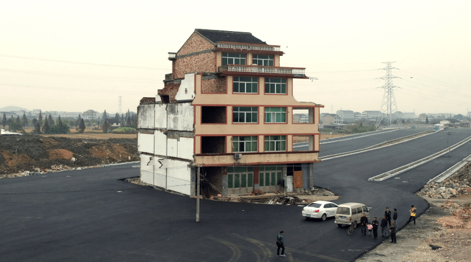

> A diverse system with multiple pathways and redundancies is more stable and less vulnerable to external shock than a uniform system with little diversity.

A single line from [Donella Meadows](https://en.wikipedia.org/wiki/Donella_Meadows) has so many dimensions. Rereading it yesterday made me think about our legacy software systems.

We should know to [never underestimate the value of working software](/en/chesterton_fence_and_software_architecture/), but why does it work even though it seems that no one should use it?

The architecture looks obsolete, and the code has more _[code smells](https://en.wikipedia.org/wiki/Code_smell)_ than the properly written places. We're afraid to make a change, but somehow we manage to patch it again. Our deployment doesn't look like a slam dunk but more like a [euro step](https://www.youtube.com/watch?v=1_uuArb_bho). 

**Yet, somehow system still stands, and users are using it. Why?**

Gerald Weinberg said _"Things are the way they are because they got that way"._

The bad design may be both the weakness and power of the system. Weakness reveals in the inertia of changes and the power in the ability to keep it still going.

We for sure heard the comment _just add one more IF_. That's tempting, right? It can be a quick win to solve the issue, yet, it may also be a quick loss, making it harder to investigate the root cause. But hey! Maybe we won't need to be doing but our accessor?

That sounds bad, of course, but it's undeniable that multiple people touching the same codebase are creating a code that no single one couldn't come up with. That may end up in a sticky amalgamate. But it can also end up with diverse defensive programming guarding us against all the various weird edge cases we faced during our system lifetime.

**That's quite similar to [Barry O'Reilly's Residuality Theory](https://www.youtube.com/watch?v=MZytZW_k-9Y).** What we see in our code are residuals. The code and design pieces somehow survived all the years of being tackled by the stressors from the outside world and our internal organisation changes. They adapted.

**In our industry, [maintainability](https://en.wikipedia.org/wiki/Maintainability) is pictured as an ultimate goal, but should it be like that?** Let me tell you a short story.

[I'm a huge proponent of recording architecture decisions.](/en/how_to_successfully_do_documentation_without_maintenance_burden/) In one of my last projects, we had a sophisticated decision-making process. We wanted to make stuff right, have a log of our decisions and be fully transparent. While working on a new design or updating the existing one, each team should provide an [RFC-like](https://en.wikipedia.org/wiki/Request_for_Comments) document and go through the _design review_ process. 

**The Design Review process requires internal approval from the team and then at least two more from people from the other teams.** The intention was to have an immutable log for design changes, increase transparency and get cross-team collaboration and knowledge sharing. Also, to increase the diversity of views. Sounds right?

That description sounds simple, but of course, we faced issues in applying that. They're a story on their own, but we eventually got an overall sound quality of the design decisions. Such designs would end up in maintainable software.

**Still, looking back, I'm unsure if having such a process was the correct decision for us. Why?**

We wanted to build a new cloud version of the on-premise legacy system. We were not doing lift'n'shift; we wanted to build a new product based on the old one. That's a challenge, as you want to take good experience from the old one and avoid repeating past mistakes. And there's a tricky part in that. 

If you're too focused on past mistakes, you may increase the likelihood of the new one. Or you may be so defensive that you'll limit yourself and not go fast enough.

**When you're rewriting your product, you're not rewriting it; you're creating a new one.** You should not assume that having your current knowledge and user base, you will repeat the good steps and avoid mishaps. We may fall into [the "it's just like..." fallacy](https://verraes.net/2021/05/its-just-like-heuristic/). If your past system survived years, you should not assume that the new one will get to that point. 

**Your system may never reach the phase where maintainability is essential.**

I do not like to move fast and break things. Our design review process was a good one, but not for us—a good one for an organisation of different maturity and context. In our case, we should think first about what we want to achieve and where we need to go to get to the place where our new business model is sustainable.

Maybe it'd be better just to let teams do what they wanted. Make them work closer with domain experts, iterate fast and get a feedback loop. They should still document their decisions and let them ask for help from other teams when they need to. [Shape the boundaries](/en/on_the_importance_of_shaping_the_boundaries_in_team_management/), and allow them to operate within them. Of course, that sounds like chaos, but it doesn't have to be. 

The critical thing here is to make teams accountable for their decisions. Let them fail and recover but face the consequences of bad choices. As long as we have a log of decision-making and constantly evaluating them, we can learn from them and survive.

**Getting back to the diversity mentioned by Donella Meadows.** We intended to increase the diversity of the decision-making, but by forcing all teams to fit the same process, we achieved the opposite. By that, we decreased the chance of our system to survive.

**What if we let teams do what they wanted, creating an unmaintainable mess but reaching adoption?** Then that'd be a decent problem to have. Jokes aside, how would I deal with that?

**I think that we should optimise not for maintainability but _removability_.** If our system is built in a way that we can relatively easy to remove pieces from it, then we can drop bad ideas and new with new ones. Also, by accident, we're getting a system that's easier to maintain.

[That's why I like CQRS.](/en/cqrs_facts_and_myths_explained/) By introducing business-focused vertical slices, we're allowing them to be diverse and easier to remove. Each slice can represent a different feature and be implemented differently (if needed). That increases the likelihood of surviving unpredictable scenarios and pivoting our product and design decisions. Of course, CQRS won't solve it all. I'm showing it as an example solution for a technical approach. 

**The most important is to ensure that our delivery process matches our product phase and organisation structure.** [Conway's law](https://en.wikipedia.org/wiki/Conway%27s_law), of course. We also should embrace that our business will evolve, the industry will change, and we need to continuously adapt our organisation and approach to changing reality.

Uber started with the attitude never to refactor but add new versions. Then they [pivoted to domain-oriented architecture](https://www.uber.com/en-PL/blog/microservice-architecture/). Amazon Prime started with a serverless approach, then they [centrailised part of their system into micro-services](https://www.primevideotech.com/video-streaming/scaling-up-the-prime-video-audio-video-monitoring-service-and-reducing-costs-by-90). And those are good examples of the evolutionary process.

**We're making the most significant decisions when we're dumbest.** We don't know our domain, and we don't know the tech stack, yet we're trying to guess the best option and present it as wise architecture decisions. We should embrace that we're not that smart and help ourselves to make mistakes and learn from them. The model way is not always the best approach for our current situation. 

**We should focus on survival and creating the design that enables that.** To achieve that, we must start simple and align our process with our current state of teams, organisation maturity, and knowledge about the product. Then try our system and our decisions in the wild to get feedback and see what's still standing. By that, we're increasing our knowledge about the client's needs and whether our system can fulfil them.

Such stimulation can help us increase diversity and build a system verified by real-world use cases. We won't have the same design we expected, but we'll have residuals that are much stronger than we'd come up with initially.

Cheers!

Oskar

p.s. Read also more on how [why are we afraid of our decisions](/en/why_are_we_afraid_of_our_decisions/) and the [risk of ignoring risks](/en/the_risk_of_ignoring_risks/).

p.s.2. **Ukraine is still under brutal Russian invasion. A lot of Ukrainian people are hurt, without shelter and need help.** You can help in various ways, for instance, directly helping refugees, spreading awareness, putting pressure on your local government or companies. You can also support Ukraine by donating e.g. to [Red Cross](https://www.icrc.org/pl/donate/ukraine), [Ukraine humanitarian organisation](https://savelife.in.ua/pl/donate/) or [donate Ambulances for Ukraine](https://www.gofundme.com/f/help-to-save-the-lives-of-civilians-in-a-war-zone).
