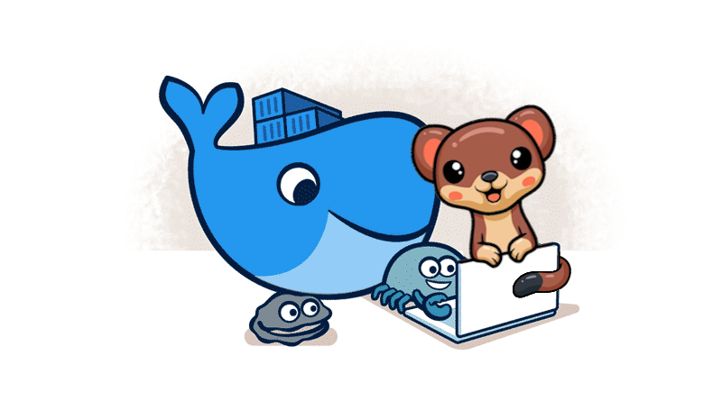

**Containerisation is something that pushed our industry much further.** Generating immutable artefacts is a foundational aspect of the DevOps process. It's much easier to troubleshoot, diagnose and catch earlier production issues. We can assume that no cowboy updates were involved.

I wrote already a few guides on this process:
- [How to build an optimal Docker image for your application?](/pl/how_to_buid_an_optimal_docker_image_for_your_application/)
- [How to build and push Docker image with GitHub actions?](/pl/how_to_buid_and_push_docker_image_with_github_actions/)
- [A few tricks on how to set up related Docker images with docker-compose](/pl/tricks_on_how_to_set_up_related_docker_images/).

Even though I'm mostly connected to the Event-Driven approach, they're one of the most read articles on my blog, proving its importance.

**I feel that the DevOps process in Event Sourcing tools is not appreciated enough; we talk too less about that, especially on the operations, continuous integration and delivery.** That may be a reason why this is still a niche. People are afraid of how to run such systems in production.

**Today, Let's bury this hole a bit and explain how to build a Docker image of the application running Marten as an event store.**

To run Marten on prod, you must have a Postgres database instance. Most of the cloud providers support them as managed services. You can run it on your own on Virtual Machine, on-premise or container. I'll assume that you have such.

You also need to have a deployment for your application running Marten, for instance, Kubernetes, a container-based, virtual machine running docker images. Choose what suits your case and your preferences. 

**Whatever that is, you'll need to build a container image. That config will need to include some of the Marten specifics. Which one?**

**In Marten, we're using code generation extensively.** It helps us to cut the number of allocations, as instead of using reflection a lot, and dictionary lookup, we're building the [Matryoshka doll model](https://en.wikipedia.org/wiki/Matryoshka_doll) on top of your code to optimise the performance and resiliency. 

Marten can generate code on the fly when you call it, which is helpful for the development phase, but may add overhead for regular usage, as it may increase _the cold start_ of the application code. For production, you'd like to cut all overhead. We understand that, so we allow you to pre-built generated code and use static code instead of doing it on the fly.

**You can [read about that in our docs](https://martendb.io/configuration/prebuilding.html), but in short, you need to do a few steps:**
1. Add [Marten.CommandLine NuGet package](https://martendb.io/configuration/cli.html) to your project:
```bash
dotnet add package Marten.CommandLine
```
2. Register Marten commands by adding the following lines to your code:
```csharp
var builder = WebApplication.CreateBuilder(args);

// add Marten
builder.Services.AddMarten();

builder.Host.ApplyOaktonExtensions();

var app = builder.Build

// has to be the last line and no app.Run is needed
return await app.RunOaktonCommands(args);
```
Marten internally is using [Oakton](https://jasperfx.github.io/oakton) for command line processing.

3. Then call from the command line:
```bash
dotnet run -- codegen write
```
4. You can also use the [Optimised Artifact Workflow](https://martendb.io/configuration/optimized_artifact_workflow.html). Which will set dynamic code generation for the Development environment and setup code generation for the Production:
```csharp
builder.Services.AddMarten()
    // Add this line to Marten config
    .OptimizeArtifactWorkflow(TypeLoadMode.Static);
```

If you configured everything correctly, your app is set up for Production usage. 

**Let's include that in the Dockerfile configuration. We'll use the optimised multistage build described in [previous article](/pl/how_to_buid_an_optimal_docker_image_for_your_application/).** We'll try to make it reusable and generic, so you can apply that easier to your project. We'll use [Docker to build arguments](https://docs.docker.com/build/guide/build-args/) to have configurable inputs for:
- .NET version,
- Project file name,
- whether to run code generation or not.

**Why would we not want to run always code generation for our Docker image?** We should always do it for deployment, but for [Development Containers](https://containers.dev/), we might want to skip that to reduce the built time.

Image definition could look as follows:

```dockerfile
ARG dotnet_version=8.0
########################################
#  First stage of multistage build
########################################
#  Use Build image with label `builder
########################################
FROM mcr.microsoft.com/dotnet/sdk:${dotnet_version}-alpine AS builder
# Project file name, mandatory parameter, e.g. Helpdesk.Api
ARG project_name
ARG run_codegen=true

# Setup working directory for project
WORKDIR /app

COPY ./${project_name}.csproj ./

# Restore nuget packages
RUN dotnet restore ./${project_name}.csproj

# Copy project files
COPY ./ ./

# Run code generation depending on the build argument
RUN if [ "${run_codegen}" = true ] ; then dotnet run -- codegen write & dotnet run -- codegen test; else echo "skipping code generation"; fi

# Build project with Release configuration
# and no restore, as we did it already
RUN dotnet build -c Release --no-restore ./${project_name}.csproj

# Publish project to output folder
# and no build, as we did it already
WORKDIR /app/
RUN ls
RUN dotnet publish -c Release --no-build -o out

########################################
#  Second stage of multistage build
########################################
#  Use other build image as the final one
#    that won't have source codes
########################################
FROM mcr.microsoft.com/dotnet/aspnet:${dotnet_version}-alpine
ARG project_name
ARG dotnet_version=8.0

# Setup working directory for project
WORKDIR /app

# Copy published in previous stage binaries
# from the `builder` image
COPY --from=builder /app/out .

# Set URL that App will be exposed
ENV ASPNETCORE_URLS="http://*:5000"
ENV PROJECT_DLL="${project_name}.dll"

# sets entry point command to automatically
# run application on `docker run`
ENTRYPOINT dotnet $PROJECT_DLL
```

You'd need to put it in the runtime project location and call it container build as:

```bash
docker build --build-arg project_name=Helpdesk.Api . -t helpdesk
```

Or with all parameters

```bash
docker build --build-arg project_name=Helpdesk.Api --build-arg codegen=true --build-arg dotnet_version=8.0 . -t helpdesk
```

**Beside the configurable input arguments, the Docker definition does one specific thing: pre-building generated code.** It has to go after project files are copied and dependencies, but **before the build.** Why? Because if we use static type load, the application will fail if no files are generated.

This is the line responsible for doing the code generation, together with a dry run test.

```dockerfile
RUN if [ "run_codegen" = true ] ; then dotnet run -- codegen write & dotnet run -- codegen test; else echo "skipping code generation"; fi
```

You can see all the changes in the [Pull Request](https://github.com/oskardudycz/EventSourcing.NetCore/pull/218) and play with the [full sample](https://github.com/oskardudycz/EventSourcing.NetCore/tree/main/Sample/Helpdesk) in my repository.

Once you build the image, you can also [push it to Container Registry](/pl/how_to_buid_and_push_docker_image_with_github_actions/)

I'm considering adding an option in our command line to generate such Dockerfile; feel free to share your thoughts and ideas for improvements!

Read also other articles around DevOps process:
- [A simple way to configure integration tests pipeline](/pl/configure_ci_for_integration_tests/)
- [How to build an optimal Docker image for your application?](/pl/how_to_buid_an_optimal_docker_image_for_your_application/)
- [A few tricks on how to set up related Docker images with docker-compose](/pl/tricks_on_how_to_set_up_related_docker_images/)
- [How to build and push Docker image with GitHub actions?](/pl/how_to_buid_and_push_docker_image_with_github_actions/)
- [How to configure a custom Test Container on the EventStoreDB example](/pl/custom_test_container_on_esdb_example/)
- [How to create a custom GitHub Action?](/pl/how_to_create_a_custom_github_action/)

Cheers!

Oskar

p.s. **Ukraine is still under brutal Russian invasion. A lot of Ukrainian people are hurt, without shelter and need help.** You can help in various ways, for instance, directly helping refugees, spreading awareness, putting pressure on your local government or companies. You can also support Ukraine by donating e.g. to [Red Cross](https://www.icrc.org/pl/donate/ukraine), [Ukraine humanitarian organisation](https://savelife.in.ua/pl/donate/) or [donate Ambulances for Ukraine](https://www.gofundme.com/f/help-to-save-the-lives-of-civilians-in-a-war-zone).
