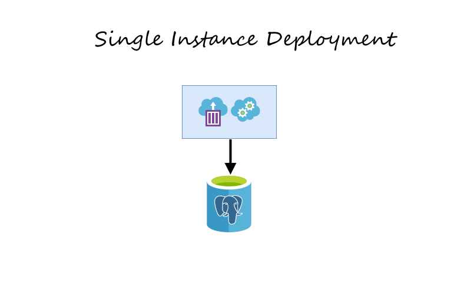
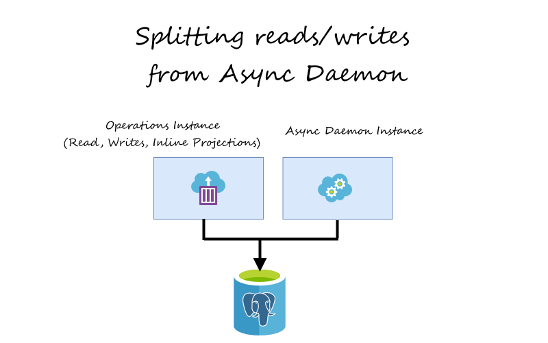
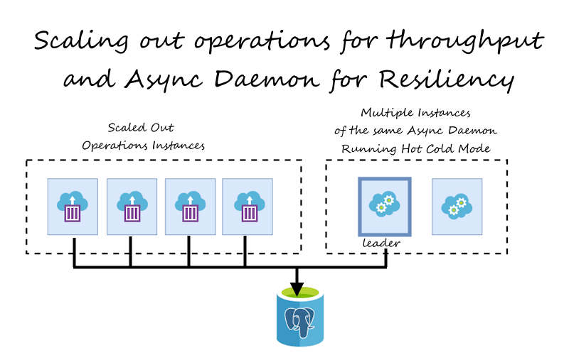
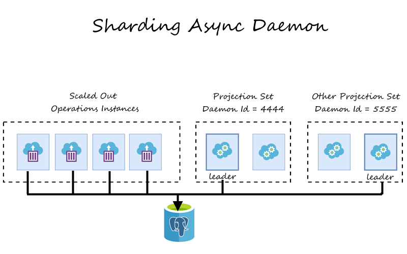

**If you are already a reader, you probably know already that I'm not so fond of the _Will it scale?_ question.** I believe that, too often, it's just a vague response if we don't like something.

**Still, I cannot deny that scaling is essential.** When choosing a tool, we need to understand its limits. That's a basis for [risk analysis](/pl/the_risk_of_ignoring_risks/) and understanding how far we can go with it, also in terms of reaching a bigger scale.

**Choosing a storage tool is an essential decision.** For primary usage, you must wage the performance of the reads and writes. That can be tricky, but it's doable. You need to think about the characteristics of the user behaviour and try to mimic that in the benchmarks. Run [synthetic tests simulating](/pl/i_tested_on_production/) production traffic and see if the performance is good enough. Better to do it for a longer time to see if there are no memory leaks or if performance degrades as time goes on. Having results, you need to verify if lags are related to your usage or the storage library per se. Then apply fixes, rinse, and repeat.

**We must also [choose the deployment model](/pl/how_to_cut_microservices/) and ensure our tool matches it.** And that's not only a technical decision; it should be made based on the product strategy. If our traffic will have peaks, or if we'd like to reduce the usage of resources in the early phases, serverless can be a good decision. If we aim to iterate quickly to get validation and expect rather constant traffic, then a monolith may be the right choice for you. If you know you'll have multiple teams; you want to invest in full autonomy, then microservices can be a decent option.

**What issues can our storage tool cause to each deployment model? For instance:**
- in serverless we cannot have stateful or constantly-running services, and it doesn't add a lot to the service startup,
- for the monolith, we need to ensure that it supports sharding or multi-tenancy for the single storage,
- for microservices, it can run safely with multiple clones of the same instance or newer/older versions simultaneously.

Of course, there's more, but those are the most important highlights.

**Ok, enough theory; let's check and evaluate Marten in those terms.** We'll use the [Helpdesk sample](https://github.com/oskardudycz/EventSourcing.NetCore/tree/main/Sample/Helpdesk) I presented in my NDC talk:

`youtube: https://www.youtube.com/watch?v=jnDchr5eabI`

It's a simple but decent starting point for a single-deployment service.

## Stateless usage

**One of the foundational things to scale services is to make them stateless.** If we have a temporary state (like logged-in user data, partial state of the process kept in memory, cache, etc.), we can safely replicate the instances running our service. Having such, we get more options, as we're not tied to any deployment style.

**Is Marten stateless?** Yes, if you're just doing reads and writes.

We don't keep anything in memory, we're using some caches to speed up things, but they're micro-optimisations and not the real stateful model (check [ImTools](https://github.com/dadhi/ImTools), they're great). We're also doing code generation that can happen either on-the-fly or statically upfront. But that's another performance optimisation. Check more in [my earlier article](/pl/marten_and_docker/) to learn how to get production setup.

So if your setup looks [like that](https://github.com/oskardudycz/EventSourcing.NetCore/blob/6e495d6d77215abe4729757f9d3644b15973e299/Sample/Helpdesk/Helpdesk.Api/Program.cs#L35):

```csharp
services
    .AddMarten(options =>
    {
        // (...)
        options.Connection(connectionString);

        options.UseDefaultSerialization(
            EnumStorage.AsString,
            nonPublicMembersStorage: NonPublicMembersStorage.All,
            serializerType: SerializerType.SystemTextJson
        );

        options.Projections.LiveStreamAggregation<Incident>();
        options.Projections.Add<IncidentDetailsProjection>(ProjectionLifecycle.Inline);
        options.Projections.Add<IncidentShortInfoProjection>(ProjectionLifecycle.Inline);
        options.Projections.Add<IncidentHistoryTransformation>(ProjectionLifecycle.Inline);
    })
    .OptimizeArtifactWorkflow(TypeLoadMode.Static)
    .UseLightweightSessions();
```

Then you're free to go. 

For sure, you noticed this line.

```csharp
options.Projections.Add<IncidentDetailsProjection>(ProjectionLifecycle.Inline);
````

Such lines are the registration of projections. Projections allow to build read models from appended events. They can be either _inline_ or _async_. Inline ones are evaluated in the same transaction as the appended event, async in the background process (read more in [Event-driven projections in Marten explained](/pl/projections_in_marten_explained/)).

As I registered all projections as inline, we're still stateless, as they will be _just_ changing more records in the database. Read models are stored as Marten documents.



We'll get to async projections and their impact soon.

## Serverless

There are a few things here. .NET, in general, is not an excellent match for serverless. It has a cold start issue related to virtual machine warm-up. Each .NET edition is trying to help in that .NET 8 will bring [Native AOT](https://learn.microsoft.com/en-us/dotnet/core/deploying/native-aot/?tabs=net7), but it's still not enough. Native AOT is still experimental, and even on .NET. 8, it lacks tree shaking, so the executable size will be big.

Marten doesn't support Native AOT yet (we will at some point), but I don’t see Marten being worse than other .NET solutions if you’re using pre-build types. So if you're considering .NET serverless and applied the [guidance around production setup](/pl/marten_and_docker/), Marten should do good for you. Or even better! Read more in [Jeremy's article Marten just got better for CQRS architectures](https://jeremydmiller.com/2022/05/31/marten-just-got-better-for-cqrs-architectures/utm_source=event_driven_io).

There’s one more thing here. If you’re afraid of cold starts, and you’d like to have lambdas/functions warm constantly, then you should consider whether serverless is a good hosting model. You’ll pay much more for constantly warm lambdas/functions than regular containerised or virtual machine deployments. Especially if you can them turn off at a defined time of the day or scale down, look for solutions like AWS Fargate or Azure Container Apps.

## Scaling async projections

**[Async Daemon](https://martendb.io/events/projections/async-daemon.html#async-projections-daemon) is the Marten subsystem responsible for processing projections asynchronously.** Technically, it's a  background process running as hosted service that processes events and stores results as read models. We recommend using it for more resource-demanding, multiple-stream projections, [storing results in other database types](/pl/projecting_from_marten_to_elasticsearch/) or [integration with other systems](/pl/integrating_Marten/).

**Technically, it's a sneaky service that polls events in batches for each projection type, runs projections simultaneously, [ensures resiliency and fault tolerance](https://martendb.io/events/projections/async-daemon.html#error-handling), and other optimisation like gap detection you wouldn't want to implement on your own.**

It can run in [two modes](https://martendb.io/events/projections/async-daemon.html#solo-vs-hotcold) currently:
- _Solo_, which assumes that there will always be only a single instance running for the specific event storage.
- _HotCold_, which can deal with multiple instances targeting the same event storage. Yet, only one will be active. Marten will perform leader election, ensuring that only a single instance will actively process data.

**So if you're running a single instance monolith, you may consider _solo_ mode not to perform additional traffic related to leader election. For any other, use _hot cold_ mode as it will be just safer.** 

Especially in containerised environments like **Kubernetes**, that's essential. You can spin up a few instances of the same service running Async Daemon, and by that, increasing resiliency if the instance dies randomly. Yet, you should ensure that doubled instances won't be killed if they get failures related to leader election. Health checks and containerised environments experience is something that we're planning to enhance soon. Actually, we have an [in-progress pull request](https://github.com/JasperFx/marten/pull/2648) from the external contributor that should soon help with that.

**So, by default, you may have multiple instances using hot cold, but for resiliency, not for processing speed improvement.** I explained in [How to scale projections in the event-driven systems?](/pl/how_to_scale_projections_in_the_event_driven_systems/) that batched, and parallelised single-instance processing should take you far. You should be fine as long as you can process events faster than they're coming. Especially that you can fall back to inline projections if you need strong consistency.

What if you can't? We'll get to that.

## Splitting reads/writes from Async Daemon

As mentioned, we can quickly scale instances horizontally for stateless usage. We cannot do that for Async Daemon easily. What can we do if we have such a configuration?

```csharp
services
    .AddMarten(sp =>
    {
        var options = new StoreOptions();

        var schemaName = Environment.GetEnvironmentVariable("SchemaName") ?? "Helpdesk";
        options.Events.DatabaseSchemaName = schemaName;
        options.DatabaseSchemaName = schemaName;
        options.Connection(builder.Configuration.GetConnectionString("Incidents") ??
                           throw new InvalidOperationException());

        options.UseDefaultSerialization(
            EnumStorage.AsString,
            nonPublicMembersStorage: NonPublicMembersStorage.All,
            serializerType: SerializerType.SystemTextJson
        );

        options.Projections.LiveStreamAggregation<Incident>();
        options.Projections.Add<IncidentHistoryTransformation>(ProjectionLifecycle.Inline);
        options.Projections.Add<IncidentDetailsProjection>(ProjectionLifecycle.Inline);
        options.Projections.Add<IncidentShortInfoProjection>(ProjectionLifecycle.Inline);
        options.Projections.Add<CustomerIncidentsSummaryProjection>(ProjectionLifecycle.Async);
        options.Projections.Add(new KafkaProducer(builder.Configuration), ProjectionLifecycle.Async);
        options.Projections.Add(
            new SignalRProducer((IHubContext)sp.GetRequiredService<IHubContext<IncidentsHub>>()),
            ProjectionLifecycle.Async
        );

        return options;
    })
    .OptimizeArtifactWorkflow(TypeLoadMode.Static)
    .UseLightweightSessions()
    .AddAsyncDaemon(DaemonMode.Solo);
```

As you see, we have both transaction processing and asynchronous projections. This is fine for the simpler application, but for the higher throughput, it may be worth **Splitting reads/writes from Async Daemon**. We must also switch daemon from _solo_ to _hotcold_.



Let's define the general helpers that will help us to reuse registrations with the production-grade setup:

```csharp
public static class Configuration
{
    public static MartenServiceCollectionExtensions.MartenConfigurationExpression AddMartenWithDefaults(
        this IServiceCollection services,
        string connectionString,
        string schemaName,
        Action<StoreOptions, IServiceProvider> configure
    ) =>
        services.AddMarten(sp =>
            {
                var options = new StoreOptions();
                schemaName = Environment.GetEnvironmentVariable("SchemaName") ?? schemaName;
                options.Events.DatabaseSchemaName = schemaName;
                options.DatabaseSchemaName = schemaName;
                options.Connection(connectionString);

                options.UseDefaultSerialization(
                    EnumStorage.AsString,
                    nonPublicMembersStorage: NonPublicMembersStorage.All,
                    serializerType: SerializerType.SystemTextJson
                );

                configure(options, sp);

                return options;
            })
            .OptimizeArtifactWorkflow(TypeLoadMode.Static)
            .UseLightweightSessions();

    public static void AddMartenAsyncOnly(
        this IServiceCollection services,
        string connectionString,
        string schemaName,
        Action<StoreOptions, IServiceProvider> configure
    ) =>
        services.AddMartenWithDefaults(
            connectionString,
            schemaName,
            configure
        )
        .AddAsyncDaemon(DaemonMode.HotCold);
}
```

The first method sets up the default setting; the second adds the _AsyncDaemon_ setup.

We can reuse those methods in our module setup:

```csharp
public static class StorageConfiguration
{
    public static void AddMartenForHelpdeskInlineOnly(
        this IServiceCollection services,
        IConfiguration configuration
    ) =>
        services.AddMartenWithDefaults(
            configuration.GetHelpdeskConnectionString(),
            HelpdeskSchemaName,
            (options, _) =>
            {
                options.Projections.LiveStreamAggregation<Incident>();
                options.Projections.Add<IncidentHistoryTransformation>(ProjectionLifecycle.Inline);
                options.Projections.Add<IncidentDetailsProjection>(ProjectionLifecycle.Inline);
                options.Projections.Add<IncidentShortInfoProjection>(ProjectionLifecycle.Inline);
            });

    public static void AddMartenForHelpdeskAsyncOnly(
        this IServiceCollection services,
        IConfiguration configuration,
        Action<StoreOptions, IServiceProvider> configure
    ) =>
        services.AddMartenAsyncOnly(
            configuration.GetHelpdeskConnectionString(),
            HelpdeskSchemaName,
            (options, _) =>
            {
                options.Projections.Add<CustomerIncidentsSummaryProjection>(ProjectionLifecycle.Async);
                options.Projections.Add(new KafkaProducer(builder.Configuration), ProjectionLifecycle.Async);
                options.Projections.Add(
                    new SignalRProducer((IHubContext)sp.GetRequiredService<IHubContext<IncidentsHub>>()),
                    ProjectionLifecycle.Async
            });
        );

    private static string GetHelpdeskConnectionString(this IConfiguration configuration) =>
        configuration.GetConnectionString(IncidentsConnectionStringName) ?? throw new InvalidOperationException();

    private const string HelpdeskSchemaName = "Helpdesk";
    private const string IncidentsConnectionStringName = "Incidents";
}
```

**By that, we have different setups for the operation's needs, so writes/reads and background processing, more resource-demanding projections, SignalR notifications and forwarding events to Kafka.**

This enables us to scale operations horizontally. We can also add resiliency to the Async Daemon and scale it vertically independently. Thanks to that, we could use smaller boxes or even serverless for regular processing and a bigger box for asynchronous projections.



## Sharding Async Daemon

And here, kids, we're getting into the _don't try this at home_ zone.

**As [Jeremy explained in Critter Stack 2023 Game Plan](https://github.com/JasperFx/marten/discussions/2550), scaling Async Daemon will be one of the biggest challenges and the highest priorities for us in the upcoming releases.** We understand the importance of that for the systems with ultimate throughput needs. We'll get it, but even for now, there are some options to shard processing. Yet, that requires a bit of hacking.

**Marten uses [Postgres advisory locks](https://vladmihalcea.com/how-do-postgresql-advisory-locks-work/) for leader election.** We're using it for distributed locking, as they're fast, lightweight and reliable. Jeremy explained that in detail in his article [Using Postgresql Advisory Locks for Leader Election](https://jeremydmiller.com/2020/05/05/using-postgresql-advisory-locks-for-leader-election/). 

**Having a single shard advisory lock with a known id helps ensure that only a single one will be active for the group of nodes.** There won't be clashing updates to read models, competing consumer issues etc. Marten internally stores the progression of the specific projection type as a row in the _mt\_event\_progression_ table. Each projection type has its row with the number of the last processed event sequence number (read more about positions in event stores in my [another article](/pl/lets_talk_about_positions_in_event_stores/)).

**What if we could distribute the processing of projection types exclusively between nodes?** 

Actually, with a bit of hacking, we can do that. Fasten your seatbelt, and let's take a ride!

**Marten has (intentionally) an undocumented feature that allows you to specify the advisory lock id that Async Daemon will use.** That means that you may have more than one group of Async Daemon nodes targeting the same set of events. 

**That can be dangerous if they are processing the same projection types.** They would be clashing with each other and causing random failures like projections results overrides, progress tracking misalignments etc. I guarantee you want to avoid ending up with such issues!

**But if you distribute projection types exclusively, that can actually work.** How to do that?

Let's expand our helper method:

```csharp
public static class Configuration
{
    public static void AddMartenAsyncOnly(
        this IServiceCollection services,
        string connectionString,
        string schemaName,
        Action<StoreOptions, IServiceProvider> configure,
        int? daemonLockId = null
    ) =>
        services.AddMartenWithDefaults(connectionString, schemaName, (options, sp) =>
            {
                if (daemonLockId.HasValue)
                    options.Projections.DaemonLockId = daemonLockId.Value;

                configure(options, sp);
            })
            .AddAsyncDaemon(DaemonMode.HotCold);
}
```

I added an optional parameter allowing you to pass a daemon lock id. 

Let's update our Helpdesk helper method also:

```csharp
public static class StorageConfiguration
{
    public static void AddMartenForHelpdeskAsyncOnly(
        this IServiceCollection services,
        IConfiguration configuration,
        Action<StoreOptions, IServiceProvider> configure
    ) =>
        services.AddMartenAsyncOnly(
            configuration.GetHelpdeskConnectionString(),
            HelpdeskSchemaName,
            configure,
            configuration.GetValue<int>($"{HelpdeskSettingsSectionName}:{DaemonLockIdSectionName}")
        );

    private const string HelpdeskSettingsSectionName = "Helpdesk";
    private const string DaemonLockIdSectionName = "DaemonLockId";
}
```

I'm reading the lock id from settings, but you could also pass it explicitly.

**Having such registration, we could have the following projects and services structure:**
- _Helpdesk.API_ - operations scaled horizontally, with read, writes and inline projections. Registration would look like:
```csharp
var builder = WebApplication.CreateBuilder(args);

builder.Services
    .AddMartenForHelpdeskInlineOnly(builder.Configuration);
```
- _Helpdesk.Projections_ - Async Daemon instance processing async projections building read models. Potentially we could shard it even more if we have some demanding projections.
```csharp
var builder = WebApplication.CreateBuilder(args);
builder.Services
    .AddMartenForHelpdeskAsyncOnly(
        builder.Configuration,
        (options, _) =>
            options.Projections.Add<CustomerIncidentsSummaryProjection>(ProjectionLifecycle.Async)
    );
```
- _Helpdesk.SignalR_ - Async Daemon instance republishing notifications about events.
```csharp
var builder = WebApplication.CreateBuilder(args);
builder.Services
    .AddMartenForHelpdeskAsyncOnly(
        builder.Configuration,
        (options, sp) =>
            options.Projections.Add(
                new SignalRProducer((IHubContext)sp.GetRequiredService<IHubContext<IncidentsHub>>()),
                ProjectionLifecycle.Async
            )
    );
```
- _Helpdesk.Kafka_ - Async Daemon instance republishing external/integration events to Kafka.
```csharp
var builder = WebApplication.CreateBuilder(args);
builder.Services
    .AddMartenForHelpdeskAsyncOnly(
        builder.Configuration,
        (options, _) =>
            options.Projections.Add(new KafkaProducer(builder.Configuration), ProjectionLifecycle.Async)
    );
```

Each Async Daemon instance will need a different lock id (e.g. 4444, 5555, 6666). 

**Such config will work even if we have multiple instances of those services, as within the group of instances, leader election will be made, and a single instance of the specific service will be running and processing a distinct subset of projections.**



Of course, such configuration is something that you can try when you know that previously described scaling techniques are not enough. You should be careful with applying it, but it can be a solution until we deliver more sophisticated mechanisms out of the box.

See also full sample showing that in the [Pull Request](https://github.com/oskardudycz/EventSourcing.NetCore/pull/219).

## TLDR

I hope this article will give you a good understanding of your scaling options with Marten. Marten can take you pretty far, even with a basic setup. I didn't focus on that, but we have built-in multi-tenancy that can offload you a lot. Jeremy explained that neatly in [Working with Multiple Marten Databases in One Application](https://jeremydmiller.com/2022/03/29/working-with-multiple-marten-databases-in-one-application/).

**Here are summary of steps of how to gradually scale services using Marten:**
1. Start with a single instance.
2. Split instances per module.
3. Split operations (read/writes and inline projections) from Async Daemon and run them separately.
4. Scale operations service horizontally.
5. Use multi-tenancy and scale it even more horizontally.
6. Scale Async Daemon vertically.
7. Shard projections processing of Async Daemon (ensuring each shard has a distinct set of projections and daemon lock id).

Cheers!

Oskar

p.s. **Ukraine is still under brutal Russian invasion. A lot of Ukrainian people are hurt, without shelter and need help.** You can help in various ways, for instance, directly helping refugees, spreading awareness, putting pressure on your local government or companies. You can also support Ukraine by donating e.g. to [Red Cross](https://www.icrc.org/pl/donate/ukraine), [Ukraine humanitarian organisation](https://savelife.in.ua/pl/donate/) or [donate Ambulances for Ukraine](https://www.gofundme.com/f/help-to-save-the-lives-of-civilians-in-a-war-zone).
