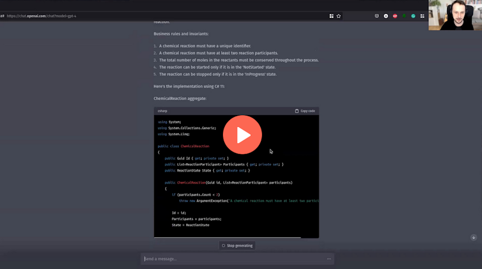

**I was recently asked what drove me to mostly use immutable data and methods rather than the Aggregate Pattern in my samples and videos.** I decided that it might be worth sharing my answer here to give you more context for my journey. Especially that [I wrote once why is that important](/pl/what_does_a_construction_failure_have_to_do_with_our_authorities/).

It's the stage of evolution that I'm currently at. 

**I started with classical aggregates following Domain Driven Design with a typical Object-Oriented tactical pattern.** So, encapsulate data and behaviour in a single class. Then, allow changes only through public methods and expose data only in read-only mode.

**Then I noticed that mentally, I was struggling.** Such a way pushed me to think more about the data than the business logic. It might be just me, but it's harder to reason what this aggregate actually does with the mixture of data and behaviour. Through discussion with others, I also noticed that I'm not the only one.

I see the value of encapsulation in the Object-Oriented way, but classes are not the only way to achieve that. 

**Of course, one may say that _"you just didn't understand the pattern"_ and one may be right.** Yet, if the pattern is too sophisticated and too many people struggle to apply it correctly, there's something wrong with it. Don't hate the player; hate the game.

Of course, I don't hate aggregate; there might be multiple reasons why 
people fail on that: lack of practical resources, not enough katas, wrong explanations or common patterns that shouldn't be considered best practices.

See more in the great (and short!) talk by Thomas Ploch:

`youtube: https://www.youtube.com/watch?v=zlFqjD2LKlE`

**Whatever the real reason, I started to look at how I could do modelling better and reflect it in the code. So, the hunting for simplicity has begun.**

At the same time, I was spending a lot of time doing and learning Event Sourcing. That made an evident impact. I slowly realised that the classically Object-Oriented style, especially C# and Java style, does not match what we have in Event Sourcing streams.

You can think about event streams as the story. In a good story, the main character transitions; Frodo didn't start as a hero, aye? That's also what's happening with the entities in Event Sourcing. They're usually state machines. Each state is actually a different aggregate. It has a similar set of data but different and the same with behaviours.

Some example? Sure, if you think about the room reservation on Booking.com, you could model it as a single aggregate, but actually, there's a distinct set of operations you can do on the initiated, confirmed and completed reservation. You also have different data. The same can be noticed in others like the shopping cart, order, etc.

**The unified, classical C#/Java version became increasingly obsolete to me.**

I also worked a lot in recent years in TypeScript, which gave me another perspective on coding with its algebraic types and was definitely inspired by works like [Domain-Modelling Made Functional](https://pragprog.com/titles/swdddf/domain-modeling-made-functional/) by Scott Wlaschin, [Decider](https://thinkbeforecoding.com/post/2021/12/17/functional-event-sourcing-decider) by Jérémie Chassaing. I also had numerous discussions with Ruben Bartelink, where he patiently tried to drive me into doing functional way correctly. 

**I also spend a lot of time explaining Event Sourcing in various ways and seeing how others are doing so.** I noticed that most explanations started with DDD and the Aggregate pattern. I noticed that this confuses people and suggests that you must understand a lot before even trying to touch Event Sourcing.

Frankly, most of our models are rather simple, especially if we cut the read model fluff from them. We rarely touch really complex business domains. Yet, we quite often make them complicated.

I was thinking about how to show others that Event Sourcing, in a nutshell, is a simple pattern, and you might not need all this complexity. I started to explain it with: _"Here are your events, your data and here are functions that run business logic."_

**I noticed data+functions, for most people, was much more straightforward to grok.** 

That triggered the reinforcement loop, and I again started to think, _"hey, if that's working for here, then why wouldn't it work as the default option?"_

**Some say Entity+Functions creates the [Anaemic Domain Model](https://martinfowler.com/bliki/AnemicDomainModel.html), but I disagree.**
I don't think that code structures make the model anaemic. I don't think that using this or that syntax makes it such. What makes it anaemic is if we don't reflect the business model and behaviour in it.

From my perspective, entity+functions can be much richer than many Object-Oriented implementations I saw. In the end, it's just syntax.
The same thing can be achieved in multiple ways.

I think that if people are too focused on encapsulation then that's also a smell of some organisational issue. If we don't believe we can catch those changes in review, tests or collaboration, then there's a bigger issue to solve first.

Still, if you're using patterns like Decider, you achieve encapsulation, but by composition. Still, neither cleanness nor functional way is the end goal for me.

**I don't care much about that being functional or not.** What I like is to get is good composition. Having structures helps me with that. I think that composition of the small blocks is the only way to tame complexity and cognitive load.

That's why I rarely call my code functional, as some purists would say that's not pure. And I don't care about purity; I care about correctness, enabling composition and reducing cognitive load.

**Last but not least, using immutable structures makes it easier to trust my code.** I know that they won't be modified, and if the object was created, then it was already validated, and I don't need to repeat IFs/Validations, etc.

Thus, again, code is simpler and easier to understand.

At least for me.

But I also noticed that's also a common path for people working more with Event Sourcing. 

I'm not saying which is better or worse in general; I'm always trying to show multiple ways of achieving that in my [workshops](/pl/training/), so both DDD and more functional ways, as different people have different perspectives and preferences.

Still, that's my current state of the art and reasoning about it. 

Let's see how different it will be after the next few years.

Read also more about my journey in:
- [How to effectively compose your business logic](/pl/how_to_effectively_compose_your_business_logic/)
- [Slim your aggregates with Event Sourcing!](/pl/slim_your_entities_with_event_sourcing/)
- [Straightforward Event Sourcing with TypeScript and NodeJS](/pl/type_script_node_Js_event_sourcing/)
- [Vertical Slices in practice](/pl/vertical_slices_in_practice/)
- [What onion has to do with Clean Code?](/pl/onion_clean_code/)
- [Explicit validation in C# just got simpler!](/pl/explicit_validation_in_csharp_just_got_simpler/)
- [Removability over Maintainability](/pl/removability_over_maintainability/)
- [Prototyping, an underestimated design skill](/pl/prototype_underestimated_design_skill/)

Check also webinar where I show transition step by step.

Cheers!

Oskar

p.s. **Ukraine is still under brutal Russian invasion. A lot of Ukrainian people are hurt, without shelter and need help.** You can help in various ways, for instance, directly helping refugees, spreading awareness, putting pressure on your local government or companies. You can also support Ukraine by donating e.g. to [Red Cross](https://www.icrc.org/pl/donate/ukraine), [Ukraine humanitarian organisation](https://savelife.in.ua/pl/donate/) or [donate Ambulances for Ukraine](https://www.gofundme.com/f/help-to-save-the-lives-of-civilians-in-a-war-zone).
