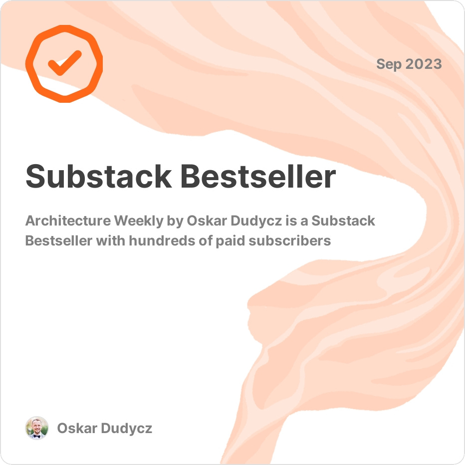

**Boom, I got this week such a nice picture from the Substack. My [Architecture Weekly](https://www.architecture-weekly.com/) newsletter appears to have become the Substack Bestseller for getting 100 paid subscribers.**

It's a nice checkpoint, so let's look back at how it started! You need to cherish good moments.

**Being hungry for knowledge is a double-edged sword.** One can say that it's impossible to know too much, but I think that in a specific context, that's possible.

My father often told me that I had a flash in the pan. I think that it wasn't a precise judgement. I wasn't quickly giving up, but I had too many hobbies and jumped from one to another, and it was easy to be interested in something new. Or just distracted.

**That's precisely what was also happening with my technical musings.** I think I did projects in most of the popular platforms of paradigms, mobile, backend, frontend, legacy, serverless, business intelligence, .NET, Java, Node.js, management, product design, etc. I was definitely not T-shaped but rather underscored.

**As I was interested in all that stuff, trying to build a holistic view of our industry to deliver better projects, I was trying to catch up with most of the news.** Like most of us, I started with a classical developer browser view: hundreds of open tabs. Of course, occasionally, I had them cleaned by random browser crashes. And all the links poof disappeared in the kingdom of doom.

Too often, I knew that I had a great link there, but I didn't remember the author or title and couldn't find it again. I was trying to devise different ideas for managing that: bookmarks, dedicated GitHub repos, YouTube playlists, and tools like Notion. All of those tools had their benefits, but the knowledge was dispersed, and they were still a mental barrier to keep them up to date. Kinda like a squirrel that hides nutts for later and forgets where it was.

**Luckily, I had a new idea that aged better!**

I'm a simple man, so the simple methods work best for me. Inspired by the immutability of the Architecture Decision Record and Event Sourcing, I just created an append-only log of valuable resources (articles, videos, whitepapers, etc.). I started to group them by week and general categories like Architecture, DevOps, Databases, Management, etc. and technologies. Firstly, I used it just for myself. Now, I could search in the markdown file by author, title, and keywords or skim approximately by time, remembering how long ago I found a particular link. Not perfect, not terrible. Good enough.

I put it in the GitHub repository that's still a basis for each release: https://github.com/oskardudycz/ArchitectureWeekly.

I shared that with my friends. As I used the GitHub release function, it appeared that some subscribed for the new releases using built-in GitHub notifications. Some started to ask me if I could _"setup a proper newsletter"_. I was postponing that idea for some time, as I didn't want to put yet another burden on myself.

**Yet, finally, I decided to use Substack, as it was the most straightforward tool.** It allowed me to share those links both through the page and send email notifications about new releases. It was also easy to use, looked professional and gave me more options.

**What options? At some point [I set up GitHub Sponsors](https://github.com/sponsors/oskardudycz) with the idea to make my Open Source _"work"_ more sustainable.** I wanted to give them something more as a gratitude for their support. Of course, not gonna lie, also as a hook to attract more of them. That idea was to do monthly webinars. I decided, why not have both and build the community for the people who want something more in their career?

Some of them already were asking me for recommendations, comments and help. A lot of questions repeated. Some of the answers were a basis for the [articles on my blog](https://event-driven.io), but I wanted to have it more interactive. 

I've set up a Discord channel.

**That's how the final idea has matured: Let's build an exclusive community that:**
- share the knowledge among themselves, 
- can support each other and ask questions,
- tackles ideas, as one of the issues of technical leaders is solitude. Not being able to find others to discuss and challenge their thoughts.

**Fast forward to the time of writing, Architecture Weekly has:**
- 3644 free subscribers,
- 103 paid subscribers,
- 19 GitHub sponsors,
- [Particular as a sponsor](https://go.particular.net/oskardudycz).

**We had so far [13 webinars](https://www.architecture-weekly.com/p/webinars) run not only by me but also by authorities:**
1. [From CRUD to Event Sourcing](https://www.architecture-weekly.com/p/webinar-1-from-crud-to-event-sourcing)
2. [Keep your streams short! Or how to model Event-Sourced systems efficiently](https://www.architecture-weekly.com/p/webinar-2-keep-your-streams-short)
3. [Implementing Distributed Processes](https://www.architecture-weekly.com/p/webinar-3-implementing-distributed)
4. [From CRUD to CQRS in Practice](https://www.architecture-weekly.com/p/webinar-4-from-cqrs-to-crud-in-practice)
5. [Architecture Weekly 100 Edition - Live Q&A](https://www.architecture-weekly.com/p/webinar-5-architecture-weekly-100)
6. [Alexey Zimarev - You don't need an Event Sourcing framework. Or do you?](https://www.architecture-weekly.com/p/webinar-6-webinar-with-alexey-zimarev)
7. [Design and test Event-Driven projections and read models](https://www.architecture-weekly.com/p/webinar-7-design-and-test-event-driven)
8. [Slim down your aggregates!](https://www.architecture-weekly.com/p/webinar-8-slim-down-your-aggregates)
9. [Radek Maziarka - Modularization with Event Storming Process Level](https://www.architecture-weekly.com/p/webinar-9-radek-maziarka-modularization)
10. [PostgreSQL Superpowers in Practice](https://www.architecture-weekly.com/p/webinar-10-postgresql-superpowers)
11. [Maciej "MJ" Jędrzejewski - Evolutionary Architecture: The What. The Why. The How.](https://www.architecture-weekly.com/p/webinar-11-maciej-mj-jedrzejewski)
12. [Jeremy D. Miller: Simplify your architecture with Wolverine](https://www.architecture-weekly.com/p/webinar-12-jeremy-d-miller-simplify)
13. [Yves Goeleven - The Fantastic 9](https://www.architecture-weekly.com/p/webinar-13-yves-goeleven-the-fantastic)

That's in total: 21 Hours, 13 Minutes, 42 seconds!

As you see, it's not a one-man show anymore.

**It may be a bold statement, but I think the subscription price is a bargain, compared to the amount of knowledge you can find in those videos.** Better than a lot of online courses.

**Is it, for me, a significant source of income right now?** Not really. To be true, I'm using the paywall as a filter for the interested people to build an engaged community here. It's still, for me, more of a way to connect and get mutual feedback with subscribers rather than a real source of income. Still, much appreciated, and I'm thankful to all.

**What are the next plans?**
- Continue to do that until it is helpful for me and my subscribers.
- I want to get more guests for webinars to make the community more diverse and supplement parts I'm not experienced enough.
- I'm thinking about building the LLM bot that'd answer based on the knowledge in the selected articles.
- I'm also considering workshops purely for the community.

**If you have ideas, don't be shy to share them!.**

**[Feel invited to join our community!](https://www.architecture-weekly.com/)**

Cheers!

Oskar

p.s. This article [was also posted on the Architecture Weekly](https://www.architecture-weekly.com/p/architecture-weekly-became-the-substack).

p.s.2 **Ukraine is still under brutal Russian invasion. A lot of Ukrainian people are hurt, without shelter and need help.** You can help in various ways, for instance, directly helping refugees, spreading awareness, putting pressure on your local government or companies. You can also support Ukraine by donating e.g. to [Red Cross](https://www.icrc.org/pl/donate/ukraine), [Ukraine humanitarian organisation](https://savelife.in.ua/pl/donate/) or [donate Ambulances for Ukraine](https://www.gofundme.com/f/help-to-save-the-lives-of-civilians-in-a-war-zone).
