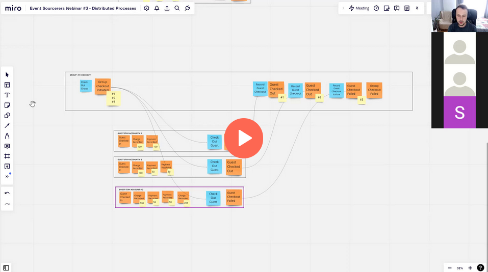

One team win is a loss for the other. For some people, money loss is a gain for others. 

**In the same way, the challenging parts of Event Sourcing are also its superpowers.**  Perspective changes everything.

**Let's say that we're building a hotel housekeeping management system.** Each morning, we prepare a list of the rooms for maids to clean up. The process is more complex than it may seem. We do not only need to take into account guest checkouts; there are also other factors. For instance, we need to make a room full clean up after checkout and every 2 or 3 days of the stay. On other days, we do a quick cleanup, e.g., replace used towels, empty trash bins, etc. We also need to consider maids' availability, distribute the workload, and ensure they won't run from one floor to another but have the assignment collocated.

Hospitality is not the easiest industry. It's all about working with people, and we humans are unpredictable. You can see all the complaints you had or heard about from your past. Some of them were justified, some were not. It's a must to have a clear log of what maid cleaned up and what not.

**As you can imagine, the initial morning schedule during the day may change.**  Some may decide to prolong the stay, some may ask not to do cleanup, some maids can get ill, and we must redistribute the load. The common thing for maids is to have the schedule printed in the morning and go by it. Some chains are trying to modernise that process, embrace that things may change, and be flexible.

**Let's say we're building such a system, giving maid tablets with information on their schedule.** We're using Event Sourcing to get a precise log of what has happened. We have a stream dedicated to a maid's daily cleanup schedule. We also have dedicated streams representing the room availability and guest stay.

In the cleanup schedule, we have events like:
- Schedule Defined, 
- Shift Started, 
- Room Full Cleanup Started, 
- Room Full Cleanup Completed,
- Shift Finished,
- etc.

**The schedule is defined each night based on the expected state of the hotel the next day. What will happen if the guest prolongs their state and we don't need to do a full cleanup?** Of course, the schedule will need to be adjusted. That also allows us to optimise it, adding other room for the maid.

The same can happen if one maid has an accident, and we must redistribute their tasks (all or the left ones if that happened in the middle of the shift).

We may also need more capacity to do the full cleanup. Then, at least, we should note that down to move the clean up for the next day or apologise to guests.

**That may sound like a lot, especially if we're responsible for implementing those processes.** If we were doing systems traditionally, this may look easier, as we'd need to override all the data in multiple tables, getting immediate consistency with transactions. That may sound more complex if we're in the denormalised event-sourced world. And indeed, I'm getting questions about such scenarios quite a lot.

**Still, overriding the state is not a great way to solve this case.** The fact that we've updated data doesn't mean that person will be notified about that, plus we may lose the precise information about the reasoning behind that change. 

Events give us more options. We can subscribe to the notification about the guest stays and, based on that information, decide on adjusting the maid schedule that had the particular room assigned for cleanup. What's more, we can also store the specific information about the reasoning for that in the maid's daily schedule stream.

**Depending on our requirements, we can store the following events:**
- **Schedule Updated** - containing either the complete new schedule. It's not perfect, but it can be fine if, more likely, we'll be changing the majority of the schedule. That may happen if we, e.g. want to put a new assignment in the middle of the schedule. Read more in [Anti-patterns in event modelling - State Obsession](https://event-driven.io/en/state-obsession/).
- **Schedule Invalidated** - for the case from above, it may be better to accept that it's better to create a new schedule instead of trying to update it for a big reshuffle of the schedule. We can put a _tombstone_ event marking that we're invalidating the old schedule and setting up a new one. It can also be useful in the case of a maid accident. We can put the reason there or create another dedicated event type depending on our needs.
- **Room Assignment Removed** + **Room Assignment Added** - we can add more than one event for each specific operation. The challenge here is knowing the correlation and reasoning for those events so that they both happened because of the same trigger.
- **Room Stay Extended** + **Schedule Adjusted** - we can store the _raw_ event we got externally that triggered rescheduling and the event showing how we adjusted the schedule. That gives us good traceability, and keeping all the information gives us a complete tracing of the process.
- **Schedule Adjusted** - we can, of course, just keep the single event with a reason and the link to the original event (e.g. as causation ID in metadata, read more in [Set up OpenTelemetry with Event Sourcing and Marten](/en/set_up_opentelemetry_wtih_event_sourcing_and_marten/)). The downside is that by looking at another stream, we don't have the full reasoning.

**Nevertheless, whatever option we choose, we give a complete view and understanding as to why we retrofit some change.** We don't have that typically in the regular state updates.

We can model such mishaps explicitly as workflows and subscribe for the particular events running compensating operations. I explained that in detail in the [webinar about implementing distributed processes](https://www.architecture-weekly.com/p/webinar-3-implementing-distributed):

**We can do the same for the compensating operation if we see some bug in our system.** If we're doing a banking system and we see that some clients had wrong account balance calculations, we can refund all of them. We can even define the migration process for event streams; we can have a one-time code that will append those events to the streams, triggering the other flows and needed notifications without doing _cowboy database updates_.

There's also another layer to it. 

**People fear the wrong state in the event streams while not being afraid of traditional storage.** And here's the deal: both may be broken the same way. The difference is that we may not even notice that it's broken in the traditional storage. We'll see that in Event Sourcing because we have tools for that.

**I believe that such observability and detecting discrepancies and fixing them (semi)automated way is a big win.** We're not only able to do it but also leave self-explanatory traces as to why we did it this way. By that, we can even correct the wrong correction.

So you tell me: is fixing the data scenarios a pros or cons of the event-sourced systems?

Read also more in:
- [What texting your Ex has to do with Event-Driven Design?](/en/what_texting_ex_has_to_do_with_event_driven_design/),
- [Simple patterns for events schema versioning](/en/simple_events_versioning_patterns/),
- [Event Versioning with Marten](/en/event_versioning_with_marten/),
- [Saga and Process Manager - distributed processes in practice](/en/saga_process_manager_distributed_transactions/),
- [Event-driven distributed processes by example](/en/event_driven_distributed_processes_by_example/),
- [Set up OpenTelemetry with Event Sourcing and Marten](/en/set_up_opentelemetry_wtih_event_sourcing_and_marten/).

Cheers!

Oskar

p.s. also read .

p.s.2 **Ukraine is still under brutal Russian invasion. A lot of Ukrainian people are hurt, without shelter and need help.** You can help in various ways, for instance, directly helping refugees, spreading awareness, putting pressure on your local government or companies. You can also support Ukraine by donating e.g. to [Red Cross](https://www.icrc.org/pl/donate/ukraine), [Ukraine humanitarian organisation](https://savelife.in.ua/pl/donate/) or [donate Ambulances for Ukraine](https://www.gofundme.com/f/help-to-save-the-lives-of-civilians-in-a-war-zone).
