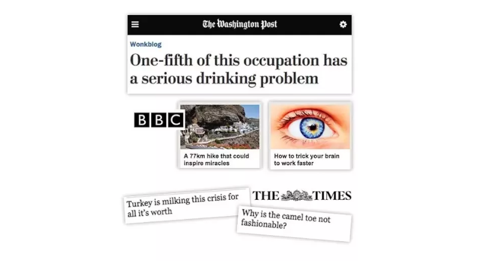
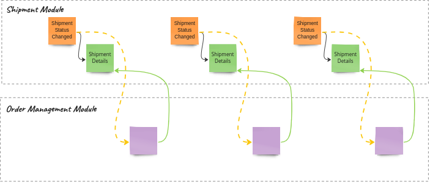
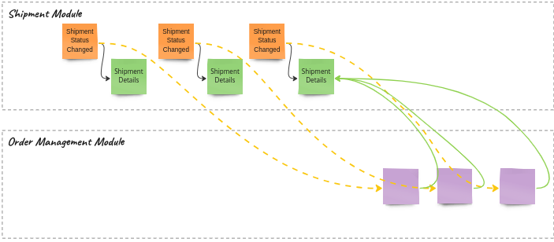
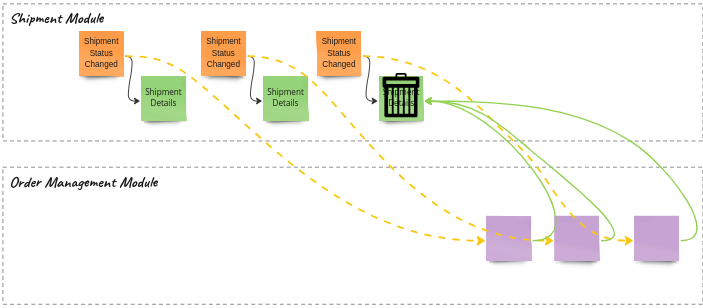
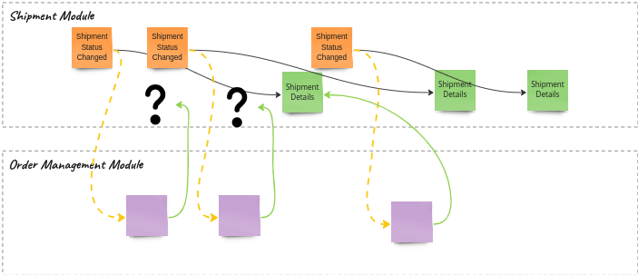

> _**Doctors Hate Her! Discover the Simple Trick to Lose Weight Overnight!**_

> _**This One Weird Trick Can Save You Hundreds on Your Energy Bills!**_

> _**The Secret Investment Banks Don't Want You to Know About!**_

I'm sure you've seen such clickbaits, aye? News portals and influencers do their best to keep us clicking and uncovering that they only have a little to say. Usually, this secret advice behind the headline is common knowledge. We're wasting time going through a gibberish, filled with words article just to find nothing we haven't already known.

Surprisingly, that's also a common mistake we make when designing events. Look at that beauty:

```csharp
record AccountInformationUpdated(
    Guid AccountId
);
```

Or that one:

```csharp
record ShipmentStatusChanged(
    Guid ShipmentId
);
```

**Those events are notifying us that something has happened but are not giving any context.** Rarely, that can be good enough information to trigger some next step of the workflow or do some generic action like logging, but typically, we need to query the publisher. And that's a rookie mistake that will hit us hard later.

**There are multiple reasons for this mistake. Let's go through the most common ones.**

## Living still in the synchronous world

Let's say that you need to get information from your insurer. You're trying to call the hotline, but you realise it's only open from 9 to 5. Maybe it's not urgent, so you decide to try again right in the morning. You're setting an alarm for 9 AM the next day, call and... You hear to [hold the line ](https://www.youtube.com/watch?v=htgr3pvBr-I) followed by information that you're the 24th person in the queue.

**If you're applying an event-driven approach by just sending raw notifications, then it's like an alarm for 9 AM to make a phone call.** Sure, it may help a bit, but actually, that's the same communication you had before. To make it event-driven, you should try harder and reshape the communication flow.

## Believing that notification is enough

It's a way to push responsibility to the subscriber and potentially reduce the work on our side. 

> _"You got the notification; just do what you want with it."_

That's not the greatest move, as if the subscriber wants to get that package was sent, and we're just publishing the _ShipmentStatusChanged_ event with the shipment id. Each time they get the notification, they need to react and query our API and decide if the information is valuable to them. That also leads to race conditions, which I will cover in more detail later in this article.

There's little benefit between regular polling from the API with the [cron job](https://en.wikipedia.org/wiki/Cron). Maybe a bit better resource utilisation, but that's also disputable.

## Going to the extreme with events granularity

You can read in multiple places that events should be granular; the smaller, the better. That advice can be misleading. My take is that **[Events should be as small as possible, but not smaller](/pl/events_should_be_as_small_as_possible/)**. 

**If we trim an event from data, we make it just a clickbait headline.** That's not usable. We should give more context and let subscribers decide if it's interesting for them or not.

## Not thinking about events as the API

[I explained in another article that we should treat events as an API](/pl/internal_external_events/). Embracing that events are contracts between a publisher and subscribers is a must. That helps with shaping proper communication and embracing the needs of both sides. Even if the event-driven communication is publisher-driven, ignoring subscribers' needs is a no-go.

**OK, so we know the reasons now, but what issues clickbait events can cause?**

## Chattiness of the communication

I'm sure you know the person who asks you a hundred times:

> _"Hey, did you finish already?"_.  

We usually answer:

> "I told you that I will ping you when I'm done, right?"

And we get:

> "Yeah, yeah, I know, just double-checking."

That's precisely what's happening with clickbait event-based communication. In theory, we're making our communication more push-based and asynchronous, but as we're not giving in the answer any more context status, we're getting constant queries. Maybe less than with continuous polling, but still a way too much.

## Exponential growth of calls

If our systems are distributed, and we have write models focused on the business logic and read models on the query needs, then it may appear that we don't have a single API to query to get all data. Write model endpoints will usually contain a minimum set of data, e.g. only dictionary keys instead without description, etc.

Read models may be fine-tuned for the module's needs, and our subscriber's needs may differ. 

All of that can end up with exponential growth of calls. First, we query for raw data, then additional calls to get dictionaries, then other nested data and too often additional data from other modules.

[Release the Kraken!](https://www.youtube.com/watch?v=38AYeNGjqg0&t=37s).

## Our communication is direct and error-prone

Just like the insurer's hotline may not be available, our services also may not. When we get an event and we try to query data from an external service, it may be down. If we add to that [at-least once delivery, idempotency, etc.](/pl/outbox_inbox_patterns_and_delivery_guarantees_explained/), we can even make a [DDoS attack](https://www.cloudflare.com/learning/ddos/what-is-a-ddos-attack/) on our services.

Of course, we can have [retry policies](/pl/dealing_with_eventual_consistency_and_idempotency_in_mongodb_projections/), [circuit breakers](https://en.wikipedia.org/wiki/Circuit_breaker), etc., but they're not solving that issue; they're just decreasing the scale of it.

One of the biggest benefits of event-driven communication is that it enables our services to be loosely coupled and resilient. By passing events, we can reduce direct connections to a bare minimum. Of course, as long as we put enough context in them.

## Race conditions between notifications and queries

The way we envision our communication looks like this:



Everything is in the right order. The shipment module first updates the read model and then sends the _Shipment Status Changed_ event. The order management module gets the notification and queries the read model. Then, the following events repeat the same pattern sequentially. If we're lucky enough, this can also happen in reality, but...

We may also get notifications with a delay:



Some may say that's not an issue, as you'll still get the latest state. And that can be fine for some scenarios (e.g. [webhooks](https://en.wikipedia.org/wiki/Webhook)). If we're just updating the read model and are interested in the latest state, that can also be fine for some time, but...

We may also end up in such a case:



The final event may have deleted the resource or made it unavailable (e.g. completed or cancelled shipment). Then, we won't be able to get any meaningful information. 

Also, if we want to trigger a particular process based on the partial step of the process, we're losing such capability.

Sometimes, events can also be delivered faster than the read model updates:



In that case, we won't even know if the record is not yet available or was made unavailable.

**We're getting eventual inconsistency. Curtain**

## How to deal with clickbait events?

The answer is simple: [treat your events as an API](/pl/internal_external_events/). Enrich your events with needed data. Consider subscribers' needs. 

For your inner module needs, you can still keep them granular but not clickbaitish. For external module needs, ensure that they get the information completeness guarantee. Thanks to that, they won't need to know too much about your modules and querying, creating a fragile, unmaintainable mess.

Beware of replacing our clickbait _ShipmentStatusChanged_ event with the following:

```csharp
record ShipmentDelayed (
    Guid ShipmentId
);
record ShipmentProviderSelected (
    Guid ShipmentId
);
record ShipmentProviderSent (
    Guid ShipmentId
);
record ShipmentCompleted (
    Guid ShipmentId
);
```

**This is a variation of [Property Sourcing Anti-pattern](/pl/property-sourcing/), that we could call _Status Sourcing_.** Those events are a bit better, but still clickbaits. 

Moreover, if we don't map them to some unified meaningful external event, then each time we add a new status, other modules will need to update their code to get information about it. That creates more coupling.

**Events should contain all information about the fact that was registered; if we're passing just a subset, then we're getting ourselves into trouble.**

## When such an event can be a correct usage?

From pattern to anti-pattern, there's a thin distance: the context. In which context then clickbait event can be a decent tradeoff?

**I already mentioned one: webhooks and websockets.** Pragmatically, if we just want to expose the notifications about the progress of our process, and we have zero idea of how subscribers will use it. It may be an acceptable tradeoff not to expose additional data and reduce the set of sent data. It may be an okayish first step to an event-driven approach, but it shouldn't be the last one.

**Security and privacy can be additional aspects.** If our notifications protocol is not secure enough, or we want to have more control over data (e.g. [personally identifiable information](https://en.wikipedia.org/wiki/Personal_data)), then we shouldn't broadcast it.

[Mathias Verraes described the Forgettable Payload pattern](https://verraes.net/2019/05/eventsourcing-patterns-forgettable-payloads/), which can be a correct modification for our clickbait event. 

We could add, to the event data, a URL to the endpoint that will return the full shipment data, e.g.

```csharp
record ShipmentStatusChanged(
    Guid ShipmentId,
    string Url
);

// and create it as
var shipmentStatusChanged = new ShipmentStatusChanged(
    shipmentId,
    $"shipments.com/{shipmentId}/versions/{shipmentVersion}"
);
```

As you see, the URL contains a version of the resource. Thanks to that, we'll be less prone to race conditions. To deal with eventual consistency, we should either implement a retry policy on the subscriber side or publish an event after the read model is updated.

This gives us more control, as we can centralise the privacy-related data and use more granular authorisation rules.

Of course, we need to remember that's not the ultimate solution, as once someone queried the data, they can do whatever they want, for instance, cache it or store it locally. 

Read more in [GDPR for busy developers](/pl/gdpr_for_busy_developers).

Or watch:

`youtube: https://www.youtube.com/watch?v=7NGlYgobTyY`

**We can also use the same for blob data.** For instance, if we know that subscribers are interested in the PDF containing the current shipment letter, we can either send a URL to versioned blob storage (e.g. [AWS S3](https://aws.amazon.com/s3/)) or our service for downloading files.

**Read also other article in Anti-patterns in event modelling series:**
- [Property Sourcing](/pl/property-sourcing/),
- [State Obsession](/pl/state-obsession/),
- [I'll just add one more field](/pl/i_will_just_add_one_more_field/).

Cheers!

Oskar

p.s. **Ukraine is still under brutal Russian invasion. A lot of Ukrainian people are hurt, without shelter and need help.** You can help in various ways, for instance, directly helping refugees, spreading awareness, putting pressure on your local government or companies. You can also support Ukraine by donating e.g. to [Red Cross](https://www.icrc.org/pl/donate/ukraine), [Ukraine humanitarian organisation](https://savelife.in.ua/pl/donate/) or [donate Ambulances for Ukraine](https://www.gofundme.com/f/help-to-save-the-lives-of-civilians-in-a-war-zone).
