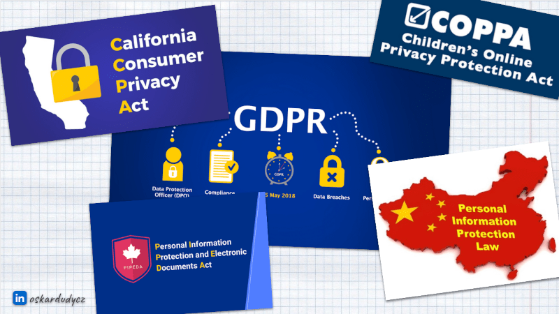
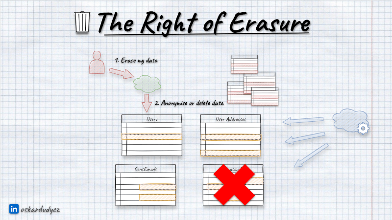
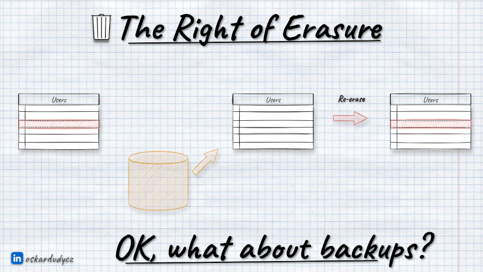
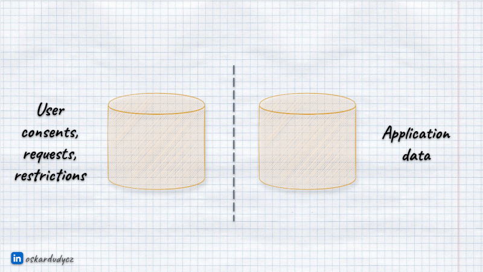
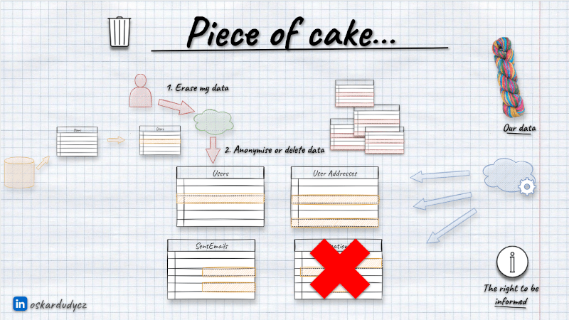
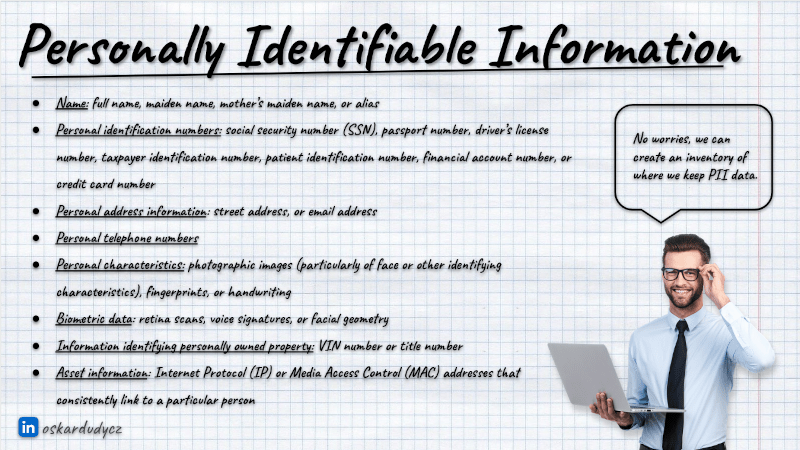
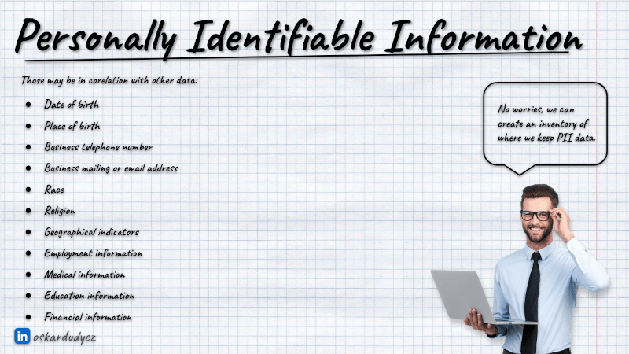
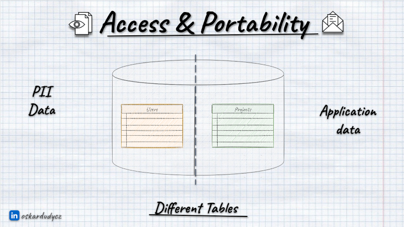
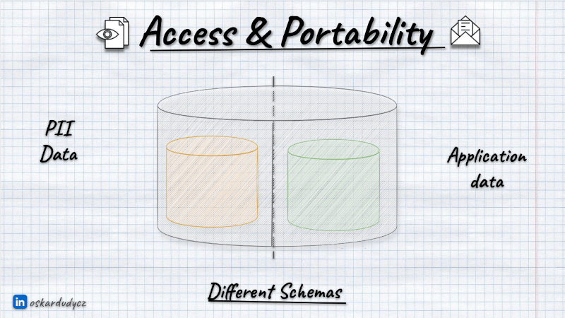
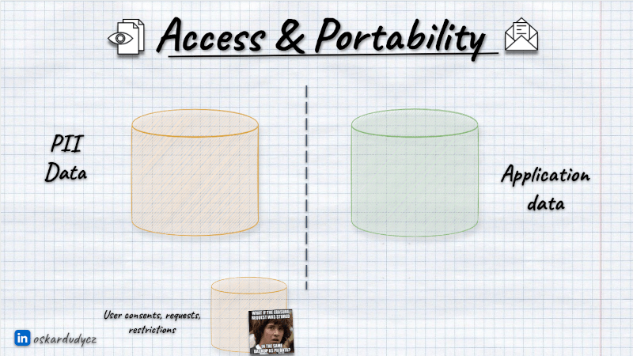

**This year, we had the fifth anniversary of the Developers' Doomsday. In 2018, on the 25th of May, the European [General Data Protection Regulation](https://gdpr-info.eu/) was made applicable.** And it escalated! 

Right now, in almost all parts of the world, there are similar laws like the [California Consumer Privacy Act](https://oag.ca.gov/privacy/ccpa); [Canada has their own](https://www.priv.gc.ca/en/privacy-topics/privacy-laws-in-canada/the-personal-information-protection-and-electronic-documents-act-pipeda/), even [China has it](https://personalinformationprotectionlaw.com/).

# Why do we need all those regulations?

Of course, bloody hackers, right? They are making everything hard. They do everything to destroy our software, steal users' data and break our [favourite logging tooling](https://en.wikipedia.org/wiki/Log4Shell). That, of course, happens, but they're not the biggest reason. 

**The biggest reason is us. We are the baddies.** 

**Would you be able to answer the following questions:**
- What data do you keep in your systems?
- How the data is distributed between services?
- What's the lifetime of the data?
- What data categories do you have?
- What information do you export and share?

Even for non-user data, most of us would have a challenge answering that, not even speaking about having policies. Yes, we don't care much about data governance and privacy practices. The reality is we keep data until application logic removes it. We're keeping all data because it may be useful in future, just in case. We're starting to notice that when our database is overloaded or we don't have space for backups. 

**As we were not motivated enough to care about users' data, someone had to force that on us.** Now, we're forced to let our users regain control of their data. And that's for good, not only from the fairness perspective but also for our system design. Let's discuss why.

Before we go, a disclaimer. Googling doesn't make us lawyers; even ChatGPTing doesn't. I'm not a lawyer; whatever you read here, consult with your Chief Security Officer, as those rules are highly contextual to your business domain and other laws and practices you do. You don't have CSO? You should.

## The law to be forgotten

The most known part of the GDPR is the _law to be forgotten_ or _right of erasure_. Our user can request the removal of their data from our system, and we're obliged to do it.

We need to give users an option to request data removal. This can be some fort on UI, email channel, etc. Once we get such a request, we can either do a batch removal from our database or schedule it. Usually, the former method is preferred, as it may take some time, and regulations don't oblige us to do it instantaneously.

No matter which way we choose, we need to clean all privacy-related data like names, social numbers, emails, addresses, IPs, etc. We can do it in two general ways:
- deleting physically all rows in tables,
- anonymising them (taking precise information like first name, last name, and address and replacing them with randomised generic ones).

**It's worth noting that we don't need to remove all data.** We need to remove only those allowing us to deduce their identity. And that's highly contextual and tricky. For instance, typically, we can leave information like gender as it's not precise, but not always. If we have a class in tech school, and there's only a single woman there, then gender in this context is _[Personally Identifiable Information (PII)](https://en.wikipedia.org/wiki/Personal_data)_, as we can identify a specific woman in this context.

**Also, we cannot always remove users' data.** There may be higher-priority laws that would force us to keep them (e.g., medical history in hospitals, tax history, etc.). To make it even trickier, we need to do our best to detect that person requested data removal from our system when we're merging companies or buying user data (a common practice in, e.g., recruitment companies). That can be done by keeping some irreversible hashes and comparing them with incoming data.

**One more thing to add: never keep PII data in your application logs.** Like, really, never. It's a pathology. Not only they won't help you track the issue, but you'll also have a hard time cleaning them on request. They're a big append-only blog and don't provide such precise removal functionality. But okay, let's say we were sane enough not to do it.

We get the removal request; we run SQL script to remove or anonymise data and run it. Poof! The user's data from tables disappeared. That's cool, but is it actually?

**It's surprisingly hard to tell what one means by _"deleting data"_.** Let's take relational databases as an example. Do you know that they also [work as append-only logs internally](/en/relational_databases_are_event_stores/)? When you run a delete statement (or any other like insert or update), a new record is appended to the structure called _[Write-Ahead Log](https://www.postgresql.org/docs/current/wal-intro.html)_ or _[Transaction Log](https://learn.microsoft.com/en-us/sql/relational-databases/logs/the-transaction-log-sql-server)_. When you commit the transaction, the database updates the tables based on the data from the log. Once that's done, it can clean the used log records. Yet, you won't know when it does it, as the Write-Ahead Log is also used for disaster recovery, etc. The same applies to most of the other database types.

What's more, if you're using Change Detection Capture features like [Postgres Logical Replication](/en/push_based_outbox_pattern_with_postgres_logical_replication/), then log entries may not be ever removed at all.

**So you need to ensure that Write-Ahead Log entries have a retention policy with your Privacy laws (for GDPR, it's a maximum of 30 days) for tables that contain user data.**

## What about backups?

The (not so) simple removal from tables is getting much more complicated if we add backups into the equation. You're not doing backups? Then let me tell you that there are two types of people: those who are doing backups and those who will be doing them. 

**If we remove or anonymise the data and restore the backup, we immediately get it back.** In theory, we could remove/anonymise data back after running restore; that already sounds hacky, but maybe it could be a tradeoff? Not quite.

**Besides the application data, we need to store information about users' consents and requests for removal.**  If we keep it in the same database, the recent consents or requests may also be brought back to the previous state, where we were allowed to keep their data. So, we might not even know whether we should anonymise or delete it again after restoring backup.

What's more, someone with access to backups can restore it to another place and read the data.

Defining our data policy, so:
- what we store,
- where we keep it,
- how do we backup and restore data,
- how long we keep data (including backups),
is essential for defining the proper Data Governance process in general, not only for GDPR.

**In the GDPR context, my recommendation is:**
- keep application data and user consents/requests separated,
- use the secured and fault-tolerant store for consents and requests,
- do backups regularly (especially for the consents),
- define the maximum length of the backups aligned with your Privacy laws (for GDPR, it's a maximum of 30 days); don't keep them longer. By that, you don't need to clean up data from backups,
- define your disaster recovery strategy, including the removal/anonymisation process as part of it.

## User Rights

Most people think that GDPR equals _removing data_. And that's a highly flattened and oversimplified view. 

**GDPR and other privacy regulations are about caring for users and their rights. Empathy and not being evil.** Here's the full list:
- **The right of erasure**,
- **The right to be informed** (about what data we keep and what we do with it),
- **The right of access** (so showing users all data we keep about them),
- **The right to rectification** (we should allow users to edit their data),
- **The right to restrict** (users should be able to tell which data we can use),
- **The right to data portability** (we should allow users to export their data. Yes, even move them to our competition).
- **The right to object** (We should allow them to object to using their data for specific needs, e.g., marketing or sharing externally). No, annoying cookie popups are not a solution),
- **The rights regarding automated decision-making and profiling** (user should be able to object to using their data in, e.g. AI-based credit scoring, etc.)

By the way, in GDPR terms, we are not talking about users but about _Data Subjects_. We also have terms like _Data processors_, which are we, our company, running software systems and processing users' data. We also have _Data Controllers_ who are either storage providers or, again, us if we're running on-premise and handling everything on our own.

The biggest responsibility lies on us, as we know what data we store and how we use it. We cannot just offload it to _Data Controllers_. They must run everything with the state of the art, but we still need to ensure that we select the proper data provider and align our usage practices with their recommendations. As I wrote in [Form a wall! And other concerns about security](/en/form_a_wall/), it's not enough to _just use Cloud_.

Yeah, being a man in the middle is always the worst position.

## The right to be informed

Could you think for a moment about the user data you have in your system? How many tables/collections do you see? If only a few, then defining the removal strategy can be not that hard. But usually, data is spread all over if we don't care about governance from the beginning.

This impacts not only the removal but also other user rights. We need to be able to inform users about what data we have and export them.

Some can say that:

> Yeah, no worries, we will just make some registry, we will write the documentation, and we will precisely know what we are doing with our data

If you also think that's easy, see how much data can be considered PII:

**Remember that such a registry needs to be actively maintained and reviewed.** We know how hard it is to [keep documentation up to date](/en/how_to_successfully_do_documentation_without_maintenance_burden/). Usually, trying to audit the existing system for GDPR data is like trying to find [where's Wally](https://www.google.com/search?q=where%27s+wally&tbm=isch). 

To make it manageable, we should limit the GDPR data's usage. Instead of spreading it in multiple tables, keep it in the same place.

You can consider keeping it in the separate database schema.

Or even a separate database.

**Centralising the PII storage is not always the best choice.** As I mentioned, whether or not some data is personally identifiable is always contextual. Also, for some data (e.g., medical or financial), we may be obliged to keep them longer, and for some, shorter. That creates a challenge to create a central, generic PII Data module. Different modules will require different data lifetimes; those requirements can be contrary. We may end up with the lowest common denominator instead of the proper solution.

Also, we'll be facing all the [Conway's Law](https://en.wikipedia.org/wiki/Conway%27s_law) issues and potentially chattiness between modules and degraded performance. Caching can help, but we also need to remember to clean up the cache after a user request or set a proper Time To Leave on it. We also need to ensure a higher security setup.

**I think that centralisation of user content and requests can be easier.** This is more generic, and by itself, it may not even need to keep private data. You may keep in it:
- user identifier (as long it's not email or based on other PII data),
- module name,
- consent/request type,
- consent/request value (typically Yes/No).

Thanks to that, you could build a generic solution to record and publish information about changes to user consent and requests. Then, other modules can subscribe to those notifications and apply requests (e.g. for removal) accordingly.

## Sharing PII data

Remember, from the data that's keeping PII data, once the data is exposed, you're losing control of it. If someone queries the data, they can do whatever they need. That applies also to other modules in your systems.

Of course, we can handle that for internal modules. As mentioned, we can publish information about removing and handling data.

**The basic rule of sharing data with external systems is: you don't.** Yes, I know sometimes you have to. For instance, we're using external identity providers, trusting that they'll handle that better than we. They generally do, but see the [Azure AD breach details](https://arstechnica.com/security/2023/09/hack-of-a-microsoft-corporate-account-led-to-azure-breach-by-chinese-hackers/) or [repeating OKTA issues](https://blog.cloudflare.com/how-cloudflare-mitigated-yet-another-okta-compromise/). If such companies have issues properly handling privacy data, consider how others do it.

If you're sharing the data with others, at least ensure that they allow you to request the removal of the data. Check if they have certifications of common standards like [SOC 2](https://en.wikipedia.org/wiki/System_and_Organization_Controls), [ISO 27001](https://en.wikipedia.org/wiki/ISO/IEC_27001) or [HIPAA](https://en.wikipedia.org/wiki/Health_Insurance_Portability_and_Accountability_Act). It won't give a full guarantee, but it'll show you that they have procedures and that you can demand to apply them and place them in contract terms. 

## GDPR and Event-driven systems

**As you see, Handling privacy can be tricky, and for Event Sourcing, even more. The most significant Event Sourcing selling point is that [we're not losing data by using it](/en/never_lose_data_with_event_sourcing/).** Our data is an immutable sequence of events, and that sounds already unmatchable with removing data, aye?

How to do it? I explained that in the follow up article: [How to deal with privacy and GDPR in Event-Sourced systems](/en/gdpr_in_event_driven_architecture).

You can also watch:

`youtube: https://www.youtube.com/watch?v=7NGlYgobTyY`

## TLDR

We should not be scared of GDPR and other privacy regulations. GDPR is a privacy framework. It's good that we got those regulations and those recommendations on how to work with our data. Those practices should not be new to us; we should have already been applying them.

It doesn't have to be all that hard to do if we try to limit the scope of users' data we need and keep them as short as possible. If we don't spread it across the whole system but try to group them logically, we might not have a headache knowing what to delete and how to show users what we know about them.

Those lifecycle policies will make GDPR easier, and our systems faster and better managed, as our databases won't be bloated, and we'll have more data flow control.

We should finally apply privacy by default because we're not baddies, right?

Cheers!

Oskar

p.s. **Ukraine is still under brutal Russian invasion. A lot of Ukrainian people are hurt, without shelter and need help.** You can help in various ways, for instance, directly helping refugees, spreading awareness, putting pressure on your local government or companies. You can also support Ukraine by donating e.g. to [Red Cross](https://www.icrc.org/pl/donate/ukraine), [Ukraine humanitarian organisation](https://savelife.in.ua/pl/donate/) or [donate Ambulances for Ukraine](https://www.gofundme.com/f/help-to-save-the-lives-of-civilians-in-a-war-zone).
