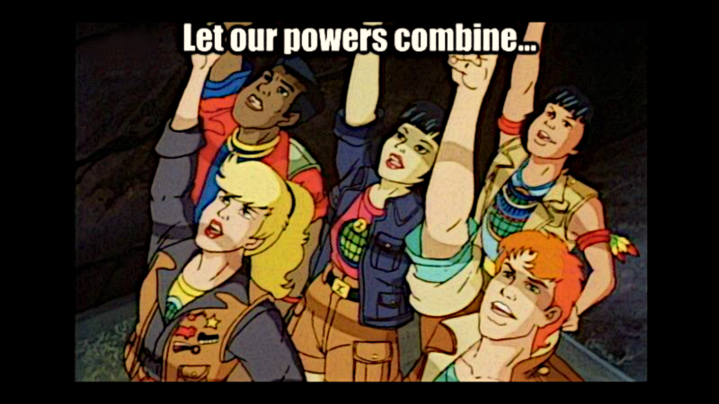

**We just introduced support plans for Marten, and here's why.**

We're really committed to providing tools that are accessible, safe and bug-free. We spend hours daily talking with over 800 users on [our Discord](https://discord.com/invite/WMxrvegf8H). I think that we're doing a decent job on that for free, and we still will.

**Why would you want to have a support plan?**

Having it is not only about getting top-notch support (which we will) but about having a notion of  _"I got you covered"_, and about building the trust that we won't disappear and won't go anywhere, reducing the [bus factor](https://en.wikipedia.org/wiki/Bus_factor). For the enterprise and critical systems, that is extremely important.

For many companies, no paid support means a hobby project, which we're not. We started our [GitHub Sponsors](https://github.com/sponsors/JasperFx) some time ago. We're already getting some income from our great users, but for many companies, sponsoring is hard to deal with, as procurement processes are not adjusted to that. Companies need invoices, and we fully understand that. That's where official support can benefit both sides, smoothening the process.

**Paid support is also about getting higher priority in resolution,** building relationships and solving stuff you typically don't want to solve through public issues or the Discord channel.

**Last but not least, it's also "help me, help you".** Marten grew big enough that we need to make our work sustainable. We tried many ways:
- joined the .NET Foundation (and left because it gives no help),
- set up GitHub sponsors,
- left our 9 to 5 jobs and ran [consulting](/pl/training/) for more flexible time and focus.

That helped, but we need consulting, and workshops are demanding and time-consuming. We like doing that and helping people this way, but we also need more dedicated time to deliver more value to you. 

**Most of the comments we get are that our tools _just work and do the work_.** Which, to me, is the best compliment we can get as we're really trying hard to help our users focus and deliver business value. 

**Still, that also means that all primary and simple features are already delivered, and the one we have left is complex, time-consuming or both.** That means that we need to get a longer span of focus purely on them to do it right. Think blue-green projection rebuilds, better DevOps tooling, observability, UIs, dashboards, etc.

**We have a general sustainability issue in the OSS world.** Let's try a simple exercise; try ask yourself the following questions:
- What is your strategy if such a case happens for your most crucial library?
- Do you have a dependency management and review strategy?
- What are you doing to minimise the bus factor for your favourite libraries?

This exercise is just to show that it's both sides' relationship. 

**We aim to be as fair as possible to make it smooth for you.** We don't want to change the license model; we understand that we need to build products, deliver you value and run a regular business-to-business relationship to make it sustainable for both sides.

**If you'd like to learn more, check our [support plans page](https://www.jasperfx.net/support-plans/?utm_source=oskar_blog) and [feel free to reach me](mailto:oskar@event-driven.io). We're here to help you build the best products.**

Cheers!

Oskar

p.s. **Ukraine is still under brutal Russian invasion. A lot of Ukrainian people are hurt, without shelter and need help.** You can help in various ways, for instance, directly helping refugees, spreading awareness, putting pressure on your local government or companies. You can also support Ukraine by donating e.g. to [Red Cross](https://www.icrc.org/pl/donate/ukraine), [Ukraine humanitarian organisation](https://savelife.in.ua/pl/donate/) or [donate Ambulances for Ukraine](https://www.gofundme.com/f/help-to-save-the-lives-of-civilians-in-a-war-zone).
