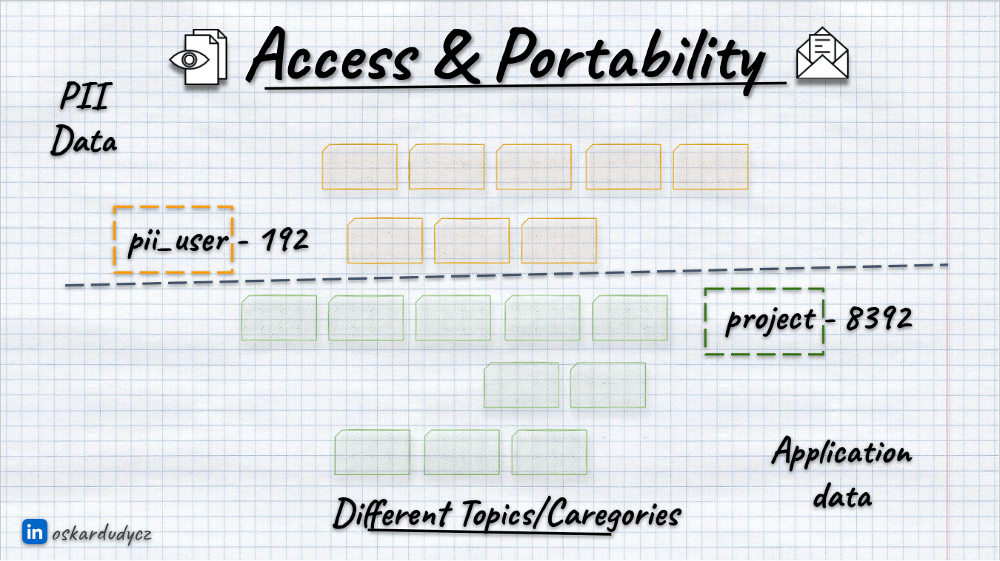
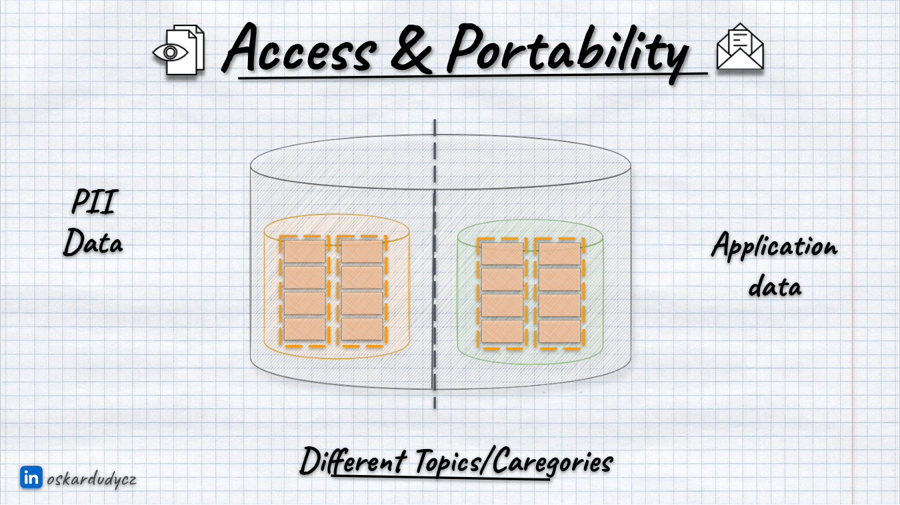
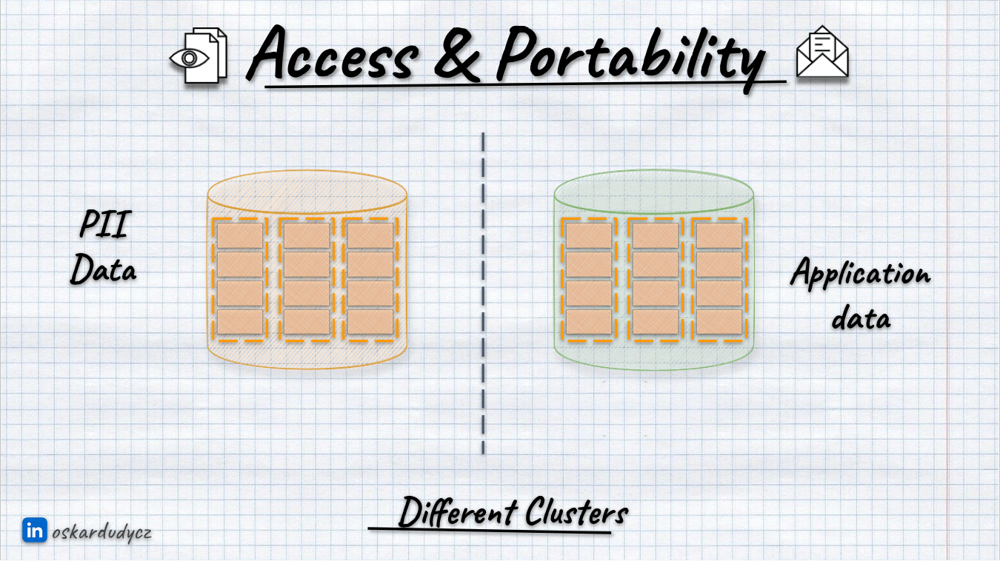
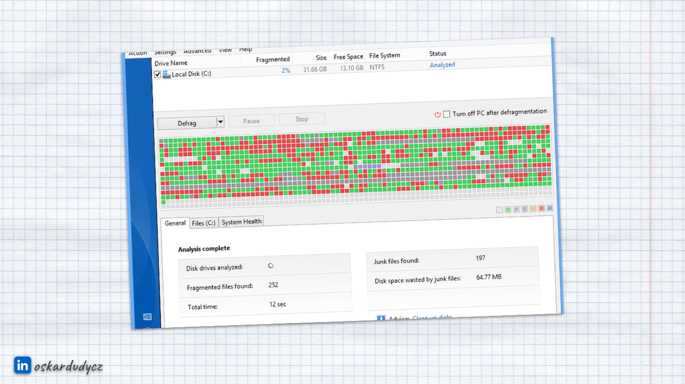
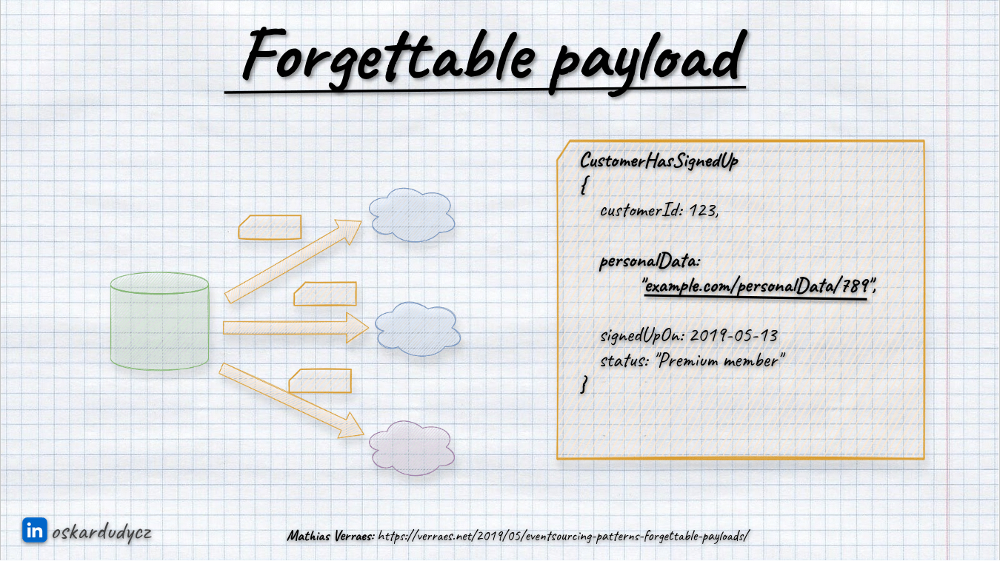
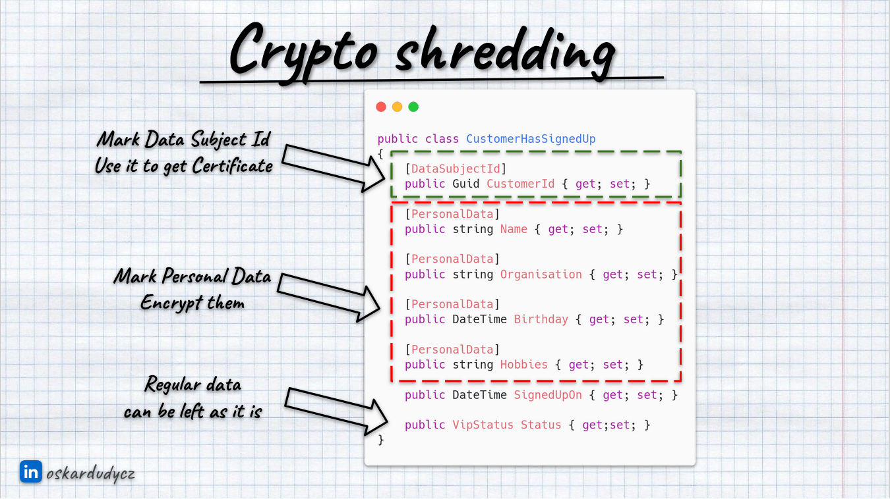

**The law to be forgotten and immutable data sounds like fire and water.** How to remove data if you're building an event-driven system based on append-only, immutable log. Is that even possible? Let's find out!

**Yet, before we go, a reminder!** [In the previous article, I described the general considerations and strategies around handling privacy regulations like GDPR](/pl/gdpr_for_busy_developers/). I encourage you to read it, as I assume that you understand that data removal is just the tip of the iceberg. Before choosing tactical moves, we should ensure we have the right data governance strategy. We need to know:
- what data we store,
- why we need them,
- how we're processing,
- where we keep it,
- how long we keep them (including backups).

Still, let's dive into the privacy specifics of the event-driven systems!

## Data segregation
 
**Data governance practices are, unfortunately, not discussed enough in event-driven systems.** People treat events more like freehand drawing, sometimes as mesh, but ending too often with a mess instead. We should carefully draw boundaries between our events.

Such practices can be more technical, like:
- streams in Event Sourcing are consistency guarantees where we can get guarantees of atomic writes, [optimistic concurrency](/pl/optimistic_concurrency_for_pessimistic_times/), etc.
- partitions in Event Streaming give us control over ordering guarantees and parallelism.

Still, technical aspects are just part of it. We should also think about the logical split. That's even more important.

**We can group streams into categories (e.g. all user events) and partitions into topics (e.g. all events from a particular module).** The proper key definition strategy can represent this. Just like we don't put all application data into a single table/collection, we should not put all our events in one random place but think about how to group them logically to make our system efficient.

**Besides the traditional split, we should also avoid keeping personal data with regular ones.** As you'll see later in the article, that makes handling privacy rules much more manageable. But even with common sense, it's clear that keeping personal data segregated gives more options to apply security and privacy regulations described in [the previous article](/pl/gdpr_for_busy_developers/).

We can break it down by categories/topics:

Or even with separate clusters:

Segregation is not the only thing we should consider; let's go and discuss other things we need to consider.

## Retention Policy

**Defining a data retention policy is crucial for handling privacy regulations correctly.** The same is true for event-driven solutions. In general, we have two types of tooling to consider:
- Messaging and Event Streaming tools such as RabbitMQ, Kafka, Pulsar, SQS, Azure Service Bus, Google Pub Sub, etc.
- Event Sourcing tools (event stores) like Marten, EventStoreDB, and Axon.

**It's worth pointing out that [Event Sourcing is not the same as Event Streaming](/pl/event_streaming_is_not_event_sourcing/).** Event Sourcing is about capturing and making decisions based on events; Event Streaming is about moving those events from one place to another, so integration. Kafka and Pulsar are not event stores, Marten, EventStoreDB are such. 

**Even if tools like Kafka, Pulsar, etc. can keep data with an infinite retention policy, it was added for resiliency, not to be used as a database.** Event stores have messaging capabilities, to forward recorded events, but they're made to keep data durable, not to get high throughput on message passing and services integrations.

Still, we should define retention policy and archive strategy for both cases, but with a bit different considerations.

**Let's start with messaging and event streaming solutions. Things are a bit easier for them.** If we assume that their main goal is to move data from one place to another, and storage is an additional capability, then we can conclude that not keeping them forever is more than fine. And it is, as the fact that we can do something doesn't mean we should. Keeping data forever will make our costs higher. Also, if we're using managed services like Azure Event Hubs for Kafka or clones like Kinesis, they might not even allow us to do so.

Each privacy regulation is different, but all have rules about how long we can keep data after a request for removal from the user. For GDPR, it's 30 days. So, we should be good if we set up a retention policy below that. Of course, as long as we respect the request and won't publish new messages containing Personal Identifiable Information (_PII data_). Such a retention policy will effectively make those messages unavailable (even if the user didn't ask us to do so).

Depending on the tool, you can define retention policies for:
- the whole cluster (e.g. [Kafka](https://kafka.apache.org/documentation/#brokerconfigs_log.retention.ms))
- topic or stream level (e.g. [Kafka](https://docs.confluent.io/platform/current/installation/configuration/topic-configs.html#delete-retention-ms), [RabbitMQ Streams](https://www.rabbitmq.com/streams.html#retention),
- queue (e.g. [RabbitMQ](https://www.rabbitmq.com/ttl.html#message-ttl-using-policy)),
- message time to live (e.g. [RabbitMQ](https://www.rabbitmq.com/ttl.html#per-message-ttl-in-publishers)).

**For event stores and Event Sourcing, things are a bit harder.** Event stores are databases, and we're using them not only to publish them and integrate different parts but also as our state. We read them each time to make our business decisions. Some event stores allow defining retention policies. For instance, [EventStoreDB allows us to define the max age for events](https://developers.eventstore.com/server/v23.10/streams.html#reserved-names). Still, we need to write our logic, always thinking that those events may disappear. It is not perfect, as it's non-deterministic, and if those data disappear, then our logic may crash. It's better to model lifetime explicitly and think about our archive strategy. But we'll get there.

Rarely do event-driven solutions provide the option to remove specific messages. If we're using an event store that is built on top of another database type (e.g. Marten on top of PostgreSQL), then technically, we can remove data, but it's not recommended, as it may not be effective. It's hard to know if someone has already consumed it. I wrote about it longer in [What texting your Ex has to do with Event-Driven Design?](/pl/what_texting_ex_has_to_do_with_event_driven_design/).

Also, as [explained in the previous article](/pl/gdpr_for_busy_developers/#the-law-to-be-forgotten), the fact that we delete something doesn't have to mean that it's actually erased. It may just mean that we can't access removed data easily.

Let's discuss how we can remove it from event-driven tooling.

## Log compaction

If you're old enough, then you should recognise that picture:

It's a print screen from Windows XP that shows the [defragmentation process](https://en.wikipedia.org/wiki/Defragmentation). It was an important process in the days when we had magnetic disks. At some point, our disk would be filled with some small empty spaces. You could put the data there, but it would distribute the file all over the disk. It would slow processing as magnetic disks spun around to read the specific data. The more it was spinning, the slower it got. To limit this effect, there was a process called defragmentation. Windows could take the files and redistribute them, sort them out, and lay them one after another so that we would have bytes one after another without empty spaces. This process can also remove dangling bytes that are unused by any application.

You may be thinking now: _"OK, boomer"_, but bear with me. I'm telling you about that for a reason. You can use a similar technique to clean up data in the event-driven tooling.

This technique usually is called _log compaction_ ([per Kafka terminology](https://docs.confluent.io/kafka/design/log_compaction.html)). It has also different names, like [_scavenging_ in EventStoreDB](https://developers.eventstore.com/server/v23.10/operations.html#scavenging) or [_topic compaction_ in Pulsar](https://pulsar.apache.org/docs/3.1.x/concepts-topic-compaction/). 

Log compaction is a process that takes a sequence of events, keeps the last event and removes the rest of them. Log compaction will perform such transformation for each of the sequences of events grouped by key and ordered by position in the stream (so in order of appearance, read more in [Let's talk about positions in event stores](/pl/lets_talk_about_positions_in_event_stores/)). In Event Sourcing, one stream represents one record/process; in Event Streaming, the breakdown can be less granular (e.g. a single module or other message sources).

You already know that [Event Sourcing is not the same as Event Streaming](/pl/event_streaming_is_not_event_sourcing/). Kafka and Pulsar are not event stores, Marten, EventStoreDB are such. Still, internally, they are usually built as append-only logs, so the log compaction part will logically work the same way.

In Event Streaming solutions like Kafka and Pulsar, log compaction will always keep the last event in sequence.

**That's important to remember, as we need to ensure that the last event won't contain any PII data. We usually put there so-called _"Tombstone Event"_.** It's named like that, as we're putting it on top, marking that this stream won't be ever used again. It may be modelled as:
- a dry event like _PersonalInformationRemovalRequested_ that has just the bare minimum of information like user identifier, requested date, etc.
- a summary event with user information that is not PII,
- a summary event with anonymised PII information.

**In event stores, that works similarly, but we may get more options.** E.g. [EventStoreDB gives functionality to _hard delete_ event stream](https://developers.eventstore.com/server/v23.10/streams.html#hard-delete). Technically, it puts the tombstone event appended by _system_. It is an irreversible operation, and you won't be able to use this stream. Still, to erase it from the disk, you need to run a log compaction process [called EventStoreDB _scavenging_](https://developers.eventstore.com/server/v23.10/operations.html#scavenging). You can also use [soft delete](https://developers.eventstore.com/server/v23.10/streams.html#soft-delete-and-truncatebefore) that doesn't add tombstone event automatically, same with [Marten archive stream method](https://martendb.io/events/archiving.html#archiving-event-streams). 

**EventStoreDB also allows partial removal using [truncate before stream metadata](https://developers.eventstore.com/server/v23.10/streams.html#soft-delete-and-truncatebefore).** That's what I recommend, as you can append explicit _Tombstone Event_ and mark all events before as eligible for _truncation_.

**I want to highlight that we should NEVER put PII information like email, user name, or insurance id into the topic or stream name.** Because of the tombstone event, this topic or stream id remains. Therefore, hash this information if necessary. 

Log compaction is a resource-consuming operation that can take some time. It's better to do it regularly, then the amount of data to compact will be smaller. It's also better to do it when the traffic in the system is smaller so as not to impact our tool performance.

**Log compaction sounds like a dangerous operation, but it doesn't have to be. Usually, it allows creation of a new log based on the old one, keeping the previous one untouched.** That's also aligned with the immutability principle, as we're not changing past data; we're writing the new version to another place. Of course, we need more storage, which can cost us more, but we're also getting a certainty that if something goes wrong, we can restore initial data, tweak it and rerun log compaction without the risk of losing data. That's fine as long as we remove the old log within the privacy regulations retention policy. Of course, tools also allow removing the old log after log compaction or trying to override it as it goes.

## Forgettable Payload

**Knowing that there's a way to erase data from event-driven tools, how do we proceed with it? One of the potential options is [Forgettable Payload, explained by Mathias Verraes](https://verraes.net/2019/05/eventsourcing-patterns-forgettable-payloads/).** This technique isn't foolproof, but it can significantly simplify data management. 

When sending events informing other systems about changes made in our module, instead of transmitting complete personal information like names, emails or insurance id, we could replace these details with a [URN](https://en.wikipedia.org/wiki/Uniform_Resource_Identifier) or link targeting where this information can be queried and accessed. 

It allows us to demonstrate our control over the data explicitly. We can also have easier control by defining authorisation rules, etc.

**We also get centralised control around personal data and consent.** When a user requests the removal of their information, we can delete it from our database. If we're using Event Sourcing, we can utilise the described above log compaction. If a user tries to access this data, we can either convey that the information is no longer applicable, return a null value, or anonymize the data as preferred. Thus, we maintain control over the data, offering a practical solution and providing us with useful tools for data management.

**It's not a perfect scenario, as we're vulnerable to race conditions, the reader may cache the result, and we're losing control of the data.** This pattern is not entirely foolproof (read more in [Anti-patterns in event modelling - Clickbait event](/pl/clickbait_event/)).

## Archive data

**We already learned in recent years that we should segregate our system behaviour.** We should also break our data model into the write and read models. That enables us to use different tools for different needs (e.g., PostgreSQL for writes, ElasticSearch for search, etc.). It also enhances resiliency, as we can cache data from another service. We can also transform what we stored, getting a new interpretation. Yet, writing and reading needs are just one of the factors around data governance.

**We should consider data considering its temperature. We should decide which part of our data is hot, cold, or warm.**  

**By 'hot data,' I mean transactional data – all the information we need to make decisions.** Remember, in Event Sourcing, we make decisions based on events; in our regular systems, we make them based on rows, documents, etc. I

**Warm data is the one that either changes rarely or is used just for reading needs (e.g., analytics, read models, audit).** If we won't modify this data, why keep it in the write model? Maybe it's fine to keep it in the analytics database. We should avoid keeping redundant data and consider using the same type of database but with a smaller instance size, thus saving costs.

**If the data is cold, we are not using it at all, and we don't need to keep it in our transactional database.** We can archive it. An archive process doesn't mean we remove data; we're moving it elsewhere. 

We might need different strategies for archiving our data. For instance, archiving may imply that we have some audit obligation to keep our data for a set duration, e.g. ten years. It is a nuance with GDPR; in some regulated industries, you can't just remove patient information in healthcare. GDPR doesn't mean you can never keep data; if laws mandate keeping specific data, that takes precedence. 

**Still, the need to keep data doesn't mean we must keep it all in one place. The data could be stored elsewhere.** Why pollute your primary database with data needed only for auditing purposes? If we keep unnecessary data in our database, _"just in case"_ we need it in the coming years, it clutters and slows down our system. 

**So, thumb-rules are:**
- keep in write model only data you need for decision making,
- if you need to modify data from time to time, you can just leave a summary of the information you need for decision-making; you might not need all past data. 
- In event-sourced systems, that means keeping streams short by introducing temporal aspects into them,
- if you need data just for reads, keep them inside read models, purge them from write model when you don't need to make new decisions out of them,
- if you still need events for rebuilding projections, consider storing summary event and removing all past events,
- if your data is cold, just kill it. Move to backup or cold storage and call it a day.

Want more? Check my talk where I explained that in detail:

`youtube: https://www.youtube.com/watch?v=gG6DGmYKk4I`

Or read my other article [Keep your streams short! Temporal modeling for fast reads and optimal data retention](https://www.eventstore.com/blog/keep-your-streams-short-temporal-modelling-for-fast-reads-and-optimal-data-retention).

## Crypto Shredding

**There is one more technique that could simplify things, known as crypto shredding.** No, it's not blockchain technology or something related to [Teenage Mutant Hero Turtles character](https://en.wikipedia.org/wiki/Shredder_(Teenage_Mutant_Ninja_Turtles)). Crypto refers to cryptography, the original term. Let's explore this concept step by step. It's another approach to making life easier and removing something without actually removing it.

**Instead of keeping the PII information raw in our events, we could encrypt it.** We could generate a unique encryption key for each user to encrypt the users' events payloads. 

**When users request to remove their data, we don't remove them from our database; we remove their encryption keys instead.** This renders the encrypted data indecipherable, effectively deleting it without physical removal. 

Of course, we don't need to encrypt the whole payload; we can select the specific fields we'd like to encrypt. We can plug into the serialisation mechanism and extend it with encryption capabilities, automating the whole process. For instance, you can mark your contract using C# attributes and Java annotations or use Protobuf with custom attributes. You can denote which fields contain user ID information, like customer ID, and mark which fields contain PII. 

Once established, we use this customer ID to find the encryption key stored in a secure key management store, such as [HashiCorp Vault](https://www.vaultproject.io/), [AWS KMS](https://aws.amazon.com/kms/), [Azure Key Vault](https://azure.microsoft.com/en-us/products/key-vault), or [Google KMS](https://cloud.google.com/kms/docs). 

The general flow would look like this:

Deserialisation is a similar process; we take the user key from the key store and decrypt the data we get in events. If the user key is unavailable, we can get regular data and assume that PII is not available or generate anonymised data on the fly.

**We then encrypt the data, a technique similar to the forgettable payload method but neater because without access to the encryption key, decryption is impossible.**

To see how to perform such transformations, check [Simple patterns for events schema versioning](/pl/simple_events_versioning_patterns/) or the complete implementation in [Diego Martin's article "Protecting Sensitive Data in Event-Sourced Systems with Crypto Shredding"](https://www.eventstore.com/blog/protecting-sensitive-data-in-event-sourced-systems-with-crypto-shredding-1).

**Crypto Shredding is a conceptually simple technique, but it offers many possibilities. For instance, [handling backups](https://event-driven.io/en/gdpr_for_busy_developers/#what-about-backups) gets much more straightforward.** If our data, which should be removed from backups, is already encrypted, we need not worry. Deleting the encryption key effectively removes the data from the backups. The classical approach would require restoring and cleaning up backups and creating new ones with the cleaned-up data. Crypto shredding is a much more efficient solution.

One potential downside is that encryption and decryption must be done on the fly, which has some performance impact.

**Secondly, some people say that quantum computing threatens the crypto shredding.** Once the encryption algorithms are busted, the data will become available again. We should use secure techniques like user key rotation (e.g. every 30 days) and the most secure cryptographic algorithms. We get from the dedicated key management services. If algorithms are busted, we'll have more urgent issues to fix first, but in the worst case, we can encrypt data again. Still, I'm not trying to downplay that, as...

**Using crypto shredding shouldn't stop us from using other data governance techniques, like applying retention policies to our data and separating personal information from regular data.** Without separation, we'll get a manageable amalgamat of data. It will be hard to find which decryption key to use and how to deal with the data. If we have a retention policy defined and applied to our events, then even busting encryption keys won't harm us, as data won't already exist. In essence, we should strive to be good stewards of our data.

Crypto shredding isn't a foolproof solution, but it is likely the most straightforward method that can be applied in event-sourced systems, general event-driven architectures, and other databases. We could use it perfectly well to [key-value and document databases](/pl/key-value-stores/).

**We generally should not share too much with external systems.** If we'd like to use crypto shredding there, we need to ensure that the user key lifetime is not longer than

## Sharing events externally

**The first rule of sharing the users' data is: you don't.**

**Too often, I see people trying to distribute data between both system modules and external systems.** I noticed that with event-driven tooling, people are even more open to that. Maybe that's because they're treating the messaging tooling as something internal and thus more secure. And that's a false view.

Once we publish data, whether we use patterns like Crypto Shredding or Forgettable Payload, someone can access the data and store it insecurely. Of course, if that happens inside our internal modules, then we can try to control it. 

**We should always publish an event where user consent was removed, requesting other modules to remove PII data.**

For external systems, I discourage you from sharing data. But if you really have to, as I wrote in [previous article](/pl/gdpr_for_busy_developers/#sharing-pii-data), at least ensure that they allow you to request the data removal. Check if they have certifications of common standards like [SOC 2](https://en.wikipedia.org/wiki/System_and_Organization_Controls), [ISO 27001](https://en.wikipedia.org/wiki/ISO/IEC_27001) or [HIPAA](https://en.wikipedia.org/wiki/Health_Insurance_Portability_and_Accountability_Act). It won't give a full guarantee, but it'll show you that they have procedures and that you can demand to apply them and place them in contract terms. 

## TLDR

After this article, I hope you see that applying privacy regulations to event-driven systems differs mainly from the technical patterns in handling them.

**The general practices around data governance, like segregation, data recency, and privacy by default, remain the same.**

My perspective on GDPR is that it serves as a privacy framework. Most of what I've discussed is not specific to event-driven systems but relates to the broader context of transparency in our operations, empathy towards users, and building credibility and trust by applying sound data governance practices.

**Ultimately, it's all about respecting user rights** So, are we the baddies in this scenario? Possibly, but we don't have to be. I hope that after this article series, you have gained some tools for working with data responsibly. Even if you don't implement them immediately, there will likely come a time when they will be necessary. 

You can also watch: 

`youtube: https://www.youtube.com/watch?v=7NGlYgobTyY`

**Other resources you may find useful:**
- [Bram Leenders - Scalable User Privacy: Crypto Shredding at Spotify](https://www.youtube.com/watch?v=l6ueOeoW7XM)
- [Michiel Rook - Forget me please? Event sourcing and the GDPR](https://www.michielrook.nl/2017/11/forget-me-please-event-sourcing-gdpr/)
- [Michiel Rook - Event sourcing and the     GDPR: a follow-up](https://www.michielrook.nl/2017/11/event-sourcing-gdpr-follow-up/)
- [Johan Sydseter - GDPR compliant event sourcing with HashiCorp Vault](https://medium.com/sydseter/gdpr-compliant-event-sourcing-with-hashicorp-vault-f27011cac318)
- [Diego Martin - Protecting Sensitive Data in Event-Sourced Systems with Crypto Shredding](https://www.eventstore.com/blog/protecting-sensitive-data-in-event-sourced-systems-with-crypto-shredding-1)
- [Daniel Lebrero - Kafka, GDPR and Event Sourcing](https://danlebrero.com/2018/04/11/kafka-gdpr-event-sourcing/)
- [Stuart Herbert - Event Sourcing and GDPR: When Immutability Meets Reality](https://www.youtube.com/watch?v=FTcBa-2-I2c)
- [Masih Derkani - GDPR Compliance: Transparent Handing of Personally Identifiable Information in Event-Driven Systems](https://www.confluent.io/resources/kafka-summit-2020/gdpr-compliance-transparent-handing-of-personally-identifiable-information-in-event-driven-systems/)
- [Harish Kumar - Easy Implementation of GDPR with Aspect Oriented Programming](https://www.infoq.com/articles/gdpr-with-spring-and-aop)

Cheers!

Oskar

p.s. **Ukraine is still under brutal Russian invasion. A lot of Ukrainian people are hurt, without shelter and need help.** You can help in various ways, for instance, directly helping refugees, spreading awareness, putting pressure on your local government or companies. You can also support Ukraine by donating e.g. to [Red Cross](https://www.icrc.org/pl/donate/ukraine), [Ukraine humanitarian organisation](https://savelife.in.ua/pl/donate/) or [donate Ambulances for Ukraine](https://www.gofundme.com/f/help-to-save-the-lives-of-civilians-in-a-war-zone).
