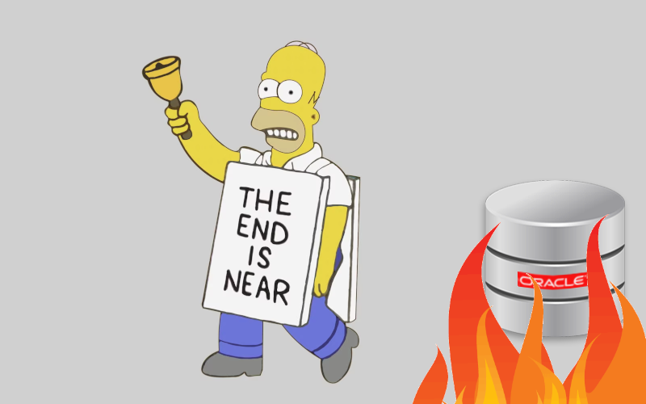
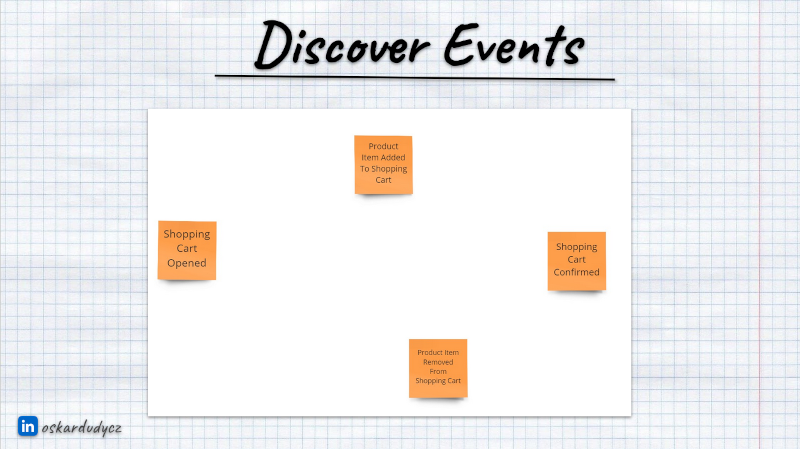
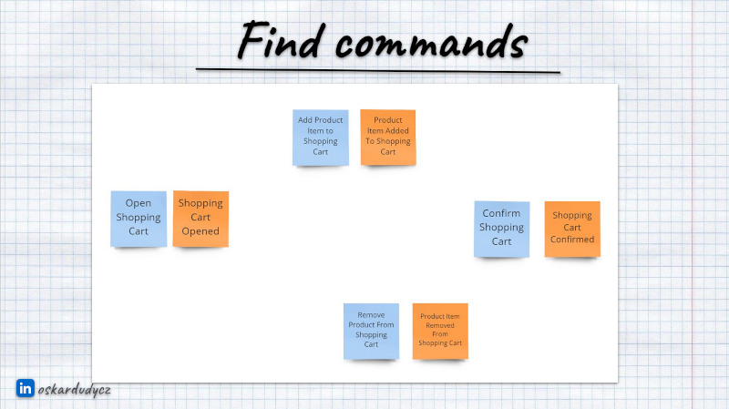
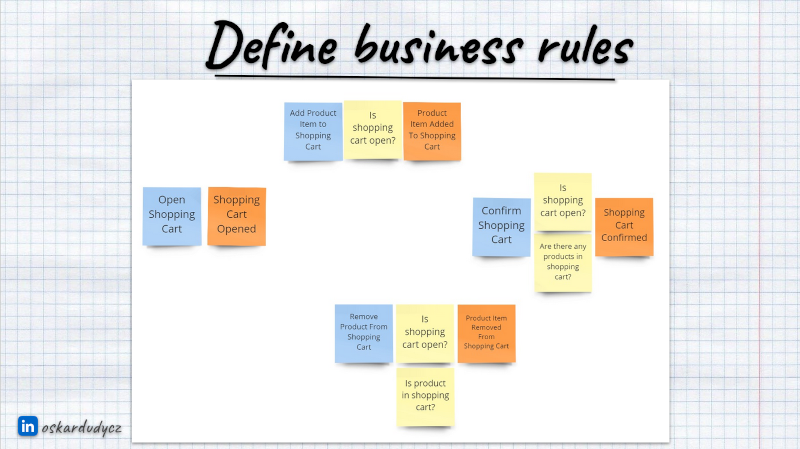
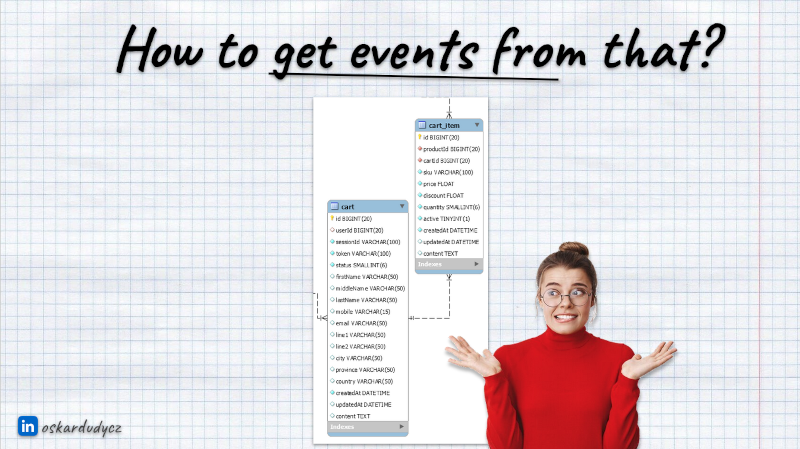
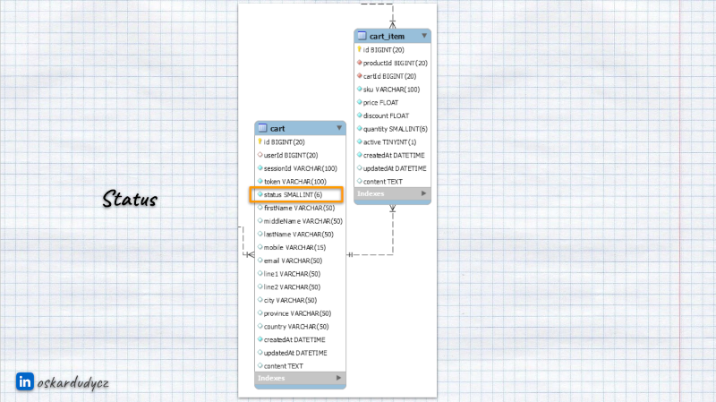
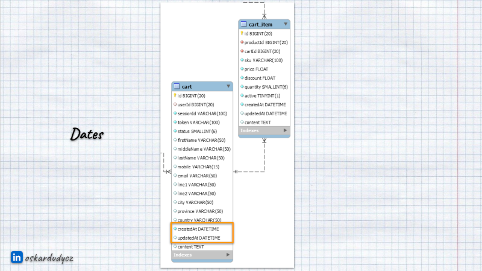
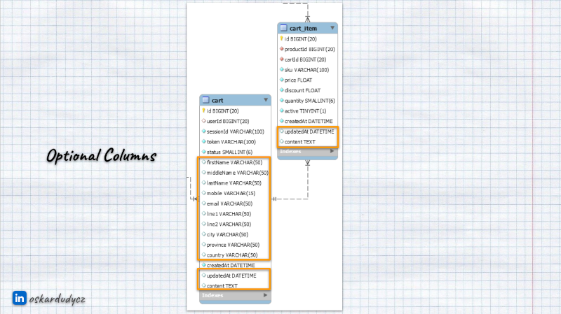

**Knock knock? Who's there? It's me, Oskar, the end is near, did you know that?** Ah, you know it but don't know how to proceed? Let's talk about the end of the CRUD world. Let's provide a Hitchhiker's Guide To Moving Relational Data To Events.

**I hope that you know why the end is near. We've been trying to optimise the storage size; we've made some sins of overriding and losing our precious business data.** Don't worry; I already talked with Saint Peter, and he will pass us through. Those sins shall be forgiven, as we had no other choice. Yet, now we do. We can optimise for information quality instead of its size.

Saint Peter, send me to his colleague, Santa Claus; you remember him? He's making a list and checking it twice. Gonna find out who's naughty or nice. And we've been naughty, oh we were! So, Santa showed me something from his list to prove it:

Ordering Process Model, a blast from the past. Don't you recognise it? Yes, it's not super-readable. Could I zoom it in? Of course, I could, but would it really help us to understand it? We'd see better what data we keep, but only a little about what's happening in our system. Finding processes and how they interact and pass information would be, at best, guessing. But no worries, I told you, the end is near, and it will wash away our past mistakes.

**In Event Sourcing Church, we're not doing that anymore. We're not losing business data; we keep them.** We keep them as events. Events are facts about what has happened, and we store them after each operation. And we're also making a list like Santa, but we call it Event Stream. It's a list of everything that has happened with our record. It's a pity, but you cannot change events, as they're immutable. But you can add a new one in the end and fix your past mistakes. When making decisions, just like Santa, we're reading and checking a list of events (not always twice; we're busy, as we're working more than one day a year).

If you join our Order, you'll find your life more peaceful. We have a clear way of behaving. 

We start modelling our process by discovering events:

Then we find commands, so intentions to run some action. Yes, we're always having good intentions:

   

And we finish our mantra by defining business rules.

Ok, we have a bit more, and we even have a _"picture that explains everything"_ (per [Alberto Brandolini](https://www.eventstorming.com/)):

Sounds a bit simpler than your past mantras, isn't it?

**But still, events are critical here.** They tell the story and show us critical parts of the process. They're building a shared understanding of the process between technical and business people.

Yet, time is running out! The storm is here; the end is coming, so let me tell you how you can help yourself get a second life.

If you're deep into the misery of the DDD, so Database-Driven Design, you should not immediately drop all you had. You should embrace the past, do an examination of conscience and move on! What should you especially examine?

## 1. Look for status columns.

Find what values they had; quite often, they may reflect the lifetime phases of your data. 

So, an order may be initiated, shipped, paid, etc. They can be transferable to events like _Order Initiated_, _Order Shipped_, _Order Paid_. Of course, be careful and don't assume that they're complete. They may be a flattened interpretation of the business process. Always consult that with someone who knows more: best with business. 

Ah, and remember, in Event Sourcing Church, we don't sware. We're not naming events as _Order Created_, _Order Updated_, _Order Deleted_. I told you that you should drop your past sins and start fresh! [State Obsession](/pl/state-obsession/) is a big sin in our decalogue, so beware!

## 2. Check for dates

**Dates columns can tell you a lot about significant occurrences in your process's lifetime.** That speaks something if they're significant enough to keep them as dedicated columns.

Of course, _CreatedDate_ and _ModifiedDate_ won't tell you much, but _ShipmentDate_, _DeliveryDate_, and _OrderPlacementDate_ will give you better information. They can tell you both about the business lingo, confirm our assumptions we got from statuses or introduce new events.

For instance:
- _ShipmentDate_ would be a next clue for introducing _Order Shipped_ event, 
- _OrderPlacementDate_ can suggest that _Order Initiated_ event may be better named _Order Placed_, and best trigger discussion with the business if they're actually the same thing,
- _DeliveryDate_ may mean we should also introduce a new _Order Delivered_ event.

And again, [talk to domain experts](/pl/a_few_words_on_communication/); they can help you be a better member of Event Sourcing Church by embracing the truth about the business process.

## 3. Analyse columns optionality

If columns are non-nullable, then it means that you have to be always provided. Nullable that they may be either provided later (so in other operations) or that they're optional.

So, in our Ordering Process, if columns are required, then the data we keep them should also be provided in the first _Order Initiated_ event. Remember that a single event type is not always a starting point for the stream; there may be more.

## 4. Search for tables with the most 1 to Many relationships

At Event Sourcing Church, we believe that setting up boundaries is an essential aspect. To make our processing effective, we group our data around the business process, not the storage normalisation (as our friends from our fellow [Document-Based Approach](/pl/strategy_on_migrating_relational_data_to_document_based/) convent).

**To find the stream boundaries, you can start by finding tables that have 1 to Many relationships.** Those that _have a lot of ones_ are candidates for the stream types. We should also logically think if this data can live without each other. For instance, shipment can be a separate process from order, but the order line cannot live without it.

Once we start discussing those boundaries, we may find more events and enrich our understanding of the process. 

## 5. Don't lie, introduce explicit events for import

Once you distinguish all events you're fine with and want to migrate your relational data, don't try to cheat; don't reuse your newly found events during import. Relational data is flattened; if you try to retrofit what happened from the final state, you will likely fail or not be precise at best. 

**It's better to be explicit and provide the _Order Imported_ event with all the current states and the code to interpret it.** It gives us clear information on how we got the data about its lifetime, which can be crucial for troubleshooting and diagnostics.

## 6. Experiment and validate

Don't be afraid to [prototype and see your model in motion](/pl/prototype_underestimated_design_skill/). Our church is forgiving!

Try migrations in a safe environment, compare the result with expectations, rinse and repeat. Don't rush things out. We wouldn't like to lose old information but improve our future based on it.

I hope this guide will help you resurrect information you have in your data.  

**The end is near: The end of flattened data and losing business information. Better to start now.** 

Cheers!

Oskar

p.s. You may also like [General strategy for migrating relational data to document-based](/pl/strategy_on_migrating_relational_data_to_document_based/). 

p.s.2. **Ukraine is still under brutal Russian invasion. A lot of Ukrainian people are hurt, without shelter and need help.** You can help in various ways, for instance, directly helping refugees, spreading awareness, putting pressure on your local government or companies. You can also support Ukraine by donating e.g. to [Red Cross](https://www.icrc.org/pl/donate/ukraine), [Ukraine humanitarian organisation](https://savelife.in.ua/pl/donate/) or [donate Ambulances for Ukraine](https://www.gofundme.com/f/help-to-save-the-lives-of-civilians-in-a-war-zone).
