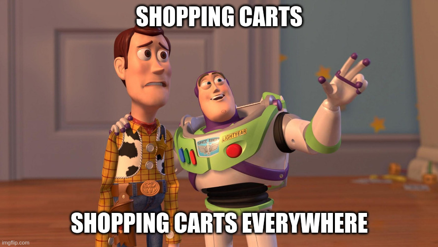

You're reading much more code than you're writing. Readability is a highly subjective term. That's probably why some call what we're doing _craft_ or even _art_. [Last week, we discussed if optimising for code size will help in that](/pl/one_or_more_event_that_is_the_question/) (TLDR, typically, it won't). Let's continue those considerations using the event-based model for our process. Again, we'll use a shopping cart as an example. It is a bit worn-out example, but it'll do for today.

Let's say we have the following description of our process (written in TypeScript):

```typescript
export type ShoppingCartEvent =
  | {
      type: 'ShoppingCartOpened';
      data: {
        shoppingCartId: string;
        clientId: string;
        openedAt: Date;
      };
    }
  | {
      type: 'ProductItemAddedToShoppingCart';
      data: {
        shoppingCartId: string;
        productItem: PricedProductItem;
      };
    }
  | {
      type: 'ProductItemRemovedFromShoppingCart';
      data: {
        shoppingCartId: string;
        productItem: PricedProductItem;
      };
    }
  | {
      type: 'ShoppingCartConfirmed';
      data: {
        shoppingCartId: string;
        confirmedAt: Date;
      };
    }
  | {
      type: 'ShoppingCartCancelled';
      data: {
        shoppingCartId: string;
        cancelledAt: Date;
      };
    };
```

It tells the story of the shopping cart. The customer opens a shopping cart and then adds some products. Optionally, they can remove some products and eventually confirm or cancel if they realise they are not in the mood to spend money.

I'm using TypeScript union types to reflect that we may record either of those facts (event types) for a shopping cart. Read more in [Straightforward Event Sourcing with TypeScript and NodeJS](/pl/type_script_node_Js_event_sourcing/).

Looking at this code, some may say:



And some may be right, as we have it everywhere. In the event type union, in the event names, we also have the shopping cart id in each event's data. If we [keep that event together with the shopping cart entity definition, e.g. in the _shoppingCart.ts_ file](https://github.com/oskardudycz/EventSourcing.NodeJS/blob/main/samples/decider/src/shoppingCarts/shoppingCart.ts), the context could be clear enough not to add it everywhere.

After dropping it, our model would look as follows:

```typescript
export type Event =
  | {
      type: 'Opened';
      data: {
        shoppingCartId: string;
        clientId: string;
        openedAt: string;
      };
    }
  | {
      type: 'ProductItemAdded';
      data: {
        shoppingCartId: string;
        productItem: PricedProductItem;
      };
    }
  | {
      type: 'ProductItemRemoved';
      data: {
        shoppingCartId: string;
        productItem: PricedProductItem;
      };
    }
  | {
      type: 'Confirmed';
      data: {
        shoppingCartId: string;
        confirmedAt: string;
      };
    }
  | {
      type: 'Cancelled';
      data: {
        shoppingCartId: string;
        cancelledAt: string;
      };
    };
```

Now, if we look at how event stores are built (using [Marten](https://martendb.io/) as an example), we may notice that each event will have its own metadata. Metadata will contain stream id. Then why repeat that in all events?

If we removed it then our model would look as follows:

```typescript
export type Event =
  | {
      type: 'Opened';
      data: {
        clientId: string;
        openedAt: string;
      };
    }
  | {
      type: 'ProductItemAdded';
      data: {
        productItem: PricedProductItem;
      };
    }
  | {
      type: 'ProductItemRemoved';
      data: {
        productItem: PricedProductItem;
      };
    }
  | {
      type: 'Confirmed';
      data: {
        confirmedAt: string;
      };
    }
  | {
      type: 'Cancelled';
      data: {
        cancelledAt: string;
      };
    };
```

One could even go to the extreme and remove the timestamps from event data, as we could also have it in the event metadata. That'd end up as:

```typescript
export type Event =
  | {
      type: 'Opened';
      data: {
        clientId: string;
      };
    }
  | {
      type: 'ProductItemAdded';
      data: {
        productItem: PricedProductItem;
      };
    }
  | {
      type: 'ProductItemRemoved';
      data: {
        productItem: PricedProductItem;
      };
    }
  | {
      type: 'Confirmed';
      data: never;
    }
  | {
      type: 'Cancelled';
      data: never;
    };
```

**Look Ma, no repetition!** Isn't that great?

Let's start with the last transformation. Dates are usually quite important. If you buy a car, you'll have multiple dates involved:
- the date you signed the sales agreement,
- the date you've notified the government about the purchase,
- the date you got the registration certificate.

Each of them may be a different one. If you don't provide them explicitly or, worse, use a single date for them, you'll get your process wrong. 

**Timestamps generated by event stores represent the system time when events were physically stored.** Such information probably won't be the same as the business date of the fact you're registering. They may be close, but being close can be quite far away from being correct. 

Also, event stores don't allow you to provide those dates. If you'll need to migrate your data at some point, you'll be doomed. Don't you plan migration? They happen more often than you expect. Sometimes, upgrading to the next database version may require migration if you aren't moving them continuously. Of course, you can do the transformation on the fly, use timestamps from the previous installation and enrich event data. Still, migrations are already not a great experience, so why add more unpleasant steps?

**OK, then what about not having the record ID in events?** I think that events are a form of documentation of our process. We can read the code and understand the flow. If we add a product item, we add it to the specific shopping cart. That's business information. If we remove it from the event data, then we say this information is not essential. 

Still, this approach is quite popular and recommended by some people. Why?
- for some people, keeping that information in event data adds additional noise to understanding the flow. You may assume that your stream will have its id and that all events will share them.
- we're duplicating data and increasing the event's payload redundantly.

I get those comments, and I'm not fully against them. I think they're fair, but my preference is a bit different. I think keeping them is more explicit and better tells us the story of what has happened.

> What about shortening and just removing the shopping cart prefix?

Let's have a look:

```typescript
{
  type: 'ProductItemRemoved';
  data: {
    id: string;
    productItem: PricedProductItem;
  };
}
```

Such structure leaves more questions than answers. What does _"id"_ even mean? Is it a shopping cart id or product id? Or maybe the user id? Nah, don't do that.

**Just like we're designing our code with the reader in mind, we should also design our events.** We need to remember that domain logic is just one of the usages. We also record those events to [build read models](/pl/projections_and_read_models_in_event_driven_architecture/) and [integrate them with other modules](/pl/internal_external_events/). We may fully understand the context and be able to cut corners and reduce the potential noise. But, what's noisy for us may be essential to get understanding for others.

Have a look at the following event:

```typescript
{
  type: 'ProductItemAdded';
  data: {
    productItem: PricedProductItem;
  };
}
```

If you see such an event for the first time, would you be 100% sure that it's coming from the shopping cart? Even if you know, wouldn't you be tempted to double-check that? Wouldn't adding _ShoppingCart_ prefix helped? How much would it hurt you?

Not persuaded enough? Then what would you tell me if you saw the following event for the first time?

```typescript
{
  type: 'Confirmed';
  data: never;
}
```

Shortened event-type names make [convention-based event type mapping](/pl/how_to_map_event_type_by_convention/) harder. Some will say that's great, as you should use [explicit events serialisation](/pl/explicit_events_serialisation_in_event_sourcing/).

**To be clear, I don't say that not putting id into event data is a big mistake.**  We can make that one of the project conventions. But, well, don't you already have a lot of conventions to remember? 

I hope this post will make it easier to understand what you're signing for when choosing your preferred noise-reduction filter. My personal preference is to keep events self-explanatory. I'm a simple man; trying to be too clever usually ends badly for me.

**Please also don't take those considerations as general advice to use redundancy for the win.** I explained that [_"I'll just add one more field"_ attitude is an anti-pattern](/pl/i_will_just_add_one_more_field/). 

Getting the simple model is not easy. We must remember that we're modelling to solve the business process most efficiently. And I believe that keeping our code close to that process and explicit is one of the essential tools to achieve that.

Cheers!

Oskar

p.s. Check also [Internal and external events, or how to design event-driven API](/pl/internal_external_events/)

p.s.2. **Ukraine is still under brutal Russian invasion. A lot of Ukrainian people are hurt, without shelter and need help.** You can help in various ways, for instance, directly helping refugees, spreading awareness, putting pressure on your local government or companies. You can also support Ukraine by donating e.g. to [Red Cross](https://www.icrc.org/pl/donate/ukraine), [Ukraine humanitarian organisation](https://savelife.in.ua/pl/donate/) or [donate Ambulances for Ukraine](https://www.gofundme.com/f/help-to-save-the-lives-of-civilians-in-a-war-zone).
