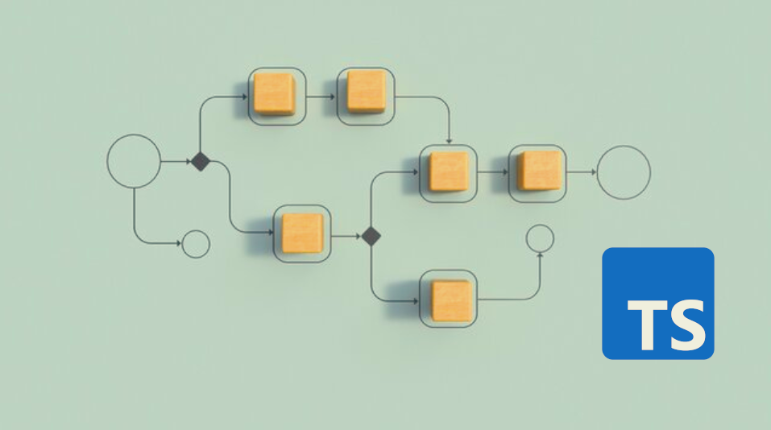
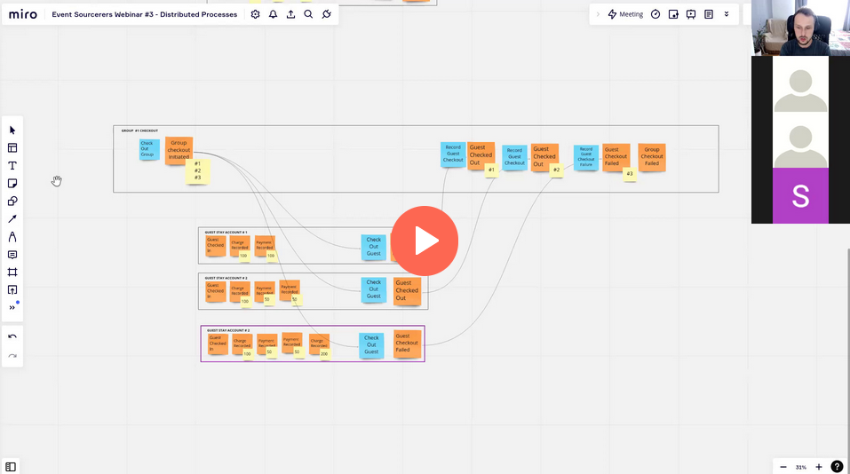

**TypeScript is an intriguing language. Some say that its [type system, by itself, is Turing Complete](https://matt-rickard.com/typescript-type-system-hacks).** Some take it to the extreme and even implement [Flappy Bird in TypeScript types](https://zackoverflow.dev/writing/flappy-bird-in-type-level-typescript/). No worries, we won't take that far today, but I'll show you a few tricks I learned recently. Of course, I'll use the event-driven examples, but you can use those techniques for other needs.

Let's say that our system has two types of messages: commands and events. Commands represent the intention to run some business logic. Events are facts representing information about what has happened in our system. Essentially, events are the outcome of the command handling. (read a more nuanced take in [What's the difference between a command and an event?](/en/whats_the_difference_between_event_and_command/)).

We could define command as:

```typescript
export type Command<
  CommandType extends string = string,
  CommandData extends Record<string, unknown> = Record<string, unknown>,
> = Readonly<{
  type: Readonly<CommandType>;
  data: Readonly<CommandData>;
}>;
```

For instance, we can define the command representing the guest checkout as such:

```typescript
export type CheckOut = Command<
  'CheckOut',
  {
    guestStayAccountId: string;
    now: Date;
    groupCheckoutId?: string;
  }
>;
```

and create the instance of it as:

```typescript
const checkout: CheckOut = {
  type: 'CheckOut',
  data: {
    guestStayAccountId: uuid(),
    now: Date(),
    groupCheckoutId: uuid(),
  },
};
```

So, the command definition tells that the command has type and data. That's represented by _CommandType_ and _CommandData_ in the Command type definition. The weirdly looking _Record<string, unknown>_ just tells that command data can be any object with properties. We're also marking it as read-only, as it's a [Data Transfer Object](https://martinfowler.com/eaaCatalog/dataTransferObject.html) that carries data and, once created, should not be changed.

Accordingly, we could define the Event type as:

```typescript
export type Event<
  EventType extends string = string,
  EventData extends Record<string, unknown> = Record<string, unknown>,
> = Readonly<{
  type: EventType;
  data: Readonly<EventData>;
}>;
```

with example:

```typescript
export type GuestCheckedOut = Event<
  'GuestCheckedOut',
  {
    guestStayAccountId: string;
    checkedOutAt: Date;
    groupCheckoutId?: string;
  }
>;

const checkedOut: GuestCheckedOut = {
  type: 'GuestCheckedOut',
  data: {
    guestStayAccountId: uuid(),
    checkedOutAt: Date(),
    groupCheckoutId: uuid(),
  },
};
```

We could define the type for function making business logic decisions as :

```typescript
export type Decide<
  State extends Record<string, unknown>,
  C extends Command,
  E extends Event,
> = (command: C, state: State) => E[];
```

We take a command and a state, returning one or more events (read more in [Straightforward Event Sourcing with TypeScript and NodeJS](/en/type_script_node_Js_event_sourcing/)). If we define all events and commands for Guest Stay, we can join those types with union. 

```typescript
export type GuestStayAccount =
  | { status: 'NotExisting' }
  | {
      status: 'Opened';
      balance: number;
    }
  | { status: 'CheckedOut' };

export type GuestStayCommand =
  | CheckIn
  | RecordCharge
  | RecordPayment
  | CheckOut;

export type GuestStayAccountEvent =
  | GuestCheckedIn
  | ChargeRecorded
  | PaymentRecorded
  | GuestCheckedOut
  | GuestCheckoutFailed;
```

This is a nice definition of the Guest Stay API. We can then encapsulate the business logic in:

```typescript
export const decide: Decide<
  GuestStayAccount,
  GuestStayCommand,
  GuestStayAccountEvent
> = (
  { type, data: command }: GuestStayCommand,
  state: GuestStayAccount,
): GuestStayAccountEvent[] => {
  const { guestStayAccountId, now } = command;

  switch (type) {
    case 'CheckIn': {
      if (state.status !== 'NotExisting')
        throw Error('Guest is already checked-in!');

      return [
        {
          type: 'GuestCheckedIn',
          data: {
            guestStayAccountId,
            checkedInAt: now,
          },
        },
      ];
    }
    case 'RecordCharge': {
      if (state.status !== 'Opened')
        throw Error('Guest account is already checked out!');

      return [
        {
          type: 'ChargeRecorded',
          data: {
            guestStayAccountId,
            amount: command.amount,
            recordedAt: now,
          },
        },
      ];
    }
    case 'RecordPayment': {
      if (state.status !== 'Opened')
        throw Error('Guest account is already checked out!');

      return [
        {
          type: 'PaymentRecorded',
          data: {
            guestStayAccountId,
            amount: command.amount,
            recordedAt: now,
          },
        },
      ];
    }
    case 'CheckOut': {
      if (state.status !== 'Opened')
        return [
          {
            type: 'GuestCheckoutFailed',
            data: {
              guestStayAccountId,
              groupCheckoutId: command.groupCheckoutId,
              reason: 'NotOpened',
              failedAt: now,
            },
          },
        ];

      const isSettled = state.balance === 0;

      if (!isSettled)
        return [
          {
            type: 'GuestCheckoutFailed',
            data: {
              guestStayAccountId,
              groupCheckoutId: command.groupCheckoutId,
              reason: 'BalanceNotSettled',
              failedAt: now,
            },
          },
        ];

      return [
        {
          type: 'GuestCheckedOut',
          data: {
            guestStayAccountId,
            groupCheckoutId: command.groupCheckoutId,
            checkedOutAt: now,
          },
        },
      ];
    }

    default: {
      const _notExistingCommandType: never = type;
      throw new Error(`Unknown command type`);
    }
  }
};
```

Sweet, we have the pattern for handling the business logic in  Event Sourcing. Thanks to its predictable nature, it's quite straightforward.

Yet, things are getting more complex if we tackle more advanced business processes. Let's try to describe the Group Checkout process that I modelled in the webinar:

[](https://www.architecture-weekly.com/p/webinar-3-implementing-distributed)

In a nutshell, we want to speed up the people's checkout by allowing the clerk to select multiple guest stays and run checkout as a batched, asynchronous process. Read also more in [Event-driven distributed processes by example](/en/event_driven_distributed_processes_by_example/#batch-operations)

**Let's try to reflect the process in code as described by Yves Reynhout in [The Workflow Pattern](https://blog.bittacklr.be/the-workflow-pattern.html).**

The group checkout process can have the following inputs:

```typescript
export type GroupCheckoutInput =
  | InitiateGroupCheckout
  | GuestCheckedOut
  | GuestCheckoutFailed
  | TimeoutGroupCheckout;

export type InitiateGroupCheckout = Command<
  'InitiateGroupCheckout',
  {
    groupCheckoutId: string;
    clerkId: string;
    guestStayAccountIds: string[];
    now: Date;
  }
>;

export type TimeoutGroupCheckout = Command<
  'TimeoutGroupCheckout',
  {
    groupCheckoutId: string;
    startedAt: Date;
    timeOutAt: Date;
  }
>;

export type GuestCheckedOut = Event<
  'GuestCheckedOut',
  {
    guestStayAccountId: string;
    checkedOutAt: Date;
    groupCheckoutId?: string;
  }
>;

export type GuestCheckoutFailed = Event<
  'GuestCheckoutFailed',
  {
    guestStayAccountId: string;
    reason: 'NotOpened' | 'BalanceNotSettled';
    failedAt: Date;
    groupCheckoutId?: string;
  }
>;
```

The clerk initiates the group checkout process after selecting a list of guests stays to checkout. Then, the next steps are triggered by guest checkout completion or failure. Once we get all events back, we can either complete the group checkout (if all guest checkouts succeeded) or fail it. We can also get the request to time out our workflow after the maximum processing time is reached.

The state of our workflow can look like this:

```typescript
export type GroupCheckout =
  | { status: 'NotExisting' }
  | {
      status: 'Pending';
      guestStayAccountIds: Map<string, GuestStayStatus>;
    }
  | { status: 'Finished' };

export const getInitialState = (): GroupCheckout => {
  return {
    status: 'NotExisting',
  };
};

export enum GuestStayStatus {
  Pending = 'Pending',
  Completed = 'Completed',
  Failed = 'Failed',
}
```

It's either not existing, pending or finished.

The output of our process can be defined as:

```typescript
export type GroupCheckoutOutput =
  | GroupCheckoutInitiated
  | CheckOut
  | GroupCheckoutCompleted
  | GroupCheckoutFailed
  | GroupCheckoutTimedOut;

export type GroupCheckoutInitiated = Event<
  'GroupCheckoutInitiated',
  {
    groupCheckoutId: string;
    clerkId: string;
    guestStayAccountIds: string[];
    initiatedAt: Date;
  }
>;

export type GroupCheckoutCompleted = Event<
  'GroupCheckoutCompleted',
  {
    groupCheckoutId: string;
    completedCheckouts: string[];
    completedAt: Date;
  }
>;

export type GroupCheckoutFailed = Event<
  'GroupCheckoutFailed',
  {
    groupCheckoutId: string;
    completedCheckouts: string[];
    failedCheckouts: string[];
    failedAt: Date;
  }
>;

export type GroupCheckoutTimedOut = Event<
  'GroupCheckoutTimedOut',
  {
    groupCheckoutId: string;
    incompleteCheckouts: string[];
    completedCheckouts: string[];
    failedCheckouts: string[];
    timedOutAt: Date;
  }
>;

export type CheckOut = Command<
  'CheckOut',
  {
    guestStayAccountId: string;
    now: Date;
    groupCheckoutId?: string;
  }
>;
```

As mentioned, once the clerk initiated the Group checkout, we spun out the set of _CheckOut_ commands, and then we published the final events once the work was done.

**Let's now try to generalise the workflow definition using the TypeScript type system.** 

Workflow is defined by the set of inputs, outputs and the state. Inputs and outputs can be either commands or events. The heuristic is that inputs are mostly events, and outputs are mostly commands.

Once the workflow is triggered by an input message, it needs to decide what to do next. The result is reflected by the list of output messages. Besides the payload (as [Yves explained in his article](https://blog.bittacklr.be/the-workflow-pattern.html)) they can be enriched by the expected integration context (e.g. whether we're sending commands, publishing events, scheduling delayed messages, etc.).

It can look as follows:

```typescript
export type WorkflowOutput<TOutput extends Command | Event> =
  | { kind: 'Reply'; message: TOutput }
  | { kind: 'Send'; message: TOutput }
  | { kind: 'Publish'; message: TOutput }
  | {
      kind: 'Schedule';
      message: TOutput;
      when: { afterInMs: number } | { at: Date };
    }
  | { kind: 'Complete' }
  | { kind: 'Accept' }
  | { kind: 'Ignore'; reason: string }
  | { kind: 'Error'; reason: string };
```

I extended the original set of semantics with Ignore, Accept and Error. Why? Read more in [No, it can never happen!](/en/no_it_can_never_happen/).

**Now, what if we'd like to be explicit and say that we can send only commands and publish only events?** We would like the TypeScript compiler to tell us if we try to use the event for command and publish for the event. Our current type definition doesn't allow us to do that; why? Because of the [Structural Typing in TypeScript](/en/structural_typing_in_type_script/). Our command and event type definitions have exactly the same structure. Let's get some flavour into it!

**In TypeScript we have so called _Flavouring_ and _Branding_ techniques.** [Wojciech Baczyński explained that in detail in his article](https://brightinventions.pl/blog/branding-flavoring/), but TLDR is that we can add a field that'll differentiate our type. Branding requires providing this optional value; flavouring makes it optional. This can be reflected as:

```typescript
export type Brand<K, T> = K & { readonly __brand: T };
export type Flavour<K, T> = K & { readonly __brand?: T };
```

Using this technique, we can update our Event and Command type definitions as:

```typescript
export type Event<
  EventType extends string = string,
  EventData extends Record<string, unknown> = Record<string, unknown>,
> = Flavour<
  Readonly<{
    type: EventType;
    data: Readonly<EventData>;
  }>,
  'Event'
>;

export type Command<
  CommandType extends string = string,
  CommandData extends Record<string, unknown> = Record<string, unknown>,
> = Flavour<
  Readonly<{
    type: CommandType;
    data: Readonly<CommandData>;
  }>,
  'Command'
>;
```

This looks a bit weird, but we're adding an additional field to tell the typescript compiler _"Hey, I'm Event!"_ or _"Hey, I'm Command!"_. 

Now, having that, we can tell TypeScript that having a set of inputs, I'd like to take the subset of it. This subset should contain only event types:

```typescript
export type WorkflowEvent<Output extends Command | Event> = Extract<
  Output,
  { __brand?: 'Event' }
>;
```

or just command types:

```typescript
export type WorkflowCommand<Output extends Command | Event> = Extract<
  Output,
  { __brand?: 'Command' }
>;
```

We're using the built-in [Extract utility type](https://www.typescriptlang.org/docs/handbook/utility-types.html#extracttype-union). It constructs a type by extracting all union members that are assignable to the union type provided as the type second parameter (so all with a specific brand: Event or Command).

Thanks to that, this won't compile:

```typescript
const event: WorkflowEvent<GroupCheckoutOutput> = {
  type: 'CheckOut',
  data: {
    guestStayAccountId: uuid(),
    now: Date(),
    groupCheckoutId: uuid(),
  },
};
```

but this will:

```typescript
const event: WorkflowCommand<GroupCheckoutOutput> = {
  type: 'CheckOut',
  data: {
    guestStayAccountId: uuid(),
    now: Date(),
    groupCheckoutId: uuid(),
  },
};
```

**We can change our workflow output definition to be explicit and say that we can send only commands and publish only events.**

```typescript
export type WorkflowOutput<TOutput extends Command | Event> =
  | { kind: 'Reply'; message: TOutput }
  | { kind: 'Send'; message: WorkflowCommand<TOutput> }
  | { kind: 'Publish'; message: WorkflowEvent<TOutput> }
  | {
      kind: 'Schedule';
      message: TOutput;
      when: { afterInMs: number } | { at: Date };
    }
  | { kind: 'Complete' }
  | { kind: 'Accept' }
  | { kind: 'Ignore'; reason: string }
  | { kind: 'Error'; reason: string };
```

And the whole Worfklow definition as:

```typescript
export type Workflow<
  Input extends Event | Command,
  State,
  Output extends Event | Command,
> = {
  decide: (command: Input, state: State) => WorkflowOutput<Output>[];
  evolve: (currentState: State, event: WorkflowEvent<Output>) => State;
  getInitialState: () => State;
};
```

Besides what we have discussed so far, I added the requirement to provide the initial state of the workflow through the _getInitialState_ method.

I also introduced the _evolve_ function. We want to store all input and output events to have the full tracing. I'll also use them to build the state of the workflow from them. Read more in [How to get the current entity state from events?](/en/how_to_get_the_current_entity_state_in_event_sourcing/). That's optional, but you should already know, that I like Event Sourcing. It can look as follows:

```typescript
export const evolve = (
  state: GroupCheckout,
  {
    type,
    data: event,
  }: WorkflowEvent<GroupCheckoutInput | GroupCheckoutOutput>,
): GroupCheckout => {
  switch (type) {
    case 'GroupCheckoutInitiated': {
      if (state.status !== 'NotExisting') return state;

      return {
        status: 'Pending',
        guestStayAccountIds: event.guestStayAccountIds.reduce(
          (map, id) => map.set(id, GuestStayStatus.Pending),
          Map<string, GuestStayStatus>(),
        ),
      };
    }
    case 'GuestCheckedOut':
    case 'GuestCheckoutFailed': {
      if (state.status !== 'Pending') return state;

      return {
        ...state,
        guestStayAccountIds: state.guestStayAccountIds.set(
          event.guestStayAccountId,
          type === 'GuestCheckedOut'
            ? GuestStayStatus.Completed
            : GuestStayStatus.Failed,
        ),
      };
    }
    case 'GroupCheckoutCompleted':
    case 'GroupCheckoutFailed':
    case 'GroupCheckoutTimedOut': {
      if (state.status !== 'Pending') return state;

      return {
        status: 'Finished',
      };
    }
    default: {
      const _notExistingEventType: never = type;
      return state;
    }
  }
};
```

We're having fun with the TypeScript system, saying that to evolve the state, we'll just use events from workflow inputs and outputs. We can do that by simply calling:

```typescript
const events: (GroupCheckoutInput | GroupCheckoutOutput)[]= 
  eventStore.readEvents(workflowId);
const initialState = getInitialState();
const state = events.reduce<GroupCheckout>(evolve, initialState);
```

Such state can be used in the decision making as:

```typescript
export const decide = (
  input: GroupCheckoutInput,
  state: GroupCheckout,
): WorkflowOutput<GroupCheckoutOutput>[] => {
  const { type } = input;

  switch (type) {
    case 'InitiateGroupCheckout':
      return initiate(input, state);
    case 'GuestCheckedOut':
    case 'GuestCheckoutFailed':
      return tryComplete(input, state);
    case 'TimeoutGroupCheckout': {
      return timeOut(input, state);
    }
    default: {
      const _notExistingEventType: never = type;
      return [error('UnknownInputType')];
    }
  }
};
```

Togethere with handling methods:

```typescript
const initiate = (
  { data: command }: InitiateGroupCheckout,
  state: GroupCheckout,
): WorkflowOutput<GroupCheckoutOutput>[] => {
  if (state.status !== 'NotExisting')
    return [ignore(IgnoredReason.GroupCheckoutAlreadyInitiated)];

  const checkoutGuestStays = command.guestStayAccountIds.map((id) => {
    return send<GroupCheckoutOutput>({
      type: 'CheckOut',
      data: {
        guestStayAccountId: id,
        now: command.now,
        groupCheckoutId: command.groupCheckoutId,
      },
    });
  });

  return [
    ...checkoutGuestStays,
    publish<GroupCheckoutOutput>({
      type: 'GroupCheckoutInitiated',
      data: {
        groupCheckoutId: command.groupCheckoutId,
        guestStayAccountIds: command.guestStayAccountIds,
        initiatedAt: command.now,
        clerkId: command.clerkId,
      },
    }),
  ];
};

const tryComplete = (
  { type, data: event }: GuestCheckedOut | GuestCheckoutFailed,
  state: GroupCheckout,
): WorkflowOutput<GroupCheckoutOutput>[] => {
  if (!event.groupCheckoutId)
    return [ignore(IgnoredReason.GuestCheckoutWasNotPartOfGroupCheckout)];

  if (state.status === 'NotExisting')
    return [ignore(IgnoredReason.GroupCheckoutDoesNotExist)];

  if (state.status === 'Finished')
    return [ignore(IgnoredReason.GuestCheckoutAlreadyFinished)];

  const { guestStayAccountId, groupCheckoutId } = event;

  const guestCheckoutStatus = state.guestStayAccountIds.get(guestStayAccountId);

  if (isAlreadyClosed(guestCheckoutStatus))
    return [ignore(IgnoredReason.GuestCheckoutAlreadyFinished)];

  const guestStayAccountIds = state.guestStayAccountIds.set(
    guestStayAccountId,
    type === 'GuestCheckedOut'
      ? GuestStayStatus.Completed
      : GuestStayStatus.Failed,
  );

  const now = type === 'GuestCheckedOut' ? event.checkedOutAt : event.failedAt;

  return areAnyOngoingCheckouts(guestStayAccountIds)
    ? [accept()]
    : [
        publish(finished(groupCheckoutId, state.guestStayAccountIds, now)),
        complete(),
      ];
};

const timeOut = (
  { data: event }: TimeoutGroupCheckout,
  state: GroupCheckout,
): WorkflowOutput<GroupCheckoutOutput>[] => {
  if (state.status === 'NotExisting')
    return [ignore(IgnoredReason.GroupCheckoutDoesNotExist)];

  if (state.status === 'Finished')
    return [ignore(IgnoredReason.GroupCheckoutAlreadyFinished)];

  const { groupCheckoutId, timeOutAt } = event;
  const { guestStayAccountIds } = state;

  return [
    publish<GroupCheckoutOutput>({
      type: 'GroupCheckoutTimedOut',
      data: {
        groupCheckoutId,
        incompleteCheckouts: checkoutsWith(
          guestStayAccountIds,
          GuestStayStatus.Pending,
        ),
        completedCheckouts: checkoutsWith(
          guestStayAccountIds,
          GuestStayStatus.Completed,
        ),
        failedCheckouts: checkoutsWith(
          guestStayAccountIds,
          GuestStayStatus.Failed,
        ),
        timedOutAt: timeOutAt,
      },
    }),
    complete(),
  ];
};
```

and helpers to make processing more explicit:

```typescript
export const isAlreadyClosed = (status: GuestStayStatus | undefined) =>
  status === GuestStayStatus.Completed || status === GuestStayStatus.Failed;

const areAnyOngoingCheckouts = (
  guestStayAccounts: Map<string, GuestStayStatus>,
) => guestStayAccounts.some((status) => !isAlreadyClosed(status));

const areAllCompleted = (guestStayAccounts: Map<string, GuestStayStatus>) =>
  guestStayAccounts.some((status) => status === GuestStayStatus.Completed);

const checkoutsWith = (
  guestStayAccounts: Map<string, GuestStayStatus>,
  status: GuestStayStatus,
): string[] =>
  Array.from(guestStayAccounts.filter((s) => s === status).values());

const finished = (
  groupCheckoutId: string,
  guestStayAccounts: Map<string, GuestStayStatus>,
  now: Date,
): GroupCheckoutCompleted | GroupCheckoutFailed => {
  return areAllCompleted(guestStayAccounts)
    ? {
        type: 'GroupCheckoutCompleted',
        data: {
          groupCheckoutId,
          completedCheckouts: Array.from(guestStayAccounts.values()),
          completedAt: now,
        },
      }
    : {
        type: 'GroupCheckoutFailed',
        data: {
          groupCheckoutId,
          completedCheckouts: checkoutsWith(
            guestStayAccounts,
            GuestStayStatus.Completed,
          ),
          failedCheckouts: checkoutsWith(
            guestStayAccounts,
            GuestStayStatus.Failed,
          ),
          failedAt: now,
        },
      };
};

export enum IgnoredReason {
  GroupCheckoutAlreadyInitiated = 'GroupCheckoutAlreadyInitiated',
  GuestCheckoutWasNotPartOfGroupCheckout = 'GuestCheckoutWasNotPartOfGroupCheckout',
  GuestCheckoutAlreadyFinished = 'GuestCheckoutAlreadyFinished',
  GroupCheckoutAlreadyFinished = 'GroupCheckoutAlreadyFinished',
  GroupCheckoutDoesNotExist = 'GroupCheckoutDoesNotExist',
}

export type ErrorReason = 'UnknownInputType';
```

Thanks to the _WorkflowOutput_ definition, we won't be able to produce wrong values.

The final definition of our workflow will look as:

```typescript
export const GroupCheckoutWorkflow: Workflow<
  GroupCheckoutInput,
  GroupCheckout,
  GroupCheckoutOutput
> = {
  decide,
  evolve,
  getInitialState,
};
```

And hey, we modelled the whole workflow, keeping it expressive and type-safe. We also had some fun with the TypeScript type system and reached the end of this article!

I encourage you to play more with TypeScript or similar languages; with advanced types of systems, you can safely model both domain and infrastructure code! Speaking about the code, see the full sample [in my repository](https://github.com/oskardudycz/EventSourcing.NodeJS/tree/2d417bd2e650c16b4af68b6a752bd684ce0a8fc0/samples/hotelManagement/src/workflows).

Also, stay tuned. In one of the following articles, I'll show you how to plug that into the actual infrastructure!

Cheers!

Oskar

p.s. **Ukraine is still under brutal Russian invasion. A lot of Ukrainian people are hurt, without shelter and need help.** You can help in various ways, for instance, directly helping refugees, spreading awareness, putting pressure on your local government or companies. You can also support Ukraine by donating e.g. to [Red Cross](https://www.icrc.org/pl/donate/ukraine), [Ukraine humanitarian organisation](https://savelife.in.ua/pl/donate/) or [donate Ambulances for Ukraine](https://www.gofundme.com/f/help-to-save-the-lives-of-civilians-in-a-war-zone).
