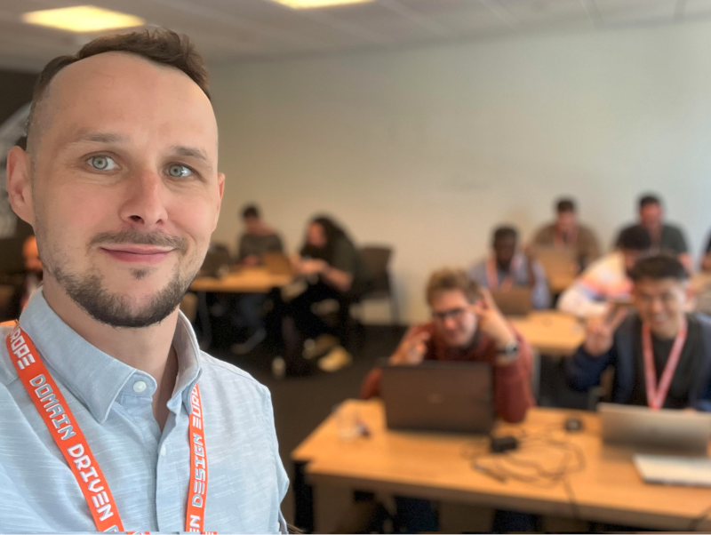
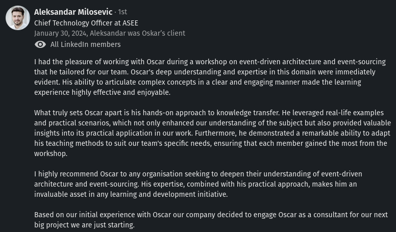
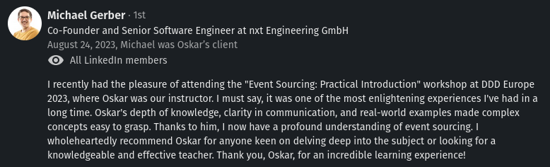
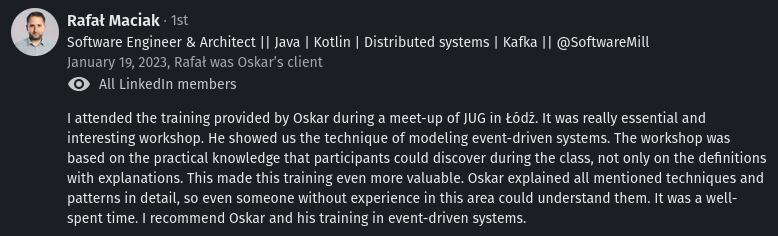

**Putting the career bets is not easy; I made boring and pragmatic choices for most of my career. They took me far.** Yet, I always felt that something was missing and that my systems could be delivered and operated better. I tried many things; I even finished my post-graduate studies around project management. 

**All of that helped me make an impact, but the most significant A-ha moment for me was Event Sourcing. Why?**

It helps to create the synergy between business and development. Thanks to that, we can get the fastest feedback loop, streamline development and operate with more insights and data correlation. We're investing in the quality of the information in our system without losing much.

**Event sourcing is already battle-tested by both big and small companies.** They see the advantages it brings, e.g. business focus and keeping all information about the business process. It can also be a great input to analytics, providing increased diagnostics and tracing. Nowadays, that's essential for running a system on the scale.

There are already decent materials teaching how to start the journey with Event Sourcing. Hell, I wrote over 100 of them on this blog. Yet it's not easy to get certainty that our design will work on production. Even when we get there, it's worth revisiting lessons learned and discovering what we can improve in preparing for the upcoming challenges.

That's why I'm explaining the nuances, strategies, tips, and tricks of having your event-sourced system well-architected. We need more of that!

I want to invite you to my biggest initiative so far!

## A three-day workshop on Production-Grade Event Sourcing: Modelling, DevOps, Process

The goal of this workshop is to strengthen all of the critical aspects of running event-sourced on production:
- modelling (like keeping streams short, managing consistency and efficiently handling business logic, best practices and anti-patterns),
- managing schema evolution, so events versioning,
- advanced projections design and resiliency, so how to get the best from events to efficiently get read models and insights from them,
- DevOps techniques (like traceability, blue-green projection rebuilt, archiving old data),
- handling distributed processes and integrating with other systems,
- putting event sourcing as a vital part of the whole architecture (so how to integrate it with non-event-sourced modules, defining private and public schema).

**The workshop will happen [May 27-29, 2024, as part of Domain Driven Design Europe](https://ddd.academy/production-grade-event-sourcing/)**. Do you know how beautiful Amsterdam is at that time of the year? You better check that!

**[You can sign up through the workshop page.](https://ddd.academy/production-grade-event-sourcing/)**

## What will you learn

After the workshop, you'll understand and practice techniques that will allow you to run your Event-Sourcing system on production.
All the exercises will be backed by the versatile knowledge I gained through my projects and working with my clients. 

I'll share my experience building systems like Marten and EventStoreDB and working as an architect and consultant in many Event Sourcing projects.

We'll start with the project of the system that looks fine as the first production deployment. Through group exercises, a mixture of modelling and practical coding exercises, we'll analyse potential issues step by step. We'll learn how to refactor it step by step without breaking it. That will allow us to fix the boundaries, consistency guarantees, and resiliency. We'll practice both adding new capabilities and changing existing ones. We'll practice schema evolution and DevOps practices like projection rebuilds. We'll end with a more robust and prepared-for-the-next-challenges system.

## Prerequisites

The workshop is designed for people who already have experience with Event Sourcing. Especially for those who would like to assess the production-readiness of their design or already deployed system. We won't start from basics but assume:
- experience in how Event Sourcing works (storing events, building state from them),
- knowledge of how to model business logic and projections/read models,
- Understand that event sourcing is not event streaming and why streaming solutions like Kafka and Pulsar should not be used as event stores.

I assume you know modelling techniques like EventStorming, C4 and modularity concepts (microservices, monolith, CQRS, etc.). And that you were already building and designing web applications. You don't need to be an expert in that, but the more you know the easier it will be.

Most of the exercises will be focused on general understanding and will not be technology-specific, but practical will require knowledge of one of the languages: C#, Java, or TypeScript. We'll use Marten and EventStoreDB as event stores examples.

## What if you don't have Event Sourcing experience yet?

I've got you covered! Check my [self-paced kit](/pl/introduction_to_event_sourcing/).

See the playlist with my talks:

`youtube: https://www.youtube.com/watch?v=jnDchr5eabI&list=PLw-VZz_H4iiqUeEBDfGNendS0B3qIk-ps&index=1&t=3067s`

Of course, that's not the full experience of doing a [workshop](/pl/training/), but it can be a good starting point.

**If you need more than that and want full coverage with all nuances of the private workshop, check [the training page](/pl/training/). Feel invited to contact me via [email](mailto:oskar@event-driven.io). I'm happy to help you via consultancy or paid mentoring!**

If you're not persuaded enough, check [recommendations from my previous clients on my LinkedIn profile.](https://www.linkedin.com/in/oskardudycz/).

Here are some of them:

**[Again, feel invited to sign up for the workshop.](https://ddd.academy/production-grade-event-sourcing/). And [contact me](mailto:oskar@event-driven.io) if you have any questions.**

See you in Amsterdam!

Cheers.

Oskar

p.s. **Ukraine is still under brutal Russian invasion. A lot of Ukrainian people are hurt, without shelter and need help.** You can help in various ways, for instance, directly helping refugees, spreading awareness, putting pressure on your local government or companies. You can also support Ukraine by donating e.g. to [Red Cross](https://www.icrc.org/pl/donate/ukraine), [Ukraine humanitarian organisation](https://savelife.in.ua/pl/donate/) or [donate Ambulances for Ukraine](https://www.gofundme.com/f/help-to-save-the-lives-of-civilians-in-a-war-zone).
