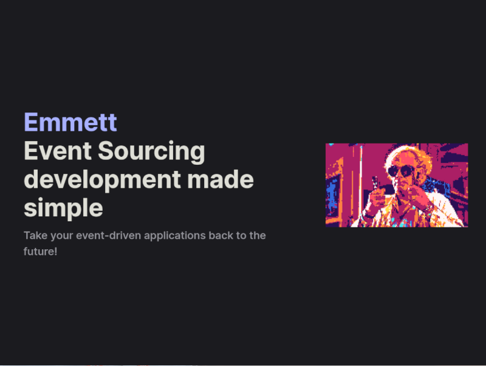

**Simple is not easy. Each person has its definition of it.** For me, it means that when I look at the solution, I think: _"So simple. Why didn't I come up with it?". That also means that it's straightforward to understand.

**In recent years, I went down the rabbit hole trying to explain to you and other readers that Event Sourcing and CQRS can be effective and simple.** I wrote hundreds of articles, delivered samples in multiple languages and worked on tooling like Marten and EventStoreDB. I'm also doing [workshops and consultancy](/pl/training). 

**Why do I do it?** I don't want to be a content creator or influencer. That's not my goal. I just saw in my projects that Event Sourcing and CQRS are working and helping to build better applications. If applied in a simple way, they not only do not bring additional complexity but are cutting it.

Again, simple is not easy. But why?

Because it requires a lot of iterations and experience, it's hard to learn from other people's mistakes. Reading blogs is kinda like trying to do it. Thanks to that, you can avoid some, but not all. Wouldn't it be nice to be walked through by hand sometimes?

Event Sourcing in CQRS having the guidance is easier than in other approaches. They have common and repeatable patterns like:
- you read events and build the state from them,
- you take this state and command and run business logic on them returning event or multiple events,
- you append those events to the event stream,
- rinse, repeat.

But well, you can always forget about it, or your colleague.

**That's why I decided to release [Emmett](https://event-driven-io.github.io/emmett/).** I gathered a catalogue of Node.js and TypeScript patterns in my blog and [sample repository](https://github.com/oskardudycz/EventSourcing.NodeJS).

You can already use it by calling:

```bash
npm add @event-driven-io/emmett
```

It already has the first set of documentation: [check here](https://event-driven-io.github.io/emmett/).

**Why Node.js and TypeScript?**

For me, it's the environment I feel the most effective in. I like its minimalistic approach and flexibility, plus TypeScript is an excellent language with its shapeshifter capabilities. It doesn't require much boilerplate; it cuts the cognitive load, so it aligns with my current vision of building applications.

**Why Emmett?**

[Because I want to take your event-driven applications back to the future!](https://en.m.wikipedia.org/wiki/Emmett_Brown).

**Is it production-ready?**

Kinda. What is here is already usable, but you'll need to wait for the full production experience in all essential aspects.

**What features does it have?**

Essential building blocks for designing and running business and application logic like:
- typings around events, commands, Deciders, Workflows, etc.
- command handling wrappers for the application layer,
- basic, in-memory event store implementation.

**What features will it have?**

We'll see, but I'd like to have the following at some point:

- building blocks for the Web Apis with Event Sourcing and CQRS,
- implementation of event store using EventStoreDB, PostgreSQL, SQLite, etc.
- abstractions for building read models,
- building blocks for integration and running distributed processes,
- built-in open telemetry,
- GraphQL API for event stores,
- Full stack development helpers with Next.js or HTMX,
- running it serverless or on the web with SQLite,
- streaming data through HTTP API (and enabling integration scenarios through it).
- defining event transformations and projections with WebAssembly,
- etc.

**Would it be a competitor to other stores?**

Probably not. For now, I'd like to have a safe playground to have fun, experiment and try out new ideas. Still, I expect what I deliver to be safe to use in production.

**Why there's no license?**

Because I'm unsure how this will end, and I don't want to expose it as an MIT license from the beginning.

**[So try it on your own, have fun and send me feedback!](https://event-driven-io.github.io/emmett/getting-started.html)** 

[Join our Discord](https://discord.gg/fTpqUTMmVa) to be a part of building it!

Read also more about Node.js and Event Sourcing to get what I want to provide out of the box:
- [Straightforward Event Sourcing with TypeScript and NodeJS](/pl/type_script_node_Js_event_sourcing/)
- [How TypeScript can help in modelling business workflows](/pl/how_to_have_fun_with_typescript_and_workflow/)
- [How to get the current entity state from events?](/pl/how_to_get_the_current_entity_state_in_event_sourcing/)
- [How to test event-driven projections](/pl/testing_event_driven_projections/)
- [How to tackle compatibility issues in ECMA Script modules (and in general)](/pl/how_to_tackle_esmodules_compatibility_issues)
- [Introduction to Event Sourcing - Self Paced Kit](/pl/introduction_to_event_sourcing/)
- [Dealing with Eventual Consistency and Idempotency in MongoDB projections](/pl/dealing_with_eventual_consistency_and_idempotency_in_mongodb_projections/)
- [How to use ETag header for optimistic concurrency](/pl/how_to_use_etag_header_for_optimistic_concurrency/)
- [Long-polling, how to make our async API synchronous](/pl/long_polling_and_eventual_consistency/)
- [Fun with serial JSON](/pl/fun_with_json_serialisation/)
- [Structural Typing in TypeScript](/pl/structural_typing_in_type_script/)
- [Why Partial<Type> is an extremely useful TypeScript feature?](/pl/partial_typescript/)
- [How events can help in making the state-based approach efficient](/pl/how_events_can_help_on_making_state_based_approach_efficient/)
- [My journey from Aggregates to Functional Composition](/my_journey_from_aggregates/)

Cheers.

Oskar

p.s. **Ukraine is still under brutal Russian invasion. A lot of Ukrainian people are hurt, without shelter and need help.** You can help in various ways, for instance, directly helping refugees, spreading awareness, putting pressure on your local government or companies. You can also support Ukraine by donating e.g. to [Red Cross](https://www.icrc.org/pl/donate/ukraine), [Ukraine humanitarian organisation](https://savelife.in.ua/pl/donate/) or [donate Ambulances for Ukraine](https://www.gofundme.com/f/help-to-save-the-lives-of-civilians-in-a-war-zone).
