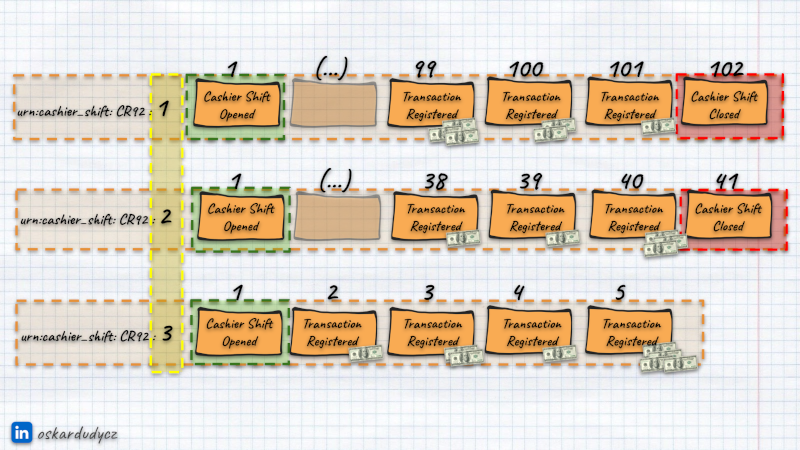

**No one knows who invented Event Sourcing. I overheard that [Hammurabi did](https://www.investopedia.com/articles/financialcareers/09/ancient-accounting.asp).** Why? Because he standardised the first set of rules of accounting.

Event Sourcing works as bookkeeping; we record new entries for each business operation. Not surprisingly, accounting patterns also work well in event sourcing.

**For instance, we can use the "Closing the Books" pattern to model the lifecycle process effectively.** [Its name comes from the accounting domain](https://courses.lumenlearning.com/sac-finaccounting/chapter/journalizing-and-posting-closing-entries/). All financial numbers are summarised and verified, and the final report is created at the end of each cycle (e.g., month and year). This data is used as a base for the next period. For accounting calculations, you don't need to bring forward the entire history; it's enough to summarise the crucial aspects to be carried forward, i.e. the opening balances, etc. The same pattern can be used for temporal modelling.

I explained this pattern in detail in [Keep your streams short! Temporal modelling for fast reads and optimal data retention](https://www.eventstore.com/blog/keep-your-streams-short-temporal-modelling-for-fast-reads-and-optimal-data-retention).

And the talk:

`youtube: https://www.youtube.com/watch?v=gG6DGmYKk4I`

**Closing the Books is the essence of Event Sourcing modelling.** Thanks to that, we can keep things short and thus run our system efficiently. We're slicing the lifetime of our process, marking the start and end of the lifecycle using events.

In this article, I assume you have read/watched, or skimmed the above resources. I'll focus on the practical example using Marten. I know that's not entirely to say _"Go read that, before we talk"_, but really: _"Go read that"_. It took me three months to write the article, and a bit less to prepare the talk. Of course, this article may be enough to grab the concept, but there you find more nuanced considerations.

**Still, we'll diverge from the accounting domain.** I started explaining Event Sourcing like many of us: using a Bank Account example. [But I stopped](/en/bank_account_event_sourcing/). It's a business domain that most of us believe in knowing how it works, but it's much different from what we may expect.

How much different? There's no database transaction between multiple bank accounts while transferring money. A Bank Account is also not an entity or transactional boundary. In accounting, we add lifecycle and work on, e.g. Accounting Month.

Yes, there's no spoon.

**Let's use a scenario close to a financial domain but not the same, plus not tied to a specific time period: cashiers in stores** (also used in the original article above). We could try to model that by keeping all transactions for the particular cash register on the same stream, but if we're building a system for bigger department stores, then that could quickly escalate. We might end up with a stream containing thousands of events. That quickly could make our processing inefficient and unmanageable.

**Yet, if we talked with our domain experts, we could realise this is not how our business works.** All payments are registered by specific cashiers, and the cashiers care only about what has happened in their shift. They don't need to know the entire history of transactions, just the starting amount of cash in the drawer  (called _float_) that was left from the previous shift.

Let's try to reflect that in the simplified event model:

```csharp
public abstract record CashierShiftEvent
{
    public record ShiftOpened(
        CashierShiftId CashierShiftId,
        string CashierId,
        decimal Float,
        DateTimeOffset StartedAt
    ): CashierShiftEvent;

    public record TransactionRegistered(
        CashierShiftId CashierShiftId,
        string TransactionId,
        decimal Amount,
        DateTimeOffset RegisteredAt
    ): CashierShiftEvent;

    public record ShiftClosed(
        CashierShiftId CashierShiftId,
        decimal DeclaredTender,
        decimal OverageAmount,
        decimal ShortageAmount,
        decimal FinalFloat,
        DateTimeOffset ClosedAt
    ): CashierShiftEvent;

    private CashierShiftEvent(){}
}
```

So we have _ShiftOpened_ and _ShiftClosed_ events marking the lifetime of the cashier shift and _TransactionRegistered_ to register the payments. Of course, we would have more types of events possibly happening between shift opening and closing, but let's keep it simple. Just assume that _TransactionRegistered_ is an example of the events you may have throughout the shift lifecycle.

**You could notice _CashierShiftId_ as a class, not a primitive value.** It's an example of the strongly-typed key:

```csharp
public record CashierShiftId(string CashRegisterId, int ShiftNumber)
{
    public static implicit operator string(CashierShiftId id) => id.ToString();

    public override string ToString() => $"urn:cashier_shift:{CashRegisterId}:{ShiftNumber}";
}
```

I'm not a big fan of the ceremony brought by strongly typed key wrappers, but it makes perfect sense here. It's not just a wrapper for a _Guid_ or _string_ value. Our cashier shift id is built from two components:
- cash register id,
- shift number.

We're using the [Uniform Resource Name structure (_URN_)](https://en.wikipedia.org/wiki/Uniform_Resource_Name).

```
urn:cashier_shift:{CashRegisterId}:{ShiftNumber}
```

You can use any format, but URN is the standardised way for handling ids with meaningful segments. Why reinvent the wheel if we have a standard for it? Our URN starts with the prefix and stream type. Then, we have cash register id and shift number segments.

We could add more components, e.g., date, if we'd like to have it sliced by a temporal aspect. So, having shift numbers reset every day. Most importantly, we're defining the explicit lifetime for our cashier shift.

If you are using EventStoreDB, you'd need to structure it a bit differently: _cashier\_shift-{cashRegisterId}:{number}_. EventStoreDB expects the first part to represent the _category_, so for our stream type, we need to have a dash followed by the unique stream ID part.


By default, Marten uses _Guid_ as stream key, but [it allows to use string](https://martendb.io/events/configuration.html#stream-identity). To do that, we need to change that in the configuration:

```csharp
services.AddMarten(options =>
    {
        options.Events.StreamIdentity = StreamIdentity.AsString;

        // (...)
    });
```

Read also:
- we can use it to define the stream id representing cashier shift (read more in [Event stores are key-value databases, and why that matters](/en/event_stores_are_key_value_stores/)),
- by that ensures uniqueness that there are no two shifts with the same number (read more in [How to ensure uniqueness in Event Sourcing](/en/uniqueness-in-event-sourcing/)),
- use it also as a strongly-typed entity identifier if we really want (read more in [Using strongly-typed identifiers with Marten](/en/using_strongly_typed_ids_with_marten/))

Moving on, our cashier shift can be modelled as follows:

```csharp
public record CashierShift
{
    public record NonExisting: CashierShift;

    public record Opened(
        CashierShiftId ShiftId,
        decimal Float
    ): CashierShift;

    public record Closed(
        CashierShiftId ShiftId,
        decimal FinalFloat
    ): CashierShift;

    private CashierShift() { }

    public string Id { get; init; } = default!;
}
```

It's either non-existent when there are no shifts, open or closed. It's trimmed to contain only information needed for decision-making (read more in [Slim your aggregates with Event Sourcing!](/en/slim_your_entities_with_event_sourcing/)). We could build it from 
events as:

```csharp
public record CashierShift
{
    // (...)

    public CashierShift Apply(CashierShiftEvent @event) =>
        (this, @event) switch
        {
            (_, ShiftOpened shiftOpened) =>
                new Opened(shiftOpened.CashierShiftId, shiftOpened.Float),

            (Opened state, TransactionRegistered transactionRegistered) =>
                state with { Float = state.Float + transactionRegistered.Amount },

            (Opened state, ShiftClosed shiftClosed) =>
                new Closed(state.ShiftId, shiftClosed.FinalFloat),

            _ => this
        };
}
```

Ok, let's add the final building block: cash register setup. We need the cash register to have cashier shifts happening on it:

```csharp
public record CashRegister(string Id)
{
    public static CashRegister Create(CashRegisterInitialized @event) =>
        new(@event.CashRegisterId);
}

public record CashRegisterInitialized(
    string CashRegisterId,
    DateTimeOffset InitializedAt
);

public record InitializeCashRegister(
    string CashRegisterId,
    DateTimeOffset Now
);

public static class CashRegisterDecider
{
    public static object[] Decide(InitializeCashRegister command) =>
        [new CashRegisterInitialized(command.CashRegisterId, command.Now)];
}
```

Let's now define the set of methods we'll allow in our process. Accordingly, to events it'll be: _OpenShift_, _RegisterTransaction_, _CloseShift_:

```csharp
public abstract record CashierShiftCommand
{
    public record OpenShift(
        string CashRegisterId,
        string CashierId,
        DateTimeOffset Now
    ): CashierShiftCommand;

    public record RegisterTransaction(
        CashierShiftId CashierShiftId,
        string TransactionId,
        decimal Amount,
        DateTimeOffset Now
    ): CashierShiftCommand;

    public record CloseShift(
        CashierShiftId CashierShiftId,
        decimal DeclaredTender,
        DateTimeOffset Now
    ): CashierShiftCommand;

    private CashierShiftCommand(){}
}
```

Our decision-making process will look as follows:

```csharp
public static class CashierShiftDecider
{
    public static object[] Decide(CashierShiftCommand command, CashierShift state) =>
        (command, state) switch
        {
            (OpenShift open, NonExisting) =>
            [
                new ShiftOpened(
                    new CashierShiftId(open.CashRegisterId, 1),
                    open.CashierId,
                    0,
                    open.Now
                )
            ],

            (OpenShift open, Closed closed) =>
            [

                new ShiftOpened(
                    new CashierShiftId(open.CashRegisterId, closed.ShiftId.ShiftNumber + 1),
                    open.CashierId,
                    closed.FinalFloat,
                    open.Now
                )
            ],

            (OpenShift, Opened) => [],

            (RegisterTransaction registerTransaction, Opened openShift) =>
            [
                new TransactionRegistered(
                    openShift.ShiftId,
                    registerTransaction.TransactionId,
                    registerTransaction.Amount,
                    registerTransaction.Now
                )
            ],

            (CloseShift close, Opened openShift) =>
            [
                new ShiftClosed(
                    openShift.ShiftId,
                    close.DeclaredTender,
                    close.DeclaredTender - openShift.Float,
                    openShift.Float - close.DeclaredTender,
                    openShift.Float,
                    close.Now
                )
            ],
            (CloseShift, Closed) => [],

            _ => throw new InvalidOperationException($"Cannot run {command.GetType().Name} on {state.GetType().Name}")
        };
}
```

Yes, I like [functional programming](/en/my_journey_from_aggregates/), and I used new pattern-matching capabilities in C# here. If you're not into it much yet, I'm passing the state and the command, and depending on its type, I'm running a specific business logic.

1. Upon _OpenShift_ command, I'm returning _ShiftOpened_ event with the shift number equal to _0_ when there was no state or incrementing the last shift number,
2. If the shift is already opened, I'm not returning any events, making it irrelevant, so I am not making any changes and not throwing any exceptions.
3. Registering transaction is just straightforward: adding a new event,
- I'm doing the necessary summaries upon the _CloseShift_ command. I could also do here validation if the declared tender (so cash in drawer) is equal to the current float, but I didn't want to blur the process,
4. When trying to close an already closed shift, I'm making it idempotent accordingly as opening an already opened shift.
5. If there was an invalid or unexpected combination of command and state, I just throw _InvalidOperationException_. Pattern matching allows me to spare some if statements.

**The essential scenario happens here:**

```csharp
(OpenShift open, Closed closed) =>
[

    new ShiftOpened(
        new CashierShiftId(open.CashRegisterId, closed.ShiftId.ShiftNumber + 1),
        open.CashierId,
        closed.FinalFloat,
        open.Now
    )
],
```

Why is it essential? Let's have a look at what our stream can look like.



As you can see, the closed shift is a different stream than the one we'll open. We're setting that up in:

```csharp
new CashierShiftId(
    open.CashRegisterId, 
    closed.ShiftId.ShiftNumber + 1
);
```

Reminder that's also reflected in our id structure:

```
urn:cashier_shift:{CashRegisterId}:{ShiftNumber}
```

## Closing and opening shift as one operation

**Cool stuff, but how to effectively perform it?** Let's start with composing closing and opening:

```csharp
using CommandResult = (CashierShiftId StreamId, CashierShiftEvent[] Events);

public record CloseAndOpenCommand(
    CashierShiftId CashierShiftId,
    string CashierId,
    decimal DeclaredTender,
    DateTimeOffset Now
);

public static class CloseAndOpenShift
{
    public static (CommandResult, CommandResult) Handle(CloseAndOpenCommand command, CashierShift currentShift)
    {
        // close current shift
        var (currentShiftId, cashierId, declaredTender, now) = command;
        var closingResult = Decide(new CloseShift(currentShiftId, declaredTender, now), currentShift);

        // get new current shift state by applying the result event(s)
        currentShift = closingResult.Aggregate(currentShift, (current, @event) => current.Apply(@event));

        // open the next shift
        var openResult = Decide(new OpenShift(currentShiftId, cashierId, now), currentShift);

        // double check if it was actually opened
        var opened = openResult.OfType<ShiftOpened>().SingleOrDefault();
        if (opened == null)
            throw new InvalidOperationException("Cannot open new shift!");

        // return both results with respective stream ids
        return ((currentShiftId, closingResult), (opened.CashierShiftId, openResult));
    }
}
```

We're running two commands sequentially, returning the results from both operations together with ids. Read also more in [How to handle multiple commands in the same transaction](/en/simple_transactional_command_orchestration/). 

If we're using Marten, we can benefit from PostgreSQL transactional capabilities and [Marten built-in Unit of Work](https://martendb.io/documents/sessions.html#unit-of-work-mechanics).

```csharp

public static class CloseAndOpenShift
{
    public static async Task<CashierShiftId> CloseAndOpenCashierShift(
        this IDocumentSession documentSession,
        CloseAndOpenCommand command,
        int version,
        CancellationToken ct
    )
    {
        var currentShift =
            await documentSession.Events.AggregateStreamAsync<CashierShift>(command.CashierShiftId, token: ct) ??
            new CashierShift.NonExisting();

        var (closingResult, openResult) = Handle(command, currentShift);

        // Append Closing result to the old stream
        if (closingResult.Events.Length > 0)
            documentSession.Events.Append(closingResult.StreamId, version, closingResult.Events.AsEnumerable());

        if (openResult.Events.Length > 0)
            documentSession.Events.StartStream<CashierShift>(openResult.StreamId, openResult.Events.AsEnumerable());

        await documentSession.SaveChangesAsync(ct);

        return openResult.StreamId;
    }
}
```

**Thanks to the predictable structure of the id and calling the _StartStream_ method, we're ensuring that if the new shift has already been opened, then our operation will be rejected.** We won't have any duplicated shifts.

We can use this code in the endpoint:

```csharp
app.MapPost("/api/cash-registers/{cashRegisterId}/cashier-shifts/{shiftNumber:int}/close-and-open",
    async (
        IDocumentSession documentSession,
        string cashRegisterId,
        int shiftNumber,
        CloseAndOpenShiftRequest body,
        [FromIfMatchHeader] string eTag,
        CancellationToken ct
    ) =>
    {
        var command = new CloseAndOpenCommand(
            new CashierShiftId(cashRegisterId, shiftNumber),
            body.CashierId,
            body.DeclaredTender,
            Now
        );

        var openedCashierId = await documentSession.CloseAndOpenCashierShift(command, ToExpectedVersion(eTag), ct);

        return Created(
            $"/api/cash-registers/{cashRegisterId}/cashier-shifts/{openedCashierId.ShiftNumber}",
            cashRegisterId
        );
    }
);
```

As you can see, we greatly benefit from the repeatability and [composability of the Event Sourcing and Decider pattern](/en/how_to_effectively_compose_your_business_logic/) and Marten's transactional capabilities.

We're also using [optimistic concurrency with ETag](/en/how_to_use_etag_header_for_optimistic_concurrency/) to ensure we won't face concurrency issues. Thanks to that, we will know we're making decisions based on the expected state.

## Closing and opening shifts as separate operations

The pattern of closing and opening as one operation can be suitable if our lifecycles are continuous. Yet, typically, they're not. Occupancy of the cash registers by cashiers depends on the traffic. There may be periods when no one works on the particular cash register. How to handle that?

Let's tackle that step by step, starting from the end, so from the closing. It'll be a simple operation now:

```csharp
app.MapPost("/api/cash-registers/{cashRegisterId}/cashier-shifts/{shiftNumber:int}/close",
    (
        IDocumentSession documentSession,
        string cashRegisterId,
        int shiftNumber,
        CloseShiftRequest body,
        [FromIfMatchHeader] string eTag,
        CancellationToken ct
    ) =>
    {
        var cashierShiftId = new CashierShiftId(cashRegisterId, shiftNumber);

        return documentSession.GetAndUpdate<CashierShift, CashierShiftEvent>(cashierShiftId, ToExpectedVersion(eTag),
            state => Decide(new CloseShift(cashierShiftId, body.DeclaredTender, Now), state), ct);
    }
);
```

I'm using here a simple wrapper that will load events from the stream, build the state from it, run business logic and append event result events if there are such:

```csharp

public static class DocumentSessionExtensions
{
    public static Task GetAndUpdate<T, TEvent>(
        this IDocumentSession documentSession,
        string id,
        int version,
        Func<T, TEvent[]> handle,
        CancellationToken ct
    ) where T : class =>
        documentSession.Events.WriteToAggregate<T>(id, version, stream =>
        {
            var result = handle(stream.Aggregate);
            if (result.Length != 0)
                stream.AppendMany(result.Cast<object>().ToArray());
        }, ct);
}
```

**Opening will be more complicated.** We need to get the shift number and data from the last closed one (like _float_, the state of the cash in the drawer after the last shift). Of course, the cashier could provide the previous shift number, but that's error-prone and potential vulnerability. It'd be better if we track that on our own. And the best way for that is to build a model that would cache the information. We could define an updated projection based on the registered events.

What should such a model contain? Potentially it could cache all needed information to open new shift, e.g.:

```csharp
public record CashierShiftTracker(
    string Id, // Cash Register Id
    string LastClosedShiftNumber,
    string LastClosedShiftFloat,
    // (...) etc.
);
```

That looks fine, as we could start by querying it and getting the needed information from it. Yet, in my opinion, that solution is not scalable and can provide some issues while maintaining. Our process may change, and we'll need to update this projection each time that impacts closing or opening. That can create issues with versioning this model, updating it as it goes etc.

**I think it'd be better to generalise it and make it agnostic to the specifics of our process.** Closing the Books pattern is repeatable:
- Store summary of the closed streams needed for audit and for the next lifecycle period,
- When opening, get data from the last event in the closed lifecycle and use it to start a new period and stream.

I wrote in [Let's talk about positions in event stores](/en/lets_talk_about_positions_in_event_stores/) that Marten keeps the global sequence number. It's a monotonic number. There may be gaps when an event is not added for some reason (e.g. a conflict or transient error). It's unique for each event. We could use it as a reference to the closing event.

```csharp
public record CashierShiftTracker(
    string Id, // Cash Register Id
    long? LastShiftClosedSequence
);
```

Now, let's define the multi-stream projection that will start tracking progress when the cash register is initialised and update it with each cashier shift closing event. We'll get it from the event metadata (Marten's _IEvent_ wrapper).

```csharp
public class CashierShiftTrackerProjection: MultiStreamProjection<CashierShiftTracker, string>
{
    public CashierShiftTrackerProjection()
    {
        Identity<CashRegisterInitialized>(e => e.CashRegisterId);
        Identity<CashierShiftEvent.ShiftClosed>(e => e.CashierShiftId.CashRegisterId);
    }

    public CashierShiftTracker Create(CashRegisterInitialized initialized) =>
        new(initialized.CashRegisterId, null);

    public CashierShiftTracker Apply(IEvent<CashierShiftEvent.ShiftClosed> closed, CashierShiftTracker current) =>
        current with { LastShiftClosedSequence = closed.Sequence };
}
```

We need to register it in the Marten configuration.

```csharp
services.AddMarten(options =>
    {
        options.Projections.Add<CashierShiftTrackerProjection>(ProjectionLifecycle.Async);

        // (...)
    });
```

**The safest option for multi-stream projection is to register it as asynchronous.** It will ensure that all events are run sequentially. Yet, it will introduce eventual consistency as it'll be processed in the background. Getting the stale data is not dangerous. We're using optimistic concurrency and have the uniqueness enforced by the predictable stream id structure. In the worst case, we may need to retry our handling.

The other option is to register it as _inline_. Then, the projection will be updated in the same transaction as the appended event. This will also work for our case because there cannot be parallel shift closings for the particular cash register. Still, as a general rule, we should try to avoid it, as optimistic concurrency will only ensure concurrency on a specific single stream. We have multiple streams, so they could override each other when we have a high load.

Pick your poison, depending on your use case.

Let's discuss using this model to locate the last cashier shift. We'll define a dedicated method for that to encapsulate the locator logic:

```csharp
public static class LastCashierShiftLocator
{
    public static async Task<CashierShift> GetLastCashierShift(
        this IDocumentSession documentSession,
        string cashRegisterId
    )
    {
        var tracker = await documentSession.LoadAsync<CashierShiftTracker>(cashRegisterId);

        if (tracker is null)
            throw new InvalidOperationException("Unknown cash register!");

        var lastClosedShiftEvent = tracker.LastShiftClosedSequence.HasValue
            ? (await documentSession.Events.QueryAllRawEvents()
                .SingleAsync(e => e.Sequence == tracker.LastShiftClosedSequence.Value)).Data
            : null;

        return lastClosedShiftEvent is ShiftClosed closed
            ? new CashierShift.Closed(closed.CashierShiftId, closed.FinalFloat)
            : new CashierShift.NonExisting();
    }
}
```

As explained above, we're getting the tracking information, loading the last event (if there's such) and returning the _ClosedShift_ or _NonExisting_ if no shift was closed yet.

Such tracking logic is repeatable and could even be generalised to other scenarios if needed.

Having that, we can define the endpoint for opening the cashier shift as follows:

```csharp
app.MapPost("/api/cash-registers/{cashRegisterId}/cashier-shifts",
    async (
        IDocumentSession documentSession,
        string cashRegisterId,
        OpenShiftRequest body,
        CancellationToken ct
    ) =>
    {
        var lastClosedShift = await documentSession.GetLastCashierShift(cashRegisterId);
        var result = Decide(new OpenShift(cashRegisterId, body.CashierId, Now), lastClosedShift);

        var opened = result.OfType<ShiftOpened>().SingleOrDefault();

        if (opened == null)
            throw new InvalidOperationException("Cannot Open Shift");

        await documentSession.Add<CashierShift, CashierShiftEvent>(opened.CashierShiftId, result, ct);

        return Created(
            $"/api/cash-registers/{cashRegisterId}/cashier-shifts/{opened.CashierShiftId.ShiftNumber}",
            cashRegisterId
        );
    }
);
```

We're using a simple wrapper for appending new events similar to _GetAndUpdate_ shown before.

```csharp
public static class DocumentSessionExtensions
{
    public static Task Add<T, TEvent>(this IDocumentSession documentSession, string id, TEvent[] events,
        CancellationToken ct)
        where T : class
    {
        if (events.Length == 0)
            return Task.CompletedTask;

        documentSession.Events.StartStream<T>(id, result.Cast<object>().ToArray());
        return documentSession.SaveChangesAsync(token: ct);
    }
}
```

## TLDR

Keeping streams short is the most important modelling practice in Event Sourcing. Closing the Books pattern is the biggest enabler for that. I hope that after this article, you'll know how to implement that effectively using Marten.

There are other options to do it, that I described in [Keep your streams short! Temporal modelling for fast reads and optimal data retention](https://www.eventstore.com/blog/keep-your-streams-short-temporal-modelling-for-fast-reads-and-optimal-data-retention) like:
- opening periods asynchronously,
- There may be scenarios where you have multiple open shifts (e.g. cash register in the restaurant used by multiple waiters),
- you might not be able to get (or even want to have) predictable ids.

Those scenarios will require different ways to handle that, but I'm sure the techniques described above can be enough for you to implement that.

See the full code in my [sample repository](https://github.com/oskardudycz/EventSourcing.NetCore/tree/main/Sample/ClosingTheBooks).

Most importantly: talk with the business experts and ask enough whys to understand the lifecycle of your business use case. Listen for the keywords like open/close/end, summary, daily, monthly, etc. For business experts, lifecycle may be so apparent that they won't mention it straight away, but if you dig and ask enough questions, they're typically more than happy to reveal it. Workshops like Event Storming or Event Modeling can help you with that.

**Check also the follow up article for more nuanced considerations on [Should you always keep streams short in Event Sourcing?](/en/should_you_always_keep_streams_short/).**

Cheers!

Oskar

p.s. **Ukraine is still under brutal Russian invasion. A lot of Ukrainian people are hurt, without shelter and need help.** You can help in various ways, for instance, directly helping refugees, spreading awareness, putting pressure on your local government or companies. You can also support Ukraine by donating e.g. to [Red Cross](https://www.icrc.org/pl/donate/ukraine), [Ukraine humanitarian organisation](https://savelife.in.ua/pl/donate/) or [donate Ambulances for Ukraine](https://www.gofundme.com/f/help-to-save-the-lives-of-civilians-in-a-war-zone).
