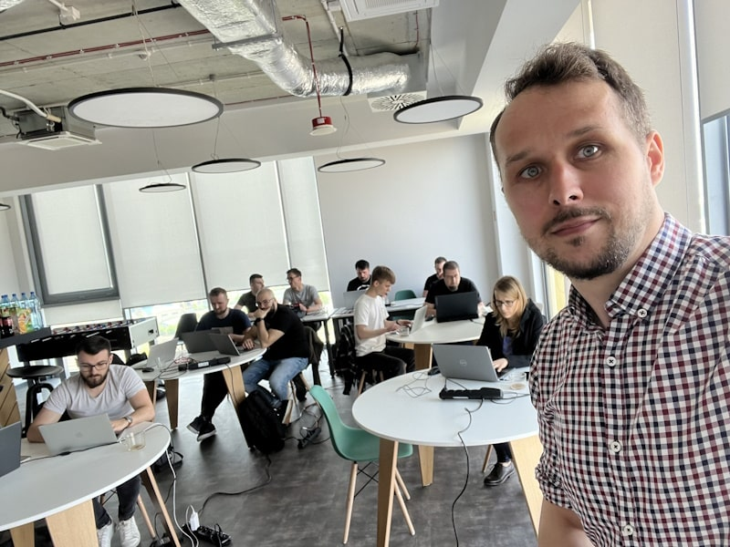

**Event Sourcing is a pattern that is quickly gaining popularity.** Many companies see the advantages it brings, e.g. business focus and keeping all information about the business process. It can also be a great input to analytics, providing increased diagnostics and tracing. Nowadays, that's essential for running a system on the scale.

There are already decent materials teaching how to start the journey with Event Sourcing. I tried to cover a lot of aspects of it in this blog. So starting is easier, but it requires a ramp-up phase. Once you pass it, it's not easy to get certainty that our design will work on production. Even when we get there, it's worth revisiting lessons learned and discovering what we can improve in preparing for the upcoming challenges. 

**We can hit accidental complexity.** That can be overwhelming. I learned that the hard way. I tackled those problems in my projects as:
- a developer and architect, 
- consultant with my clients
- tooling author.

I think that those versatile lessons could also be useful for you.

**Do you want to speed up your journey?** Do you like onsite conferences?

**You can mash those two together, as I'll be giving pre-conference workshops on my favourite conferences:**
- **[Techorama - 6th of May](https://techorama.be/workshops/practical-introduction-to-event-sourcing?utm_source=event_driven_io),**
- **[DDD Europe - 27th-29th of May.](https://2024.dddeurope.com/program/production-grade-event-sourcing-modelling-devops-process?utm_source=event_driven_io)**

## Practical Introduction to Event Sourcing at Techorama

**Date:** [6th of May](https://techorama.be/workshops/practical-introduction-to-event-sourcing?utm_source=event_driven_io).

The workshop will be hands-on and teach you how to use Event Sourcing, giving you solid foundations. You will understand after them:
- when and how to use it and what benefits it brings,
- how to reflect your business logic in the code using events,
- differences to the classical approach,
- different tools such as Marten and EventStoreDB, and the differences between them,
- how to use Event Sourcing on your system,
- challenges related to Event Sourcing and recommended solutions.

**The general plan looks like this:**

1. Introduction to Event Sourcing. Basic terminology (event, stream of events, command), differences from the classical approach.
2. What is Event Sourcing, and how is it different from Event Streaming. Advantages and disadvantages.
3. Write model and data consistency guarantees.
4. Various ways of handling business logic: Aggregates, Command Handlers, functional approach.
5. Projections and best practices for building a read model on the.
6. Event Sourcing in the context of application architecture and integration with other approaches.
7. Saga, Choreography, Process Manager, handling distributed processes.
8. Good and bad practices in modelling and handling events.
9. Event Sourcing on production, evolution, event versioning, etc.

This should build a good foundation for your Event Sourcing journey. I won't lie: you won't be an expert after it, but you'll be able to start applying it to your projects, learn what you don't know, and have a plan for advancing it.

**The requirements to join are simple:**
- understanding of the basic building blocks of the application design,
- experience in one of the languages and platforms: C#, Java, TypeScript (code exercises will be done using them),
- positive and open-minded attitude.

Interested? [Sign up here](https://techorama.be/workshops/practical-introduction-to-event-sourcing?utm_source=event_driven_io).

## Production-Grade Event Sourcing: Modelling, DevOps, Process

**Dates:** [27th-29th of May](https://2024.dddeurope.com/program/production-grade-event-sourcing-modelling-devops-process?utm_source=event_driven_io)

**The goal of this workshop is to strengthen all of the critical aspects of running event-sourced on production:**
- modelling (like keeping streams short, managing consistency and efficiently handling business logic, best practices and anti-patterns),
- managing schema evolution, so events versioning,
- advanced projections design and resiliency, so how to get the best from events to efficiently get read models and insights from them,
- DevOps techniques (like traceability, blue-green projection rebuilt, archiving old data),
- handling distributed processes and integrating with other systems,
- putting event sourcing as a vital part of the whole architecture (so how to integrate it with non-event-sourced modules, defining private and public schema).

**After the workshop, you'll understand and practice techniques that will allow you to run your Event-Sourcing system on production.**

All the exercises will be backed by the versatile experience I got throughout my career. I'll share my experience building systems like Marten and EventStoreDB and working as an architect and consultant in many Event Sourcing projects.

We'll start with the project of the system that looks fine as the first production deployment. Through group exercises, a mixture of modelling and practical coding exercises, we'll analyse potential issues step by step. We'll learn how to refactor it step by step without breaking it. That will allow us to fix the boundaries, consistency guarantees, and resiliency. We'll practice both adding new capabilities and changing existing ones. We'll practice schema evolution and DevOps practices like projection rebuilds. We'll end with a more robust and prepared-for-the-next-challenges system.

**Prerequisities?**

**The workshop is designed for people who already have experience with Event Sourcing.** Especially for those who would like to assess the production-readiness of their design or already deployed system. I won't start from basics but assume:
- experience in how Event Sourcing works (storing events, building state from them),
- knowledge of how to model business logic and projections/read models,
- Understand that event sourcing is not event streaming and why streaming solutions like Kafka and Pulsar should not be used as event stores.

**I assume you know modelling techniques like EventStorming, C4 and modularity concepts (microservices, monolith, CQRS, etc.).** And that you were already building and designing web applications.

Most of the exercises will be focused on general understanding and will not be technology-specific, but practical will require knowledge of one of the languages: C#, Java, or TypeScript. We'll use Marten and EventStoreDB as event stores examples.

**If you took my Practical Introduction workshop, you'll also be fine with taking the Advanced workshop.** Especially that, you'll also have three weeks to do some additional preparations. I can help you spend this time as well as you can!

Interested? [Sign up here](https://2024.dddeurope.com/program/production-grade-event-sourcing-modelling-devops-process?utm_source=event_driven_io).

## Can't be there or want a private experience?

No worries, I also run private trainings and other forms of help like:
- architecture review,
- consultancy,
- proof of concepts,
- mentoring.

I'm happy to help! 

**If you don't know what to choose, don't hesitate [to contact me via email](mailto:oskar@event-driven.io)**. I'm here to help. 

Check the details on my [training](/pl/training/) page. 

**A workshop is the most effective way to jump-start.**

You can also try to do [Introduction to Event Sourcing - Self-Paced Kit](/pl/introduction_to_event_sourcing/) on your own. I think that's a decent path, but longer, the choice is yours!

Cheers!

Oskar

p.s. **Ukraine is still under brutal Russian invasion. A lot of Ukrainian people are hurt, without shelter and need help.** You can help in various ways, for instance, directly helping refugees, spreading awareness, putting pressure on your local government or companies. You can also support Ukraine by donating e.g. to [Red Cross](https://www.icrc.org/pl/donate/ukraine), [Ukraine humanitarian organisation](https://savelife.in.ua/pl/donate/) or [donate Ambulances for Ukraine](https://www.gofundme.com/f/help-to-save-the-lives-of-civilians-in-a-war-zone).
