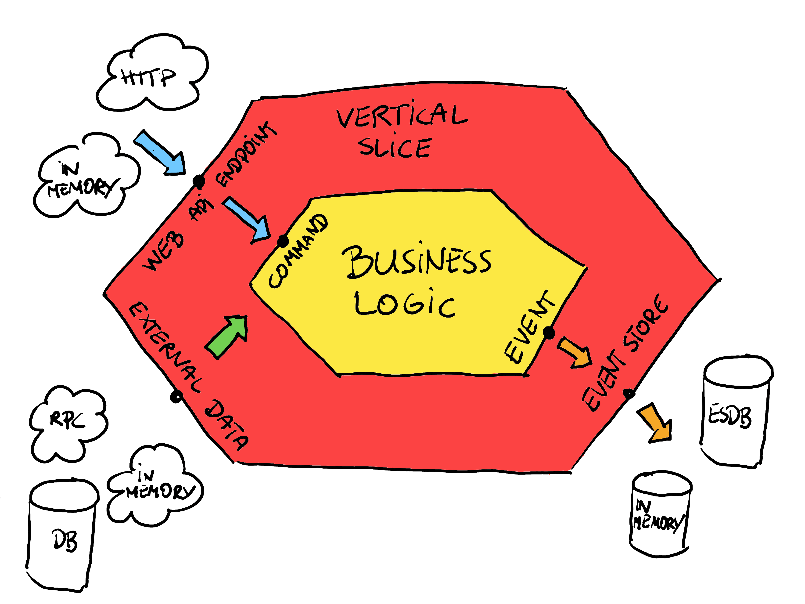

**I've been going pretty down the rabbit hole in the last few years. What am I searching for?** A way to deliver better software. And that's, of course, a _"thank you for nothing"_ type of answer. And also a joke, I'll tell you what I mean by better. I mean software close to the business, fulfilling the requirements with expected quality and allowing fast iterations to get a quicker feedback loop.

**To do that, we need to use proper design/modelling techniques and a tool that enables building synergy.** Some say your code should scream, but I don't like shouting. That's enough if the code is explicit and sincere. Yet, too often, being explicit means a lot of manual work and boilerplate. That's not superb developer experience; I wrote more about that in [Stacking the bricks in the software development process](/en/stacking_the_bricks/). And that's the biggest source of beef around coding styles and architecture. Different people see the tipping point between boilerplate and generic in other places. Where do I see it? That's a longer take, but let's focus on one specific aspect today: quality and testing.

I wrote already here a few times about testing:
- [Behaviour-Driven Design is more than tests](/en/behaviour_driven_design_is_not_about_tests/)
- [Testing business logic in Event Sourcing, and beyond!](/en/testing_event_sourcing/)
- [Ogooreck, a sneaky testing library in BDD style](/en/ogooreck_sneaky_bdd_testing_framework/)
- [Writing and testing business logic in F#](/en/writing_and_testing_business_logic_in_fsharp/)
- [Testing asynchronous processes with a little help from .NET Channels](/en/testing_asynchronous_processes_with_a_little_help_from_dotnet_channels/)
- [I tested it on production and I'm not ashamed of it](/en/i_tested_on_production/)
- [How to configure a custom Test Container on the EventStoreDB example](/en/custom_test_container_on_esdb_example/)
- [A simple way to configure integration tests pipeline](/en/configure_ci_for_integration_tests/)

Today, I'd like to show you the next iteration and my current state of the art, which resulted from that journey.

**I'll show you how the [Emmett](https://event-driven-io.github.io/emmett/getting-started.html) way to testing can help with your developer experience!**

Before we go, let's install the Emmett npm package. We'll use it in next steps:

```sh
npm add @event-driven-io/emmett
```

## Domain

Let me use a similar Shopping Cart domain I explained in [Straightforward Event Sourcing with TypeScript and NodeJS](/en/type_script_node_Js_event_sourcing/). The business logic looks as follows:

```typescript
import {
  EmmettError,
  IllegalStateError,
  sum,
} from '@event-driven-io/emmett';

export const addProductItem = (
  command: AddProductItemToShoppingCart,
  state: ShoppingCart,
): ProductItemAddedToShoppingCart => {
  if (state.status === 'Closed')
    throw new IllegalStateError('Shopping Cart already closed');

  const {
    data: { shoppingCartId, productItem },
    metadata,
  } = command;

  return {
    type: 'ProductItemAddedToShoppingCart',
    data: {
      shoppingCartId,
      productItem,
      addedAt: metadata?.now ?? new Date(),
    },
  };
};

export const removeProductItem = (
  command: RemoveProductItemFromShoppingCart,
  state: ShoppingCart,
): ProductItemRemovedFromShoppingCart => {
  if (state.status !== 'Opened')
    throw new IllegalStateError('Shopping Cart is not opened');

  const {
    data: { shoppingCartId, productItem },
    metadata,
  } = command;

  const currentQuantity = state.productItems.get(productItem.productId) ?? 0;

  if (currentQuantity < productItem.quantity)
    throw new IllegalStateError('Not enough products');

  return {
    type: 'ProductItemRemovedFromShoppingCart',
    data: {
      shoppingCartId,
      productItem,
      removedAt: metadata?.now ?? new Date(),
    },
  };
};

export const confirm = (
  command: ConfirmShoppingCart,
  state: ShoppingCart,
): ShoppingCartConfirmed => {
  if (state.status !== 'Opened')
    throw new IllegalStateError('Shopping Cart is not opened');

  const totalQuantityOfAllProductItems = sum(state.productItems.values());

  if (totalQuantityOfAllProductItems <= 0)
    throw new IllegalStateError('Shopping Cart is empty');

  const {
    data: { shoppingCartId },
    metadata,
  } = command;

  return {
    type: 'ShoppingCartConfirmed',
    data: {
      shoppingCartId,
      confirmedAt: metadata?.now ?? new Date(),
    },
  };
};

export const cancel = (
  command: CancelShoppingCart,
  state: ShoppingCart,
): ShoppingCartCancelled => {
  if (state.status !== 'Opened')
    throw new IllegalStateError('Shopping Cart is not opened');

  const {
    data: { shoppingCartId },
    metadata,
  } = command;

  return {
    type: 'ShoppingCartCancelled',
    data: {
      shoppingCartId,
      canceledAt: metadata?.now ?? new Date(),
    },
  };
};

export const decide = (command: ShoppingCartCommand, state: ShoppingCart) => {
  const { type } = command;

  switch (type) {
    case 'AddProductItemToShoppingCart':
      return addProductItem(command, state);
    case 'RemoveProductItemFromShoppingCart':
      return removeProductItem(command, state);
    case 'ConfirmShoppingCart':
      return confirm(command, state);
    case 'CancelShoppingCart':
      return cancel(command, state);
    default: {
      const _notExistingCommandType: never = type;
      throw new EmmettError(`Unknown command type`);
    }
  }
};
```

As you can see, it's a simple set of functions that evaluate business rules (based on the input command and current state) and return an event as a result. 

**Okay, but how do I test it? Wouldn't it be good if your library provided you with the recommended (but not enforced) method out of the box?**

If you think the answer is yes, you should like what you'll see next. 

One of the biggest benefits of having repeatable patterns is testing, which Emmett helps to do out of the box. For Event Sourcing, the testing pattern looks like this:
- **GIVEN** set of events recorded for the entity,
- **WHEN** we run the command on the state built from events,
- **THEN** we’re getting new event(s) as a result of business logic. Or the exception is thrown.

Let's see how you can apply this pattern in Emmett.

```typescript
import { DeciderSpecification } from '@event-driven-io/emmett';

const given = DeciderSpecification.for({
  decide,
  evolve,
  initialState: getInitialState,
});

describe('ShoppingCart', () => {
  describe('When empty', () => {
    it('should add product item', () => {
      given([])
        .when({
          type: 'AddProductItemToShoppingCart',
          data: {
            shoppingCartId,
            productItem,
          },
          metadata: { now },
        })
        .then([
          {
            type: 'ProductItemAddedToShoppingCart',
            data: {
              shoppingCartId,
              productItem,
              addedAt: now,
            },
          },
        ]);
    });
  });

  describe('When opened', () => {
    it('should confirm', () => {
      given({
        type: 'ProductItemAddedToShoppingCart',
        data: {
          shoppingCartId,
          productItem,
          addedAt: oldTime,
        },
      })
        .when({
          type: 'ConfirmShoppingCart',
          data: {
            shoppingCartId,
          },
          metadata: { now },
        })
        .then([
          {
            type: 'ShoppingCartConfirmed',
            data: {
              shoppingCartId,
              confirmedAt: now,
            },
          },
        ]);
    });
  });

  describe('When confirmed', () => {
    it('should not add products', () => {
      given([
        {
          type: 'ProductItemAddedToShoppingCart',
          data: {
            shoppingCartId,
            productItem,
            addedAt: oldTime,
          },
        },
        {
          type: 'ShoppingCartConfirmed',
          data: { shoppingCartId, confirmedAt: oldTime },
        },
      ])
        .when({
          type: 'AddProductItemToShoppingCart',
          data: {
            shoppingCartId,
            productItem,
          },
          metadata: { now },
        })
        .thenThrows(
          (error: Error) => error.message === 'Shopping Cart already closed',
        );
    });
  });

  const getRandomProduct = (): PricedProductItem => {
    return {
      productId: randomUUID(),
      unitPrice: Math.random() * 10,
      quantity: Math.random() * 10,
    };
  };
  const oldTime = new Date();
  const now = new Date();
  const shoppingCartId = randomUUID();

  const productItem = getRandomProduct();
});
```

We start by setting up a specification for our tests by passing:
- **[decide](https://event-driven-io.github.io/emmett/getting-started.html#business-logic-and-decisions)** - a function that groups our command handling into a single method,
- **[evolve](https://event-driven-io.github.io/emmett/getting-started.html#building-state-from-events)** - a function that is used to [build the current state from events](/en/how_to_get_the_current_entity_state_in_event_sourcing/),
- **[getInitialState](https://event-driven-io.github.io/emmett/getting-started.html#building-state-from-events)** - the initial, empty state on which we apply events to get the current one.

**_DeciderSpecification_ helps you follow the Given/When/Then pattern.** It builds the state internally based on the events passed in the _Given_ part. It'll run the business logic provided in the _When_ part and then test the result events or an error.

It's as simple as that! I know that using _simple_ is dangerous, but I really think it's harder to make it more straightforward. Or at least I haven't found a better way yet.

## WebApi

Let's not stop here, as Emmett also helps you with integration and end-to-end testing. But before we go, let's show you quickly how you could define Express.js WebApi with a little help from Emmett.

We need to install the Emmett Express.js npm package. 

```sh
npm add @event-driven-io/emmett-expressjs
```

Having that the WebApi setup would look like:

```typescript
import { type WebApiSetup } from '@event-driven-io/emmett-expressjs';
import { Router } from 'express';
import { evolve, getInitialState } from '../shoppingCart';

// Let's setup the command handler, we'll use it in endpoints
const handle = CommandHandler(evolve, getInitialState);

export const shoppingCartApi =
  (
    // external dependencies
    eventStore: EventStore,
    getUnitPrice: (productId: string) => Promise<number>,
  ): WebApiSetup =>
  (router: Router): void => {
    // We'll setup routes here
  };
```

The API definition is a function that takes external dependencies and returns the Web API setup. We're also setting upCommand Handler that will orchestrate loading and storing events in the event store [(see more in Emmett docs)](https://event-driven-io.github.io/emmett/getting-started.html#command-handling).

We can use it in the full setup like:

```typescript
import { getInMemoryEventStore } from '@event-driven-io/emmett';
import { getApplication, startAPI } from '@event-driven-io/emmett-expressjs';
import type { Application } from 'express';
import type { Server } from 'http';

const eventStore = getInMemoryEventStore();

const shoppingCarts = shoppingCartApi(
  eventStore,
  getUnitPrice,
  () => new Date(),
);

const application: Application = getApplication({
  apis: [shoppingCarts],
});

const server: Server = startAPI(application);
```

We'll use in-memory event store for now. Yes, it's also provided out of the box!

Let's not keep the setup empty for too long and define our first endpoint!

```typescript
router.post(
  '/clients/:clientId/shopping-carts/current/product-items',
  on(async (request: AddProductItemRequest) => {
    // 1. Translate request params to the command
    const shoppingCartId = getShoppingCartId(
      assertNotEmptyString(request.params.clientId),
    );
    const productId = assertNotEmptyString(request.body.productId);

    const command: AddProductItemToShoppingCart = {
      type: 'AddProductItemToShoppingCart',
      data: {
        shoppingCartId,
        productItem: {
          productId,
          quantity: assertPositiveNumber(request.body.quantity),
          unitPrice: await getUnitPrice(productId),
        },
      },
    };

    // 2. Handle command
    await handle(eventStore, shoppingCartId, (state) =>
      addProductItem(command, state),
    );

    // 3. Return response status
    return NoContent();
  }),
);
```

Again, simple stuff. We:
- Translate and request params to the command.
- Run command handler on top of business logic.
- Return the proper HTTP response.

Of course, we could make it even crisper and automagically do the request mapping, more conventional-based status resolution, decorators, and fire-command-and-forget, but we won't. Why?

**I prefer composability over magical glue.** I believe that a healthy amount of copy-paste won't harm you. I target removability and segregation of the code and making things explicit that should be explicit.

**Still, I won't tell you how to live!** If you want to add more, feel free to do it. I want to give you basic building blocks and recommendations so you can build on top of that!

Let's skip other endpoints to keep the focus on tests. They'll look accordingly to the above one. You can find a complete definition in [Emmett docs](https://event-driven-io.github.io/emmett/getting-started.html#webapi-definition).


## Integration Testing

Cool, we now have API up and running. We even tested our [domain logic with unit tests](#unit-testing). That's great, but as you know, a lot can happen in the meantime. The request mapping or validation may fail; middlewares (like auth one) can say no. It'd be great to test it.

There are many different shapes of Testing: [Pyramids](https://martinfowler.com/articles/practical-test-pyramid.html), [Honeycombs](https://engineering.atspotify.com/2018/01/testing-of-microservices/), [Thropies](https://kentcdodds.com/blog/the-testing-trophy-and-testing-classifications) etc. All of them share the goal of having them reliable and fast. However, agreeing on where the compromise is and where to put the biggest effort is, of course, challenging to agree.

No matter what your preference is, Emmett has got you covered.

**Let's say that you're a fan of [Hexagonal/Ports & Adapters Architecture](https://jmgarridopaz.github.io/content/hexagonalarchitecture.html) and you'd like to test the whole flow being able to replace dependencies (adapters) with in-memory implementations to have your tests running in-memory.** Such approaches have tradeoffs. The pros are that they run smoothly, allow a fast feedback loop, and run tests continuously. The downside is that they don't validate all integration scenarios with real tools. Don't worry, we'll cover that later!

I heard that one picture could speak more than a thousand words, so let's look at this one:


**The picture shows the boundaries between the business logic and our application layer.**

Our application layer is thin; it's a vertical slice to which the entry point (port) is the WebApi endpoint. Inside it, we can do additional stuff like getting product prices and mapping requests with additional data added to the command. We handle commands in the business logic that return event(s). We're storing them in the event store. This looks like that in the already known adding product to shopping cart code:

```typescript
const handle = CommandHandler(evolve, getInitialState);

type AddProductItemRequest = Request<
  Partial<{ clientId: string; shoppingCartId: string }>,
  unknown,
  Partial<{ productId: number; quantity: number }>
>;

////////////////////////////////////////////////////
// Web Api
////////////////////////////////////////////////////

export const shoppingCartApi =
  (
    // external dependencies
    eventStore: EventStore,
    getUnitPrice: (productId: string) => Promise<number>,
  ): WebApiSetup =>
  (router: Router): void => {
    ////////////////////////////////////////////////////
    // Endpoint
    ////////////////////////////////////////////////////
    router.post(
      '/clients/:clientId/shopping-carts/current/product-items',
      on(async (request: AddProductItemRequest) => {
        const shoppingCartId = getShoppingCartId(
          assertNotEmptyString(request.params.clientId),
        );
        const productId = assertNotEmptyString(request.body.productId);

        const command: AddProductItemToShoppingCart = {
          type: 'AddProductItemToShoppingCart',
          data: {
            shoppingCartId,
            productItem: {
              productId,
              quantity: assertPositiveNumber(request.body.quantity),
              unitPrice: await getUnitPrice(productId),
            },
          },
        };

        await handle(eventStore, shoppingCartId, (state) =>
          addProductItem(command, state),
        );

        return NoContent();
      }),
    );
    // (...) other endpoints
  };

////////////////////////////////////////////////////
// Business Logic
////////////////////////////////////////////////////

export type AddProductItemToShoppingCart = Command<
  'AddProductItemToShoppingCart',
  {
    shoppingCartId: string;
    productItem: PricedProductItem;
  }
>;

export const addProductItem = (
  command: AddProductItemToShoppingCart,
  state: ShoppingCart,
): ProductItemAddedToShoppingCart => {
  if (state.status === 'Closed')
    throw new IllegalStateError('Shopping Cart already closed');

  const {
    data: { shoppingCartId, productItem },
    metadata,
  } = command;

  return {
    type: 'ProductItemAddedToShoppingCart',
    data: {
      shoppingCartId,
      productItem,
      addedAt: metadata?.now ?? new Date(),
    },
  };
};
```

**Our slice has 3 ports that one can plug in:**

1. **WebApi endpoint**, where the user can send a request (which will be translated to a command).
2. **_getUnitPrice_ function** that gets the product price. Depending on our design, it may represent a call to an external service (e.g. with HTTP), calling a database (e.g. read model) or just running some computation. We're also using it as an input to the command.
3. **Event store**, from which we load events and store new facts.

We already made those dependencies explicit, allowing us to replace the real ones in the tests. Also, as we know that we're doing Event Sourcing then, why not take advantage of that and write our tests in the following style:
- **GIVEN** set of events recorded for the entity,
- **WHEN** we run the web API request,
- **THEN** we’re getting new event(s) as a result of business logic. Or the error status is returned with Problem Details.

Let's start with defining our WebApi specification. We're using _ApiSpecification_ class from _@event-driven-io/emmett-expressjs_.

```typescript
import {
  getInMemoryEventStore,
  type EventStore,
} from '@event-driven-io/emmett';
import {
  ApiSpecification,
  getApplication,
} from '@event-driven-io/emmett-expressjs';

const unitPrice = 100;
const now = new Date();

const given = ApiSpecification.for<ShoppingCartEvent>(
  (): EventStore => getInMemoryEventStore(),
  (eventStore: EventStore) =>
    getApplication({
      apis: [
        shoppingCartApi(
          eventStore,
          () => Promise.resolve(unitPrice),
          () => now,
        ),
      ],
    }),
);
```

We're also using the same _getApplication_ known from the previous steps. The only difference is that we replaced real dependencies with the in-memory ones. _ApiSpecification_ uses internally [SuperTest package](https://www.npmjs.com/package/supertest). It allows straightforward testing of Express.js, e.g. it ensures that server starts in a random port and provides the helpers for building test requests, which we'll use in our tests.

Having it, we can define our tests as:

```typescript
import {
  existingStream,
  expectNewEvents,
  expectResponse,
} from '@event-driven-io/emmett-expressjs';

describe('When opened with product item', () => {
  it('should confirm', () => {
    return given(
      existingStream(shoppingCartId, [
        {
          type: 'ProductItemAddedToShoppingCart',
          data: {
            shoppingCartId,
            productItem,
            addedAt: oldTime,
          },
        },
      ]),
    )
      .when((request) =>
        request.post(`/clients/${clientId}/shopping-carts/current/confirm`),
      )
      .then([
        expectResponse(204),
        expectNewEvents(shoppingCartId, [
          {
            type: 'ShoppingCartConfirmed',
            data: {
              shoppingCartId,
              confirmedAt: now,
            },
          },
        ]),
      ]);
  });
});
```

The test follows the similar Given/When/Then pattern as our unit tests but uses HTTP request to trigger the command handling and uses additional helpers to set up and verify data:

- **exisitingStream** - allows you to specify the stream id and events existing in the stream. You can set more than one stream if your command handling logic requires that,
- **expectResponse** - verifies the HTTP response with expected criteria like status code. You can also check the response body, headers, etc. For expected errors you can use **expectError** accordingly.
- **expectEvents** - ensures that new events are appended to the specific streams in the event store.

Complete tests will look like this:

```typescript
import {
  getInMemoryEventStore,
  type EventStore,
} from '@event-driven-io/emmett';
import {
  ApiSpecification,
  existingStream,
  expectError,
  expectNewEvents,
  expectResponse,
  getApplication,
} from '@event-driven-io/emmett-expressjs';
import { randomUUID } from 'node:crypto';

describe('ShoppingCart', () => {
  let clientId: string;
  let shoppingCartId: string;

  beforeEach(() => {
    clientId = randomUUID();
    shoppingCartId = `shopping_cart:${clientId}:current`;
  });

  describe('When empty', () => {
    it('should add product item', () => {
      return given()
        .when((request) =>
          request
            .post(`/clients/${clientId}/shopping-carts/current/product-items`)
            .send(productItem),
        )
        .then([
          expectNewEvents(shoppingCartId, [
            {
              type: 'ProductItemAddedToShoppingCart',
              data: {
                shoppingCartId,
                productItem,
                addedAt: now,
              },
            },
          ]),
        ]);
    });
  });

  describe('When opened with product item', () => {
    it('should confirm', () => {
      return given(
        existingStream(shoppingCartId, [
          {
            type: 'ProductItemAddedToShoppingCart',
            data: {
              shoppingCartId,
              productItem,
              addedAt: oldTime,
            },
          },
        ]),
      )
        .when((request) =>
          request.post(`/clients/${clientId}/shopping-carts/current/confirm`),
        )
        .then([
          expectResponse(204),
          expectNewEvents(shoppingCartId, [
            {
              type: 'ShoppingCartConfirmed',
              data: {
                shoppingCartId,
                confirmedAt: now,
              },
            },
          ]),
        ]);
    });
  });

  describe('When confirmed', () => {
    it('should not add products', () => {
      return given(
        existingStream(shoppingCartId, [
          {
            type: 'ProductItemAddedToShoppingCart',
            data: {
              shoppingCartId,
              productItem,
              addedAt: oldTime,
            },
          },
          {
            type: 'ShoppingCartConfirmed',
            data: { shoppingCartId, confirmedAt: oldTime },
          },
        ]),
      )
        .when((request) =>
          request
            .post(`/clients/${clientId}/shopping-carts/current/product-items`)
            .send(productItem),
        )
        .then(
          expectError(403, {
            detail: 'Shopping Cart already closed',
            status: 403,
            title: 'Forbidden',
            type: 'about:blank',
          }),
        );
    });
  });

  const oldTime = new Date();
  const now = new Date();
  const unitPrice = Math.random() * 10;

  const given = ApiSpecification.for<ShoppingCartEvent>(
    (): EventStore => getInMemoryEventStore(),
    (eventStore: EventStore) =>
      getApplication({
        apis: [
          shoppingCartApi(
            eventStore,
            () => Promise.resolve(unitPrice),
            () => now,
          ),
        ],
      }),
  );

  const getRandomProduct = (): PricedProductItem => {
    return {
      productId: randomUUID(),
      unitPrice,
      quantity: Math.random() * 10,
    };
  };

  const productItem = getRandomProduct();
});
```

You can use those tests as complementary to the business logic (e.g., testing the most important scenarios), or you may even replace unit tests with them. As they're in memory, they're fast enough to be run continuously.

You can also replace the in-memory store with the real one (e.g. [EventStoreDB](https://developers.eventstore.com/)) and test your module in isolation from other modules. The choice is yours!

Again, in Emmett, we don't want to force you to anything but give you options and the recommended safe path.

I encourage you to watch Martin Thwaites' talk ["Building Operable Software with TDD (but not the way you think)"](https://www.youtube.com/watch?v=prLRI3VEVq4). It nicely explains why I can now shift the balance from unit testing to integration testing.

## End-to-End Testing

You may say:

> _Oskar, those tests are cool, but I'd like to either test business logic with unit tests or run my end-to-end tests treating the WebApi as a black box._

And I answer: sure, why not! I also give you help with that.

Let's start by adding some flavour and use [EventStoreDB](https://developers.eventstore.com/) this time. We need to install two more packages. One for adding implementation of the [EventStoreDB](https://developers.eventstore.com/) event store:

```sh
npm add @event-driven-io/@event-driven-io/emmett-esdb
```

Now, we need to switch the in-memory implementation to [EventStoreDB](https://developers.eventstore.com/) in WebApi setup. Updated will look as follows:

```typescript
import { getEventStoreDBEventStore } from '@event-driven-io/emmett-esdb';
import { EventStoreDBClient } from '@eventstore/db-client';

const eventStoreDBClient = EventStoreDBClient.connectionString(
  `esdb://localhost:2113?tls=false`,
);
const eventStore = getEventStoreDBEventStore(eventStoreDBClient);

const shoppingCarts = shoppingCartApi(
  eventStore,
  getUnitPrice,
  () => new Date(),
);
```

It's as simple as that; we're injecting just a different implementation.

As [EventStoreDB](https://developers.eventstore.com/) is a real database, we need to set it up for our tests. The simplest option is to use a Docker container. You can do it in multiple ways, but the fastest can be using [TestContainers](https://node.testcontainers.org/). The library allows us to easily set up containers for our tests. It automatically randomise ports, helps in teardown etc. (read more [here](/en/configure_ci_for_integration_tests/), to see if it's always a best option)

Emmett provides the package with additional test containers like the one for [EventStoreDB](https://developers.eventstore.com/). You need to install:

```sh
npm add @event-driven-io/@event-driven-io/emmett-testcontainers
```

:::

Having that, we can set our test container with:

```typescript
import {
  EventStoreDBContainer,
  type StartedEventStoreDBContainer,
} from '@event-driven-io/emmett-testcontainers';

let esdbContainer: StartedEventStoreDBContainer;
describe('ShoppingCart E2E', () => {
  // Set up a container before all tests
  before(async () => {
    esdbContainer = await new EventStoreDBContainer().start();
  });

  // Stop container once we finished testing
  after(() => {
    return esdbContainer.stop();
  });
  // (...) Tests will go here
});
```

And create our test specification using the _ApiE2ESpecification_ type:

```typescript
import { type EventStore } from '@event-driven-io/emmett';
import { getEventStoreDBEventStore } from '@event-driven-io/emmett-esdb';
import {
  ApiE2ESpecification,
  getApplication,
} from '@event-driven-io/emmett-expressjs';

const given = ApiE2ESpecification.for(
  (): EventStore => getEventStoreDBEventStore(esdbContainer.getClient()),
  (eventStore: EventStore) =>
    getApplication({
      apis: [
        shoppingCartApi(
          eventStore,
          () => Promise.resolve(unitPrice),
          () => now,
        ),
      ],
    }),
);
```

The test will look accordingly to the integration tests, with the distinction that we also use HTTP requests for the setup. We're also checking only responses; we treat the WebApi as a black box.

```typescript
import { getEventStoreDBEventStore } from '@event-driven-io/emmett-esdb';
import { expectResponse } from '@event-driven-io/emmett-expressjs';
import type { StartedEventStoreDBContainer } from '@event-driven-io/emmett-testcontainers';

describe('When opened with product item', () => {
  it('should confirm', () => {
    return given((request) =>
      request
        .post(`/clients/${clientId}/shopping-carts/current/product-items`)
        .send(productItem),
    )
      .when((request) =>
        request.post(`/clients/${clientId}/shopping-carts/current/confirm`),
      )
      .then([expectResponse(204)]);
  });
});
```

Complete tests will look like this:

```typescript
import { type EventStore } from '@event-driven-io/emmett';
import { getEventStoreDBEventStore } from '@event-driven-io/emmett-esdb';
import {
  ApiE2ESpecification,
  expectResponse,
  getApplication,
} from '@event-driven-io/emmett-expressjs';
import {
  EventStoreDBContainer,
  StartedEventStoreDBContainer,
} from '@event-driven-io/emmett-testcontainers';
import { randomUUID } from 'node:crypto';

describe('ShoppingCart E2E', () => {
  const unitPrice = 100;
  let clientId: string;
  let shoppingCartId: string;
  let esdbContainer: StartedEventStoreDBContainer;
  let given: ApiE2ESpecification;

  before(async () => {
    esdbContainer = await new EventStoreDBContainer().start();

    given = ApiE2ESpecification.for(
      (): EventStore => getEventStoreDBEventStore(esdbContainer.getClient()),
      (eventStore: EventStore) =>
        getApplication({
          apis: [
            shoppingCartApi(
              eventStore,
              () => Promise.resolve(unitPrice),
              () => now,
            ),
          ],
        }),
    );
  });

  beforeEach(() => {
    clientId = randomUUID();
    shoppingCartId = `shopping_cart:${clientId}:current`;
  });

  after(() => {
    return esdbContainer.stop();
  });

  describe('When opened with product item', () => {
    it('should confirm', () => {
      return given((request) =>
        request
          .post(`/clients/${clientId}/shopping-carts/current/product-items`)
          .send(productItem),
      )
        .when((request) =>
          request.post(`/clients/${clientId}/shopping-carts/current/confirm`),
        )
        .then([expectResponse(204)]);
    });

    it('should return details', () => {
      return given((request) =>
        request
          .post(`/clients/${clientId}/shopping-carts/current/product-items`)
          .send(productItem),
      )
        .when((request) =>
          request.get(`/clients/${clientId}/shopping-carts/current`).send(),
        )
        .then([
          expectResponse(200, {
            body: {
              clientId,
              id: shoppingCartId,
              productItems: [
                {
                  quantity: productItem.quantity,
                  productId: productItem.productId,
                },
              ],
              status: ShoppingCartStatus.Opened,
            },
          }),
        ]);
    });
  });

  const now = new Date();

  const getRandomProduct = (): PricedProductItem => {
    return {
      productId: randomUUID(),
      unitPrice: unitPrice,
      quantity: Math.random() * 10,
    };
  };

  const productItem = getRandomProduct();
});
```

KUDOS also goes to [Thiago Valentim](https://github.com/thiagomini) for contribution and [delivering E2E tests feature](https://github.com/event-driven-io/emmett/pull/29).

Check also the full [Emmett getting started guide](https://event-driven-io.github.io/emmett/getting-started.html) and see the [full sample in Emmett repository](https://github.com/event-driven-io/emmett/tree/main/samples/webApi/expressjs-with-esdb).

## TLDR

**I really think that Event Sourcing, with its repeatable patterns and focus on business, can streamline development.** Yet, learning it may be challenging. You need to learn both new approaches and tooling. That's why I decided to publish Emmett to package safe defaults and my state-of-the-art. I don't want to replace or compete with existing tooling but guide you through this journey.

**See that tests are first-class citizens in Emmett.** I think that's a pretty rare thing. I want to make getting the trust in your code and yourself smoother while going through the Event Sourcing journey. The proportion between unit, integration and end-to-end tests is up to you. The most important part is that I've got you covered.

**I'd be really curious about your thoughts on this approach. Feel free to comment here or [Join our Discord](https://discord.gg/fTpqUTMmVa) and discuss it with me there!**

Cheers!

Oskar

p.s. **Ukraine is still under brutal Russian invasion. A lot of Ukrainian people are hurt, without shelter and need help.** You can help in various ways, for instance, directly helping refugees, spreading awareness, putting pressure on your local government or companies. You can also support Ukraine by donating e.g. to [Red Cross](https://www.icrc.org/pl/donate/ukraine), [Ukraine humanitarian organisation](https://savelife.in.ua/pl/donate/) or [donate Ambulances for Ukraine](https://www.gofundme.com/f/help-to-save-the-lives-of-civilians-in-a-war-zone).
