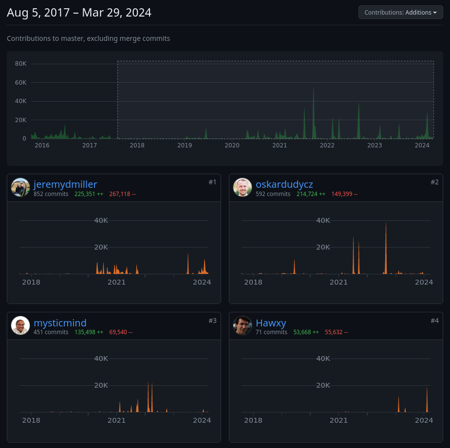
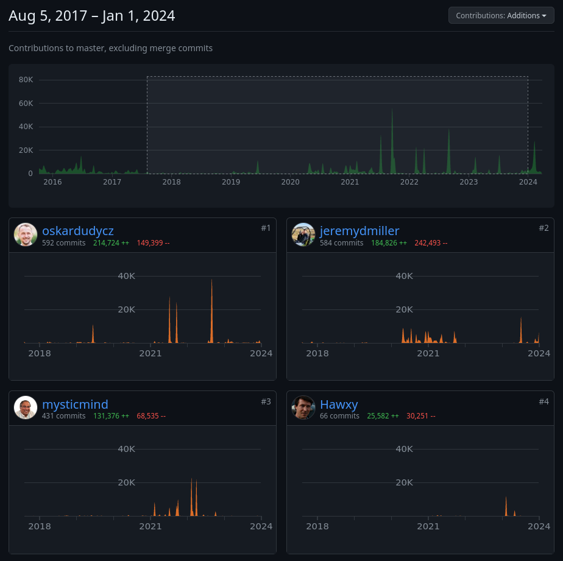

**Folks, I'd like to inform you that I'm no longer a Marten maintainer.** As you know, sometimes in the project's lifetime, there's a moment when either you need to settle things or make hard decisions. Unfortunately, the latter occurred here.

**I'm not happy that this is ending not as I hoped. Marten was a big part of my life: over 6 years as a contributor and over 5 years as a co-maintainer.** Still, I'd like to thank Jeremy Miller and Babu Annamalai for our past collaboration. I think that we managed to build a unique tool. I'd also like to say big kudos to the Marten community. I always said that's one of the big reasons that motivated me on this path.

For various reasons, I already wasn't active in the final push for the v7 version, which is a significant milestone. I think that shows that the team is motivated to keep it going.

**I'm not leaving the Event Sourcing and Event-Driven space.** I'm planning to continue what I was doing, so if you need any help from me, feel free to reach out to me. 

The closest goals are [the workshops on Techorama and DDD Europe](/en/speed_up_your_event_sourcing_journey_with_workshops/). Then, I'll think about what's next and how much I need to adjust my course.

----

This blog is also a chronicle of my journey, I will finish it with a few stats and dates. 

As mentioned, I was Marten's:
- **User for over 7 years.** I'm not sure of the exact date, but I started my EventSourcing .NET samples to learn Event Sourcing and Marten. [First commit was on 28th January 2017](https://github.com/oskardudycz/EventSourcing.NetCore/commit/db211c70603dbb17a08d7b0ad53b5ac18468bb66), so it had to be a bit earlier than that.
- **Contributor for over 6 years.** I [opened my first pull request to Marten](https://github.com/JasperFx/marten/pull/841) (and in general to OSS ever) on the 6th of August 2017. We were missing asynchronous apply methods in projections, so I thought, "let's try to do this OSS-thing". It was merged on the 1st September 2017. Funnily enough, eventually, we didn't use this change in our project as we were using it to load additional data while updating read models, which is not a great practice in general. But, well, we all need to start somewhere.
- **Maintainer for over 5 years**. It happened [officially on Jeremy's blog](https://jeremydmiller.com/2018/09/27/marten-3-0-is-released-and-introducing-the-new-core-team/) on 27th September 2018. I was already active on our Gitter, so I am sending more Pull Requests. Jeremy invited Babu and me to join the core team, and we agreed. 

During that time, I've made:
- 146 Pull Requests,
- 592 Commits,
- 214724 Additions,
- 149,399 Removals

Plus also work on [Weasel](https://github.com/JasperFx/weasel), spinoff for schema management:
- 23 Pull Requests,
- 90 Commits,
- 12051 Additions,
- 10010 Removals.

Being 2nd most active contributor (both in this period and in general).

If we exclude the last three months when I wasn't very active code-wise, then even on 1st. Of course, those are just code output stats; they don't show the quality or importance of contribution, just activity. Ultimately, they're just fun/dumb statistics for a chronicle like this.

We've built the Discord community for 1235 members (at the time of writing).

We joined as one of the first .NET Foundation in March 2020. And we left it as one of the first in [February 2022](https://github.com/JasperFx/marten/issues/2183).

----

**I'm not happy about the ending, but I don't regret the journey.**

Something is ending, something is starting. Off we go to the next chapter.

Cheers

Oskar

p.s. **Ukraine is still under brutal Russian invasion. A lot of Ukrainian people are hurt, without shelter and need help.** You can help in various ways, for instance, directly helping refugees, spreading awareness, putting pressure on your local government or companies. You can also support Ukraine by donating e.g. to [Red Cross](https://www.icrc.org/pl/donate/ukraine), [Ukraine humanitarian organisation](https://savelife.in.ua/pl/donate/) or [donate Ambulances for Ukraine](https://www.gofundme.com/f/help-to-save-the-lives-of-civilians-in-a-war-zone).
