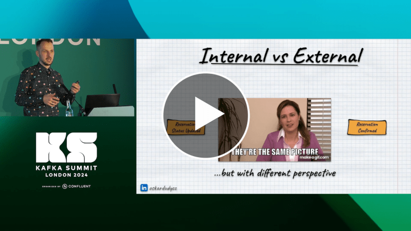

**Have you heard about Passive Aggressive Events or CRUD sourcing? Or maybe about the Clickbait event?**

If you don't, you better check the talk I gave at Kafka Summit 2024. Knowing only best practices is one side of the coin. Knowing what NOT to do can be even more important.

During the session, I explained the specifics of event modelling, starting with bad practices and knowing why and how to avoid them. I told the story about the project that aimed to modernise legacy software into the event-driven world. In theory, artificial, but in practice, none of the examples were made up. Either I made those mistakes on my own, or I saw them in my projects or helped to fix them for my clients.

I tried to make it both entertaining and educational, bitter and sweet. It is not easy when you're not a native speaker. There's a thin line between being funny and being silly.

**The thin line is also between bad and good practices. And this thin line is: _context_.**

By the way, I'm not a lucky guy, so I always try to be overprepared. I put a big effort into preparing the talk, and it paid off, as the comments were really positive. 

That was a big relief for me, as it was my first time speaking for this community, and I wasn't sure how my talk about event modelling anti-patterns would be seen.

Why unlucky? This time, the Wi-Fi on my laptop broke right before the talk. I also had in past cases like Windows Updates shutting my computer in the middle of the talk. After that, I have been taking two laptops with me for some time.

**The talk also summarised my current article series about anti-patterns in event modelling. Here's the full list:**
- [State Obsession](/pl/state-obsession/),
- [Property Sourcing](/pl/property-sourcing/),
- [I'll just add one more field](/pl/i_will_just_add_one_more_field/).
- [Clickbait event](/pl/clickbait_event/),
- [Should you record multiple events from business logic?](/pl/one_or_more_event_that_is_the_question/),
- [Stream ids, event types prefixes and other event data you might not want to slice off](/pl/on_putting_stream_id_in_event_data/).

**Check also more general considerations:**
- [Events should be as small as possible, right?](/pl/events_should_be_as_small_as_possible/),
- [What's the difference between a command and an event?](/pl/whats_the_difference_between_event_and_command/),
- [Internal and external events, or how to design event-driven API](/pl/internal_external_events/),
- [Event Streaming is not Event Sourcing!](/pl/event_streaming_is_not_event_sourcing/),
- [Don't let Event-Driven Architecture buzzwords fool you](/pl/dont_let_event_driven_architecture_buzzwords_fool_you/),
- [How to design software architecture pragmatically](/pl/how_to_design_software_architecture_pragmatically/),
- [How to deal with privacy and GDPR in Event-Driven systems](/pl/gdpr_in_event_driven_architecture/).

**If you'd like to avoid those mistakes, don't hesitate to [contact me!](mailto:oskar@event-driven.io).** I'm here to help. Check my [training](/pl/training/) page. A workshop is the most effective way to jump-start. 

You can check [recommendations on my Linked.in profile](https://www.linkedin.com/in/oskardudycz/) to see how other people liked working with me.

**Watch also my talk about The Light and The Dark Side of the Event-Driven Design:**

`youtube: https://www.youtube.com/watch?v=0pYmuk0-N_4`

Also, fun fact: Kafka in Polish is pronounced as "kawka," which means small coffee. Thus, the photo below.

Cheers!

Oskar

p.s. **Ukraine is still under brutal Russian invasion. A lot of Ukrainian people are hurt, without shelter and need help.** You can help in various ways, for instance, directly helping refugees, spreading awareness, putting pressure on your local government or companies. You can also support Ukraine by donating e.g. to [Red Cross](https://www.icrc.org/pl/donate/ukraine), [Ukraine humanitarian organisation](https://savelife.in.ua/pl/donate/) or [donate Ambulances for Ukraine](https://www.gofundme.com/f/help-to-save-the-lives-of-civilians-in-a-war-zone).
