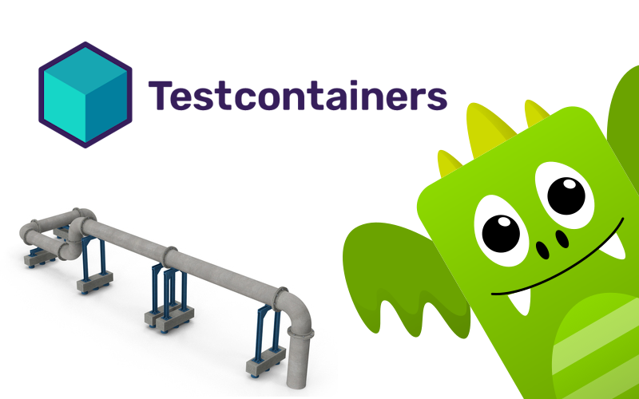

**[Testcontainers](https://testcontainers.com/) became a popular way of setting up dependencies for integration testing.** They're not ideal, as configuring them to run your tests efficiently is not as trivial as it's glossed; I explained that in [A simple way to configure integration tests pipeline](/en/configure_ci_for_integration_tests/). Still, undeniably, it can speed up the initial ramp-up phase and, if used wisely, can be a decent way to handle common testing dependencies.

Testcontainers already provide the default configurations for tools like PostgreSQL, Kafka, MongoDB etc. Yet, sometimes you need to use something a bit less mainstream, for instance, [EventStoreDB](https://developers.eventstore.com/) as your [event store](/en/event_stores_are_key_value_stores/). How to do it?

**Luckily, test Containers provide a built-in way of handling such cases, providing a generic abstraction for that: _GenericContainer_.** We can extend it to provide our test container. Let's see how to do it using Typescript.

We need to start by adding two classes, one representing a container image configuration and the other representing a started container instance.

```typescript
import {
  AbstractStartedContainer,
  GenericContainer,
  type StartedTestContainer,
} from 'testcontainers';

export const EVENTSTOREDB_IMAGE_NAME = 'eventstore/eventstore';
export const EVENTSTOREDB_IMAGE_TAG = '23.10.1-bookworm-slim';

export class EventStoreDBContainer extends GenericContainer {
  constructor(
    image = `${EVENTSTOREDB_IMAGE_NAME}:${EVENTSTOREDB_IMAGE_TAG}`
  ) {
    super(image);
    };
  }

  async start(): Promise<StartedEventStoreDBContainer> {
    return new StartedEventStoreDBContainer(await super.start());
  }
}

export class StartedEventStoreDBContainer extends AbstractStartedContainer {
  constructor(container: StartedTestContainer) {
    super(container);
  }

  getConnectionString(): string {
    return `esdb://${this.getHost()}:${this.getMappedPort(2113)}?tls=false`;
  }
}
```

And that's the bare minimum that we need to have. The container definition takes the default LTS EventStoreDB image, allowing us to provide the other one. We're also exposing the EventStoreDB connection string. It's important as Testcontainers run containers on random ports to help in test isolation.

We could set it up as:

```typescript
const container: StartedEventStoreDBContainer = await new EventStoreDBContainer().start();

const eventStore = EventStoreDBClient.connectionString(this.getConnectionString())
```

**That's some aid, but well, if Testcontainers are to reduce the cognitive load by providing a default container setup, then we could do better than that.**

We could set up default recommended options for testing. What could they be? For instance, EventStoreDB is secure by default. You should run the setup to configure certificates, etc. It's also recommended that a cluster with at least three nodes on production be configured to get proper resiliency. All of that is, of course, important, and running tests against the production setup is a must at some point (read more in [I tested it on production, and I'm not ashamed of it](/en/i_tested_on_production/)). Still, for most of the integration tests touching common features (like appending events and (subscribing to notifications about them](/en/persistent_vs_catch_up_eventstoredb_subscriptions_in_action/)), running an insecure single cluster should be more than enough. We could even disable file storage and use an in-memory setup to enable the reusing of the container between multiple tests. All of those are performance optimisations and tradeoffs, but we need to be sure that our test suite is not only giving proper results but also running fast. Tests on real production databases can be covered by [synthetic tests](/en/i_tested_on_production/).

Ok, then, how to do it? Let's define some default options like default EventStoreDB ports to expose:

```typescript
export const EVENTSTOREDB_PORT = 2113;
export const EVENTSTOREDB_TCP_PORT = 1113;
export const EVENTSTOREDB_TCP_PORTS = [
  EVENTSTOREDB_TCP_PORT,
  EVENTSTOREDB_PORT,
];
```

Then, defining the default image setup.

```typescript
export const EVENTSTOREDB_IMAGE_NAME = 'eventstore/eventstore';
export const EVENTSTOREDB_IMAGE_TAG = '23.10.1-bookworm-slim';
export const EVENTSTOREDB_ARM64_IMAGE_TAG = '23.10.1-alpha-arm64v8';

export const EVENTSTOREDB_DEFAULT_IMAGE = `${EVENTSTOREDB_IMAGE_NAME}:${process.arch !== 'arm64' ? EVENTSTOREDB_IMAGE_TAG : EVENTSTOREDB_ARM64_IMAGE_TAG}`;
```

And yes, we're also giving help to the Mac M1 users, as the ARM64 image is not included in the default tag. It's still in alpha, so why not automate it?

Now, let's define the explained earlier options:

```typescript
export type EventStoreDBContainerOptions = {
  disableProjections?: boolean;
  isSecure?: boolean;
  useFileStorage?: boolean;
  withoutReuse?: boolean;
};

export const defaultEventStoreDBContainerOptions: EventStoreDBContainerOptions =
  {
    disableProjections: false,
    isSecure: false,
    useFileStorage: false,
    withoutReuse: false,
  };
```

As you see, we're making them customisable, as we'd like people to enable the full setup. It's also a good practice to have all default options named in a way so that the default can be assumed as _false_. That reduces the cognitive load.

Having that, we can update our base container definition:

```typescript
import {
 AbstractStartedContainer,
 GenericContainer,
} from 'testcontainers';
import type { Environment } from 'testcontainers/build/types';

export class EventStoreDBContainer extends GenericContainer {
  private readonly tcpPorts = EVENTSTOREDB_TCP_PORTS;

  constructor(
    image = EVENTSTOREDB_DEFAULT_IMAGE,
    options: EventStoreDBContainerOptions = defaultEventStoreDBContainerOptions,
  ) {
    super(image);

    const environment: Environment = {
      ...(!options.disableProjections
        ? {
            EVENTSTORE_RUN_PROJECTIONS: 'ALL',
          }
        : {}),
      ...(!options.isSecure
        ? {
            EVENTSTORE_INSECURE: 'true',
          }
        : {}),
      ...(options.useFileStorage
        ? {
            EVENTSTORE_MEM_DB: 'false',
            EVENTSTORE_DB: '/data/integration-tests',
          }
        : {}),
      EVENTSTORE_CLUSTER_SIZE: '1',
      EVENTSTORE_START_STANDARD_PROJECTIONS: 'true',
      EVENTSTORE_EXT_TCP_PORT: `${EVENTSTOREDB_TCP_PORT}`,
      EVENTSTORE_HTTP_PORT: `${EVENTSTOREDB_PORT}`,
      EVENTSTORE_ENABLE_EXTERNAL_TCP: 'true',
      EVENTSTORE_ENABLE_ATOM_PUB_OVER_HTTP: 'true',
    };

    this.withEnvironment(environment).withExposedPorts(...this.tcpPorts);

    if (!options.withoutReuse) this.withReuse();
  }

  async start(): Promise<StartedEventStoreDBContainer> {
    return new StartedEventStoreDBContainer(await super.start());
  }
}
```

As you can see, we're setting up the default Environment settings, exposing ports, and marking our container as reusable by default (by calling _this.withReuse()_). Thanks to that, Testcontainers will not start a new container if a Testcontainers-managed container with the same configuration is already running. That cuts the cold-start time. Yet, you need to ensure that the test data you're adding won't collide with other tests, so you better be careful.

You can still override the environment settings by calling [withEnvironment method](https://node.testcontainers.org/features/containers/#with-environment-variables).

Having that, let's also extend the started container by adding _getClient_ method that'll return already setup EventStoreDB client for your container.

```typescript
import { EventStoreDBClient } from '@eventstore/db-client';
import {
  AbstractStartedContainer,
  type StartedTestContainer,
} from 'testcontainers';

export class StartedEventStoreDBContainer extends AbstractStartedContainer {
  constructor(container: StartedTestContainer) {
    super(container);
  }

  getConnectionString(): string {
    return `esdb://${this.getHost()}:${this.getMappedPort(2113)}?tls=false`;
  }

  getClient(): EventStoreDBClient {
    return EventStoreDBClient.connectionString(this.getConnectionString());
  }
}
```

You can test if all is working fine through the test:

```typescript
import { jsonEvent } from '@eventstore/db-client';
import assert from 'node:assert/strict';
import { randomUUID } from 'node:crypto';
import { after, beforeEach, describe, it } from 'node:test';
import {
  EventStoreDBContainer,
  StartedEventStoreDBContainer,
} from './eventStoreDBContainer';

void describe('EventStoreDBContainer', () => {
  let container: StartedEventStoreDBContainer;

  beforeEach(async () => {
    container = await new EventStoreDBContainer().start();
  });

  void it('should connect to EventStoreDB and append new event', async () => {
    const client = container.getClient();

    const result = await client.appendToStream(
      `test-${randomUUID()}`,
      jsonEvent({ type: 'test-event', data: { test: 'test' } }),
    );

    assert.ok(result.success);
  });

  after(async () => {
    await container.stop();
  });
});
```

You can use the same pattern for any other tool with container image. Also you can define custom images in the similar way, if you're using C#, Java, Go, or other supported by Testcontainers developer environment.

Still, if you're using Node.js, and you'd like to use EventStoreDB Testcontainer, then hey, you can just install Emmett Testcontainers package:

```shell
npm add @event-driven-io/@event-driven-io/emmett-testcontainers
```

And use it as:

```typescript
import {
  EventStoreDBContainer,
  type StartedEventStoreDBContainer,
} from '@event-driven-io/emmett-testcontainers';

let esdbContainer: StartedEventStoreDBContainer;
void describe('ShoppingCart E2E', () => {
  // Set up a container before all tests
  before(async () => {
    esdbContainer = await new EventStoreDBContainer().start();
  });

  // Stop container once we finished testing
  after(() => {
    return esdbContainer.stop();
  });
  // (...) Tests will go here
});
```

Read also more in [Testing Event Sourcing, Emmett edition](/en/testing_event_sourcing_emmett_edition/).

Check also my other articles on DevOps and Continuous Integration:
- [A simple way to configure integration tests pipeline](/en/configure_ci_for_integration_tests/)
- [How to build an optimal Docker image for your application?](/en/how_to_buid_an_optimal_docker_image_for_your_application/)
- [Docker Compose Profiles, one the most useful and underrated features](/en/docker_compose_profiles/)
- [A few tricks on how to set up related Docker images with docker-compose](/en/tricks_on_how_to_set_up_related_docker_images/)
- [How to build and push Docker image with GitHub actions?](/en/how_to_buid_and_push_docker_image_with_github_actions/)
- [How to create a Docker image for the Marten application](/en/marten_and_docker)
- [How to create a custom GitHub Action?](/en/how_to_create_a_custom_github_action/)

Cheers!

Oskar

p.s. **Ukraine is still under brutal Russian invasion. A lot of Ukrainian people are hurt, without shelter and need help.** You can help in various ways, for instance, directly helping refugees, spreading awareness, putting pressure on your local government or companies. You can also support Ukraine by donating e.g. to [Red Cross](https://www.icrc.org/pl/donate/ukraine), [Ukraine humanitarian organisation](https://savelife.in.ua/pl/donate/) or [donate Ambulances for Ukraine](https://www.gofundme.com/f/help-to-save-the-lives-of-civilians-in-a-war-zone).
