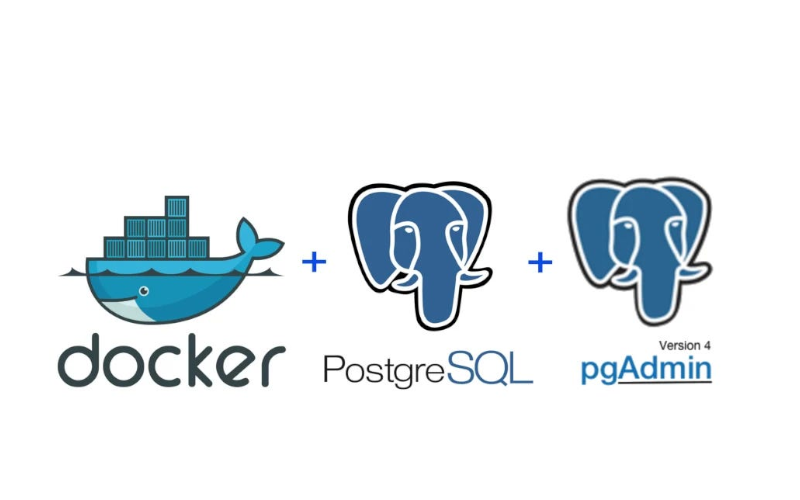

**Developer experience is a phrase repeated in multiple ways. In our industry, we finally realised how important it is to reduce the cognitive load.** As our profession became mainstream, we realised that hacked mode doesn't scale. As with lean manufacturing, we should cut waste. Waste can mean repetitive tasks that distract us from the work we do.

Of course, I'm not saying we should try to get "in the zone". Or we should spend hours configuring Vim keybindings and learning all _grep_ params by heart before we can code. No, I don't believe in _10x developers_. What I mean is cutting the annoying papercuts.

**Today, I'd like to show you a few tricks on configuring the PostgreSQL local developer environment using Docker Compose.**

Let's start with the basic setup:

```yml
version: "3"
services:
    postgres:
        image: postgres:15.1-alpine
        container_name: postgres
        environment:
            - POSTGRES_DB=postgres
            - POSTGRES_USER=postgres
            - POSTGRES_PASSWORD=Password12!
        ports:
            - "5432:5432"
```

The most basic setup, besides adding two additional configurations through environment variables:
- _POSTGRES\_DB_ - instructs PostgreSQL container to automatically create a default database with the provided name,
- _POSTGRES\_USER_ - sets the default username.
- _POSTGRES\_PASSWORD_ - sets the custom password for the PostgreSQL user. 

We could skip those variables if we'd like to use the default one, but let's make it a bit more spicy in preparing for what comes next.

If we run:

```shell
docker-compose up
```

Then, a new PostgreSQL container will be created and available on the _localhost:5432_ (as we also exposed this port to the host). We can now try to connect our application.

That's nice, but what if we'd like to set up a basic database structure, such as a predefined set of tables, indexes, data, etc.? A Default Postgres image also helps here—or actually a Docker convention supported by it.

**Most relational databases support a special _docker-entrypoint-initdb.d_ folder.** This folder is used to initialise the database automatically when the container is first created. You can put _.sql_ or _.sh_ scripts there, and Docker will automatically. This happens only the first time the container is started, not on subsequent restarts.

Let's try that and add a basic script called _001-init.sql_:

```sql
BEGIN;

-- structure setup

CREATE TABLE users (
    id SERIAL PRIMARY KEY,
    username VARCHAR(50) NOT NULL,
    email VARCHAR(100) NOT NULL
);

-- data setup

INSERT INTO users (username, email) 
VALUES ('user1', 'user1@example.com');

INSERT INTO users (username, email) 
VALUES ('user2', 'user2@example.com');

COMMIT;
```

It's a simple script that shows that we can run the script transactionally (see _BEGIN_ and _COMMIT_). We can also set up a database structure and insert some data. 

We could split the script into two files: _001-init-structure.sql_ and _002-init-data.sql_. They will be run in alphabetical order. As you can see, you could even put the sequence of the migration scripts exported from your application there.

**Cool, but how do you put it inside the container? We can use [volumes](https://docs.docker.com/storage/volumes/) for that.** Pardon the self-quote, but I wrote in my [my other article](/pl/tricks_on_how_to_set_up_related_docker_images/) that:

> Volumes enable storing the container data. You can restart the container, and the data will remains. It also allows to mount/bind the host operating system files to the container. It can go both ways, you can send files to the container, but you can also see generated files from the container in the host storage.

How to do it? Simple as that:

```yml
version: "3"
services:
    postgres:
        image: postgres:15.1-alpine
        container_name: postgres
        environment:
            - POSTGRES_DB=postgres
            - POSTGRES_USER=postgres
            - POSTGRES_PASSWORD=Password12!
        ports:
            - "5432:5432"
	# VOLUMES CONFIG
        volumes:
            - ./docker/postgres:/docker-entrypoint-initdb.d
```

Where _./docker/postgres_ is a local folder path relative to the Docker Compose file. We can put our init files there, and they will be automatically copied to the Docker container during the build and then run on the first run of the Docker container instance. It's pretty simple and helpful, isn't it?

Ok, let's add more spice and show the example of the shell script run on database initialisation. Why would we do it?

As you see, the existing PostgreSQL database container configuration is flexible. But each flexibility has its limits. **What if we'd like to set up multiple databases instead of one?** The existing setup won't help. We need to do it on our own. As with any other database, [PostgreSQL has its command line](https://www.postgresql.org/docs/current/app-psql.html). It could be used to set up databases, run SQL scripts, etc.

We could add a new script called _000-create-multiple-postgresql-databases.sh_ and put there the following script:

```bash
#!/bin/bash

set -e
set -u

function create_database() {
	local database=$1
	echo "  Creating Database '$database' for '$POSTGRES_USER'"
	psql -v ON_ERROR_STOP=1 --username "$POSTGRES_USER" <<-EOSQL
	    CREATE DATABASE $database;
	    GRANT ALL PRIVILEGES ON DATABASE $database TO $POSTGRES_USER;
EOSQL
}

if [ -n "$POSTGRES_MULTIPLE_DATABASES" ]; then
	echo "Multiple database creation requested: $POSTGRES_MULTIPLE_DATABASES"
	for db in $(echo $POSTGRES_MULTIPLE_DATABASES | tr ',' ' '); do
		create_database $db
	done
	echo "Multiple databases created"
fi
```

It checks if there's a _POSTGRES\_MULTIPLE\_DATABASES_ environment variable. If there is, it gets database names by splitting the value by a comma. Then, it runs the _create\_database_ function, which creates a new database and grants all permissions to the user provided through the _POSTGRES\_USER_ environment variable.

Now, if we put this file into the _./docker/postgres_ folder, it will be automatically run before our scripts. This will come true because we mapped this folder to the volume, and the scripts are run alphabetically. 

We need to change the of _POSTGRES\_DB_ into _POSTGRES\_MULTIPLE\_DATABASES_:

```yml
version: "3"
services:
    postgres:
        image: postgres:15.1-alpine
        container_name: postgres
        environment:
            # UPDATED TO MULTIPLE DATABASES
            - POSTGRES_MULTIPLE_DATABASES="postgres,blogs,auth"
            - POSTGRES_USER=postgres
            - POSTGRES_PASSWORD=Password12!
        ports:
            - "5432:5432"
        volumes:
            - ./docker/postgres:/docker-entrypoint-initdb.d
```

Now, besides the default _postgres_ database, two more will be created _blogs_ and _auth_. You can be more creative here and use the shell scripts to customise even more database setup.

So we have a fully set-up database and can connect to it from our application, but wouldn't it be good to have an IDE to view data?

**PostgreSQL has a decent open-source web IDE called [pgAdmin](https://www.pgadmin.org/).** It's possible to use it as a Docker image. Let's to it by extending our configuration!

```yml
version: "3"
services:
    postgres:
        image: postgres:15.1-alpine
        container_name: postgres
        environment:
            - POSTGRES_MULTIPLE_DATABASES="postgres,blogs,auth"
            - POSTGRES_USER=postgres
            - POSTGRES_PASSWORD=Password12!
        ports:
            - "5432:5432"
        volumes:
            - ./docker/postgres:/docker-entrypoint-initdb.d


    pgadmin:
        container_name: pgadmin_container
        image: dpage/pgadmin4
        environment:
            - PGADMIN_DEFAULT_EMAIL=${PGADMIN_DEFAULT_EMAIL:-pgadmin4@pgadmin.org}
            - PGADMIN_DEFAULT_PASSWORD=${PGADMIN_DEFAULT_PASSWORD:-postgres}
            - PGADMIN_CONFIG_SERVER_MODE=False
            - PGADMIN_CONFIG_MASTER_PASSWORD_REQUIRED=False
        ports:
            - "${PGADMIN_PORT:-5050}:80"
        depends_on:
            - postgres
```

Let's discuss those a bit cryptic environment variables setup.
- _PGADMIN\_DEFAULT\_EMAIL_ and _PGADMIN\_DEFAULT\_PASSWORD_ - Sets the default credentials for the pgAdmin user. pgAdmin can also be hosted as a regular service (e.g. on a test environment) and have a more advanced user setup, but a single user for local development is more than enough.
- _PGADMIN\_CONFIG\_SERVER\_MODE_ - determines whether pgAdmin runs in server mode (multi-user) or desktop mode (single-user). We're setting it to false, so we won't be prompted for login credentials. This is an annoying papercut we're removing.
- _PGADMIN\_CONFIG\_MASTER\_PASSWORD\_REQUIRED_ - controls whether a master password is required to access saved server definitions and other sensitive information. By setting this to false, we skip the additional layer of password protection for server details in pgAdmin.

As you can see, we're cutting security corners by just configuring the local development environment. 

**You may have noticed a weird syntax: _${PGADMIN\_DEFAULT\_EMAIL:-pgadmin4@pgadmin.org}_**. This setup means that if _PGADMIN\_DEFAULT\_EMAIL_ is defined in the host environment, then its value is used. Otherwise, it will fall back to the default value (in our case _pgadmin4@pgadmin.org_).

You could pass such variables in the shell:

```shell
export PGADMIN_DEFAULT_EMAIL=myemail@example.com
export PGADMIN_DEFAULT_PASSWORD=securepassword
export PGADMIN_PORT=6666
docker-compose up
```

Or define the _.env_ file in the same folder as our _docker-compose.yml_ file, and Docker will use it automatically.

```env
PGADMIN_DEFAULT_EMAIL=myemail@example.com
PGADMIN_DEFAULT_PASSWORD=securepassword
PGADMIN_PORT=6666
```

It's pretty useful for security and changing variables without modifying the main script. Check also [Docker Compose Profiles, one the most useful and underrated features](https://event-driven.io/en/docker_compose_profiles/) to learn more about running the same file with multiple variations.

Getting back to our Docker Compose configuration. If we start containers now, we'll also get the pgAdmin running on _http://localhost:5050_. We'll be automatically logged in, but... 

**...but we won't see any database automatically.** How come?!

pgAdmin doesn't do any automatic discovery. We could setup the connection manually, but then we'd need to repeat it each time we clean up our volumes. And that happens often if we'd like to clean our test data in a fresh environment (you can do it by running _docker compose down -v_).

Let's change that and set up our server list automatically. Let's start by defining the _servers.json_ file inside the new _docker/pgAdmin_ folder. And put there:

```json
{
    "Servers": {
        "1": {
            "Group": "Servers",
            "Name": "Docker",
            "Host": "postgres",
            "Port": 5432,
            "MaintenanceDB": "postgres",
            "Username": "postgres", "
            "Password": "Password12!",
            "SSLMode": "prefer",
            "Favorite": true
        }
    }
}
```

As you can see, we're just configuring our database. We could define even more if we'd like to by adding _"2": { }"_ etc. 

If you're generating password randomly (e.g. in the CI/CD) then you can also define passfile and replace _"Password": "Password12!",_ with _"PassFile": "/pgpass",_. Then you can keep the server setup intact, but just define the database password inside the _passfile_. We could put it in the _docker/pgAdmin_ folder and put it inside:

```yml
postgres:5432:*:postgres:Password12!
```

Let's go on this longer path to show the full setup. We need to adjust a bit our config:

```yml
version: "3"
services:
    postgres:
        image: postgres:15.1-alpine
        container_name: postgres
        environment:
            - POSTGRES_MULTIPLE_DATABASES="postgres,blogs,auth"
            - POSTGRES_USER=postgres
            - POSTGRES_PASSWORD=Password12!
        ports:
            - "5432:5432"
        volumes:
            - ./docker/postgres:/docker-entrypoint-initdb.d


    pgadmin:
        container_name: pgadmin_container
        image: dpage/pgadmin4
        environment:
            - PGADMIN_DEFAULT_EMAIL=${PGADMIN_DEFAULT_EMAIL:-pgadmin4@pgadmin.org}
            - PGADMIN_DEFAULT_PASSWORD=${PGADMIN_DEFAULT_PASSWORD:-postgres}
            - PGADMIN_CONFIG_SERVER_MODE=False
            - PGADMIN_CONFIG_MASTER_PASSWORD_REQUIRED=False
        ports:
            - "${PGADMIN_PORT:-5050}:80"
        depends_on:
            - postgres
        user: root
        entrypoint: /bin/sh -c "chmod 600 /pgpass; /entrypoint.sh;"
        volumes:
            - ./docker/pgAdmin/pgpass:/pgpass
            - ./docker/pgAdmin/servers.json:/pgadmin4/servers.json
```

We defined that our user needs to be root, as we need to be able to set up the proper permissions to the _passfile_. We can do such a setup by changing the entrypoint:

```yml
/bin/sh -c "chmod 600 /pgpass; /entrypoint.sh;"
```

[Entrypoint](https://docs.docker.com/reference/dockerfile/#entrypoint) is used to specify the command executed when the container is started. Here, we're saying that before running the regular start-up command, run an additional shell script to set proper _pgpass_ permissions using the [chmod](https://en.wikipedia.org/wiki/Chmod) function.

We're also mapping volumes to place _pgpass_ and _servers.json_ into proper folders. As you see, we can also map specific files instead of just directories.

Now, if we run the:

```yml
docker compose up
```

**We should get pgAdmin with a preconfigured database. Sweet!**

Some can say: _"Boy that's a lot of plumbing!"_. One can be correct here, but this is the setup you do once and don't care about. You can put this code inside the project repository and call it a day.

Yet, there's another option. If you'd prefer to keep it simpler for others to use and customise to your project conventions, you can build your own pgAdmin image embedding the setup.

You could add Dockerfile with the following config (e.g. inside _docker/pgAdmin_ folder):

```dockerfile
# Use the official pgAdmin image as the base
FROM dpage/pgadmin4

# Set environment variables
ENV PGADMIN_DEFAULT_EMAIL=${PGADMIN_DEFAULT_EMAIL:-pgadmin4@pgadmin.org}
ENV PGADMIN_DEFAULT_PASSWORD=${PGADMIN_DEFAULT_PASSWORD:-postgres}
ENV PGADMIN_CONFIG_SERVER_MODE=False
ENV PGADMIN_CONFIG_MASTER_PASSWORD_REQUIRED=False

# Copy custom configuration files
COPY pgpass /pgpass
COPY servers.json /pgadmin4/servers.json

# Ensure the pgpass file has the correct permissions
RUN chmod 600 /pgpass

# Use root user to allow necessary permissions (as in your original setup)
USER root

# Set the entrypoint to the original entrypoint script
ENTRYPOINT ["/entrypoint.sh"]

# Expose the default port (80 inside the container)
EXPOSE 80
```

Then you can build it publish it to your container repository, and use it as:

```yml
```yml
version: "3"
services:
    postgres:
        image: postgres:15.1-alpine
        container_name: postgres
        environment:
            - POSTGRES_MULTIPLE_DATABASES="postgres,blogs,auth"
            - POSTGRES_USER=postgres
            - POSTGRES_PASSWORD=Password12!
        ports:
            - "5432:5432"
        volumes:
            - ./docker/postgres:/docker-entrypoint-initdb.d

     pgadmin:
        container_name: pgadmin_container
        image: event_driven_io_pgadmin:latest
        ports:
            - "${PGADMIN_PORT:-5050}:80"
        depends_on:
            - postgres
```

Read more in:
- [How to build an optimal Docker image for your application?](/pl/how_to_buid_an_optimal_docker_image_for_your_application)
- [How to build and push Docker image with GitHub actions?](/pl/how_to_buid_and_push_docker_image_with_github_actions/)

**Of course, there's a tradeoff that you then need to keep up to date, which has its costs.** Typically, I'd not recommend doing it, but it can make sense for tools like pgAdmin that don't change a lot. The choice is yours!

I hope that this article shows you how and why tweaking the default Docker setup can be useful and how that can cut those annoying papercuts, improving the overall developer experience.

If you get to this place, then you may also like my other articles around Docker and Continuous Integration:
- [A simple way to configure integration tests pipeline](/pl/configure_ci_for_integration_tests/)
- [How to build an optimal Docker image for your application?](/pl/how_to_buid_an_optimal_docker_image_for_your_application/)
- [Docker Compose Profiles, one the most useful and underrated features](/pl/docker_compose_profiles)
- [A few tricks on how to set up related Docker images with docker-compose](/pl/tricks_on_how_to_set_up_related_docker_images/)
- [How to build and push Docker image with GitHub actions?](/pl/how_to_buid_and_push_docker_image_with_github_actions/)
- [How to configure a custom Test Container on the EventStoreDB example](/pl/custom_test_container_on_esdb_example/)
- [Setting up NGINX load balancer for .NET WebApi](/pl/setting_up_nginx_with_aspnet/)
- [How to create a Docker image for the Marten application](/pl/marten_and_docker)
- [How to create a custom GitHub Action?](/pl/how_to_create_a_custom_github_action/)

**Also feel free to [contact me!](mailto:oskar@event-driven.io) if you think that I could help your project. I'm open on doing consultancy and mentoring to help you speed up and streghten your systems.**

Cheers!

Oskar

p.s. **Ukraine is still under brutal Russian invasion. A lot of Ukrainian people are hurt, without shelter and need help.** You can help in various ways, for instance, directly helping refugees, spreading awareness, putting pressure on your local government or companies. You can also support Ukraine by donating e.g. to [Red Cross](https://www.icrc.org/pl/donate/ukraine), [Ukraine humanitarian organisation](https://savelife.in.ua/pl/donate/) or [donate Ambulances for Ukraine](https://www.gofundme.com/f/help-to-save-the-lives-of-civilians-in-a-war-zone).
