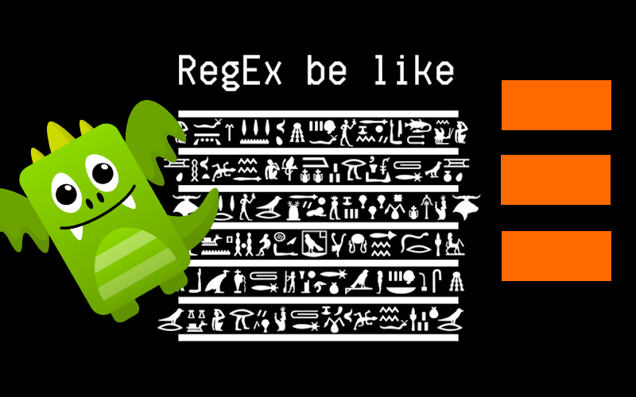

**Regular expressions are one of the classic examples of hate and hate relationships.** Yes, it's not a typo; hate and hate. Do you know anyone who loves or knows how to write moderately complex regex? And can they keep their skill for longer than two weeks without forgetting how to do it?

Maybe this whole wave of Large Language Models is about having someone who will show us how to write regexes. Maybe we hate regular expressions so much that we don't care about hallucinations.

Still, undeniably, regular expressions are useful and powerful. Let me show you an example, but be careful; I warned you already!

**We'll use in this article knowledge from my two other articles:**
- [Persistent vs catch-up, EventStoreDB subscriptions in action](/en/persistent_vs_catch_up_eventstoredb_subscriptions_in_action/)
- [Event stores are key-value databases, and why that matters](/en/event_stores_are_key_value_stores/)
- [Let's talk about positions in event stores](/en/lets_talk_about_positions_in_event_stores/)
- [Mapping event type by convention](how_to_map_event_type_by_convention/)

**Don't want to dive deep into them? Fine, here's the TLDR:**
- EventStoreDB is a database that has the durable append-only log as the physical structure where events are stored,
- events are grouped into streams. Stream is a key/value pair where the key is the record id (e.g. order id), and the value is a sequence of events recorded for this record (e.g. _OrderConfirmed_, _OrderPaymentRecorded_, etc.)
- Events have specific data and metadata, e.g. event type name; we can use it to deserialise events to a specific type. We can do manual type resolution, or automatic, based on conventions.
- EventStoreDB has a functionality called [Catch-up subscriptions](https://developers.eventstore.com/clients/grpc/subscriptions.html#subscribing-from-the-start), which allows you to subscribe to push notifications about new events. You can subscribe to all events or those coming from specific streams.

**Today, we'll focus on subscribing to all events and how to filter them by event type.**

You can think about EventStoreDB subscription as some moving cursor. They start by pointing to the selected position (e.g., the start of the log) and then move sequentially event by event. The global log (called in EventStoreDB _$all_ stream) represents the physical file storage. Thus, it's fast as it doesn't go to indexes. The safe default recommendation is to start from the global log if you want to get events from multiple streams. Typically, you do, as you may want to trigger some flows, build read models, or forward events to the messaging system.

**By default, you'll get all events, whether you need them or not, including internal events used for internal store processing.** That's a waste of network and resources. Not surprisingly, the mature database should provide a solution for that, and that's what EventStoreDB do with [server-side filtering](https://developers.eventstore.com/clients/grpc/subscriptions.html#server-side-filtering). It will perform the filtering during moving cursor, skipping unwanted events without sending them to our application.

Out of the box, you can:
- filter out system events,
- filter by the stream name prefix,
- filter by the event type prefix.

That covers default cases, especially if you have conventional-based naming. You can include module prefixes and stream category prefixes into the name and get a specific set of events, but what if you'd like to get events with specific types? What if those events don't share a common prefix because they're from different (sub)modules or stream categories? Then you have one more option.

**You can filter out events using our inglorious regular expressions!** Yes, I know how that sounds, but please stay with me. 

The subscription with filter looks like that in C#:

```csharp
var filterOptions = new SubscriptionFilterOptions(EventTypeFilter.RegularExpression("SOME REGEX"));

await using var subscription = client.SubscribeToAll(
        FromAll.Start,
        filterOptions: 
        cancellationToken: ct
);
```

Regular expressions allow us to provide the OR operator. Let's say that we want to get _InvoiceIssued_ and _UserEmailProvided_ events. Regex for it could look as

```
^(InvoiceIssued|UserEmailProvided)$"
```

Not that hard, aye? Let's try to generalise it then:

```csharp
public static class EventFilters
{
    public static Regex OneOfEventTypesRegex(params string[] values) =>
        new("^(" + string.Join("|", values.Select(Regex.Escape)) + ")$");
}
```

Simple code, we're just joining the strings with **_|_** separator, escaping the text if it includes some reserved regular expression characters like dot.

We can pass the array of strings and build regular expressions from them. We can call it as:

```csharp
var filterRegex = EventFilters.OneOfEventTypesRegex("InvoiceIssued", "UserEmailProvided");

var filterOptions = new SubscriptionFilterOptions(EventTypeFilter.RegularExpression(filterRegex ));
```

We could also wrap that into a single method:

```csharp
public static class EventFilters
{
    public static Regex OneOfEventTypesRegex(params string[] values) =>
        new("^(" + string.Join("|", values.Select(Regex.Escape)) + ")$");

    public static IEventFilter OneOfEventTypes(params string[] values) =>
        EventTypeFilter.RegularExpression(OneOfEventTypesRegex(values));
}
```

Now, if we have the event type mapper  that's mapping CLR type into the event type name (known from [mentioned earlier article](how_to_map_event_type_by_convention/)), we could also add:

```csharp
public static class EventFilters
{
    // (...)
    public static Regex OneOfEventTypesRegex(params string[] values) =>
        new("^(" + string.Join("|", values.Select(Regex.Escape)) + ")$");

    public static Regex OneOfEventTypesRegex(EventTypeMapper eventTypeMapper, params Type[] eventTypes) =>
        OneOfEventTypesRegex(eventTypes.Select(eventTypeMapper.ToName).ToArray());

    public static Regex OneOfEventTypesRegex(params Type[] eventTypes) =>
        OneOfEventTypesRegex(EventTypeMapper.Instance, eventTypes);
    
    public static IEventFilter OneOfEventTypes(params string[] values) =>
        EventTypeFilter.RegularExpression(OneOfEventTypesRegex(values));

    public static IEventFilter OneOfEventTypes(EventTypeMapper eventTypeMapper, params Type[] eventTypes) =>
        EventTypeFilter.RegularExpression(OneOfEventTypesRegex(eventTypeMapper, eventTypes));

    public static IEventFilter OneOfEventTypes(params Type[] eventTypes) =>
        EventTypeFilter.RegularExpression(OneOfEventTypesRegex(eventTypes));
}
``` 

And use it as:

```csharp
var eventTypeMapper = new EventTypeMapper();

eventTypeMapper.AddCustomMap<InvoiceIssued>("InvoiceIssued");
eventTypeMapper.AddCustomMap<UserEmailProvided>("UserEmailProvided");

var filterOptions = EventFilters.OneOfEventTypes(eventTypeMapper, typeof(ShoppingCartOpened));
```

Or conventional based

```csharp
var filterOptions = EventFilters.OneOfEventTypes(typeof(InvoiceIssued), typeof(UserEmailProvided));
```

And that's all, folks; it wasn't as hard as we thought it would be! 

Still, not to leave you with the impression that Regular Expressions are pleasant, let me finish with an additional example. If I'd like to filter out (so not get) system events AND my specific event called, e.g. _CheckpointStored_, then the filter would look like this:

```csharp
public static class EventFilters
{
    public static readonly Regex ExcludeSystemAndCheckpointEventsRegex =
        new(@"^(?!\$)(?!" + Regex.Escape(typeof(CheckpointStored).FullName!) + "$).+");
```

And I'll leave you with that, allowing you to think for a moment about how it works (or pasting it to ChatGPT asking for help). How would you generalise to filter out more than one event?

**If you'd like to expand and align knowledge around EventStoreDB (or Event Sourcing in general), [contact me!](mailto:oskar@event-driven.io) Besides blogging, I'm also doing consulting and [trainings](https://event-driven.io/en/training/). Happy to help you and your team!**

Cheers!

Oskar

p.s. **Ukraine is still under brutal Russian invasion. A lot of Ukrainian people are hurt, without shelter and need help.** You can help in various ways, for instance, directly helping refugees, spreading awareness, putting pressure on your local government or companies. You can also support Ukraine by donating e.g. to [Red Cross](https://www.icrc.org/pl/donate/ukraine), [Ukraine humanitarian organisation](https://savelife.in.ua/pl/donate/) or [donate Ambulances for Ukraine](https://www.gofundme.com/f/help-to-save-the-lives-of-civilians-in-a-war-zone).
