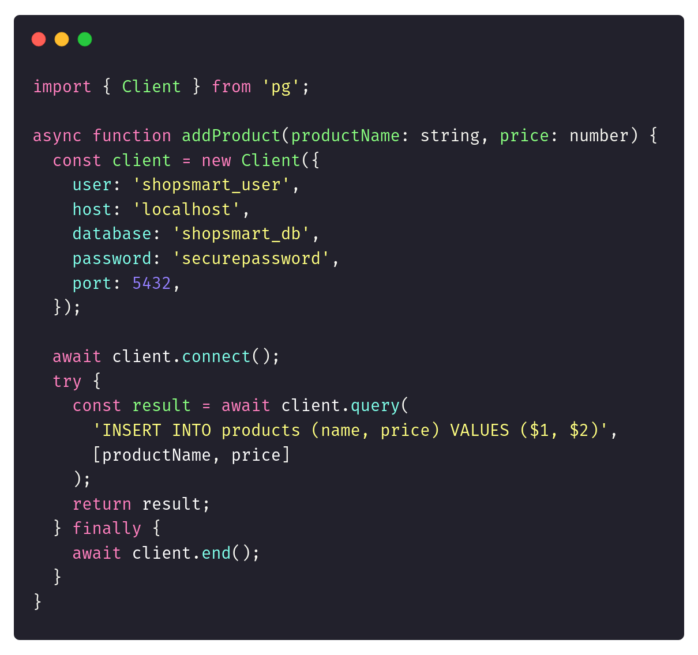
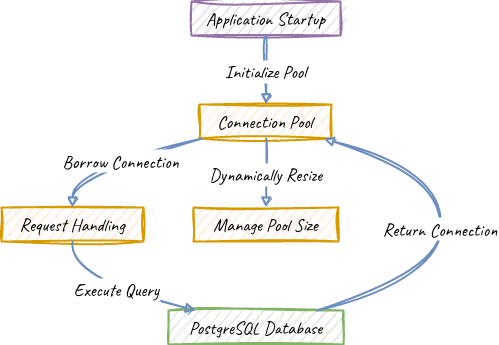
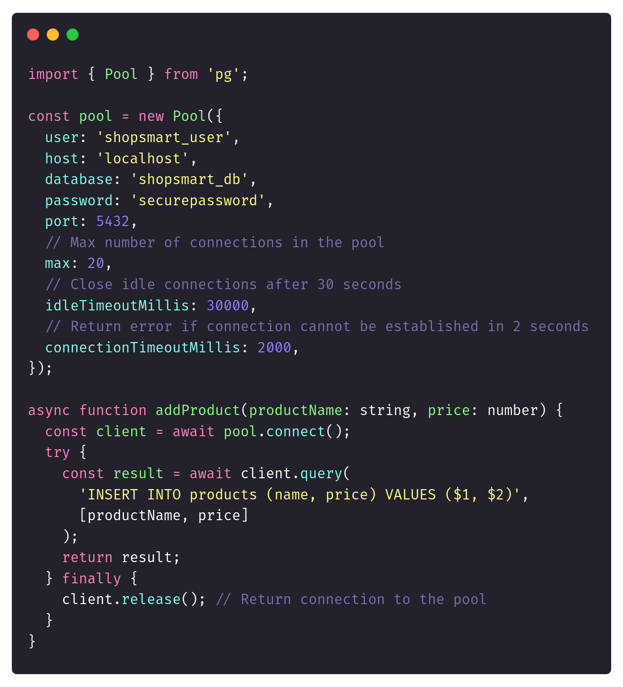
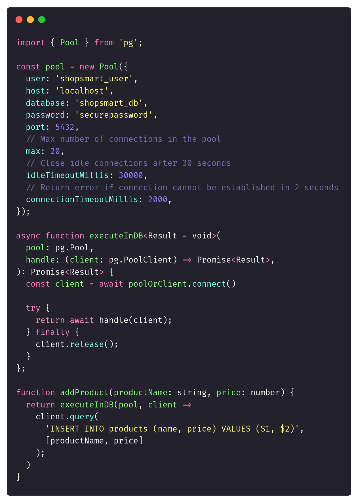
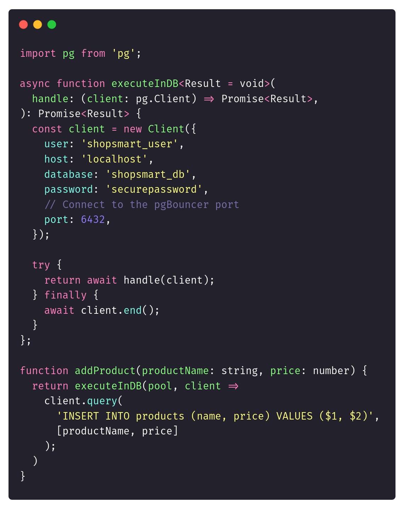
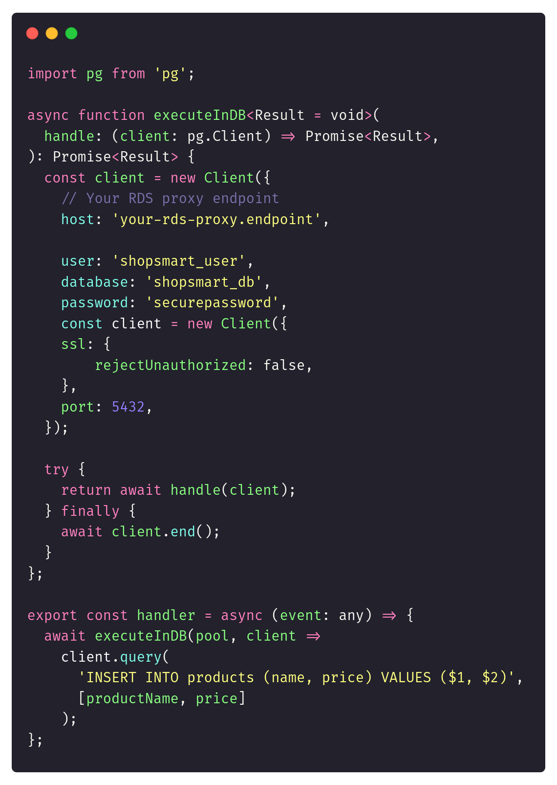

Welcome to the new week!

**Efficiently managing database connections is crucial for any application that handles multiple requests.** Without proper connection management, your application can quickly become slow, unreliable, and costly to maintain. Database connection pooling offers a smarter way to handle database connections.

However, connection pooling isn't always ideal, especially in serverless architectures. Let's explore the mechanics of connection pooling, understand its importance, discuss when it might not be suitable, and explore how modern serverless solutions redefine connection management.

## Life without connection pooling

**Imagine you're building a new e-commerce platform that helps small and medium-sized businesses create and manage their online stores.** It provides features like product listings, inventory management, order processing, and customer analytics. Initially, the focus is on delivering basic functionalities like product management and checkout processes.

You start with a simple architecture. The backend is written in Node.js and PostgreSQL database. The naive version of your database access code could look as:



**Each HTTP request opens a new database connection.** This can work well for local development or small deployment, but setup quickly hits a wall as your user base grows. Users start complaining about slow load times, and your database server gets overwhelmed by too many open connections.

**Why does that become a problem?**

**Opening a new database connection for every request involves a time-consuming process** involving authentication, network setup, and session establishment. This adds significant latency, especially in high-traffic applications. Your database has a finite limit on how many concurrent connections it can handle. Without pooling, you risk overwhelming the database, leading to resource exhaustion and potential downtime.

## What is Connection Pooling?

Database connection pooling is a technique that allows applications to manage database connections more efficiently by reusing a set of established connections. Instead of creating a new connection for each database request, the application maintains a pool of open connections that can be reused, significantly reducing the time and resources needed to establish connections repeatedly.

### How Connection Pooling Works

Here's a breakdown of how connection pooling operates in a technical environment:

1.  **Connection Initialization**: When the application starts, it initializes a fixed number of database connections and stores them in a pool.

2.  **Request Handling**: Whenever a request needs to interact with the database, the application borrows an existing connection from the pool instead of opening a new one.

3.  **Connection Reuse**: After executing the query, the connection is returned to the pool, making it available for future requests.

4.  **Dynamic Pool Management**: The pool can dynamically resize, creating more connections if demand exceeds a pre-defined limit and reducing idle connections to save resources.

Do you prefer visuals? There you have it!



Connection pooling can significantly enhance performance and reduce latency by eliminating the latency added by setting up a connection each time.

### Implementing Connection Pooling

Each mature development environment has a built-in connection pooling. For instance, for PostgreSQL:

-   Java has [HikariCP](https://github.com/brettwooldridge/HikariCP),

-   .NET has the [Npgsql connection pool](https://www.npgsql.org/doc/connection-string-parameters.html#pooling),

-   Python has the [SQLAlchemy connection pool](https://docs.sqlalchemy.org/en/14/core/pooling.html),

-   Go has the [pgxpool](https://pkg.go.dev/github.com/jackc/pgx/v4/pgxpool) for PostgreSQL,

-   Node.js has [pg.Pool](https://node-postgres.com/apis/pool),

-   etc.

We’ll use the last one to address our connection management-related performance bottlenecks. The code could look as follows:



It’s a simple code change, but instead of creating a new connection on each request, we’re asking the connection pool to “borrow” us a connection.

**Imagine our e-commerce analytics dashboard or Black Friday’s demand. It could receive thousands of requests per second, each demanding data from a central database.** Without connection pooling, the overhead of opening and closing connections for each query would cripple performance. With pooling, the dashboard delivers real-time insights without delay.

**Databases have a finite limit on the number of concurrent connections they can handle.** Without pooling, you risk overwhelming your database with excessive connections, leading to resource exhaustion and potential downtime.

In applications where high concurrency is expected, such as e-commerce platforms, connection pooling helps manage the number of active connections efficiently. It ensures that the database isn't overwhelmed by the number of clients. The connection pool offloads the database by maintaining connections shared across multiple clients, avoiding unnecessary load on your database infrastructure.

**As your application scales, so does the number of database requests it must handle.** Connection pooling enables applications to manage a high volume of concurrent connections effectively, providing a reliable way to handle traffic spikes without degrading performance or overloading the database.

All that sounds great, but we cannot have only good things. So, let’s discuss…

### Challenges and Considerations

While connection pooling offers numerous benefits, it comes with its own challenges that must be addressed to ensure optimal performance. As you saw in the code snippet, the connection pool gives you multiple configuration settings.

Each implementation can have its own, but the most important are:

-   pool size

-   connection timeout.

**Choosing the right pool size is critical to avoid bottlenecks or resource exhaustion.** Too few connections can lead to queued requests, while too many can overwhelm the database resources, degrading performance.

It’s not possible to say what size is best for your application. That’s something that should include the specifics of your:

-   workload characteristics,

-   database capacity,

-   application requirements.

**We should analyze our application’s workload to determine the optimal number of connections, considering peak and off-peak usage patterns.**

Having that, take a look at database capacity and understand its limits. That’s critical for preventing overloading it with too many connections.

What does “too many” mean? It can mean something else for each application. The basic information comes from considering the concurrent users and requests our application needs to support. But of course, we should understand our business use case to set up the metrics based on the real demand.

**Striking the right balance between performance and resource usage requires carefully tuning pool settings.** While a larger pool can handle more requests, it consumes more resources. Conversely, a smaller pool can lead to contention and delays.

We can try to implement dynamic pool sizing algorithms that adjust the pool size based on current demand and resource availability. Of course, that’s tricky, and we should start by continuously monitoring and fine-tuning the settings as our system evolves.

#### Connection Leaks

Connection leaks are one of the most common issues. They occur when connections are not properly returned to the pool, leading to a gradual exhaustion of available connections and eventual application failures. This often happens when a developer forgets to close a connection after use.

**Using try/finally block can help with that.** We did that in our snippet above. That ensures connections are always returned to the pool, even if an exception occurs.

Of course, we should cut the number of things developers need to remember. That’s why it’s worth including such cleanup in some common wrappers, reducing the likelihood of misuse. Our updated helper can look as follows:



But even with that, we should continuously monitor our connection usage to identify if we don’t have potential connection leaks.

#### Security Considerations

**As we share connections between multiple operations, we also share the credentials we connect with.** This can make it harder to use some features like [Row-based security](https://www.postgresqltutorial.com/postgresql-administration/postgresql-row-level-security/). We’ll always connect to the database as the same user.

This can push you to implement Access Control in the application layer. The other option is to have multiple connection pools. Each connection pool will be related to specific Permission Groups/Roles (e.g. different connection pools for admins and regular users).

Maintaining a large pool of open connections can pose a risk in environments where security is a critical concern. If a connection in the pool is compromised, it might lead to unauthorized access to the database.

Ensure proper security measures, such as encryption and access control, are in place when using connection pooling. If security cannot be guaranteed, you may consider alternatives that offer tighter control over connection access.

* * *

### Connection Pools, Microservices and Conway’s Law

Nowadays, [Conway's Law](https://www.architecture-weekly.com/p/papers-we-love-2-how-do-committees) always has to be involved, aye? But why here?

**Using a connection pool library like [pg.Pool](https://node-postgres.com/apis/pool) in Node.js is a good first step toward implementing connection pooling for many applications.** It's simple, easy to set up, and provides a basic level of pooling out of the box. You already saw that refactoring from a no-pooling setup should be pretty easy to medium-sized applications.

**Yet, it assumes that you have a pool per deployment.** That works great for monolithic or not highly distributed systems, but…

What if you have multiple instances of the same service and doing [load balancing](/en/setting_up_nginx_with_aspnet/)?

What if you have microservices with dozens of deployed services?

What if you not only have Node.js applications but also write in other stacks (e.g. Java, C#, Python, etc.)?

This can result in repeating the connection pool setup in each dev environment, which can be painful to maintain.

Also, if all those applications use the same database (e.g., shared per database schema), they won’t use the same pool, which can again lead to pool exhaustion.

For these situations, you might consider using a dedicated service for pooling. It’ll act as a proxy between our application and the database. The examples can be as follows:

-   MySQL: **[ProxySQL](https://proxysql.com/)** or **[MySQL Router](https://dev.mysql.com/doc/mysql-router/en/)**

-   MSSQL: **[odbc-bcp](https://github.com/mkleehammer/pyodbc)**

-   Oracle: **odpi-pool, [MaxScale](https://github.com/mariadb-corporation/MaxScale)**

-   PostgreSQL: **[pgBouncer](https://www.pgbouncer.org/).**

We’ll use the last one as an example.

#### Connection Pool Proxy Service

**pgBouncer** is a specialized connection pooler for PostgreSQL, offering advanced features beyond those available in basic libraries. It's known for its high performance and low memory footprint, making it suitable for demanding applications. pgBouncer acts as a middle layer between your application and the PostgreSQL server. It maintains a pool of connections to the server and multiplexes client connections, managing resources efficiently.

To configure it, we need to install it on our server:

```
sudo apt-get install pgbouncer
```

Setup the configuration and reference to our PostgreSQL database in _pgbouncer.ini_:

```
[databases]

mydb = host=localhost port=5432 dbname=mydb

[pgbouncer]

listen_addr = 127.0.0.1

listen_port = 6432

auth_type = md5

auth_file = /etc/pgbouncer/userlist.txt

pool_mode = transaction

max_client_conn = 100

default_pool_size = 20
```

Having that, we can launch the service

```
sudo service pgbouncer start
```

**Now, we need to modify our application. We cannot use the application level pool anymore.** If we did, then they would clash with each other. If we’re using the connection pool proxy, we must create a client each time and let the proxy manage connections internally. The updated code would look like this:



Same for other services. Each can just use the native connectivity without being aware of the pooling.

**A proxy service like pgBouncer can help speed up and handle more transactions without putting pressure on the application.** It can also scale independently from the application. As it’s designed to handle connection pools purely, it can be better optimised and more suitable for resource-constrained environments.

As always, the pros can easily become cons depending on the perspective. They require additional configuration and maintenance compared to library-based solutions. While efficient, they lack some advanced features like query rewriting or protocol-level optimizations found in other solutions.

* * *

### When Proxy Connection Pool Might Not Be Enough

Even with pgBouncer-like solutions, there might be cases where your application demands more dynamic and automated solutions, especially in serverless environments.

**While working on [Pongo](https://github.com/event-driven-io/Pongo) and [Emmett](https://github.com/event-driven-io/emmett). I implemented connection pooling by default, similar to the one I showed above.** But I forgot to enable a regular non-pooled approach. I was quickly reminded that [I was wrong](https://github.com/event-driven-io/Pongo/issues/35). The fix was simple, but let me explain why I enabled such an option.

**Connection pooling can become problematic in serverless environments.** Serverless architectures, like those built on AWS Lambda or Azure Functions, are designed to be stateless, with each function execution being short-lived and independent. Maintaining a pool of connections across multiple executions isn't feasible, as each invocation might spin up its connection pool.

This can lead to excessive resource consumption and overwhelm the database with too many simultaneous connections. Since serverless functions scale automatically based on demand, they can quickly exceed the database's connection limits.

Instead of traditional connection pooling, serverless applications often require alternative solutions like database proxying or managed connection pools, allowing efficient connection management without persistent states.

**For applications with very low traffic or infrequent database access, the overhead of managing a connection pool may outweigh its benefits.** The time and resources spent on maintaining the pool might not be justified if the application doesn't require rapid database access or high concurrency.

In such cases, a simpler approach of opening a new connection for each request might be more straightforward and efficient.

**Ok, but what if our solution has higher demands and traffic, and we’re into serverless?**

Of course, you can maintain your instance of VM with pgBouncer, but that’s not serverless, as it requires stateful service. We could also implement a single-writer pattern by queuing all operations to a single queue, but then it’s not the most scalable solution (to say mildly).

Typically, we need to use the managed service. An example of that can be the [AWS RDS Proxy](https://aws.amazon.com/rds/proxy/) (for Azure, you could use [Azure Database for MySQL/PostgreSQL Flexible Server Proxy](https://learn.microsoft.com/en-us/azure/postgresql/flexible-server/concepts-pgbouncer))

**AWS RDS Proxy is a fully managed database proxy.** It’s designed to enhance the scalability and reliability of applications that use Amazon RDS databases. It is particularly useful in serverless architectures where maintaining persistent connections is challenging.

RDS Proxy is a man in the middle between your application and the database, managing connections efficiently. It allows serverless functions to share a pool of database connections, reducing the overhead of establishing new connections with each function invocation.

To set it up, you must have RDS Proxy ready and ensure that your AWS Lambda has access to it (so if IAM Role has proper setup). After that, we just need to adjust the setup to be:



Of course, we still need to monitor it to ensure that our RDS Proxy settings match our needs.

AWS RDS Proxy is a decent service, but it requires configuration and understanding of AWS services, which might introduce complexity. Plus, it adds additional costs to the managed service. No free lunch!

**Implementing Connection Pooling Proxy is a trend for Serverless Offerings**. [Cloudflare Hyperdrive](https://developers.cloudflare.com/hyperdrive/configuration/how-hyperdrive-works/) and [Supabase Supavisor](https://supabase.com/blog/supavisor-postgres-connection-pooler) are examples of such services. They’re designed specifically for serverless environments, addressing the unique challenges of stateless architectures.

**Cloudflare Hyperdrive is a global connection pooling solution that optimizes database interactions across distributed environments.** It manages a global pool of connections and routes queries to the nearest pool to reduce latency.

**Supavisor is a connection pooler for PostgreSQL developed by Supabase.** It is designed to handle high concurrency and rapid I/O operations. Built with Elixir, it efficiently manages connections and offers features like query load balancing.

They both shine in high-concurrency, real-time applications. However, they are both limited to supported databases (for Supabase, it’s just PostgreSQL) and may not support all native connection settings.

Plus, of course, they’re only limited to their products. Still, if you’re into serverless, check if your provider has such a proxy service. If you need to be on a high scale, you may require it!

## Best Practices for Implementing Connection Pooling

Let’s recap the learnings and try to give a recap of what Implementing connection pooling effectively requires adherence to best practices that ensure optimal performance and resource management. Here are some recommendations:

-   **You can start simple by using reliable connection pooling libraries.** Choose a connection pooling library or framework that suits your application’s needs. These libraries provide built-in support for connection pooling and offer various features to customize and optimize pool behaviour.

-   **Handle connection release gracefully to prevent connection leaks.** Ensure you release connection (e.g. in a try/finally block or reusable helper). You can also implement retry logic to handle transient connection failures gracefully. Provide fallback mechanisms to ensure continuity of service in case of connection issues.

-   **If you’re into microservices, Kubernetes, or multiple tech stacks, consider using a proxy service like pgBouncer to unify load balancing.**

-   **If you’re into Serverless, check managed services available in your platform like AWS RDS Proxy, Cloudflare Hyperdrive, Supabase Supervisor.** Traditional connection pooling may not be the best fit in serverless environments due to the stateless nature of serverless functions.

-   **Monitor and tune pool settings regularly.** This is essential to maintaining optimal performance. Track metrics such as connection usage, wait times, and pool size to identify potential issues. Continuously evaluate your system as it evolves.

Database connection pooling is essential for optimizing performance and resource utilization in modern applications. By reusing existing connections, pooling reduces latency, improves scalability, and ensures efficient resource usage. However, it also requires careful configuration and monitoring to avoid pitfalls like connection leaks and resource exhaustion.

By implementing best practices and leveraging reliable connection pooling strategies, you can build performant and resilient applications that handle high traffic and demanding workloads.

In software development, mastering connection pooling is like having a well-oiled engine—it keeps everything running smoothly and efficiently. So, take the time to understand and implement connection pooling in your projects. Your applications (and your users) will thank you for it.

Cheers

Oskar

**p.s. Ukraine is still under brutal Russian invasion. A lot of Ukrainian people are hurt, without shelter and need help.** You can help in various ways, for instance, directly helping refugees, spreading awareness, and putting pressure on your local government or companies. You can also support Ukraine by donating, e.g. to the [Ukraine humanitarian](https://savelife.in.ua/en/donate/) organisation, [Ambulances for Ukraine](https://www.gofundme.com/f/help-to-save-the-lives-of-civilians-in-a-war-zone) or [Red Cross](https://redcross.org.ua/en/).
