Welcome to the new week!

**In [the last edition](/en/architecture-weekly-189-mastering/), we explored why connection pooling is crucial for using databases efficiently.**

**Now, let's take a step further and perform a thought experiment: How would you actually implement a connection pool?** We'll use Node.js and TypeScript as an illustration, as we need to choose a specific stack to make the concepts concrete.

If you think, “Well, I won’t ever do it myself”, don’t worry—the intention here isn’t to drown you in the imaginary code. Instead, I will show you how these micro-scale coding considerations can impact macro-scale design analysis.

**As we go, we’ll learn a few valuable concepts, like Queuing, Backpressure and single Writer, and discuss why queuing can be useful in managing concurrency and beyond!**

### Connection Pool

Let’s start where we ended, so with our database access code:

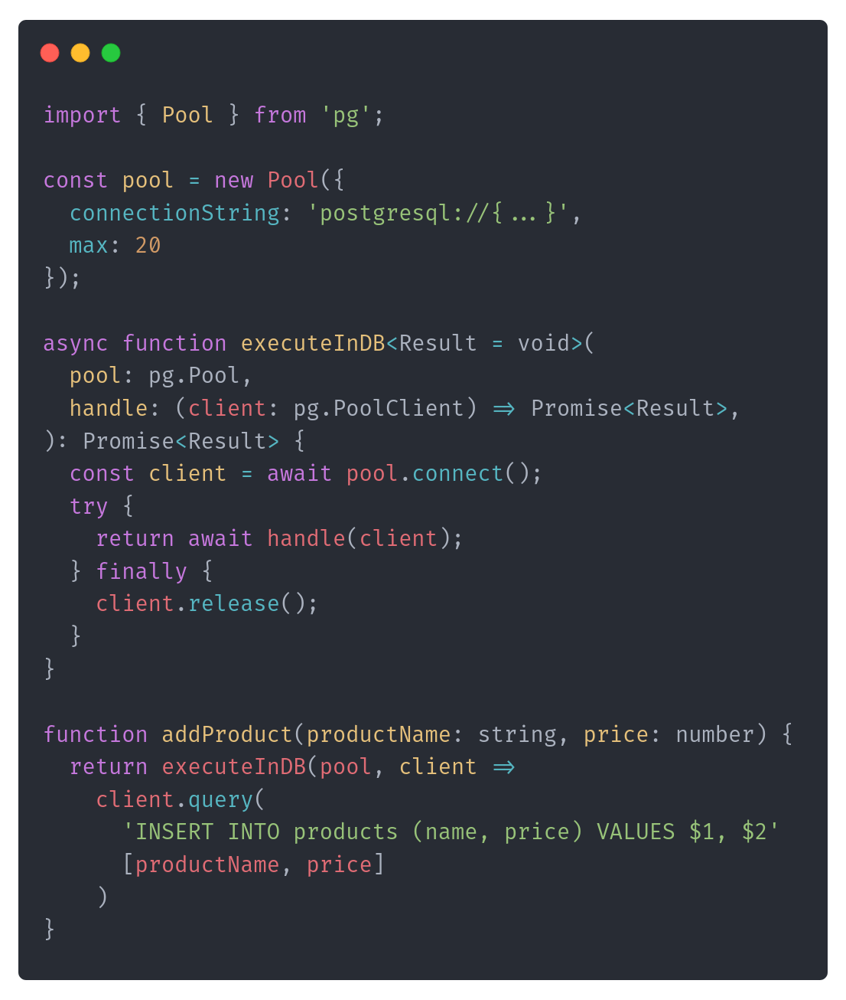

As we discussed in detail in the previous article, a connection pool manages reusable database connections shared among multiple requests. Instead of opening and closing a connection for each request, we borrow a connection from the pool and return it after database operation.

Thanks to that, we’re cutting the latency required to establish a connection and get a more resilient and scalable solution ([at least if we’re not into serverless](https://www.architecture-weekly.com/i/147364154/when-proxy-connection-pool-might-not-be-enough)).  

**Stop for a moment, take a sheet of paper and pen, and try to outline how you would implement such a connection pool.**

Done? Now, think about the potential limitations of your thinking and the potential solutions to them.

Ready? Let’s compare that with my thoughts!

### Basic definition

Let’s start by defining the basic API. It could look like this:

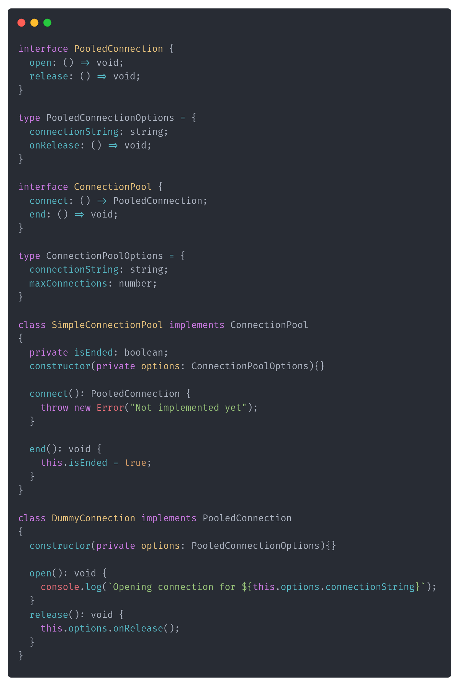

**There is not much to explain besides that we want to manage the pool to the database represented by the connection string and limit the number of open connections. Why?**

Imagine a service like a payment gateway that handles transactions for a popular online retailer. During peak shopping times, such as Black Friday, the system experiences a huge increase in payment requests. Each transaction requires a secure connection to the database to verify payment details and update the order status.

Yet, the database has its limits, so we might need to try somehow to squeeze that into the limit of 100 concurrence connections. When all 100 connections are occupied processing transactions, new incoming requests must be managed effectively.

We could try to:

\- **Fail Immediately**: The system could reject new requests outright, leading to a poor user experience and lost sales.

\- **Retry Aggressively**: The requests might enter a loop, repeatedly attempting to acquire a connection, which can further strain the system.

The naive implementation of a fail-fast strategy could look as such:

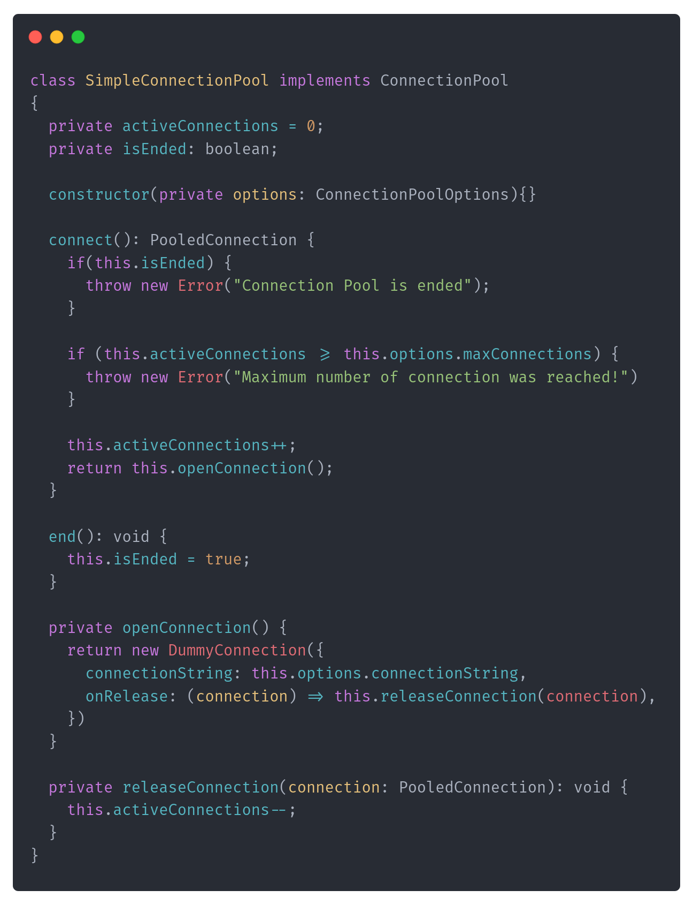

**Now, While doing retries in the loop or even immediate failure can be a temporary solution, for obvious reasons, it won’t scale and will result in a subpar experience.**

Consider a busy restaurant with limited seating. When all tables are occupied, you can be asked to wait a bit near the entrance. As tables become available, the waiter will invite you to be seated. This ensures that the restaurant operates smoothly without overcrowding or turning away customers.

We could do the same with our connection pool implementation. Instead of rejecting new requests or letting them endlessly retry (which could crash your system), they're placed in a queue and handled sequentially.

Queuing brings the following benefits:

1\. **Sequential Processing:** Requests are handled on a first-come, first-served basis, ensuring fairness.

2\. **System Stability**: Queuing prevents the system from being overwhelmed by controlling the rate at which requests are processed.

3\. **Enhanced User Experience:** While users might wait longer, they receive feedback that their request is in progress, often preferable to immediate failures.

Okay, but how do we add queuing to our pooling? Let’s start by defining a simple queue. Essentially, you could think about it as an array of pending items.

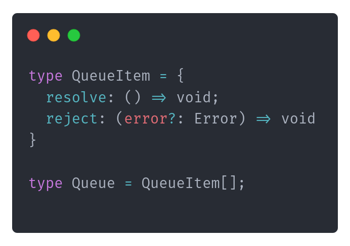

Instead of throwing an error, we will enqueue an “open connection task” to the queue and return Promise. That will make the user wait until the connection is open.

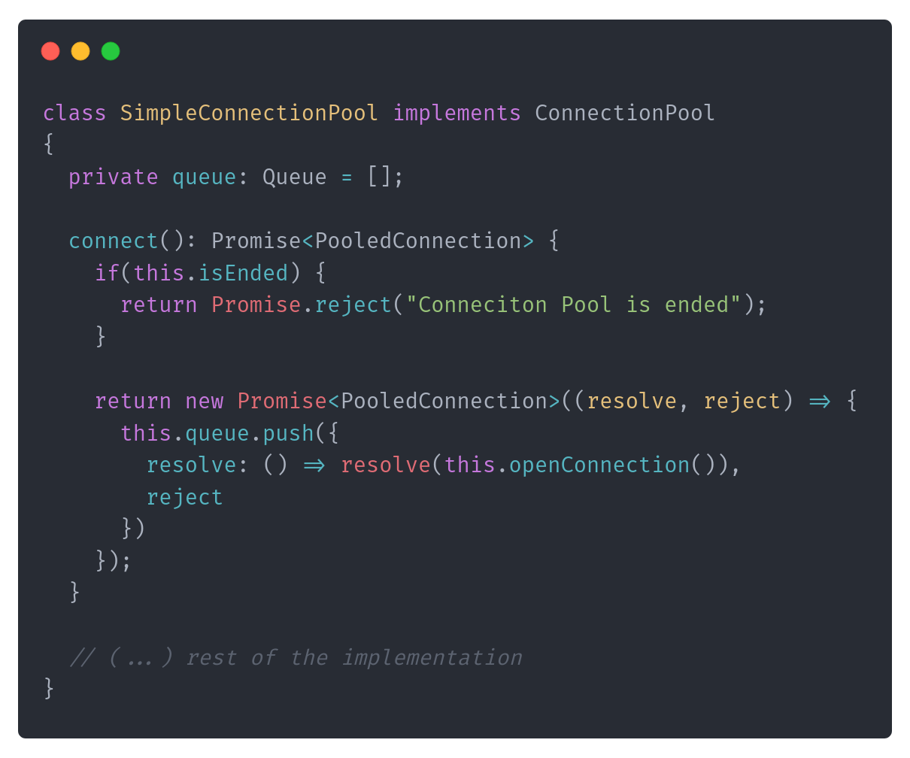

In other words, we’re telling the pool user that they can safely wait and when they can stop waiting (thanks to the native Promise handling, in .NET, that’d be _Task_; in Java: _CompletableFuture_).

Now, we’ll need to trigger processing, and we can trigger it immediately once the pool is created. We should also be able to stop processing; we can do it by:

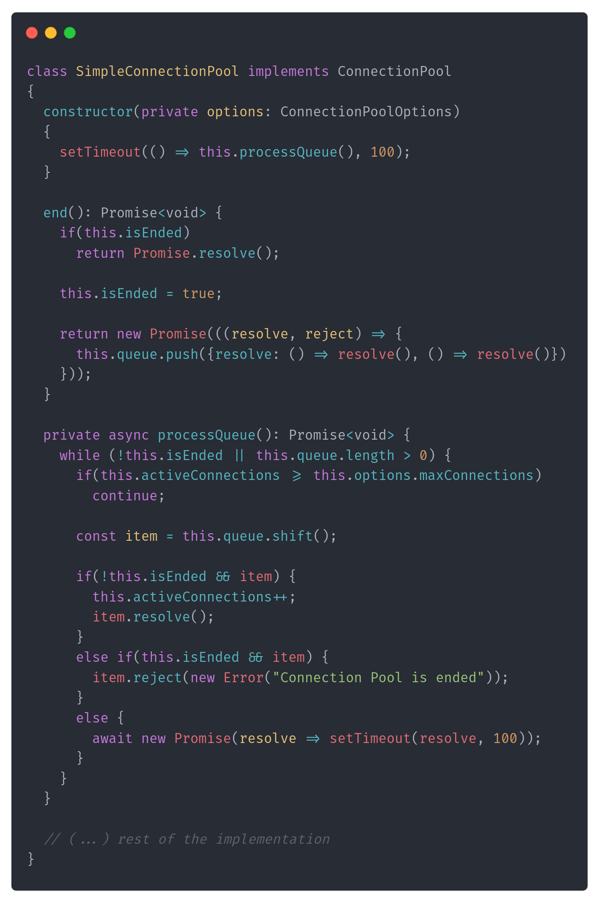

Queue processing happens in the _processQueue_ method. It’s an asynchronous method that tries to process the queue until all items are handled. We’re triggering it immediately upon pool creation. It runs until the pool ends, or there are pending items to process.

We also added handling to make a graceful pool ending accordingly. When that happens, we must reject all pending items and wait until that’s done. We'll know that as we’re enqueuing the “end all processing” as the last item in the queue.

Cool, aye?

### Limitations of Raw Queuing

While queuing addresses the immediate challenge of handling excess requests, it introduces its own set of challenges:

1.  **Unbounded Growth:** The queue can grow indefinitely if incoming requests arrive faster than they can be processed. This can consume significant memory, leading to performance issues or even system crashes. In our case, as we’re only processing the queue (creating a new connection) when we are below the maximum number of active connections, that can quickly escalate if our connections are used too long.

2.  **Increased Latency:** As the queue grows, each request's waiting time increases, leading to higher response times and potential timeouts. You saw that even in raw code, the initial version just returned a new connection; now we’re returning the promise. Promise that will be fulfilled eventually (or not…).

3.  **Resource Consumption**: Each queued request might consume resources (like memory for request data), straining the system as the queue grows.

Returning to our payment gateway example, if the rate of incoming payment requests is consistently higher than the rate at which transactions can be processed, the queue will grow over time. This leads to longer wait times for users, increased latency, and potentially even lost transactions if the system becomes overwhelmed.

To mitigate the pitfalls of unbounded queuing, we introduce the concept of backpressure.

### Introducing Backpressure: Controlling the Flow

Backpressure is a mechanism by which a system signals to upstream components (like clients or calling services) to slow down the rate of incoming requests. It's like a network flow control mechanism, where data transfer rates are adjusted to prevent packet loss or congestion.

**How Backpressure Helps:**

1.  **Preventing Overload:** By controlling the rate of incoming requests, the system ensures it processes tasks at a sustainable pace.

2.  **Resource Management:** It prevents excessive memory or CPU consumption caused by an unbounded number of queued requests.

3.  **Improved User Experience:** Instead of allowing requests to languish in a long queue, the system can provide immediate feedback to clients, prompting them to retry later or handle the slowdown gracefully.

How to actually implement Backpressure? The most popular options are:

-   **Rejecting Excess Requests:** When the queue reaches a certain length, the system can start rejecting new requests with appropriate error messages, signaling clients to retry after some time.

-   **Dynamic Rate Limiting:** Adjust the rate at which new requests are accepted based on the current system load.

-   **Client-Side Adjustments:** Clients can be designed to handle backpressure signals, employing strategies like exponential backoff to retry requests.

Let’s apply the basic option, so rejecting Excess Requests. We need to extend Connection Pool options to provide max queue size:

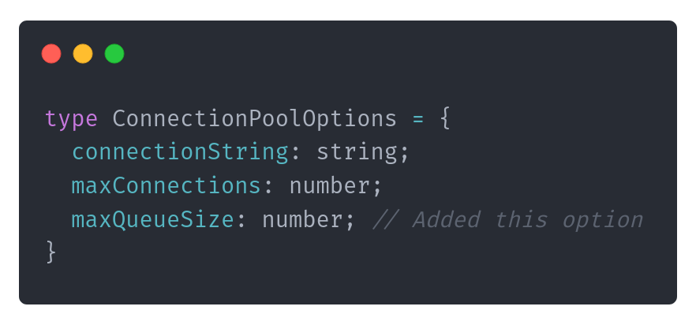

Then we can use it in the connect method to reject promise immediately:

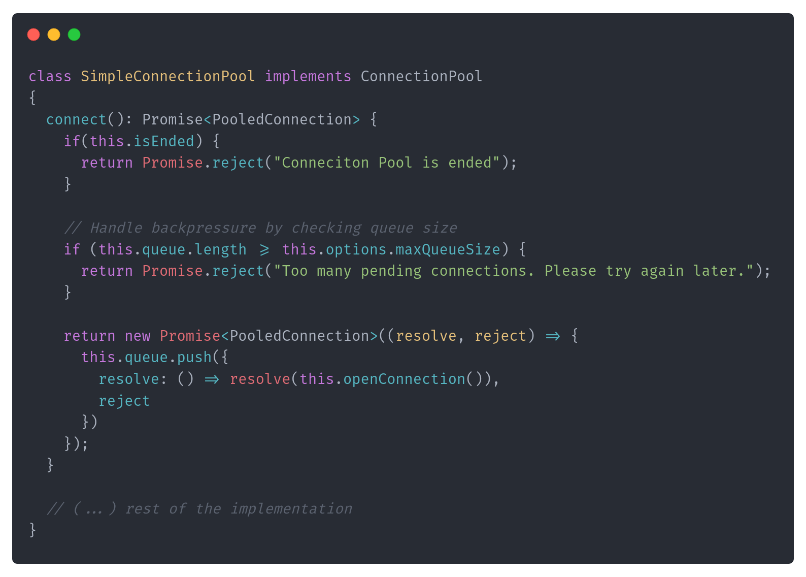

Of course, we could return some other type with additional information, like when to retry or apply dynamic rate limiting, but you get the idea. If you’d like to learn more about that pattern, please drop me a note, and I’ll consider that in further releases.

### Centralising Queue Management into Broker

The implementation looks okay, but it’s not fully bulletproof. Also, queue management seems to be mixed with backpressure management. That’s not great, as it looks more like a general pattern. What if we centralised that into one place? Let’s do that!

We’ll define the general QueueBroker, which is responsible for managing the queue and triggering processing, ensuring that only one processing is happening at one time. Let’s start by adjusting our API:

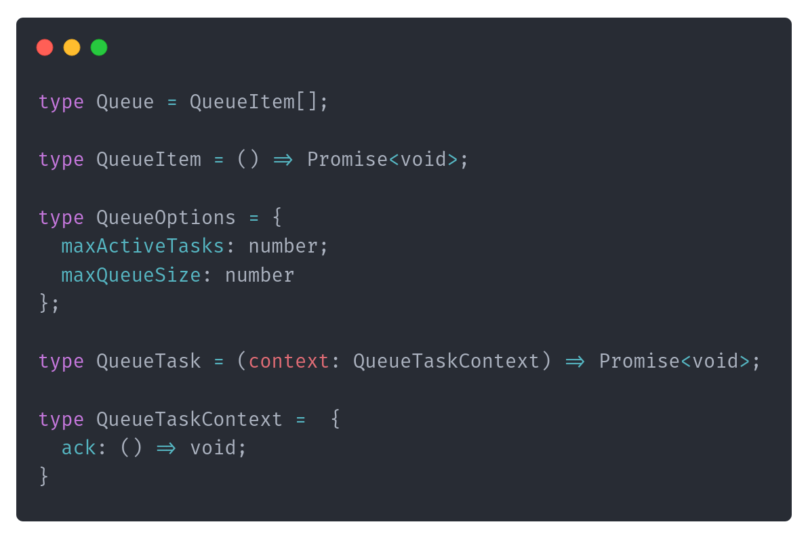

The queue is still built with an array of async tasks. It can manage the number of active tasks and the queue size.

What’s Queue Task? Before explanation, let’s look now on the extracted QueueBroker code:

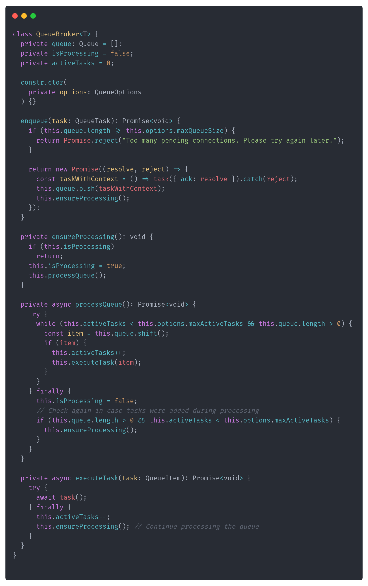

Essentially, it’s refactored code we took from the connection pool. The difference is that instead of constantly running the background process, it is triggered once the item is processed. Then, it tries to drain the queue until the end.

The QueueBroker handles concurrency by managing the number of tasks (connections) processed concurrently using the _maxActiveTasks_ parameter. It automatically tracks the number of active tasks and ensures that no more than the number of connections are active at any time.

**The queue task is an async, potentially multi-step process that can start and be completed at some point.** When we open a connection, we start such a task; we don’t know precisely when it will be released. We only know it will be done after we run our SQL query. As we know, various queries take different amounts of time. That’s why we’re giving queue user to ack (from “Accept”) the task processing end:

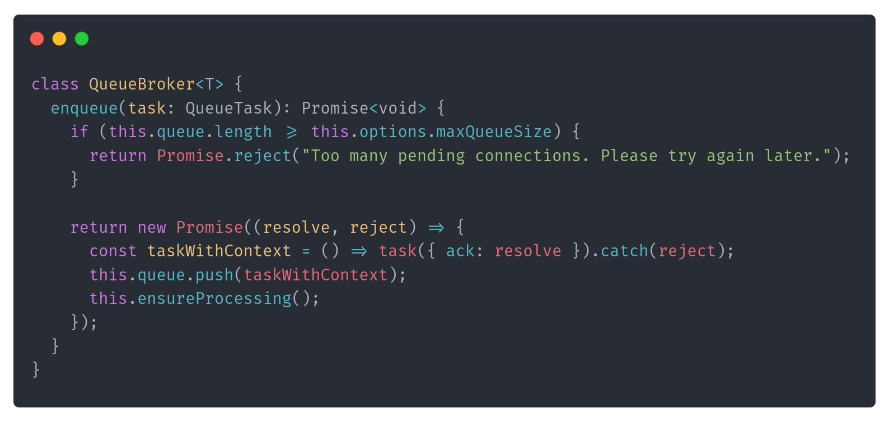

We’re returning the promise that it will end when the task is handled, so when ack is called.

**Thanks to that, we don’t need to sleep or wait; all processing is push-based.**

The refactored connection pool implementation will look as follows:

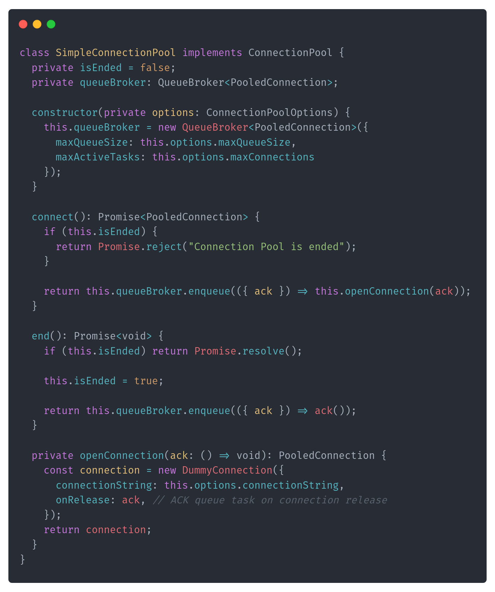

This is the critical line responsible for finishing the queue task:

```
onRelease: ack, // ACK queue task on connection release
```

The resolve method is passed directly into openConnection, which means that when a connection is released, it's automatically resolved and the next task in the queue can be processed.

Our connection pool no longer needs to track active connections manually. The QueueBroker handles this logic by limiting the number of concurrently running tasks.

This setup supports multiple concurrent connections up to the specified limit (maxConnections). The QueueBroker ensures that the pool can handle as many connections as allowed and processes them efficiently.

**After that now, we limited the resource usage and made the queuing code reusable in other places. And hey, we implemented one more pattern: Single-Writer.**

### Single-Writer Pattern

What is the Single-Writer Pattern?

**The Single-Writer pattern is a concurrency design pattern in which only one thread (or, in JavaScript's case, one function execution context) is responsible for writing or modifying a shared state.** This pattern is useful in scenarios where multiple threads or asynchronous functions might try to modify shared state concurrently, leading to potential race conditions or inconsistent state.

In our connection pool, the **QueueBroker** class is key. It manages a queue of tasks (like opening connections) and ensures that only a set number of tasks run simultaneously based on the pool’s capacity. This keeps the system from becoming overloaded.

The single-writer pattern is implemented through the _processQueue_ method in the QueueBroker. Here’s how it works:

-   **Single Point of Execution**: We use an _isProcessing_ flag to ensure only one instance of _processQueue_ runs at a time. This prevents multiple instances from processing tasks simultaneously, which could lead to inconsistencies.

-   **Controlled Task Management**: Tasks are added to the queue, and the QueueBroker decides when to process them, ensuring the system stays within its capacity limits.

In the **SimpleConnectionPool** class, task management is delegated to the QueueBroker. When a connection request is made, it’s queued and handled by the QueueBroker, ensuring that connections are opened only when the system is ready. This delegation:

-   **Prevents Race Conditions**: By centralizing task management, we avoid multiple processes trying to modify the same data simultaneously.

-   **Simplifies Concurrency Management**: Only the QueueBroker modifies the queue or tracks active tasks, reducing complexity and minimizing bugs.

The result is a connection pool that operates efficiently and reliably, using resources effectively without being overwhelmed. The single-writer pattern makes the system easier to understand, maintain, and scale, setting a solid foundation for future growth.

### **Lifting the Patterns to System Architecture**

The concepts of queuing, backpressure, and the single writer pattern are not limited to individual services or isolated pieces of code. These patterns are foundational principles in the design of large-scale distributed systems, where they play a crucial role in maintaining stability, consistency, and performance. Let's explore how these patterns are applied in real-world systems, with specific examples of tools and technologies that use them.

#### **Queuing and Backpressure in Microservices: Amazon SQS and AWS Lambda**

In a microservices architecture, different services often communicate asynchronously using message queues. **Amazon Simple Queue Service (SQS)** is a fully managed message queuing service that enables microservices to decouple and scale independently. However, managing the flow of messages between services is critical.

**In a typical microservices environment, one service might produce messages much faster than another service can consume them.** For example, a data ingestion service might rapidly upload logs to a queue, but the log processing service might not be able to keep up due to its processing speed or external dependencies, like a database or external API.

**SQS, combined with AWS Lambda, provides a potential solution.** SQS handles the queuing, while Lambda can process these messages. Importantly, Lambda automatically scales the number of function instances based on the number of messages in the queue. This scaling is effectively a form of backpressure: if the queue grows, more Lambda instances are invoked to process the backlog, and if the queue shrinks, the number of instances is reduced.

**For instance, consider a media company that processes user-uploaded videos.** Videos are uploaded to S3, and an SQS queue triggers Lambda functions to process these videos (e.g., generating thumbnails and converting formats). If there’s a sudden spike in uploads, SQS will handle the queuing, and Lambda will scale up the number of processing functions. If the video processing service is slower due to the complexity of certain videos, backpressure ensures that the system can gracefully handle the backlog without overwhelming the processing service.

#### **Queuing and Backpressure in Content Delivery Networks (CDNs): Cloudflare**

In content delivery networks (CDNs), managing the flow of requests and responses is critical for ensuring fast and reliable delivery of content to users around the world. **Cloudflare**, one of the largest CDNs, uses sophisticated queuing and backpressure mechanisms to manage this flow at a massive scale.

**CDNs face the challenge of delivering content quickly, even during traffic spikes.** For example, when a new video goes viral, millions of users might try to access it simultaneously. If the CDN’s servers are not carefully managed, they could be overwhelmed, leading to slow load times or outages.

**Cloudflare uses backpressure to manage how content is delivered to users.** When a server becomes overloaded with requests, it can slow down the rate at which new requests are accepted, queueing them as necessary. This ensures that the server remains responsive and all users receive their content, albeit with some requests being slightly delayed.

**For instance, millions of users might simultaneously request access to the video stream during a global sporting event's live streaming.** Cloudflare’s CDN infrastructure will queue and manage these requests, applying backpressure to ensure the servers are not overwhelmed. This allows the CDN to continue delivering high-quality video streams to all users, even under extreme load.

### **Single Writer Pattern in Kafka Consumer Groups**

**In distributed systems, maintaining the order of events during processing is crucial for consistency, especially when dealing with real-time data streams.** Kafka’s consumer groups naturally implement a form of the Single Writer pattern to ensure that events are processed in the correct order.

**How It Works? Kafka divides data into partitions, each processed by a single consumer within a consumer group.** This approach ensures that only one consumer is responsible for processing the events from a particular partition at any time, maintaining the order of events and avoiding race conditions.

**Consider an e-commerce platform processing order events like "OrderPlaced," "OrderConfirmed," and "OrderShipped."** Each event is critical to maintaining the correct order state. Kafka’s consumer groups ensure that all events for a given order are handled by the same consumer, in the exact sequence they were produced, ensuring consistency in the order management system.

If a consumer fails, Kafka reassigns the partition to another consumer, which resumes processing from the last committed offset, preserving the order of events. This mechanism aligns with the Single Writer pattern, ensuring that each partition's events are handled by a single "writer" (consumer) at a time, thus maintaining the integrity and consistency of the system.

### **Conclusion: From Micro-Scale Patterns to Macro-Scale Stability**

Queuing, backpressure, and the single-writer pattern are more than just programming techniques—they’re foundational principles that ensure the stability and scalability of large, distributed systems. Whether managing database connections in a Node.js application or architecting a global content delivery network, these patterns help you control the flow of data, maintain consistency, and keep your systems resilient under load.

By understanding and applying these patterns, you can design systems that perform well under normal conditions and remain robust and responsive during peak loads and unexpected spikes in traffic. As your systems grow, these patterns will be critical in ensuring that your architecture scales gracefully and continues to deliver value to your users.

**Also, last but not least. How do you like the new format? What would you change in it? What topics would you like to see here?**

Cheers

Oskar

**p.s. Ukraine is still under brutal Russian invasion. A lot of Ukrainian people are hurt, without shelter and need help.** You can help in various ways, for instance, directly helping refugees, spreading awareness, and putting pressure on your local government or companies. You can also support Ukraine by donating, e.g. to the [Ukraine humanitarian](https://savelife.in.ua/en/donate/) organisation, [Ambulances for Ukraine](https://www.gofundme.com/f/help-to-save-the-lives-of-civilians-in-a-war-zone) or [Red Cross](https://redcross.org.ua/en/).
