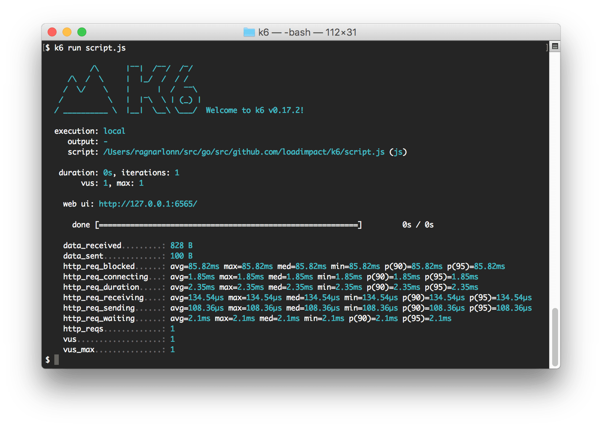
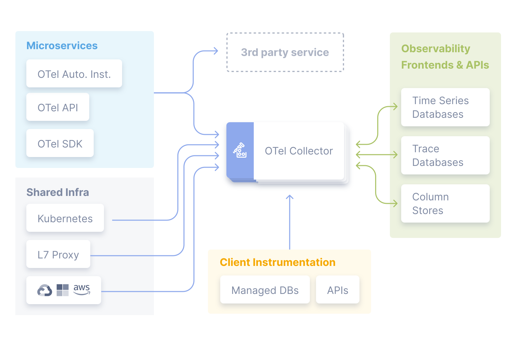
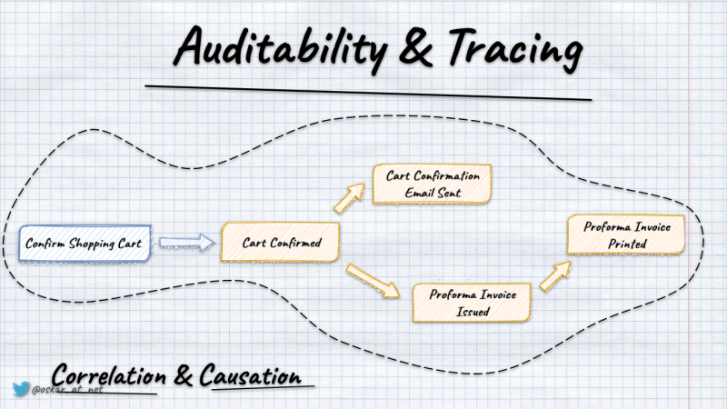

Welcome to the new week!

**Why is connection pooling important? How can queuing, backpressure, and single-writer patterns help?** If you don't know the answer, then go go go, and check the previous two editions ([here](/en/architecture-weekly-189-mastering/) and [there](/en/architecture-weekly-190-queuing-backpressure/))!

Jokes aside, we did a learning by doing. We've built a simple connection pool, added queuing with backpressure, and implemented patterns like single-writer. All of that is to show, on a smaller scale, how those patterns can be extrapolated to broader usage.

We wrote it in TypeScript, and the code looks solid; it sounds like we could deploy it to production or maybe pack it and release it as an open-source library, right?

Hold your horses! Before we hit deploy, there's a usual question we need to ask:

**Is this ready for production?**

If we don't ask ourselves, we'll either ask soon or learn the answer the hard way.

This is the usual border between the proof of concept and reality. Even if:

-   something conceptually makes sense,

-   we talked through it with our colleagues,

-   we tested it on a smaller scale, we should validate it before applying it.

How to do it? We'll discuss that today.

## **What does production-readiness even mean?**

Does this mean it's feature-complete, has no bugs, or doesn't have security leaks? What about working as expected? Expected from who? Users, customers, operations?

What's your definition?

Google invented the whole concept of [the Production Readiness Review](https://sre.google/sre-book/evolving-sre-engagement-model/). The name is so posh that it clearly says it's hard to define what production means in general.

We cannot define a simple checklist that fits all cases, but we can decide if our software matches our contextual criteria.

In our case, the code was production-ready as it matched the criteria of being an illustration for a discussion about the architecture concept. Still, I tested it today, and it didn't even compile (sloppy me!). And that's not the end of the list.

Let's think about verifying if our connection pool and queue are production-ready in a more common sense.

## **1\. Unit Testing, so how to verify that?**

**Testing is more than just verifying that the code works - it's about ensuring it holds up under all specified conditions.** Some say that we should always write the tests first. Test means specification and verification are here if the code matches it. We didn't do that, as the code was more an illustration of the idea, but if we wanted to make it work, we'd need to run it finally. Of course, we could write an application using our connection pool, run it and manually test it. Yet, that wouldn't be repeatable and would be a good measure. We could easily skip some edge cases. We need a more systematic approach.

**We could start with unit testing.** What a unit means is an endless discussion. For the sake of this article, let's assume that unit tests are where we validate the smallest possible components of our system in isolation (or actually their behaviour). We need to ensure that each function does what it's supposed to, without surprises.

In our case, this could mean:

-   **QueueBroker Initialization**: The `QueueBroker` is the heart of our queuing system. When it starts, it should initialise with the correct options, have an empty queue, and be ready to accept tasks immediately. If it fails here, nothing else will work correctly. We'll test to confirm this foundational behavior.

-   **Task Enqueuing**: Tasks need to be added to the queue correctly. The system should respect the `maxQueueSize` limit—if we try to enqueue beyond that, it should reject the tasks cleanly. It is crucial to ensure that the system won't overwhelmed under high load, potentially leading to a crash.

-   **Task Processing**: The `processQueue` method is responsible for managing active tasks. It must handle tasks without exceeding the `maxActiveTasks` limit. This prevents resource exhaustion and ensures that the system can maintain performance under load. We'll test how it deals with successful and failed tasks to ensure resilience.

-   **Graceful Shutdown**: When the system needs to shut down, the `end` method should stop accepting new tasks while allowing current tasks to finish. This is critical to avoid leaving work in an inconsistent state, which could lead to data corruption. We'll ensure the shutdown process is smooth, even when `end` is called multiple times.

-   **Connection Management**: We'll test how the connection pool handles opening and releasing connections. It must respect the `maxConnections` limit and efficiently trigger the next task when a connection is released. It ensures that the system uses resources efficiently without bottlenecks.

## **2\. Integration Testing: Ensuring Components Play Nicely Together**

Unit tests are great for individual components, but we must see how everything works together. Integration tests simulate real-world scenarios to ensure the entire system functions as expected.

If I were to start testing, I wouldn't probably start with unit tests.

**In our case, I'd start with end-to-end task execution.** I'd write tests simulating operations like opening and releasing database connections to ensure tasks are processed in the correct order and within the system's configured limits. Then, depending on the outcome of that execution, I'd cover failing scenarios with unit tests, gradually building trust in the implementation. Of course, we'd like to cover everything in the end, but our implementation currently doesn't do any IO operations. So, testing with integration tests should be fast enough. I'd also keep the focus on the business scenarios, allowing us to refactor the internals more easily.

What else could we check by integration tests?

-   **Failure Handling**: Real systems encounter failures. If a task fails, the system should continue processing other tasks without issues. We could test whether a single failure doesn't bring down the entire system and whether error handling works as expected.

-   **Edge Case Handling**: Every system has edge cases, which are unexpected scenarios that can cause problems if mishandled. We could test situations like restarting the pool or enqueuing tasks after the pool has ended. The system needs to behave predictably even in these less common situations.

-   **Backpressure Simulation**: Queuing and backpressure are about managing overload. We need to simulate scenarios where the queue fills rapidly to see if the system rejects new tasks correctly and recovers when the load decreases. This is critical for ensuring that the system remains responsive under stress.

-   **Single Writer Guarantees**: We could try to access the connection pool concurrently, asynchronously, multiple times to ensure that it doesn't misbehave, so, e.g. that it keeps the limits of max connections and parallel processing and doesn't become stuck in the middle when all connections are closed.

As we're coding in Node.js and TypeScript, I'd use [Native Node.js Test Runner](https://nodejs.org/api/test.html). I could also use some other popular solutions like [Jest](https://jestjs.io/), [Vitest](https://vitest.dev/), etc.

**The decision would be related to the team's and organisation's experience.** I'd try to balance the learning time and avoid using obsolete or unmaintained tooling (even if the team knows it).

Yet, as the Node.js native runner is built-in, delivered by the core team, and it's fast, I'd use it to reduce the number of dependencies and moving pieces.

## **3\. Stress Testing: Pushing the System to Its Limits**

It's not enough to know that the system works under normal conditions - we need to see how it performs when it's really under pressure. Stress testing pushes the system to its limits to identify potential failure points and understand its behaviour in extreme scenarios.

-   **High Concurrency Load**: We could simulate a high number of concurrent tasks to see how the connection pool handles the load. Does it keep up, or do we start seeing delays and failures? It helps us identify bottlenecks in task processing and resource management.

-   **Queue Size Limits**: We need to understand what happens when the queue is full (or almost full). Does it manage resources efficiently, or does it start to fail? Testing this helps ensure stability as it approaches its limits.

-   **Resource Utilisation**: Under stress, we could monitor CPU and memory usage to spot any bottlenecks or inefficiencies. We should understand how our solution scales and where improvements might be needed to handle higher loads. We should always do that knowing the usage characteristics and consider deployment limits and costs.

-   **Task Execution Timeouts**: By introducing delays, we can simulate long-running tasks to see if the system can handle these without causing delays for other tasks. This helps us ensure the system remains responsive, even when some tasks take longer than expected. We can also detect if that won't cause cascading failures. For instance, having the maximum number of tasks, most of them long-running, won't harm our load. This part can also be used to fine-tune the default settings recommendations (like queue size, maximum connection limit, etc.)

-   **Graceful Shutdown:** One of the most critical aspects of a robust system is how it shuts down. If the system can't stop cleanly, it risks leaving tasks incomplete or data inconsistent. We could simulate scenarios where the pool is instructed to shut down. Then we'd need to ensure that no new tasks are enqueued, all pending tasks are completed, and the system doesn't leave any connections open or tasks unprocessed. Such verification is essential for maintaining data integrity and avoiding resource leaks, which could affect future system performance or reliability.

## **4\. Load Testing: Ensuring Stability Under Realistic Conditions**

Stress testing is about handling extreme conditions—like sudden spikes in traffic or resource exhaustion. It might not reveal issues that only appear during prolonged, sustained usage. That's where load tests are must-haves; they ensure that the system performs reliably under expected, everyday conditions.

-   **Simulating Typical User Load:** We can simulate the number of concurrent users accessing the system, ensuring that the connection pool and queue manage tasks efficiently under normal operating conditions. This helps us validate that response times remain consistent and that no unexpected delays or bottlenecks occur during regular use.

-   **Memory Management Over Time:** Load tests allow us to monitor memory usage over extended periods. This is essential for detecting memory leaks, where memory consumption gradually increases without release, potentially leading to crashes or slowdowns after prolonged operation. It ensures that our connection pool and queue do not introduce memory inefficiencies that could degrade system performance over time.

-   **Resource Consumption Stability:** we can track the system's CPU, memory, and other resource usage under sustained load by running load tests. This helps us ensure that resource consumption remains steady and predictable, without unexpected spikes or gradual increases that could indicate inefficiencies or potential points of failure in the connection management process.

-   **Latency and Throughput Consistency:** Load testing lets us measure whether the system maintains consistent response times and task processing rates as it handles typical user activity. Suppose we observe increasing latencies or reduced throughput under load. In that case, it may indicate bottlenecks in the queue management or connection pooling logic that must be addressed to ensure a smooth user experience.

-   **Connection Pool Utilisation:** we monitor how effectively the connection pool manages available connections during load testing. We need to ensure that connections are reused efficiently and that the pool scales to handle varying levels of demand without unnecessary delays in connection handling. This helps us confirm that the system is optimally configured for real-world use.

-   **Real-World Scenario Testing:** Load testing allows us to simulate more complex scenarios that might occur in production, such as a gradual increase in user activity throughout the day or handling intermittent traffic spikes. This helps us ensure the system remains stable and responsive as usage patterns fluctuate, providing insights into how well it adapts to varying workloads.

For our scenario, I'd use [Benchmark.js](https://benchmarkjs.com/) for microbenchmarks and [k6](https://k6.io/) for load and stress testing. What is the difference? Think of microbenchmarks as unit tests. They can benchmark precisely small components, but they won't show the whole picture. We need both. In the same way, we could start with load and stress testing, micro-benchmarking precisely the bottlenecks.

Both Benchmark.js and k6 allow to code tests in JS, which matches our needs!

Source: https://k6.io/blog/the-state-of-load-testing/

## **5\. Observability: Gaining Full Visibility into the System**

Last but not least, to track precisely what's happening in our system, we need to make our connection pool and queue observable. This involves publishing metrics such as the current number of open connections, queue depth, error rates, and any other data that helps us understand the system's behaviour, especially when things go wild.

Incorporating observability isn't just about plugging in a few tools - it's about making informed decisions on monitoring, tracing, and logging what's happening under the hood.

Source: https://opentelemetry.io/docs/

### **Why OpenTelemetry?**

**OpenTelemetry provides a comprehensive framework for collecting distributed traces, metrics, and logs from various parts of our system.** It's an open-source, vendor-neutral standard that allows you to instrument your code without being locked into a specific monitoring solution.

**The trade-offs? OpenTelemetry's flexibility is both its strength and a potential weakness.** While it allows you to collect and export data to different backends (like Prometheus, Jaeger, or Zipkin), the initial setup can be complex, especially in a large system with many moving parts. You'll need to invest time in configuring it correctly and integrating it across your application stack.

However, the benefits outweigh the setup effort, especially in a production environment where understanding the flow of data and pinpointing performance bottlenecks is crucial. OpenTelemetry lets us trace how tasks move through the queue, measure the time spent in various states, and capture any anomalies. This detailed tracing is vital for correlating performance issues with specific events or code paths, making diagnosing and resolving problems quickly easier.

What tooling would I use for our Connection Pool and Queue observability?

### **Open Telemetry tooling**

**[Prometheus](https://prometheus.io/) and [Grafana](https://grafana.com/) are powerful for monitoring and visualising system metrics.** Prometheus excels at scraping and storing time-series data, such as the number of active connections, task processing times, and queue depth. Grafana, in turn, offers robust visualisation capabilities, allowing us to create dashboards that provide real-time insights into system performance.

While powerful, Prometheus isn't as straightforward when dealing with high-cardinality data (data with many unique labels). If your system generates many unique metrics (for example, tracking individual tasks in a highly dynamic environment), Prometheus can struggle with memory consumption and performance. Additionally, setting up Prometheus with Grafana involves more configuration than simpler, all-in-one solutions. The alternative is using vendor-managed solutions like Honeycomb, Datadog, etc.

Still, Prometheus and Grafana are widely adopted, meaning extensive community support and a wealth of plugins and integrations are available.

### **Structured Logging**

**[Pino](https://github.com/pinojs/pino) is a high-performance logging library for Node.js that outputs logs in a structured JSON format.** This structured logging approach is essential because it makes it easier to search, analyse, and correlate logs with the metrics and traces collected by OpenTelemetry and Prometheus.

Of course, nothing is perfect. Pino is designed for performance, so it might not offer some of the more advanced features available in other logging libraries (like Winston). For instance, while Pino is great for fast logging with minimal overhead, it might require additional setup to integrate with log management systems like Elasticsearch or [Loki](https://grafana.com/oss/loki/) for complex querying and alerting.

Despite these trade-offs, Pino's speed and efficiency make it an ideal choice for applications where performance is critical and logging overhead needs to be minimised. Moreover, its JSON output is perfectly suited for integration with other observability tools, making correlating log events with traces and metrics easier.

### **The Importance of Correlation**

**The real power of these tools lies in their ability to work together.** You gain a holistic view of your system by combining OpenTelemetry's traces, Prometheus's metrics, and Pino's structured logs. This means when an issue arises, you're not just seeing that something went wrong—you're seeing why it went wrong, how it propagated through your system, and where to fix it.

For example, if your load tests reveal that tasks are taking longer to process under certain conditions, OpenTelemetry traces can show you where the delays occur in your queue. Prometheus metrics can then indicate whether the problem is related to resource saturation (e.g., CPU or memory constraints). Pino logs can provide the exact error messages or unexpected behaviours that triggered the slowdown.

### **Why This Setup is Necessary**

Without observability, you're essentially flying blind. You might know something is wrong when your application slows down or crashes, but you won't have the necessary insights to diagnose and fix the issue efficiently. This is particularly critical in production environments, where downtime can have significant business impacts. The chosen tools aren't just about collecting data—they're about making that data actionable. With proper observability, you can:

-   Proactively identify and fix issues before they impact users.

-   Understand the root causes of performance bottlenecks and failures.

-   Optimise your system using real-world usage patterns, not just theoretical assumptions.

In essence, while there are always trade-offs with tool selection—whether it's complexity, performance overhead, or integration challenges—the combination of OpenTelemetry, Prometheus, Grafana, and Pino offers a balanced approach that provides deep insights, flexibility, and robust performance monitoring. These tools collectively ensure that your connection pool and queuing system aren't just production-ready and equipped to handle the unexpected with grace.

## **6. Automated Testing with CI/CD**

Of course, we need to integrate, automate and run it continuously. It's not just about running tests - it's about catching issues early and making sure everything in your codebase is continuously validated. This reduces the risk of introducing errors into production and keeps your code in a deployable state. I'd use GitHub Actions for that, as it'd be integrated with repository, making it easy to set up workflows for automating tests, deployments, and other processes.

GitHub Actions can run easily both unit tests, and integration tests. You can use it to spin up Docker containers or test environments using [Testcontainers](https://testcontainers.com/), which is especially useful for integration tests that require databases or other services.

**While GitHub Actions is great for the basics, stress and load testing require more specialized tools and environments.** These tests simulate real-world usage and extreme conditions, which can be difficult to replicate within the limited environment of GitHub Actions.

-   **Environment Limitations:** Stress and load tests typically require a more controlled and scalable environment, often with the ability to simulate hundreds or thousands of concurrent users. GitHub Actions runners are not ideal for this, as they are designed for short-lived, smaller-scale operations.

-   **Resource Intensive:** Stress and load tests can consume significant resources, including CPU, memory, and network bandwidth. Running these tests on GitHub Actions could be costly and inefficient, as the environments are not optimized for long-running, resource-heavy tasks.

For that we'd either need some cloud solutions ([k6 provides such](https://k6.io/docs/cloud/)), or (God help!) Kubernetes deployment.

## **7\. Overwhelmed? Let's Keep It Practical**

**If you're starting to feel like there's a lot to handle, you're not alone. Overwhelmed? You should be!**

Implementing all these tools and processes at once might be overkill, especially if your project is still in its early stages. But you don't have to do everything immediately.

Think of this as a maturity model - a roadmap you can follow as your project grows and your needs evolve.

### **The Maturity Ladder: Building Confidence Step by Step**

Instead of diving headfirst into the deep end, let's break this down into manageable stages:

#### **Stage 1: Basic Testing and Logging**

-   **When to Apply**: This is your starting point, ideal for early-stage projects where the focus is on achieving the core functionality.

-   **What to Do**: Start with unit and integration tests using the Node.js native test runner. Implement basic logging with Pino to capture key events and errors. This gives you confidence that the system works as intended in simple scenarios. Set up GitHub Actions for CI/CD to automate your tests.

-   **Why Stay Here**: If your application is small, traffic is low, and the complexity is manageable, there's no need to over-engineer. Focus on building and refining the core features.

#### **Stage 2: Enhanced Testing and Observability**

-   **When to Apply**: As the project grows, you'll likely see more traffic and start adding more features. At this point start integrating OpenTelemetry for basic observability. Use Benchmark.js for performance testing critical paths. This is where you start to see the value in catching issues early before they reach production.

-   **Why Move Here**: If you're starting to see performance issues, or if the team is growing and changes are becoming more frequent, enhanced testing and observability are crucial. They help you catch and fix issues early, ensuring your system remains stable and performant.

#### **Stage 3: Full-Scale Production Readiness**

-   **When to Apply**: When your system becomes critical to your business, handling substantial traffic or operating in a distributed environment, it's time to go all-in.

-   **What to Do**: Implement full observability with OpenTelemetry, Prometheus, and Grafana. Automate everything from environment setup to deployment with tools like Terraform and Docker. Regularly perform load and stress tests with k6 to ensure the system can scale and remain stable under pressure.

-   **Why Move Here**: If your system is mature and downtime or performance issues would significantly impact business, this is the stage where you need to ensure absolute reliability and performance. By this point, you want to have a system that's functional, robust, scalable, and resilient.

## **Conclusion: Don't Jump into the Deep End Prematurely**

There's a temptation to over-engineer right from the start - to build complex architectures and set up elaborate pipelines before they're really needed. But that's often counterproductive.

**Start with the basics. Build confidence gradually. As your project grows, scale your processes and tooling to match.** This way, you're not just ready for production—you're ready for production when it truly matters, without wasting time and resources on over-engineering in the early stages.

**The goal isn't to have the most sophisticated setup possible—it's to have the right setup for your project's current state.** By following this approach, you ensure that your system is not just production-ready but also future-ready, capable of scaling and adapting as its demands grow.

**And hey, dear reader, I'd like to learn where you'd like to go next. Your thoughts mean much to me, and I'd like to make it engaging for you! Please respond to this email, comment, or fill out this short survey: [https://forms.gle/1k6MS1XBSqRjQu1h8](https://forms.gle/1k6MS1XBSqRjQu1h8)!**

Cheers

Oskar

p.s. **Ukraine is still under brutal Russian invasion. A lot of Ukrainian people are hurt, without shelter and need help.** You can help in various ways, for instance, directly helping refugees, spreading awareness, putting pressure on your local government or companies. You can also support Ukraine by donating e.g. to [Red Cross](https://www.icrc.org/pl/donate/ukraine), [Ukraine humanitarian organisation](https://savelife.in.ua/pl/donate/) or [donate Ambulances for Ukraine](https://www.gofundme.com/f/help-to-save-the-lives-of-civilians-in-a-war-zone).
