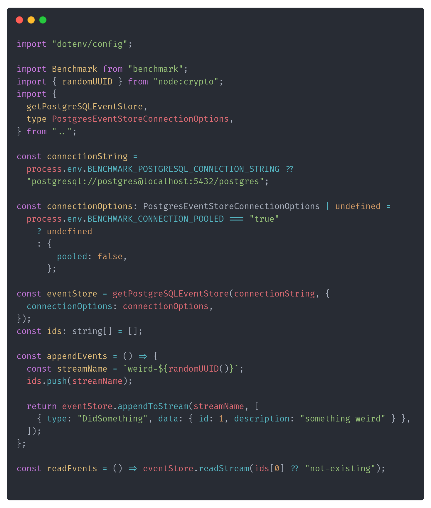
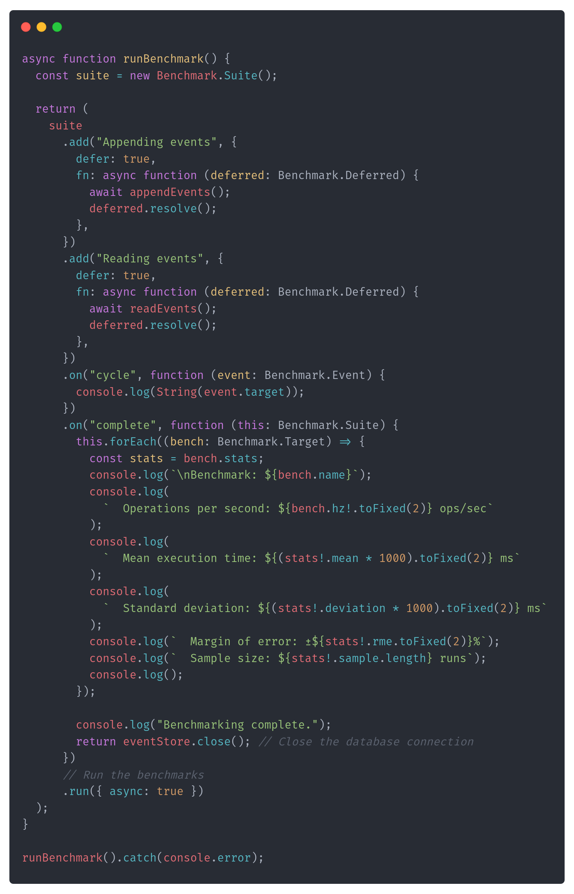
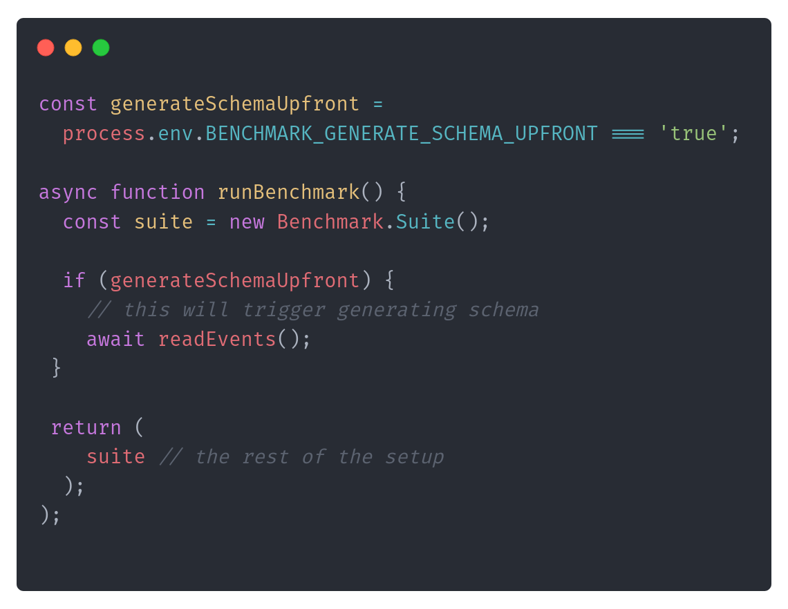
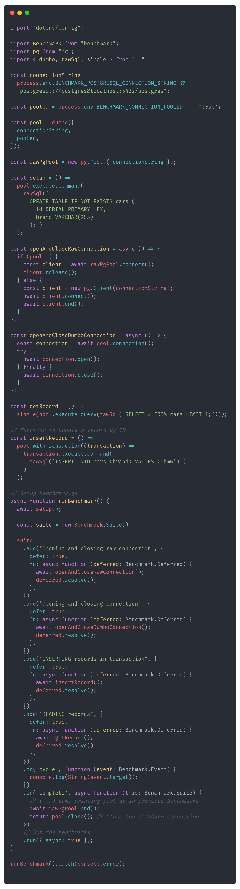

**Boy, it's the fourth episode of the refreshed format, time flies!**

We started by [learning the importance of connection pooling](/en/architecture-weekly-189-mastering/), [discussing how to implement it](/en/architecture-weekly-190-queuing-backpressure/), and then plot twisting to [explain why what we learned so far is not yet production-ready](/en/architecture-weekly-191-is-it-production/) and what does it actually mean to be production-ready!

Lots of talking, especially considering that those topics were more to trigger discussions on different deployment strategies (e.g., serverless or not), how and when to scale, and why queuing is essential. Why so much talking? Because it's cheap! It's cheap to discuss and analyse tradeoffs before we make final decisions. Yet, we can't fall into analysis paralysis constantly going back and forth; there's a time when we'll hear:

**Talk is cheap; show me the numbers!**

If we don't, we'll see them. And I intend to show you the real numbers today.

But before I do, I need to tell you a secret. I'm writing those articles not only for you but also for me, maybe even primarily for me, as I'm writing them not to forget. Forget about what? About what I've learned. But I hope you'll forgive me for this selfishness, as there's an additional benefit for you: they're real. They're showing my journey and are the outcome of my real architecture considerations.

**Currently, I'm building two Open Source tools: [Emmett](https://event-driven-io.github.io/emmett/getting-started.html) and [Pongo](https://github.com/event-driven-io/Pongo).** Both of them are Node.js storage tools. Emmett intends to bring Event Sourcing to the JS/TS community and their applications back to the future. Pongo is like a Mongo, but it is on PostgreSQL. So joining Mongo experience with PostgreSQL consistency and capabilities. So far, the feedback is positive. But it's an intriguing journey touching multiple aspects. Not only technical but also product-building, as I want to make it sustainable for me and useful for users.

**The hidden trap of building something useful is that people will use it, which can cause some trouble.** I'm a big fan of the slogan "Make It Work, Make It Right, Make It Fast". Why? From the C2 Wiki:

> If it doesn't work right, in what sense does it work at all?
>
> _Here's my interpretation. First crank out code that handles one common case (MakeItWork). Then fix all of the special cases, error handling, etc. so all tests pass (MakeItRight)._
>
> _Another interpretation, "Make it right" means make the code more clear, i.e., refactor. "Make it work" is the part about getting the code to operate correctly. A rephrase might be, "Make it work correctly, make the source code clear, make it run quickly."_

So, I think what's there in Emmett in Pongo works. Based on the feedback, it sounds kind of right. Is it fast? Yes and no.

## **The issue**

That's how we got to the troubles users can cause. They might want to use your tool, deploy it, and verify whether it works and how fast it works. And they may find out that it doesn't work as they expected.

Jokes aside, having early adopters and getting a feedback loop is crucial. I'm lucky to have people like Fernando who have contacted me and said they observed something weird.

**He said that locally, hosting PostgreSQL on a Docker container, the application was running instantly and super fast. Still, he never got a request processing time below one second when deployed to the end environment.** That could not have been an issue a few years back, but it definitely sounds unacceptable nowadays. I told you that I'm lucky, and I do.

Fernando is building a serverless-first product, which is a common case for startups or those in the early phases of development. With this model, you pay only for what you use. That means each request will (or can) spin up a new stateless environment. We cannot have a shared state between the calls, e.g., we cannot share a connection pool.

That's a challenge but also a valid use case that I want to support. One of the reasons why I selected the Node.js environment to build my tools is that it helps me deliver faster and more sustainably.

We discussed already in [Mastering Database Connection Pooling](/en/architecture-weekly-189-mastering/) that there are "Connection Pools as a Service" like:

-   [AWS RDS Proxy](https://aws.amazon.com/rds/proxy/),

-   [Azure Database for MySQL/PostgreSQL Flexible Server Proxy](https://learn.microsoft.com/en-us/azure/postgresql/flexible-server/concepts-pgbouncer),

-   [Cloudflare Hyperdrive](https://developers.cloudflare.com/hyperdrive/configuration/how-hyperdrive-works/),

-   [Supabase Supavisor](https://supabase.com/blog/supavisor-postgres-connection-pooler)

They can keep the shared connection, but they can cause issues if you're using an application-level proxy like [pg pool](https://node-postgres.com/apis/pool).

I used connection pooling as a default design choice for both Emmett and Pongo. They're sharing a common dependency [called Dumbo](https://github.com/event-driven-io/Pongo/releases/tag/0.10.0), which is responsible for connection management and running database queries.

Nevertheless, I added the option to turn off pooling to support the "Connection Pool as a Service" scenario. Knowing his use case, I also recommended that option earlier to Fernando, and that's also one of the reasons for the performance issue. We're getting there.

## **The Initial Analysis**

Emmett and Pongo are logically simple tools; they're:

-   taking the request (reading events, appending new, filtering documents, updating them, etc.),

-   translating that into the SQL,

-   getting database connection (and transaction if it's a write request),

-   executing SQL query,

-   committing transaction, if it was open, and closing connection.

I'm outsourcing the database stuff to the PostgreSQL driver, so I won't do sneaky things that could complicate this simple process.

**That's why the first step was to cut off external and the most obvious issues.** What could be they?

Deployment specifics? Serverless, in general, is vulnerable to the cold start issue. Cold start happens when the function is run after not being called for some time. Then, the whole environment needs to be started. The next request can reuse this environment without additional delay. After some time of inactivity, the environment will be again _"put to sleep"_ so you don't use resources and don't pay for them.

**Still, that wasn't an issue here, as we verified that it's happening constantly, not only on the first request.**

Some deployments are different. For example, [Cloudflare Workers](https://developers.cloudflare.com/workers/) use custom, slimmed Node.js; even AWS introduced recently [their own Node.js runtime](https://github.com/awslabs/llrt).

**But it wasn't that; it also happened when running locally against the actual database.**

The distance between the database and application hosting? If they were hosting in different regions (e.g. database in the USA and application in Europe), that could add significant enough latency.

**Wasn't that? Both deployments were in a similar region.**

So maybe that's the issue with the database? It could have been underprovisioned (so had a shortage of needed resources). If you're using innovative hostings like [NeonDB](https://neon.tech/) and [Supabase](https://supabase.com/), which are adding their sprinkles to make PostgreSQL serverless and cheap, then maybe those sprinkles are the reason.

**Nah, running against the regular PostgreSQL hosted on [Azure RDS](https://azure.microsoft.com/en-us/products/postgresql). Gave the same subpar results.**

Then maybe something in the application is causing delays. Maybe an unusually big payload is causing delays. That could increase the latency between the application and the database and add to the serialisation time.

**Nope, the payloads were even smaller than they typically are.**

So we're back to the initial point, and the thesis is that it can be a bug in Emmett or Pongo.

## **Show me the numbers!**

If that sounds like guessing, then you're right; calling that analysis is a bit of an exaggeration. But it's a necessary step to avoid dumb mistakes and understand the deployment specifics, data usage, and scenarios. This is needed to reproduce that and set benchmarks. Yes, benchmarks, because we finally got to the numbers.

I reached the moment when I knew the primary issue. I wanted to know more about the reasons, so I had to choose tooling. I was correct, I was right, but I wasn't fast, and to fix that, benchmarks were needed.

I chose [Benchmark.js](https://benchmarkjs.com/) as it's the most popular microbenchmark tool in Node.js. I didn't need load tests yet, as I wanted to pinpoint the specific issue to make the initial improvement. Each development has its own benchmarking tools, I'll show you the syntax, but it's not as critical as understanding what we're doing.

**The first step was reproducing the intended usage and confirming that we were getting similar numbers.**

1.  I've set up a NeonDB free-tier database in a region similar to my local computer. This database is underprovisioned for bigger usage, and that's fine, as such a setup should make the observed issue even bigger.

2.  I've set up the test with the event store connected to that database (of course, making that configurable). And doing basic operations like appending and inserting. It looked like this:



Having that, I could set the benchmark code:



As you see, it's a simple scenario; nothing fancy between telling the benchmarking engine what to do multiple times and gathering results. I already thought those delays may be related to pooled vs non-pooled usage, so I included a basic feature toggle (passed as an environment variable).

Sidenote: If you think you don't need a benchmarking tool, you can get those times on your own with simple timers, then check this talk. Andrey Akinshin nicely explains how much statistical knowledge is incorporated into building such tools to give you the best results. 

`youtube: [Embedded video](https://www.youtube.com/watch?rel=0&autoplay=0&showinfo=0&enablejsapi=0&v=5S8c3j2HFpY)`

Nevertheless, even such simple benchmarks [gave me enough food for thought](https://github.com/event-driven-io/emmett/pull/108).

For **non-pooled** connection, I got:

```text
Appending events x 1.98 ops/sec ±28.76% (15 runs sampled)
Reading events x 3.05 ops/sec ±12.89% (19 runs sampled)

Benchmark: Appending events
  Operations per second: 1.98 ops/sec
  Mean execution time: 506.14 ms
  Standard deviation: 262.83 ms
  Margin of error: ±28.76%
  Sample size: 15 runs

Benchmark: Reading events
  Operations per second: 3.05 ops/sec
  Mean execution time: 327.42 ms
  Standard deviation: 87.54 ms
  Margin of error: ±12.89%
  Sample size: 19 runs
```

And for **Pooled connection,** I got:

```text
Appending events x 7.52 ops/sec ±29.75% (46 runs sampled)
Reading events x 25.10 ops/sec ±3.40% (61 runs sampled)

Benchmark: Appending events
  Operations per second: 7.52 ops/sec
  Mean execution time: 132.99 ms
  Standard deviation: 136.92 ms
  Margin of error: ±29.75%
  Sample size: 46 runs

Benchmark: Reading events
  Operations per second: 25.10 ops/sec
  Mean execution time: 39.84 ms
  Standard deviation: 5.40 ms
  Margin of error: ±3.40%
  Sample size: 61 runs
```

**Exercise for you:** Look at them and think about what's odd here. Then, move on to the next paragraph.

## **Analysing benchmarks**

I got a better but similar result for a non-pooled connection (the one Fernando used). If you sum up mean execution and standard deviation, then the time could be similar to the one he observed: almost 1 second.

Appending was slower than reads, but that's expected.

For the pooled connection, I got much better results—not great, not terrible. If:

-   I had a bit faster DB than the free tier and...

-   I wasn't running benchmarks from my local computer, but from the same network as the database. They should be better and better enough for most systems.

We know pooling should give better performance, but why three times better? That's odd. Also, why is this standard deviation so big? It's almost the same as the mean execution time. **That suggests that there's something wrong with the test setup.**

**To understand why that was happening, it's necessary to know how appends and reads work internally.** Both Emmet and Pongo try to reduce the boilerplate.

One of the aids is generating the database schema for you. On the first call, it'll create the schema. Then it won't repeat that. As the event store should be used as a singleton, it'll only happen for the first request, and then subsequent operations won't have this penalty. That's good enough for local development and even stateful deployments, but... It's actually not great if you're doing serverless. Why? Because potentially, each call is the first one, as we don't have a shared state.

To validate that, [I updated the benchmark setup](https://github.com/event-driven-io/emmett/pull/109), doing the first call before the benchmark run:



Then I reran benchmarks with schema generated upfront and the results look as follows for **non-pooled** connection:

```text
Appending events x 2.40 ops/sec ±13.17% (16 runs sampled)
Reading events x 2.90 ops/sec ±18.93% (18 runs sampled)

Benchmark: Appending events
  Operations per second: 2.40 ops/sec
  Mean execution time: 416.37 ms
  Standard deviation: 102.96 ms
  Margin of error: ±13.17%
  Sample size: 16 runs

Benchmark: Reading events
  Operations per second: 2.90 ops/sec
  Mean execution time: 345.36 ms
  Standard deviation: 131.47 ms
  Margin of error: ±18.93%
  Sample size: 18 runs
```

And for **pooled:**

```text
Appending events x 9.17 ops/sec ±0.72% (47 runs sampled)
Reading events x 27.58 ops/sec ±0.34% (65 runs sampled)

Benchmark: Appending events
  Operations per second: 9.17 ops/sec
  Mean execution time: 109.05 ms
  Standard deviation: 2.76 ms
  Margin of error: ±0.72%
  Sample size: 47 runs

Benchmark: Reading events
  Operations per second: 27.58 ops/sec
  Mean execution time: 36.26 ms
  Standard deviation: 0.51 ms
  Margin of error: ±0.34%
  Sample size: 65 runs
```

That almost removed the standard deviation error in pooled benchmarks, reducing it and significantly improving the meantime.

**Now, the question is, why is schema creation so costly?** Am I having some wild setup? I don't. Those are just a few tables and CREATE IF NOT EXISTS statements. That can lead to the conclusion that it's not an issue with the schema creation but with opening the new connection.

Benchmark times can also suggest that. If we're doing append as the first request then we're making two calls: 1st with the database schema setup, 2nd with append. If we're running the non-pooled setup, it'll open two connections for non-pooled, and that will be one.

For the setup without upfront schema creation, I got 0.5 seconds of the mean execution time. Fernando had over 1 second. Why? Because he was initially benchmarking the command handling process, not just appending it. Command handling consists of reading events and appending events. So if the issue is indeed with the opening connection time, it could be doubled. But to prove that, we need to have something more...

## **Benchmark baseline**

A baseline is something we compare to. A similar scenario, but trimmed with all the fluff we have in our implementation. We do that to compare to the "solution without our code". So, in other words, we're removing the latency that our mishaps could cause. In our case, this could be:

-   running just regular INSERT and SELECT from Dumbo and raw PostgreSQL driver,

-   opening and closing connections both with Dumbo and raw PostgreSQL driver.

The benchmark [could look as follows](https://github.com/event-driven-io/Pongo/pull/68):



After running it, I got the following results for **non-pooled** connection:

```text
Opening and closing raw connection x 3.46 ops/sec ±14.99% (21 runs sampled)
Opening and closing connection x 3.19 ops/sec ±17.17% (21 runs sampled)
INSERTING records in transaction x 2.50 ops/sec ±13.55% (16 runs sampled)
READING records x 2.75 ops/sec ±18.46% (18 runs sampled)

Benchmark: Opening and closing raw connection
  Operations per second: 3.46 ops/sec
  Mean execution time: 288.62 ms
  Standard deviation: 95.06 ms
  Margin of error: ±14.99%
  Sample size: 21 runs

Benchmark: Opening and closing connection
  Operations per second: 3.19 ops/sec
  Mean execution time: 313.72 ms
  Standard deviation: 118.31 ms
  Margin of error: ±17.17%
  Sample size: 21 runs

Benchmark: INSERTING records in transaction
  Operations per second: 2.50 ops/sec
  Mean execution time: 400.40 ms
  Standard deviation: 101.80 ms
  Margin of error: ±13.55%
  Sample size: 16 runs

Benchmark: READING records
  Operations per second: 2.75 ops/sec
  Mean execution time: 363.79 ms
  Standard deviation: 135.01 ms
  Margin of error: ±18.46%
  Sample size: 18 runs
```

And for **pooled:**

```text
Opening and closing raw connection x 348 ops/sec ±195.81% (87 runs sampled)
Opening and closing connection x 122,531 ops/sec ±0.85% (83 runs sampled)
INSERTING records in transaction x 8.81 ops/sec ±1.53% (45 runs sampled)
READING records x 27.28 ops/sec ±1.38% (66 runs sampled)

Benchmark: Opening and closing raw connection
  Operations per second: 347.82 ops/sec
  Mean execution time: 2.88 ms
  Standard deviation: 26.79 ms
  Margin of error: ±195.81%
  Sample size: 87 runs

Benchmark: Opening and closing connection
  Operations per second: 122531.07 ops/sec
  Mean execution time: 0.01 ms
  Standard deviation: 0.00 ms
  Margin of error: ±0.85%
  Sample size: 83 runs

Benchmark: INSERTING records in transaction
  Operations per second: 8.81 ops/sec
  Mean execution time: 113.46 ms
  Standard deviation: 5.92 ms
  Margin of error: ±1.53%
  Sample size: 45 runs

Benchmark: READING records
  Operations per second: 27.28 ops/sec
  Mean execution time: 36.66 ms
  Standard deviation: 2.10 ms
  Margin of error: ±1.38%
  Sample size: 66 runs
```

They're clearly showing that Dumbo adds some overhead, but not too much. For the pooled setup, it works even better.

By comparing the SQL query and reconnection results, it's clear that the majority of the time is spent establishing a connection. [See, I told you!](/en/architecture-weekly-189-mastering/).

## **What's next?**

If that was the conclusion for the tool that's not intended to be serverless-friendly, we could bury the results in the new backlog issue. That could be a tradeoff if we had more important items. Still, I intend to make Emmett and Pongo serverless-friendly.

**The next steps are:**

1.  **Adding explicit connection session.** Thanks to that, the command handler could explicitly ask to reuse the same connection both for reads and appends. That should cut the execution time around 4 times for the non-pooled connection. Api will be similar to [Mongo sessions](https://www.mongodb.com/docs/manual/core/read-isolation-consistency-recency/#std-label-sessions). Pongo already supports it.

2.  **Add upfront schema generation through CLI.** This should reduce the potential cold start and redundant call for schema creation.

3.  **Adding Open Telemetry and/or extending benchmarks with [Flame Graphs](https://www.brendangregg.com/flamegraphs.html).** This is critical not to blindly guess, but to have enough information about bottlenecks. Tracing and metrics will be essential. I already exposed benchmarks in the repository so anyone could run it. Giving more data is also essential for building trust in users.

4.  Add more benchmarks and load tests and expose the results openly.

**I want to show you the open telemetry part. I already got feedback through the [form under the last article](https://forms.gle/qHekCiSxmAJnamh87) that this topic should interest you.**

## **TLDR**

1.  Connection pools are improving performance by a lot.

2.  But you can't assume that you'll always be able to use it.

3.  When you have performance issues, start by correcting obvious mistakes.

4.  Then, understand the scenario, set up and write benchmarks to reproduce the issue (at least to some defined threshold).

5.  Use tools for that; don't build them on your own.

6.  Analyse the results and be critical of both them and your implementation.

7.  Check if they don't have a huge deviation.

8.  Adjust them or implement them if needed. Rinse repeat.

**There are lies, big lies, and benchmarks. We should be careful and critical.**

The benchmarks I show you are really simple, but following this, you can run the initial investigations and the first round of improvements. Benchmarking is not easy; I'm also not an expert, but even not being an expert can give you good enough results if you tackle that systematically.

To learn how to do it check a great intro from Daniel Marbach:

`youtube: [Embedded video](https://www.youtube.com/watch?rel=0&autoplay=0&showinfo=0&enablejsapi=0&v=QI1vmZxINjc)`

**And hey, dear reader, I'd like to learn where you'd like to go next. Your thoughts mean much to me, and I'd like to make it engaging for you! Please respond to this email, comment, or fill out this short survey: [https://forms.gle/1k6MS1XBSqRjQu1h8](https://forms.gle/1k6MS1XBSqRjQu1h8)!**

Cheers

Oskar

p.s. **Ukraine is still under brutal Russian invasion. A lot of Ukrainian people are hurt, without shelter and need help.** You can help in various ways, for instance, directly helping refugees, spreading awareness, putting pressure on your local government or companies. You can also support Ukraine by donating e.g. to [Red Cross](https://www.icrc.org/pl/donate/ukraine), [Ukraine humanitarian organisation](https://savelife.in.ua/pl/donate/) or [donate Ambulances for Ukraine](https://www.gofundme.com/f/help-to-save-the-lives-of-civilians-in-a-war-zone).
